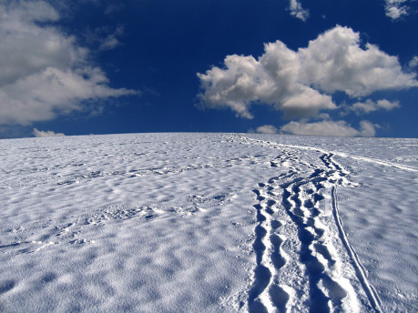

> Motto:
>
> „Každý den a každou noc
>
> Když říkám rodokmen Bride,
>
> Nebudu zabit, nebudu soužen,
>
> Nebudu zavřen, nebudu zraněn,
>
> Ani mě Kristus nenechá v zapomnění.
>
> Žádný oheň, žádné slunce, žádný měsíc mě nespálí,
>
> Žádné jezero, žádná voda, žádné moře mě neutopí…“
>
> (lidové zaříkadlo, z knihy Alexandra Carmichaela _Carmina_
>
> _Gadelica: Hymns and Incanations from the Gaelic_)

Kdysi na dalekém severu bylo jedno království. Bylo veliké, dobře zásobené a s dobrými obchodními cestami. Vládl tam ale krutý král, který si hleděl jen peněz. Tento panovník chtěl získat ještě větší bohatství a moc a to mu nakonec zatemnilo mysl. Začal uchvacovat okolní menší království, a proto potřeboval ještě před začátkem jara zvýšit počet svých vojáků. Vyslal tedy verbíře i do těch nejzapadlejších vesnic a samot s rozkazem: „Vyhlaste v každém obydleném koutě mé země, že všichni chlapci od třinácti a muži do padesáti let budou bez výjimek odvedeni do armády.“ Po celé zemi se ozýval nářek žen a dětí, kterým odcházeli jejich milovaní manželé, otcové i synové do armády na dlouhá léta a do smrtelných nebezpečí.

Verbíři putovali zemí a obešli už skoro všechny vesnice a města. Když dorazili do poslední vesničky, oddechli si úlevou. Neměli rádi svou práci, sami měli doma manželky a děti, od kterých museli také odejít. Už obešli i poslední dům. „Tak, můžeme se vrátit,“ prohlásil vůdce skupiny a obrátil se k často nedobrovolně odvedeným mužům a chlapcům. „Promiňte mi to, chlapi,“ dodal, „věřte mi, že být to všecko na mně, nechal bych vás doma. Jenže já králem nejsem.“ Nepočetný oddíl vyrazil ven z brány vesnice. „Počkej Werre,“ zastavil vše jeden z verbířů, a když se k němu Werr otočil s otázkou v očích, pokračoval, „tohle je moje rodná vesnice.“ „A co s tím, Haralde? Chceš nám tu povyprávět dojemný příběhy z dětství nebo co?“ zavrčel Werr nepřívětivě. Nikdy neměl Haralda v lásce, vždyť on všechnu tu špinavou práci dělal s nadšením a nijak na něj nepůsobil nářek žen, když od nich odváděl manžely a syny. Vykonával svou práci, jako by byl nějaká bezduchá loutka. Werr a ostatní verbíři alespoň dokázali projevit soucit. „Chci jen říct, že v lese nedaleko odtud je ještě jedna samota. Když jsem tu ještě žil, byla v té chalupě bylinkářka Brighid se svými dvěma syny. Zajdeme si pro ně, protože pokud správně počítám, tak jim je právě třináct let. Jsou zralí na vojnu a službu naší zemi i králi.“ Werr otráveně povzdechl, ale nijak neodpověděl. „Odmítáš snad sloužit naší zemi? Vzpíráš se rozkazům krále?“ zeptal se výhrůžně Harald. „Pojďme pro ně Werre,“ pronesl jeden z vojáků a útěšně poplácal svého vůdce po rameni. „Ještě tahle samota a pak už to všechno skončí. Kdybych ji vynechal, ten blbec by to rozmazal někde nahoře a budou problémy,“ prolétlo Werrovi hlavou. Zhluboka se nadechl a vyrazil směrem k lesu. Za chůze na sobě pocítil vítězné pohledy Haralda, který oddílu ukazoval cestu. „Aby tě mor schvátil, ty blázne jeden vojenská,“ mumlal si Werr hněvivě, „jak krásný by byl svět, kdyby válka neexistovala.“

„Wulfe, kde jsi s tou vodou?! S takovou ten oběd nikdy neuvařím!“ zakřičel mladík od stolu, kde škrábal brambory a krájel zeleninu. „Už běžím Wolfe!“ do místnosti vtrhl druhý chlapec se škopkem naplněným vodou. Nicméně jak běžel, zakopl o práh a upadl. Mnoho vody se přelilo přes okraj. „Wulfe, dávej přece pozor!“ zasténal Wolf a odběhl od rozdělaného jídla, aby bratrovi pomohl. „Promiň, skočím ještě pro vodu,“ omlouval se chlapec a znovu odklopýtal z domu. Wolf se za ním jen díval a pak se ušklíbl. Kdokoliv jiný by teď rozhořčeně nadával nebo by byl rozzlobený kvůli nepořádku, jaký Wulf svou zbrklostí způsobil. Ale on ne. Byl to přece jeho bratr, jeho dvojče. Navíc věděl, že to prostě patří k jeho povaze a stejně tak věděl, jak moc se bratr za každou svou chybu stydí. To je pro něj dostatečný trest. Uklidil vědro, vytřel podlahu a konečně mohl pokračovat v rozdělaném obědě. „Trocha soli,“ řekl si sám pro sebe a natáhl se pro přísadu do poličky. Najednou za sebou uslyšel kroky. „To bylo rychlé bráško. No, když už jsi tu, prostři stůl, jídlo už bude hotové.“ Otočil se a ztuhl. Ve dveřích stáli verbíři a jeden z nich držel Wulfa za límec, jako kdyby provedl nějakou nekalost. „D-dobrý den,“ vykoktal překvapeně. „Co to tu děláte?“ zeptal se, přestože už mu pomalu docházelo, o co tu jde. Pamatoval si, že nedávno ve vesnici vybubnovali, že budou odvody do královské armády. „Co tu chceme, to je snad jasné. Král dal rozkaz a rozkazy se musí poslouchat. K nám bys měl mít úctu, ne mě kousnout do ruky, když tě chytnu,“ řekl voják, který stále ještě držel Wulfa za límec. Když domluvil, strčil do svého zajatce tak prudce, až Wulf spadl na tvrdou podlahu. „Uklidni se, nejsou to zločinci a ty nejsi žádný mistr popravčí, abys s nimi tak zacházel. Chováš se, jako by ti přeskočilo!“ okřikl ho rozzlobeně Werre. Pak se obrátil k dvojčatům a řekl: „A teď kluci, kde vězí vaše máma? Aby se s váma stihla ještě rozloučit.“ „Naše matka už dávno nežije,“ odpověděl Wolf a pomáhal svému bratru na nohy. „To je mi líto,“ řekl na to Werre a pozorně si prohlížel ty nebojácné kluky před sebou. Podobali se téměř nachlup. Stejné černé vlasy, stejné jedovatě zelené oči, stejně úzká ramena a štíhlé tělo, stejná výška. Dokonce i jejich postoj a výraz překvapení a vzdoru ve tváři se navzájem podobaly, jako by si své pocity a myšlenky dokázali předat beze slov. „Vezmeme vás s sebou. Asi máte strach, ale nebojte se, v armádě není všechno tak zlé,“ snažil se je Werre marně utěšit. „Veliteli, neprotahujme to, cesta lesem bude dlouhá a pomalu už padá tma,“ ozval se Harald. Wolf začal Haraldovi hned horlivě přisvědčovat: „Má pravdu, za světla se do vesnice nedostaneme a v lese je tolik medvědů a vlků, že bychom se po setmění jejich útoku určitě nedokázali vyhnout. Nejbezpečnější bude přespat tady v domě a na cestu vyrazit až zítra ráno.“ Potom jen s uspokojením sledoval, že se jeho nápad uchytil. Werre i jeho vojáci souhlasili tím spíš, že nad ohněm byl kotlík plný horkých brambor. Když si vojáci dvojčat na chvíli přestali všímat, Wulf tiše sykl na svého bratra: „Co to provádíš? Nejen, že nás odvedou do armády, ty jim ještě dáš najíst a necháš je u nás přespat! Proč? Vždyť medvěda a vlky tu už nikdo neviděl nejmíň dva roky.“ „Už si nedělej starosti, stačí jen počkat, až všichni usnou,“ zněla klidná Wolfova odpověď. Na znamení, že porozuměl, Wulf přikývl a usmál se.

Všichni vojáci usnuli až k půlnoci. Wolf jemně zatřásl bratrovým ramenem. Ve slabém světle posledních uhlíků žhnoucích v dohasínajícím ohništi ho pobídl, aby vstal, sbalil svou přikrývku a postupoval za ním. Obratně překračovali vojáky spící na podlaze. Wulf vzal z věšáku jejich kožešinové pláště. Wolf se přiblížil ke dveřím. Oběma rukama uchopil závoru. Pro všechny severské bohy! Ať to jde tiše! Klapnutí odsunuté závory jim v nočním tichu připadalo jako výstřel. Nikdo se ale nepohnul. Otevřeli dveře. Nehlučně vyšli ven a oblékli se. V chladném nočním vzduchu se jim srážel dech a vydechovali obláčky páry. I když jen o malou chvilku Wolf byl narozen dřív, proto po matčině smrti často zastával roli ochránce. Chytil teď svého bratra za ruku a vyšli do tmy. Když dorazili mezi první stromy, silně se ochladilo. Do této chvíle temné nebe se ještě více zatáhlo a začalo hustě sněžit. Wolf o poznání pevněji stiskl ruku svého mladšího bratra a utěšoval ho: „Neboj se. Jsem ti vždycky nablízku. Nedovolím, aby ti kdokoliv ublížil. Až se všechno přežene, bude líp.“ Přihnal se vítr a počasí přešlo v divokou vánici. „Wolfe, já mám strach,“ zašeptal Wulf.

Ráno se vojáci probudili a zjistili, že dvojčata jsou pryč. „Najděte je!“ naoko rázně rozkázal Werre. Ale ve skutečnosti měl na mysli něco jiného – nepospíchejte, ať mají čas utéct. I když neznámým lesem v hlubokém sněhu postupovali jen pomalu, oba chlapce stejně brzy našli. Byli schouleni vedle sebe pod starou borovicí, která se nacházela jen nedaleko od okraje lesa. Na první pohled to vypadalo, jako by oba spali. Jeden chlapec držel druhého pevně kolem ramen a jeho ztuhlá tvář měla starostlivý výraz. Druhý chlapec, který byl kromě svého pláště zabalen do dvou přikrývek, měl hlavu opřenou o bratrovu hruď. Jeho tvář nesla stopy prožitého strachu a leskly se na ní zmrzlé slzy. Nejbližší z vojáků se nad nimi sklonil, aby zjistil, zda jsou ještě naživu. Zdálo se mu, že jeden z bratrů už zemřel a nedýchá. Nad tváří druhého se však několikrát objevil obláček par ze srážejícího se dechu. Vzali tedy bezvládná těla do náruče a vydali se zpět k domu. Tam zapálili oheň a obě těla položili na postel, kterou přistrčili blíž k ohništi. Přikryli je hromadou dek a kožešin a nějaký čas se pokoušeli křísit chlapce, který ještě dýchal, když ho našli. Stále doufali, že se stane zázrak. Po několika hodinách se jeden z chlapců probral. Byl to Wulf. Když vedle sebe uviděl nehybné tělo staršího bratra, propukl v pláč. Po chvilce nesouvisle promluvil: „Říkal, že mi nikdo neublíží, že všechno bude v pořádku, zabloudili jsme, já už nemohl udělat ani krok, dal si mě na záda, pod stromem mi dal svou deku a říkal, že všechno bude v pořádku, já ale plakal…“ Wulf chvílemi mluvil, chvílemi umlkal a objímal bezvládné tělo svého staršího bratra. Werre ho konejšivě pohladil po hlavě. Nakonec prohlásil: „Ten s námi nepůjde. Necháme ho tady.“ Harald nevěřil svým uším: „Cože? Vzpíráš se králi? Zákonům?“ „Tady ani král se svými zákony nic nezmůže. Tenhle kluk je tak otřesený, že je k nepotřebě. Už by nic nezvládl. K čemu je armádě úplně zlomený kluk? Takový nepotřebujem!“ Ostatní verbíři přitakávali Werrovým slovům. Harald před zjevnou přesilou ustoupil. Opustili tedy samotu i plačícího kluka a vydali se na zpáteční cestu ke svému králi.

Wulf stále objímal svého bratra a hlavu zabořil do záhybu kožešinového pláště na jeho hrudi. Slzy se mu valily po tvářích. Tiše a vyčítavě vzlykal: „Proč jsi pryč? Říkal jsi, že budeš vždycky se mnou. Lháři! Lháři…“ Pak ale uslyšel tichou odpověď: „Já nejsem lhář. Držím své slovo.“ Wulf se lekl a seskočil z postele. Pohlédl Wolfovi do tváře. Uvědomil si, že bratrovy oči i rty se pohybují a že bledý obličej postupně ožívá úsměvem. Zaznamenal i to, jak těžce a trhaně začal Wolf znovu dýchat. Navždy si vryl do paměti další bratrova slova: „Viděl jsem mámu, řekla, že ještě nepřišel můj čas.“

Wulfovi nepřestávaly téct slzy, ale už to nebyly slzy smutku, nýbrž radosti. Jejich matka Brighid nad nimi bděla, i když už nežila.
