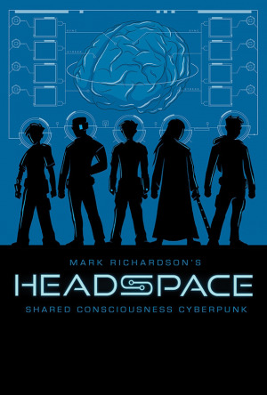

Svět Headspace je čistý cyberpunk. Blízká budoucnost, technologie o něco pokročilejší, ale stále rozpoznatelné, společnost plná tlaků a problémů. Korporace se přetahují o moc a trhy a důsledky těchto tahanic dopadají na lidi kolem. Nůžky mezi těmi, co mají, a zbytkem se rozevírají čím dál víc.

Co je v takovém světě nejcennější? V konečném důsledku je to lidský kapitál. Peníze se dají vydělat (nebo ukrást). Zbraně můžete vyrobit. Sílu a rychlost vám dodá kyberware, čerstvý přímo z výrobní linky. Ale to všechno potřebuje schopného člověka, který to dokáže použít. A neexistuje způsob, jak někoho takového vyčarovat z fleku, nezávisle na tom, kolik milionů jste ochotni utratit. Tedy až do teď.

Titulní _Headspace_ je nová technologie, schopná zahýbat rovnováhou sil. Jednoduše řečeno, je to síť spojující mozky. Neprolomitelná, neblokovatelná, umožňuje okamžitou komunikaci a plné sdílení. Myšlenky, emoce, vzpomínky, dovednosti. Kde jste původně měli tým specialistů, máte najednou skupinu schopnou jednat jako jeden organismus, v každém aspektu silnou tak jako nejlepší z nich. Nejde vypnout bez zabití zapojených lidí, ale koho to trápí? Velkou výhodou je loajalita – nehrozí, že vám člen takového týmu zběhne, ostatní by to věděli skoro dřív než on. Takže pokud se vám nevzbouří celý tým najednou...

Postavy díky spojení skrz _Headspace_ fungují jako jeden tým. To zahrnuje komunikaci, sdílení dovedností a toho, že není potřeba řešit, jestli to, co viděl kolega, bylo předáno, nebo ne. Taky to znamená, že členové teamu nemusí být poblíž, aby si navzájem pomohli. A taky to znamená spoustu problémů, protože sdílené je všechno. Zmiňoval jsem už, že to je na doživotí? Je to horší – pokud připojený člen zemře, v síti zůstane část jejich vzpomínek. Má to své výhody – takový „duch“ si pořád pamatuje část svých dovedností – ale klidnému spaní to rozhodně nepomáhá.

Hra má poměrně silně vymezené téma. V době krize korporátní hráči cítí příležitost. Situace eskaluje a honba za ziskem má čím dál více obětí. Hráči hrají elitní agenty korporace, kteří si řekli, že čeho je moc, toho je příliš. Jejich předchozí zaměstnavatel překročil čáru a musí zaplatit. Tady se nepracuje pro nejvyšší nabídku, žádný pan Johnson nepřichází s falešným úsměvem a kufříkem plným peněz. Žádný outsourcing a lidské zdroje, od teď hrajeme podle vlastních plánů.

Což neznamená, že by prostředí bylo kompletně předepsané. Ve světě Headspace je plno krizí a podobná situace se může odehrát v mnoha variantách. Ať už je to kanadské město zasažené tsunami, sabotáž přehrady na středním východě, která způsobí rozsáhlá sucha, nebo epidemie neznámé nemoci, která uvrhne celá města do karantény, vždycky se najde někdo se snahou vytěžit ze situace maximum. A kde jsou peníze, konflikt na sebe nenechá dlouho čekat.

Systém je tak trochu Apocalyse World a tak trochu není. Pořád házíte 2k6, pořád máte tři možné výsledky, z nichž ten nejpravděpodobnější vyrábí další komplikace, a pořád detaily závisí hlavně na fikci. Celá záležitost je ale trochu abstraktnější. Nejsou tu tahy pro konkrétní situace, vše závisí na tom, kterou dovednost používáte a jak se dokážete vyrovnat s vedlejšími účinky přímého propojení myslí.

Co je nutno zmínit – ten odstavec o tom, že dovednosti jsou nejsilnější kapitál, nijak nepřeháněl. Postavy jsou nejlepší z nejlepších a je to znát. Systém vůbec nepostihuje úrovně nižší než „absolutní špička“. Každá postava má tři dovednosti, což jsou oblasti, kde si vůbec nepotřebuje házet. A díky systému _Headspace_ si může půjčovat dovednosti ostatních členů týmu. Půjčené dovednosti už hod vyžadují, ale pořád jde pouze o množství komplikací, neúspěch vůbec není na stole. Teprve když příslušnou dovednost nemá nikdo, nastupuje hod na improvizaci s možností selhání.

Komplikace jsou kapitola sama o sobě. _Headspace_ není dokonalý a při sdílení dovedností prosákne ledasjaký bordel. S každou dovedností jsou spojené vzpomínky a silné emoce. Ty se můžou šířit po spojení a nakazit celý team. Hráč si při tvorbě postavy vybírá, jaké emoce patří ke kterým dovednostem, a to také určuje případné komplikace. Věci se rozhodně budou vyvíjet jinak, pokud specialistka na střelné zbraně má problémy zvládat hněv, než když trpí napůl vyléčeným PTSD a ostatním hrozí záchvaty paniky. Její výkony se zbraní to většinou neovlivní (je zvyklá), ale ostatní můžou být méně vyrovnaní.

Pravidla pro vybavení nejsou příliš komplexní. Věci mají většinou fikční popisek a sem tam pár nejvýraznějších vlastností popsaných tagy, zbraně navíc poškození a dosah. Kybernetických doplňků není velký počet, ale jsou patřičně nabušené. Například v seznamu jsou jedny kyberoči, které umějí všechny odpovídající triky – noční vidění, termo, UV, nahrávání a ochranu před oslněním. Kybernohy vám umožní doběhnout motorku a seskočit ze střechy bez zranění. A tak podobně. Množství upgradů není omezené esencí nebo něčím takovým, postavy jich můžou nabrat, kolik zvládnou. Platí za ně expy, což věci trochu limituje.

Jak je v hrách PbA zvykem, součástí jsou robustní pravidla pro tvorbu kampaně. Roli hrozeb v tomto světě zastávají – jak jinak – korporace. Na začátku každé kampaně je určeno, které mají prsty v příslušné situaci. Jejich následující plány a projekty jsou to, co určuje značný kus hry.

Hlavním cílem hráčských postav je tyhle plány překazit nebo alespoň zpomalit. To ale nebude snadné, protože korporace mají velkou početní a materiální převahu. Jeden team těžko zhatí všechno. Je potřeba si vybírat bitvy, nebo se sakra ohánět.

Každá korporace také dostane agenta – NPC na úrovni postav. To budou nejvýraznější antagonisté, ti, co vedou nepřátelské síly, zajišťují ochranu jejich datacenter a nebo vedou mediální kampaně. Vzhledem k tomu, že jde o bývalé kolegy, je slušná šance, že některá z postav toto NPC zná, a pravděpodobně tam jsou nějaké nedořešené záležitosti.

Ukázkové korporace v knížce jsou pěkná směska amorálních molochů, bezcitných oportunistů, zločinců v legálním hávu, pragmatiků volících menší zlo a dobrých lidí ve špatných okolnostech. Minimálně dva příklady toho, jak chválihodné cíle a eskalující situace tvoří dláždění na té příslovečné cestě do pekla. Tohle a fakt, že každá korporace má pojmenované NPC, by mohlo znamenat, že to je nepřítel, se kterým se dá vyjednávat. Hra sice hodně tlačí na pilu, co se týče korporací jako opozice, ale není to opozice černočerná a nemyslící.

Když to shrnu, Headspace by vás měl zajímat, protože:

- je to kyberpunk se vším všudy,
- je to o postavách, ne o vybavení,
- nefláká to tu punkovou část, boj lidí proti korporátním zájmům je téma dne,
- žádné mega-, jen korporace. Nepřítel je silný ale můžete mu zasadit citelnou ránu,
- vy i nepřítel máte tvář, do které lze dostat pěstí,
- hrát za skupinu propojených myslí, to se moc často nevidí.
