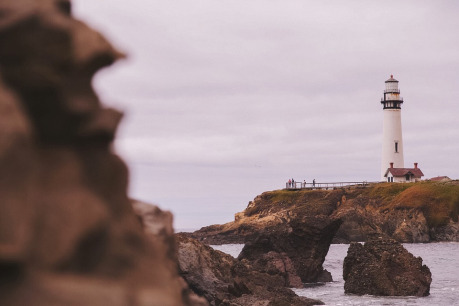

Maják však pred týždňami prestal svietiť, čo vážne ohrozuje obchod a vyvoláva strach v starostovi, mestskej rade, obyvateľoch i u samotných obchodníkov.

Je potrebná pomoc hrdinov na vyriešenie toho problému.

## Čo sa v skutočnosti stalo:

Starostov radca, ctený Ferius Hradosti, náhodne našiel v archívoch odovzdávajúci list o diele majáku čarodeja Kleprechoma vtedajšiemu starostovi. V ňom je vysvetlené, že maják funguje na základe obrazov, ktoré sú v ňom umiestnené. Ak by nejaký z nich nedopatrením spadol, maják by bol nefunkčný. Na ich opravu je potrebné obraz posypať špeciálnym práškom a umiestniť na svoje miesto. Bez pomoci prášku nie je možné obrazom pohnúť. Recept na prášok bol súčasťou príloh.Ferius sa chopil príležitosti. Namiešal prášok, okolo strážcu sa prešmykol do majáku a obrazy poprehadzoval. Verí, že vďaka jeho vplyvu a radám starosta a celá rada bude časom tak zúfalá, že vydá uznesenie, v ktorom vyhlási toho, kto opraví maják za kráľa Kalmery, ktorý dostane starostovu dcéru za ženu.

Ctený Hradosti však nerátal s tým, že mu magický prášok silne poraní ruky a jeho krik započul strážca majáku. Na odstránenie tejto chyby strážcu postrašil tým, že jeho ženy a deti prehlási za čarodejníkov a nechá upáliť na námestí a následne na to ho otrávil tak, aby to vyzeralo, na infarkt. Všeobecne sa tak myslí, že strážca majáku nezvládol zanedbanie svojich povinností a toho dôsledok.

## SCÉNA 1. Prihlásenie sa do služby

DÔVOD SCÉNY: Hrdinovia sú oboznámený so situáciou i finančnou odmenou za skorú opravu majáku. Formou popisu scény a odevu hlavných účastníkov sú hrdinovia nenápadne upozornený, že Ferius má ako jediný hodvábne rukavice.

MIESTO: Sála radnice, kde starosta, radca a úzky okruh zástupcov mesta prijímajú rozhodnutia a prijímajú sťažnosti i hostí.

POČASIE: Teplé a vlhké počasie so silnými rannými i večernými hmlami.

POPIS SCÉNY: Starosta, ktorému situácia v meste robí viditeľné starosti, vrelo privíta hrdinov, ponúkne im odmenu i všetky informácie, ktoré má.

INFORMÁCIE: Kalmerský maják je veľmi stará budova postavená čarodejom Kleprechom. Jeho svetlo bolo vidno za každého počasia a včas varovalo lode pred podmorskými útesmi, zradnými prúdmi, skalami i potopenými loďami. Nebolo potrebné sa oň starať, ale i tak pri ňom stále stál jeden vojak na stráži. Bola to viac menej čestná funkcia. Pred desiatimi dňami však zničoho nič maják prestal svietiť a od vtedy sa potopilo už niekoľko lodí i napriek provizórnym majákom zbudovaným na pobreží.

ODMENA: Starosta je, i napriek zvrašteným obočiam rady mesta a ľahostajnou tvárou radcu, ochotný zjednávať o odmene. Uvedomuje si, že ak sa obchod neobnový, tak celé mesto umrie od hladu.

ZÁVER SCÉNY: Bez ohľadu na dennú/nočnú dobu, v závislosti od priania hrdinov, sú odprevadený ku majáku.

## SCÉNA 2. Kalmerský maják

DÔVOD SCÉNY: Maják je ústrednou miestnosťou dobrodružstva a zároveň riešením zápletky. Postavy by mali zistiť, že nie je žiaden viditeľný spôsob, ako svetlo v majáku zažať a ani ako ho poškodiť. Mali by prísť na to, že do obrazov sa dá vojsť i na to, že je ich možné presúvať.

MIESTO: Maják sa nachádza v strede prístavu. Je to štvorcová veža o hrane niečo širšej ako päť metrov, a vysoká dvadsaťsedem metrov. Je ozdobená chŕličmi a znakmi, ktorým sa pripisuje magická moc. Na jej vrchu je jediná miestnosť s okennou stenou na všetky strany. Strecha má tvaru ihlanu tvoreného z pálených škridiel.

POPIS 1: Po štyristotridsaťdva schodoch sa hrdinovia dostanú do jedinej miestnosti majáku. Ide o bielo natretú štvorcovú miestnosť vysokú niečo cez päť metrov. Horná polovica každej steny je presklenná. Pri pohľade od dverí uvidia jeden veľký obraz na ľavej i pravej stene. Jeden je na stene oproti i na stene s dverami. V strede miestnosti je kovový podstavec, na ktorom vrchu by malo žiariť na všetky strany svetlo majáku. Každý z obrazov zachytáva určitú krajinu a scénu. Táto scéna sa mení každý dvadsaťsedem minút. Zmena scény sa týka osvetlenia, zvierat i ľudí. Pôsobí dojmom, ako by sa cezeň dalo pozorovať, čo sa na danom mieste deje. Ako okno do ... do inej časti sveta.

POPIS 2: Postavy sa môžu pokúsiť obrazu zvesiť, prípadne zameniť medzi sebou. Keďže ešte trvá mágia prášku, je to možné, ale na rukách postáv sa prášok prichytí. Floreskujúca hmota sa nedá zmyť a postupne nenávratne rozožerie kov, kožu i drevo. Živý materiál rozožiera pomalšie a bolestne. Nie však nenávratne a zranenie takto získané je možné časom vyliečiť.

GM POZNÁMKY: Každý zo štyroch obrazov je magický a svet v ňom zobrazený nie je reálny. Je to ako interaktívny magický film, ktorý sa každý rok začína odznova a nie je žiaden rok rovnaký kvôli náhodným rozhodnutiam jeho „obyvateľov“. Pri bližšom ohľadaní je možné zistiť, že je možné do obrazov vstúpiť. Postava, ktorá do obrazu vstúpi sa rovnakou cestou z neho vie i dostať. Kvôli nedostatočnej optickej ilúzii pôsobia obrazy ako fotorámik - nie film, ale statické obrázky. V skutočnosti v nich ubieha čas rovnako, ako v skutočnom svete. Hrdina, ktorý do obrazu vstúpi sa zmenší na tretinu, čo pociťuje ako náhlu nevoľnosť a chorobnosť. Čím ďalej sa postava od obrazu vzdiali, resp. čím hlbšie do obrazu vojde, tým viac a viac sa zmenší. Je to spôsobené tým, že obrazy sú vo svojej magickej podstate dvojrozmerné a tretí rozmer sa „zakresľuje“ zmenšením objektu. Po necelom dni chôdze sa hrdina tak zmenší, že prestane existovať i v samotnom obraze.

POMÔCKA: Ak postavy neprídu na to, že sa do obrazov dá vstúpiť, pri zmene krajiny bude počuť i nejaký výrazný zvuk. Hlavne v noci, keď bude mesto i maják zahalený do hmly a ticha.

ZÁVER SCÉNY 1: Postavy sa po jednom alebo skupinovo rozhodnú preskúmať jednotlivé obrazy.

ZÁVER SCÉNY 2: Ak postavy umiestnia obrazy na správne svetové strany, maják zvonu oživne. Úloha splnená.

## SCÉNA 3: Obrazový svet

DÔVOD SCÉNY: Preskúmaním obrazových svetov by si postavy mali uvedomiť, že obrazy reprezentujú svetové strany.GM POZNÁMKY: Obsah obrazu závisí od sveta, v ktorom sa príbeh odohráva. Ale keďže ide o nereálne obrazové svety, tak môžte použiť i reálne priblíženie a nemusíte sa držať „domácej“ mapy:

- _•_ Sever: Skorá jeseň. Utláčaní vidiečania terorizovaný všemocným rytierom a jeho družinou sú naviac napádaný zbojníkmi i barbarmi zo severu. Dedinčania sa boja i vlastného tieňa. Rytier nevidí rád nové a ešte k tomu i ozbrojené tváre a barbari nerobia rozdiely medzi tými, čo zabijú. Obraz je momentálne na západnej stene.
- _•_ Juh: Neskorá jar. Kmene černochov bojujú medzi sebou o oázy, prepadávajú karavánne cesty, boja sa modiel a zaniknutých miest. Krajina je posiata riedkymi nízkymi stromami s plochou korunou a zem kožovitou trávou. Obraz je na umiestnený na východnej stene.
- _•_ Východ: Teplo. Zdanlivo nekonečné množstvo žltých ľudí stavajú nekonečný múr, ktorý skrz nedostavané časti prekonávajú rýchli šikmookí útočníci na malých koníkoch ozbrojený krátkymi lukmi a zahnutými šabľami. Ľudia sú pracovitý, ale rovnako utláčaný a vykorisťovaný. Niekedy nevedia čo je horšie. Ich kráľ alebo nájazdníci. Obraz je na umiestnený na severnej stene.
- _•_ Západ: Teplo a vlhko. Pralesná krajina obývaná ľudmi červenej pleti. Ľudia pestujú kukuricu a lovia v lesoch. Majú posvätnú úctu ku svojim bohom a vyberačom daní, ktorý krajinu „plienia“ v pravidelných intervaloch, a z bytostí a duchov lesa. Obraz je na umiestnený na južnej stene.

POPIS: V každom svete/obraze sa hrdinovia najprv stretnú s obyčajnými ľudmi a skrz nich sa potom môžu zapojiť do ich každodenného života, respektíve konfliktu s autoritami a predátormi prostredia.

MENÁ: Nemá postáv by mali ešte viac zdôrazniť geografickú príslušnosť obrazu. Zoznam mien: [http://www.behindthename.com/random/](http://www.behindthename.com/random/)

Severania používajú mená francúzske, východňari čínske, západňari natívny američania a južania africké.

POKLADY: Do sveta obrazu je možné zobrať prakticky čokoľvek, čo sa zmestí do jeho rámu, ale nie je možné z neho vybrať nič, čo bolo v obraze vytvorené.

PRAVIDLÁ: Postava v obrazovom svete môže byť ranená, môže zomrieť, môže používať mágiu i svoje schopnosti.

POMÔCKY: Ak by hrdinom nebolo jasné, aký význam majú obrazu v celkovej hádanke, tak je možné nakresliť mapu a zakresliť naň svetové strany i rozloženie obrazov. Zdôrazniť, že ráno má svetlo v obraze s múrom a v noci na obraze džunglou. Je tiež možné posunúť počasie o niekoľko mesiacov dopredu počas spánku postáv. Na severe tak spraviť zimu, na juhu horúce leto.

ZÁVER: Postavy sa vrátia do miestnosti v majáku.

## SCÉNA 4. Záver

DÔVOD SCÉNY: Získanie odmeny, prípadne odhalenie vinníka pokazenia majáku.

MIESTO: Sála radnice. Miesto, kde im bola úloha zadaná.

POPIS SCÉNY: Starosta i zástupcovia mesta sú nadšený z opravy majáku a zasypú hrdinov chválou a otázkami. Jedine radca bude mať v tvári rezervovaný a nespokojný pohľad.

ZÁVER: Ak odhalia pravého vinníka pokazenia majáku, Ferius sa pokúsi utiecť, čo môže mať za následok naháňačku. Tak alebo tak hrdinovia po vyriešení problému s majákom odídu z mesta bohatší a slávnejší.

## SCÉNA 5: Alternatívne riešenie

DÔVOD SCÉNY: Hrdinovia sa môžu pokúsiť zistiť udalosti ohľadne noci, keď sa maják pokazil.

POPIS: V čase vypnutia majáku, bolo to v jedenásť hodín doobeda, strážil maják vojak Erik Fronten. Boj to skúsený veterán, ktorý slúžil so cťou. Bol predvedený na výsluch na pokyn radcu cteného Feriusa Hradosti. Výsluch sa konal pred vojenskými predákmi mesta a Erik pôsobil bledo a ustarane. Niekoľko dní na to umrel na zástavu srdca. Predpokladá sa, že nezvládol zanedbanie svojich povinností a toho dôsledok.

INFORMÁCIE od manželky: Po vypočúvaní prišiel domov veľmi ustaraný a ako prvé pobozkal ženu a deti. Nevidela som ho nikdy tak vrúcne dávať najavo lásku.

INFORMÁCIE od lekára: Telo Erika Frontena som na pokyn radcu cteného Feriusa Hradosti prehliadol a nenašiel som žiadne známky vonkajšieho zavinenia. Telo bolo pochované na miestnom cintoríne so všetkými náležitosťami.

INFORMÁCIE od Erika Frontena (nekromantské kúzla nie sú legálne, i na otváranie hrobov sa spoločnosť nepozerá rada): Počas noci som počul výkrik z majáku. Hlas mi trochu pripomínal radcu cteného Feriusa Hradosti, ale neviem to istotne povedať. Behal som tam ako som najrýchlejšie vedel, ale nikoho som nevidel. Tak som myslel, že sa mi to len zdalo. Až na druhý deň, keď maják zhasol a ctený Ferius Hradosti sa mi vyhrážal upálením manželky a detí mi to doklaplo. Ale to bolo neskoro. Skutočne neviem, prečo som umrel. Prišlo to tak náhle.

INFORMÁCIE od nelegálneho predajcu narkotík a podobných komodít (nie je ľahké ho nájsť): Hej hej, keď si niečo kúpite, spravíme obchod. Tu nedávno som predal komusi koreň takej rastliny, ktorá môže spôsobiť zastavenie srdca. Neviem kto to bol. Vysoký, štíhly s kapucňou. Mal na ruke podivné hodvábne rukavice.

ZÁVER: Pri konfrontácií radca cteny Ferius Hradosti všetko poprie a obviní hrdinov z neschopnosti a nesústredenia sa na to podstatné. Ak hrdinovia nevymyslia spôsob, ako ho „pritlačiť“, tak sa svojim vplyvom zo všetkého vykrúti.
