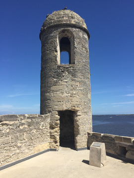

Nedávno jsme v redakci uvažovali o dalším kolektivním článku, který by přinesl konkrétní nápady pro hry vás, našich čtenářů, které by bylo možné vložit do probíhajícího dobrodružství. Napadlo nás tehdy požádat několik autorů o předpřipravené lokace, tentokrát menší než [hexy v č. 53](http://drakkar.sk/53/kolektivni-clanek-hexy.html). Vzniknout měly malé „dungeony“ o 5–10 místnostech. Dali jsme autorům opět volnost v obecném prostředí, do kterého svůj dungeon zasadí, a tak se i tentokrát můžeme setkat nejen s fantasy prostředím.

Abychom však osloveným autorům nějak usnadnili nasměrování kreativity, připravili jsme pro ně 3 × 10 „ingrediencí“, ze kterých mohli libovolně či náhodně vybírat. Až v tu chvíli nás napadlo, že tyto soubory ingrediencí lze použít při mnohých hrách, zejména ve fantasy prostředí, jako zdroje rychlé inspirace pro tvorbu malé lokace se zápletkou.

O co tedy jde? Hoďte si kostkami, abyste určili ingredience, ze kterých pak lze sestavít malý dungeon. První sada určuje důvod, proč postavy do jeskyně jdou, druhá sada určuje prostředí a třetí převládající nepřátele.

Jak se s ingrediencemi popasovali naši autoři, se dozvíte na následujících stranách.

### Zápletka, hod 1k10:

1. Postavy láká zvědavost
1. Postavy jdou vyřešit něco tajemného
1. Postavy láká poklad
1. Postavy láká vyřešit výzvu, kterou jen málokdo přijme
1. Někdo blízký postavám je v ohrožení
1. Postavy někomu slíbily pomoc
1. Postavám někdo nabízí velkou odměnu za pomoc
1. Postavám byl nějaký úkol předurčen osudem nebo hvězdami
1. Postavy dostaly úkol rozkazem od nadřízeného
1. Postavy se dostaly do problémů a musí je vyřešit

### Prostředí, hod 1k10:

1. Zatopená jeskyně
1. Kostnice
1. Chrám zapomenutého boha
1. Ledový labyrint
1. Bludiště klamů a zrcadel
1. Opuštěná pevnost
1. Podpalubí ztroskotané lodi
1. Skalní labyrint
1. Zarostlá zahrada
1. Klášter mlčenlivých mnichů

### Nepřítel, hod 1k10:

1. Skřeti
1. Uctívači kultu
1. Umrlci se vzpomínkami
1. Zelený sliz
1. Elf s píšťalou
1. Oživlé sochy
1. Netopýři se žhnoucíma očima
1. Konstrukty
1. Čarodějnice se srdcem z ledu
1. Pavouci spřádající sítě

Jednotlivé minidungeony najdete ve webovém vydání jako samostatné články v [obsahu 57. čísla Drakkaru](.).
