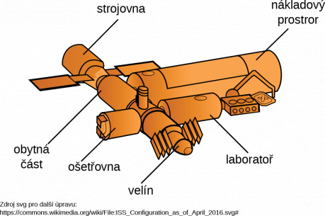
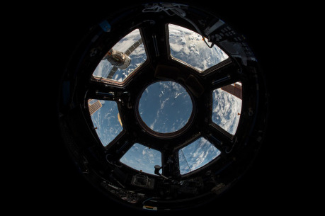

## Obecný popis:

Stanice de Vries je orbitální laboratoř genového inženýrství. Posádku běžně tvoří patnáct osob. Stanici vlastní a provozuje korporace ZK. Motivace založení orbitální laboratoře bylo obcházení regulací výzkumu na planetě a totální izolace.

Stanice se skládá z hlavní části a tří přídavných modulů (ošetřovna, nákladní modul, laboratoř). Interiér je vyvedený ve sterilní bílé barvě a design je minimalistický. Stanice má vlastní pohon pro malé manévry na orbitě, podporu života a umělou gravitaci.

## Co se tu pokazilo:

Cíl vývoje bylo testování na zakázku vyrobených virů, které způsobují zapsání libovolné předem navržené sekvence do buněk hostitele. Konkrétní aplikací měla být biologická zbraň. Šéf výzkumu Dr. Weis časem objevil léčivý a regenerační potenciál této technologie a potají vedl tento směr výzkumu. Jak už to bývá, tak se experiment s biologickou zbraní vymkl kontrole a došlo k nakažení několika obyvatel a tak ZK nařídila likvidaci stanice (a svědků), která by vypadala jako nehoda. Únikové moduly vypuštěny bez lidí (až na jeden, ve kterém unikli přeživší agenti ZK a na jeden poškozený), loď navedena na trasu, vedoucí k postupnému ztroskotání v atmosféře. Komunikace vyřazena a posádka ponechána napospas. Během potyček na palubě došlo k uvolnění všech variant viru, vedoucí k nepředvídatelným mutacím zasažených.

## Jak se do toho zapletou postavy:

Jeden z agentů ZK, kteří zasahovali na stanici de Vries, se dostal do kontaktu s hráčskou postavou a nakazil ji virem, který na stanici unikl. Prostředky, umožnující léčbu zůstaly na výzkumné, která za pár dnů nejspíš shoří v atmosféře.

## Cíle:

- _•_ Postavy: Vyrobit si pro sebe lék. Dostat se ze stanice živí.
- _•_ Dr. Weise: Vyzkoušet antivirus na mutantech. Dostat se ze stanice živý a se svými laboratorními
- _•_ výsledky. Třeba za pomoci lodi postav.
- _•_ Cíl ZK: Zničit loď i s obyvateli, tak aby to vypadalo jako nehoda.

## Popis místností

### Přechodová komora

Standardní přechodová komora zajištující spojení stanice s kosmickou lodí pro posádku. Tato je vybavena i dekontaminačním vybavením. Ve skříňkách ve zdi visí poslední skafandr. Vnitřní dveře pro vstup do stanice jsou pečlivě zavařeny.

### Obytná zóna

Obytná chodba sestává z úzké chodby, která má po stranách vchod do malých kójí, kde obyvatelé stanice obvykle spí. V kójích lze najít osobní majetek obyvatelů stanice. Na konci modulu se chodba rozšíří do prostoru, který slouží jako jídelna. V rozích jsou kóje se sociálním zařízením.

__Risk:__ Střet se zmutovaným obyvatelem stanice, nálož nastražená na dveřích řídícího centra.

__Zisk:__ deník obyvatele stanice, nezodpovědně zapsaná hesla na papírku, užitečné věci denní potřeby.

### Ošetřovna

Místnost, plná vyspělé medicínské techniky, nástrojů a léků pro urgentní medicínu. Místnosti vévodí uzavíratelný průhledný box s operačním ramenem. Po stranách je několik lůžek. Ve zdi je několik kryogenických kapslí pro pacienty, kterým by nešlo pomoci přímo na stanici. Místnost bývala sterilní, ale teď nese známky po nedávné činnosti a část lékařského materiálu byla použita.

__Risk:__ Zmražený mutant (Ing. Miller), robotické operační rameno, momentálně nastavené na automatickou pitvu.

__Zisk:__ Léky, zdravotní záznamy posádky, informace o výzkumu, pevné uzamykatelné dveře a plně fungující podpora života.

### Laboratoř

Vstup do laboratorního modulu je chráněn masivními dveřmi, které budou jistě zamčené. Ovládá je Dr. Weis, který se tu ukryl. Velký modul zaplněný stoly s laboratorním vybavením pro genetické inženýrství v čele s přístroji pro čtení DNA a úpravu mikroorganismů. V laboratorních počítačích, které se podaří rozjet by bylo možné najít informace o výzkumu (samozřejmě zašifrované). Několik kontejnerů s biologickým materiálem bylo zjevně poškozeno střelbou. V místnosti je také zásoba jídla a pití pro jednoho člověka nejméně na týden.

__Zisk:__ Lék na mutaci. Potenciálně mocný lék, potenciální biologická zbraň.

### Nákladový prostor

Největší modul stanice. Je tvořený dvěma patry, spojenými nákladním výtahem, který je sám o sobě přechodovou komorou. V patře I lze otevřít strop místnosti, vedoucí do volného prostoru. Místnosti vévodí robotické rameno, určené pro přemisťování zásob z nákladních lodí. V patře II, které je spojeno s obytným modulem, se je pouze sklad. Bedny se zásobami a nákladem jsou zajištěny lany, které je kotví k podlaze. V modulu je několik mrtvých členů posádky stanice, které zabil asanační robot. Skladuje se zde vše od jídla, nářadí, vybavení, chemikálií, paliva až po zapečetěný biologický odpad z experimentů.

__Risk:__ Střet s imobilizovaným asanačním robotem, hejno zmutovaných laboratorních krys, které se prokousaly z klecí.

__Zisk:__ materiální vybavení, vstup do stanice.

### Velín

Malý modul se zaheslovaným velitelským počítačem, dokumenty, manuály, poškozeným telekomunikačním terminálem. Z modulu vede žebřík k únikovým modulům, původně jich tam bylo šest, každý navržen pro tři osoby. Někdo však vypustil všechny, až na jeden který měl poruchu a zůstal v modulu. Vchod do velínu chrání zamčené masivní dveře a tříštivá nálož, navržená aby explodovala, pokud zaznamená pohyb v blízkosti v blízkosti dveří.

__Risk:__ Výbuch nálože a poškození lodi, probíjející ovládací pult.

__Zisk:__ Palubní deníky, možnost (po opravě a velitelském loginu) ovládat systémy lodi.

### Strojovna

Modul sestává z úzké servisní šachty, ze které lze spravovat, nastavovat a ladit pohony lodi, podporu života, výrobu energie a podobně. Na zemi leží roztrhané tělo vojáka a na palivové nádrži je umístěná ještě neaktivovaná nálož.

__Risk:__ Kouř a dým, možnost poškodit loď neopatrným jednáním, nebezpečí popálení a exploze.

__Zisk:__ možnost opravit některé systémy lodi (s nářadím ze skladu), login technika pro velitelský počítač.

## Popis nepřátel a nehráčských postav:

### Mutant – člověk

Bývalý člen posádky. Humanoidní bytost, jejíž pokožka je pokrytá zeleným slizem. Schopna používat nástroje a jednoduše uvažovat. Zuřivá a odolná, schopna používat zbraně a nástroje. Místo krve z ní také teče zelený sliz. Je schopna regenerovat, což nějakou dobu trvá, přesto to může představovat nepříjemné překvapení. Kdo přijde do styku se zeleným slizem, může být nakažen.

### Hejno zmutovaných krys

Krysy, které virus udělal silnějšími. Pohybují se ventilací a v potrubí lodi, takže se můžou objevit kdekoli. Milují sýr, ale nepohrdnou lidským masem. Jsou inteligentnější nežli obyčejné krysy a od koutků jim kape zelená slizká pěna.

### Asanační robot

Šestinohý kovový stroj, vysoký jako člověk, vyzbrojený plamenometem, tazerem, čepelemi, naprogramovaný k vyčištění stanice od všeho živého. Jeho dvacet senzorů lemuje kovový trup a rudě září ve tmě.

### Dr. Weis

Holohlavý chlapík s brýlemi v bílé, ale zakrvácené laboratorní kombinéze. Vedoucí testů. Věří v léčivou sílu viru a už nenávidí ZK. Chce se dostat živý na zem. Během potyček byl těžce zraněn, a tak musel použít upravený virus pro svou regeneraci.

__Nebezpečí:__ v jednom případu z šesti (pokud se postavy s Weisem setkají po pár hodinách, hoďte si 1k6 – jednička znamená zešílení) může Dr. Weis zešílet vlivem mutace a stát se agresivním.

__Podpora:__ Weis se vyzná na stanici, má kódy k hlavnímu počítači a hlavně zná detaily viru a může pomoct postavám najít lék.

### Ing. Miller

Palubní technik, momentálně zmražený na ošetřovně. Je šance, že se probere a bude při smyslech, ale je tu i riziko že ho popadne amok (při rozmrazení si hoďte 1k6 – jednička až trojka je šílenství, čtyřka až šestka je normální stav). Vyzná se v technice na stanici a dokáže ji opravit, s těmi správnými součástkami.
