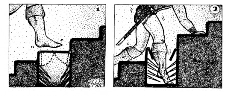
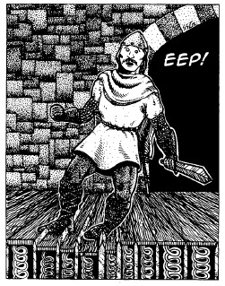
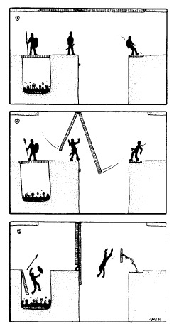
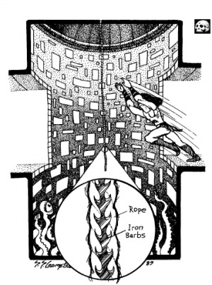
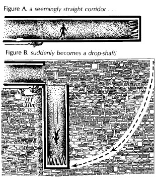

Príbeh sa odohráva v menšej dedinke na obchodnej ceste, pri ktorej v masívnej veži sídli mocný alchymista alebo čarodej. Nikto presne nevie. Veža je niekoľko kilometrov od dediny, ale i tak ľudia občasne počujú zvuky výbuchov, prípadne ohňostroje alebo farebný dym. Nikto nevie, čo tam ten alchymista, alebo čarodej, porába, ale všetci ho majú vo veľkej úcte. Raz za čas Flerexius, tak sa volá, príde do dediny a s hostinským dohodne obchod. Väčšinou pošle nejaký balík do mesta, alebo nejaký balík dostane. Sem tam si chodí objednať suroviny, ktoré mu chýbajú. Nikdy sa moc nezdržuje.

A tu začína príbeh. Flerexius si objednal byliny, ktoré došli uzavreté v sklenenej fľaši. Hostinský ich však nestíha doručiť, a tak poprosí hrdinov o službu. Ich úlohou je priniesť Flerexiusovi fľašku s bylinkami a dostanú od neho druhú polovicu odmeny. Hostinský im poskytne dohodu, ktorú spolu uzavreli, ako doklad o tom, že práve hrdinom má vyplatiť spomínanú druhú polovicu.

## SCÉNA 1. Hostinec na konci sveta

DÔVOD SCÉNY: Zaúkolovanie hrdinov, dohoda o pláci, doplnenie zásob.

MIESTO: Dedinský hostinec, cez ktorý práve prechádza karavána s ovocím a zeleninou pre mesto. Hostinec je čistý a útulný, ale momentálne je tam plno. Vnutri, vonku i v stajniach.

POČASIE: Podľa ročného obdobia. Nemalo by mať nejak zásadný vplyv na dobrodružstvo. Malo by však byť kludné, mierumilovné. Atmosféra dňa domácka, víkendová.

POPIS SCÉNY: V hostinci je hlučno a dusno. Hostinský i všetci jeho pomocníci sa venujú vareniu, točeniu piva, roznášaniu objednávok a podobne. Karavána, ktorá do dediny prišla (alebo cez ňu prechádza), vyplnila väčšinu hostinca, ale pre hrdinov sa predsa len našlo voľné miesto. Hrdinovia vidia, ako sa hostinský snaží prehovoriť domácich i hostí na niečo, ale všetci ho odmietajú (nedostatok času). A tak nakoniec zavíta ku hrdinom a im ponúkne polovicu dohodnutej odmeny, ak zanesú Flerexiusovi tovar, ktorý si z mesta objednal.

GM POPIS: V skutočnosti sa hostinský do veže bojí ísť a rovnaká bázeň odrádza i ostatných dedinčanov. V poslednom období totiž veža pôsobí viac ako vulkán a menej ako obydlie humanoida. Preto je hostinský do určitej miery ochotný o cene „zájazdu“ ku Flerexiusovi zjednávať. Ako prvé poznamená, že by u neho mohli hrdinovia nakúpiť magické predmety, nápoje a pomôcky. Ak by ich to nepresvedčilo, navrhne zadarmo nocľah a nakoniec i večeru a raňajky.

ZÁVER SCÉNY: Na druhý deň hrdinovia vyrazia ku veži Flerexiusa.

## SCÉNA 2. Flerexius

DÔVOD SCÉNY: „Turning point.“ Príbeh sa zamotá a hrdinovia sa bez možnosti výberu dostanú z dažďa pod odkvap.

ZAČIATOK SCÉNY: Cesta k veži je príjemná, osviežujúca. I samotná veža vyzerá mierumilovno. Dvere sú dokorán otvorené, nádvorie čisté a upratané. Nikde ani živáčka. Len jeden starší kôň stojí v stajni (kôň je hluchý a viac menej slepý). Po niekoľkých schodíkoch hrdinovia vstúpia do chládku samotnej veže. Ticho veže prerušuje len hlas muža vyššieho veku. Pri pozornom započúvaní je možné rozoznať jednotlivé slová. Flerexius si dôkladne kontroluje prípravu na nové kúzlo. Hrdinovia ho nájdu v hodovnej sále veže, kde je všetko nachystané na nejaký experiment alebo kúzlo. Soľ vysypaná na zemi do tvaru podivných znakov, oktagram tvorený múkou, všade biele sviečky popísané zlatým písmom, kalichy s tekutinami a bylinkami. V strede oktagramu je položená kocka zo železa. Zdá sa, že Flerexius sa pokúša premeniť železo na zlato použitím mágie.

POPIS SCÉNY: Flerexius je na čarodeja/alchymistu zbrklý, rýchlo hovorí a je veľmi nepozorný na svoj zovňajšok. Hrdinov privíta tak, akoby mali dôjsť už predvčerom, ak nie skôr. Vyplatí im takmer dvojnásobok, čo im bolo sľúbené, a okamžite pridá chýbajúcu ingredenciu do kúzla.

Kúzlo sa okamžite spustí a začne hotový armagedon na zemi. Najprv v sekunde zovrie obsah pohárov a z nich cez okná vyletí zlatý žhavý lúč na nádvorie okolo veže. To vzbĺkne magickým ohňom. Horí kameň, zem i samotný vzduch. V miestnosti začne byť teplo na nevydržanie. Je problém dýchať. Flerexius to zhodnotí kľudným hlasom a pokrčením ramien: _„Hmmm, asi som zabudol nasmerovať energiu do vnôtra oktagramu.“_ Jeden zo zablúdilých jazykov ohňa sa v tom okamihu dotkne jeho tela a on sa roz­padne na prach. Neďaleko od miesta, kde domáci pán skonal, sa objaví teleport a v ňom duch diablika: _„Prajem príjemný deň. Situácia naznačuje, že nebezpečenstvo ohrozenia života je na lokálnom maxime. Preto vás prosíme opustiť priestor pracovne skrz núdzový východ. Dodržujte prosím nasledujúce poradie: tehotné ženy ako prvé, po nich nasleduje jeden muž vo veku od 15 do 25 rokov, fyzicky zdravý. V prípade, že sa taký v skupine nenachádza, prednosť dostáva muž s najvyšším množstvom zdravých detí do 40 rokov. Po ňom nasledujú ženy do 40 rokov po jednom od najmladšej po najstaršiu. A potom ostatní. Prajem príjemnú cestu.“_

GM POPIS: Vplyvom mágie nesmerovaného kúzla je kúzlenie vysoko nestabilné a žiaden kúzelník nevie povedať, čo by sa v skutočnosti stalo, ak by zakúzlil. Pred zlatým ohňom tiež nie je možné zabezpečiť si ochranu. Na druhej strane, zlatý oheň je schopný roztopiť a zničiť každý magický predmet. I prsteň pána Saurona. Takže ak hrdinovia smerujú do Mordoru, už tam nemusia.

ZÁVER SCÉNY: Hrdinovia sa cez teleport dostanú do malej miestnosti s troma východmi. Diablik svojim temným červeným svetlom ožaruje okolie.

## SCÉNA 3. Čierna schránka

DÔVOD SCÉNY: Samotné jadro dobrodružstva i jeho vyvrcholenie

ZAČIATOK SCÉNY: Hrdinovia sa ocitajú v kruhovej miestnosti. Okolo nej sedí s nohami prekríženými na zemi tucet kamenných postáv s telom i tvárou zahalenou v kapucni. Pred každým z nich je do podlahy vytesaná kúzelnícka palica. Miestnosť pôsobí dojmom okrúhleho stolu, kde každý čarodej zaujíma rovnocenné miesto medzi ostatnými a na znak mieru ukladá svoju palicu. V strede miestnosti, kde smerujú všetky palice, horí malý červený magický oheň. Nad ním sa znovu zjavuje diablik: _„Vážené dámy, vážení páni! Dovolte, aby som vás privítal v mieste symbolizujúcom rovnováhu všetkých dvanástich typov síl, ktoré prúdia našimi telami. Ich sila a dobrota dáva vzniku života, udržuje ho i ukončuje v závislosti od činov, ktoré konáme v kolobehu veľkého plánu. Prosím občerstvite sa pred odchodom na zvolené miesto.“_ V miestnosti ale žiadne občerstvenie nie je a hrdinovia vidia len tri východy z miestnosti. Dvoje dverí opatrených silným zámkom a chodbu. Nad chodbou je nápis: cesta ku núdzovému kľúču. Diablik sa zatiaľ špára v zuboch, prdne si, poškrabe sa na riti a grgne si štýlom opitého štangasta po exnutí litrového piva pod 3 sekundy. Na otázky hrdinov neodpovedá. Po necelých troch minútach sa začne znovu venovať postavám: _„Vyzerá to tak, že ste si zas zabudli kľúč. Pochopiteľne,“_ zatvári sa nešťastne a vyberie odnikiaľ zvitok a začne ho nahlas čítať: _„Vážené dámy, vážení páni. V prípade, že ste si zabudli svoj kľúč, vám musím predčítať podmienky zmluvy, ktoré ste s tvorcom dohodli. Ako prvé, máte právo sa posadiť a umrieť v mieri. Je zakázané špiniť priestory jaskyne, znečisťovať ich a inak tropiť neporiadok. Za druhé, dýchateľný vzduch v týchto priestoroch sa dopĺňa len v stanovený deň. Zmluvou je dohodnutý štvrtok medzi siedmou a desiatou hodinou, čo je obsahom dodatku číslo 831. Starý vzduch bude recyklovaný spôsobom popísaným v dodatku číslo 256. I k nemu sa dostaneme...“_

GM POPIS: Diablik je správcom tejto časti jaskyne a hrdinov sa snaží presvedčiť, že nie je reálny. Jeho povinnosťou je však priniesť na požiadanie kľúčik, čo je poznačené v zmluve pod bodom 666 alebo 999. Podľa toho, ako sa na to pozerá. Ak postavy z nejakého dôvodu ostanú v miestnosti dosť dlho na to, aby poprosili Diablika správnou formuklou o prinesenie kľúča – formulácia je súčasťou bodu 666 alebo 999, potom sa Diablik teleportuje ku kľúču a postavám ho prinesie.

ZÁVER SCÉNY: Hrdinovia stratia trpezlivosť a vydajú sa na prieskum chodby, scéna 4, alebo s kľúčom od Diablika pokračujú k scéne 5.

## SCÉNA 4. Dungeon

DÔVOD SCÉNY: Samotný zapascovaný dungeon.

POPIS SCÉNY: Prvá _pasca 1_ je ihneď na prvých krokoch chodby dlhej najmenej 27 metrov. Druhá _pasca 2_ je 2.7 metrový úsek za schodiskom (hlavne pre tých, ktorí by chceli schody preskočiť). Tretia a štvrtá pasca (_pasca 3_ a _pasca 4_) nasledujú chvíľu po sebe. Piata _pasca 5_ je na konci chodby a už z diaľky je vidno, že pred bodliakmi sú na zemi padacie dvere. V skutočnosti nejde o padacie dvere, ale o normálne dvere, ktoré vo zvislej polohe chodby (bodliaky naspod) otvárajú vchod do miestnosti, v ktorej je kľúč na striebornom podnose.

GM POPIS: _Pasca 5_ sa znovu vráti do pôvodnej polohy, ak nie je zaťažená, a tak postava, ktorá príde ku kľúču môže ostať uzavretá a bez východu.

ZÁVER SCÉNY: Po prekonaní pascí sa hrdinovia dostanú ku kľúču.

## SCÉNA 5. Dvere

DÔVOD SCÉNY: Happy End

POPIS SCÉNY: Postavy, ktoré zdarlivo prekonali pasce, dostanú možnosť otvorenia dverí. Jedny i druhé dvere otvoria teleport neďaleko hostincu s tým, že kľúč sa magicky vráti na svoje miesto v podzemí. Práve takto chodieval Flerexius na nákupy. Teleport ostane aktívny približne hodinu.

GM POPIS: Kam smerujú druhé dvere? Otvoria sa po tom, ako postavy získajú oba kľúče? Čo na to hovorí zmluva s Diablikom? Ak by hrdinovia boli príliš bojachtiví, kamenné postavy čarodejov sa môžu postaviť postavám na odpor. Je možné ich umlčať slovíčkom dohodnutým v zmluve o diele dodatok 272, ako postavám s radosťou prečíta Diablik, ak budú dostatočne trpezliví.

ZÁVER SCÉNY: Hrdinovia sa dostanú s finančnou odmenou za prinesenie byliniek znovu do krčmy, kde im ustaraný hostinský bude nalievať zadarmo.
