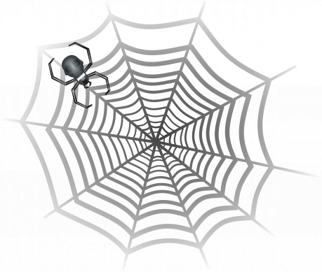

Když večer znavený Muir Buckinner zapadl do krčmy, honila se po severním obzoru vdoví mračna, předznamenávající silnou příbřežní bouřku. Takovou bouřku, jež způsobí, že se pár lodí nevrátí do přístavu včas, tedy v lepším případě. V horším případě se nevrátí vůbec a ve městě přibude pár vdov. Muirovi to ale bylo celkem jedno, už mnoho let byla moře osiřelá, takže tuto noc příliš vdov nepřibude. Když po silné zelňačce a pár žejdlících šel spát, na severu už hřmělo.

Ráno se probudil do krásného rána, moře po bouři vonělo svěžestí přinášenou mírným vánkem až k jeho skromnému loži na půdě. Sluneční paprsky tančily na drobných vlnkách a Muir se tím pohledem kochal notnou chvíli. Zdálo se že, přístav byl noční divočiny zcela ušetřen, snad jen že mírný deštík spláchl prach. Jeho kochající se zrak zalétl více vpravo, až za hlásku u kasáren městské gardy. Tam přeci jen k nějaké změně došlo – u jednoho z nepoužívaných mol staré části přístavu byl nově vyvázán neznámý koráb.

{:.sidebar}
Místo: Paimpol, největší přístav Západní marky Erathie (jakékoliv větší přístavní město, nejlépe s odděleným kotvištěm místní autority, ať už je to král, či jiný zeměpán, kupecká gilda nebo třeba církevní řád)

Muir sice nebyl zrovna námořník, ale tato loď jej přesto zaujala. Nedovedl říct proč, vypadala jako docela standardní obchodnická koga, ale přesto zároveň jinak. Buckinner neodolal a ještě před snídaní zamířil po nábřeží ke starému přístavu. Nedostal se ale moc daleko, jindy otevřená branka byla uzavřená a přátelského dědu s obuškem městské stráže vystřídali dva gardisté s halapartnami. Rozhodl se nepokoušet štěstí a najít jiné místo, odkud by si loď prohlédl.

Procházka na konec vlnolamu nového přístavu a pak trocha nebezpečného lezení po kluzkých kamenech přinesla úspěch – otevřený výhled na tajuplnou kogu. Zatímco těch pár plavidel patřících gardě bylo vyvázáno přímo k nábřeží, koga stála na konci stařičkého mola, na němž hlídkovali další dva gardisté. Muir využil času potřebného na oddech k důkladnému pozorování, což mu vyneslo hned několik poznatků, z části snad vysvětlujících zvláštní přitažlivost neznámé lodi. Ta seděla nízko na vodě, takže její podpalubí bylo plné. Zda vody nebo nákladu nebylo možné poznat. Avšak nebylo vidět žádné poškození trupu, na rozdíl od takeláže, která byla pochroumaná snad až moc na jedinou bouři. Takže to byl spíš náklad.

Když se zamyslel nad tím, co taková koga asi vezla, uvědomil si další nepatřičnost. Loď vypadala jako starší kousek, avšak prodloužený trup dokládal, že konstrukčně patřila naopak k těm nejmodernějším. Buckinnerovi bylo jasné, že odsud více nezjistí a také to, že to tak nemůže nechat. Vrátil se proto do krčmy, dnes si práci shánět nebude. Místo toho věnoval den odpočinku a přípravě své výbavy, olejování luku a koženice, broušení tesáků a tak. Rovněž přemýšlel, zda tam doplavat z vlnolamu nebo se proplížit přes gardistický přístav. Právě kvůli luku, kterému by delší pobyt ve vodě určitě nesvědčil, se rozhodl pro druhou možnost.

Průzkum lodi z dálky je úkol střední obtížnosti, který si však lze ulehčit, pokud postavy podniknou nějaké rozumné přípravy tak, aby jim pohled na loď nic nezakrývalo. Přímo do starého přístavu se normálně dostat nedá, slouží lodím přístavní autority, takže je obehnán zdí a momentálně i střežen. Uličky k němu bezprostředně přiléhající jsou po dřívějším požáru rejdištěm živlů nekalých. Podle míry úspěšnosti lze zjistit následující:

1. Ačkoliv lana a ráhnoví vypadají poničené víc než jednou drsnou bouří, tak samotný trup se zdá nedotčen.
2. Podle toho, jak loď sedí na vodě, lze se domnívat, že náklad je stále na palubě. Nebo že loď nabrala hodně vody.
3. Loď vypadá, že na moři strávila už pěkných pár let, ale prodloužený trup odpovídá kogám nejnovější konstrukce.

Pokud má někdo námořní znalosti nebo uspějí ve zkoušce inteligence, pak se mohou domnívat, že se něco pokusilo loď násilím zastavit.

Střední obtížnost průzkumu znamená, že průměrné štěstí (hod) dopřeje postavám jeden úspěch, tedy odhalí první stupeň nápovědy.

Přes zeď proklouzl ve Stínově, jak místní nazývali uličky pobudů za starým přístavem. On, viditelně ozbrojený, však s nimi problém neměl. Místo zvolil dobře, neb v cestě mu stála pouhá dvojice stráží na začátku mola. A těm se ve všudypřítomných stínech dokázal vyhnout. Věděl však, že musí být na otevřeném prostoru potichu, aby nepřilákal jejich pozornost. Záhy se ukázalo, že to nebude snadné. Kus pochozí části mola byl propadlý a zbývalo z něj jen pár trámů utopených ve stínu zídky.

Muir se dlouze nadechl, protáhl a se štěstím rychle a tiše přeběhl na druhou stranu. Podobné překážky mu vždycky šly. Za to byl rád, neb měl dojem, že zahlédl ve vodě hemžit se docela velké kraby. Bližší pohled na kogu jen potvrdil dřívější dohady, na trupu nebylo ani škrábnutí, takže s největší pravděpodobností byl na palubě náklad. Jenže těžký náklad ještě nemusel být pro Muira zajímavý, chtěl však odhalit příběh této lodi. Prvním krokem bylo zjištění jména lodi. To však byl trochu problém, neb nápis na přídi nebyl vůbec vidět. Po chvilce pátrání bylo možné zjistit proč – celý trup lodi byl pokryt jemným mastným popílkem.

Se škodolibou myšlenkou na to, že hlídka bude mít ráno asi problém, našel místo, kde by mělo být jméno lodi uvedeno, a očistil jej. Dosáhnout po jeho celé délce nebylo úplně snadné, ale dlouhoruký Muir to zvládl dost dobře na to, aby jméno nakonec přečetl – Eremceg.

Buckinner pak již neváhal a vytáhl se na palubu. Tam byl pohyb složitější pro haldy trosek, navíc nechtěl riskovat, že bude spatřen proti světlejšímu horizontu. Po chvilce si s úlekem uvědomil, že na palubě ještě nikdo nebyl a pohybem v popílku zanechává viditelné stopy. Nicméně právě našedlý popílek byl příčinou, proč loď vypadala starší, než byla. Proto začal propátrávat palubu.

Stráž u paty mola není příliš bdělá, vyhnout se její pozornosti je lehké. Naopak násilné řešení není vhodné, hlídka při první příležitosti zapíská na posily, které se vzápětí dostaví a přečíslí postavy. V boji jsou dost zdatné a postavy s největší pravděpodobností zadrží a předvedou před kapitána přístavu. Pokud se budou snažit vyjednávat, tak se nechá snadno umluvit k tomu, aby je na palubu kogy poslal jako oficiální průzkum. Gardistický mág (nebo mág jiné autority) totiž loď prohlásil za prokletou a on nechce riskovat život nikoho ze svých lidí (to je taky jediná informace, co se dá o lodi zjistit, nelehce, od gardistů). Pověření ale taky znamená, že si z pokladu budou moci nechat jen to, co schválí garda. Nedohodnou-li se, tak je garda napoprvé vyvede do hostince (a nechá pod dozorem bývalého gardisty, který má zabránit opakovanému pokusu, všimnout si ho je středně těžké, zbavit se jej, když o něm vědí, lehké). Napodruhé je vsadí na dva dny do šatlavy, mezitím je loď odtažena neznámo kam. Uvedené platí pro jakýkoliv střet s gardou.

Přejít bez světla po navlhlých trámech je středně obtížné. Ulehčí to například právě světlo, ale nezabezpečené světlo přiláká hlídku, nicméně tu přiláká i případný pád do vody. Lze taky bez problémů přeplavat, a dokonce přejít na druhou stranu ve vodě. Jakýkoliv pobyt ve vodě však znamená napadení jedné postavy a její lehké zranění jakýmsi živočichem. Hraničářské dovednosti mohou odhalit, že se jedná o nejedovatého, ale dosti agresivního krabího pavouka. Při plavbě z vlnolamu jsou takto zraněny dvě postavy.

Lučištník se rozhodoval, zda zamířit na záď ke krytému kormidlu, nebo naopak na příď do kotevny. Nákladovými otvory se do lodi dostat nedalo, neb byly zavaleny zřícenou takeláží. Zvuky se zdály až příliš živé, proto založil šíp a postupoval k jeho zdroji s velkou obezřetností. Přední nástavba byla uvnitř relativně zachována, takže nebylo obtížné se prosmýknout ke kotevnímu rumpálu. Těžký kotevní řetěz nejspíš za bouře sklouznul z rumpálu a teď v něm uvízla noha dalšímu neoficiálnímu průzkumníkovi. Drobný chlapík byl oděn v prosté kožené zbroji a s častými přestávkami se snažil svou končetinu vyprostit. Při tom zjevně ztratil krátký meč ležící kousek od něho, a tak teď jako páku používal svou dýku.

Muir se pokusil muže potichu uklidnit, ale jedinou reakcí byla naštěstí nepříliš přesně vržená dýka. V odpověď vypuštěný šíp neminul. Lukostřelec chvíli zvažoval, zda se nemá těla zbavit, ale pak se rozhodl, že je to zbytečná práce, jen vytrhl a očistil svůj šíp. Zběžná prohlídka zlodějova těla přinesla váček s několika mincemi a drobný zlatý šperk. Šperháky a lahvička s jedem jej nezaujaly, na rozdíl od malé lucerny s praktickou soustavou stínítek. Tu hned použil, u samotného rumpálu byla trocha měsíčního světla, ale ostatní prostory jen tím víc tonuly ve stínech.

Pokračoval proto s prohlídkou příďových prostor pro posádku. Jak se dalo čekat, prodloužený trup byl určen nákladu, takže posádka pracující na lodi měla stále podmínky velmi stísněné a její pohodlí bylo až na posledním místě. Bouře se i zde podepsala, ale jinak se zdálo přední podpalubí docela v pořádku. Zkáza, jež postihla palubu, se sem nepřenesla. S lucernou zavěšenou na opasku se delší dobu rozhlížel.

Muir shledal, že to, co zbývá ze zásob, je ještě zcela poživatelné, jako by loď byla opuštěna nejvýše před týdnem. Potraviny i vodu opatrně otestoval, ale zdály se bez závad, neotrávené. Z důkladného průzkumu jej vyrušil pavouk. A ne ledajaký, celý černý a velikosti kočky. Muir potřeboval tři šípy na to, aby se jej zbavil. Zranění unikl jen díky kvalitním botám.

„Potvoro hnusná,“ tiše zaklel Muir, když si prohlédl pavouka přišpendleného šípem k podlaze. Opět vrátil všechny tři střely do toulce, neb jeho tatalijské šípy by byly i pro průměrného gardistu zřetelným pojítkem. Rozhodl se, že nebude čekat na další osminohé návštěvníky a konečně půjde prozkoumat kormovou nástavbu, třeba v ubikacích důstojníků objeví něco zajímavějšího. Předtím, než vylezl na palubu, zakryl lucernu stínítkem.

{:.sidebar}
Očištění názvu lodi lze pojmout jako lehkou zkoušku, pokud postava neuspěje, spadne do vody. Tam jej zase zraní krabí pavouk (lehké zranění). Pokud nebudou reagovat na to, že by očištění nápisu mohlo přilákat hlídku ani po očištění nápisu, který je v měsíčním světle dost jasně vidět, tak to zvýší pravděpodobnost zásahu hlídky při všech následujících příležitostech. Zjištění názvu lodi může být pro oneshotové hry prvním záchytným úspěchem. Pro úplnost, Eremceg znamená turecky pavouk.

Při přesunu přes otevřený prostor seznal, že v okolí panuje naprostý klid a zadoufal, aby to tak ještě nějakou chvíli zůstalo. Jako první se dal do průzkumu krytého kormidelního prostoru, vymoženosti nové generace kog. Kormidlo obvykle stávalo na nejvyšším místě zadní, kormové nástavby, cenou za vynikající výhled rušený „jen“ plachtami bylo úplné vystavení živlům a samozřejmě též nepřátelským lučištníkům. Nové kogy to vyřešily altánovou konstrukcí doplněnou soustavou velkých okenic, čímž vznikl přijatelný kompromis mezi ochranou a výhledem.

Lučištníkovi se u kormidla moc nelíbilo, trosky a skvrny od krve byly v měsíčním světle docela děsivé. Vrátil se proto na palubu, aby mohl vstoupit do zadní nástavby, kde by měly být kajuty kapitána a jeho důstojníků. A taky průchod do podpalubí a k nákladu. Hned za vstupem se nacházely dveře do levoboční části nástavby, Muir tušil, že tam by se měl nacházet sklad plachet a lan. To jej příliš nezajímalo, proto si nechal tuto místnost nakonec. Přímo před sebou měl otevřené dveře do kapitánovy kajuty. Nejprve jej zaujaly samotné dveře, z venku byly dost poškozené zbraněmi, ale neproražené. Přesto se i v kapitánově kajutě nejspíš bojovalo. Zatímco prostory posádky na přídi byly zařízeny maximálně účelně, za lůžka námořníkům sloužily hamaky natažené mezi žebrovím lodi. O ubytovací prostory se museli dělit s truhlářskou dílnou a ve skladišti potravin se nedalo hnout, tak kapitánova kajuta skýtala především dostatek prostoru a při otevření okenic i světla. Lampička odhalila, že její výbavu tvoří sice především účelný, ale přesto alespoň trochu pohodlný nábytek z kvalitního leštěného dřeva s čalouněním. Skříně i truhlice byly ozdobeny vypalovanými námořnickými motivy a našlo se místo i na obrazy. Jeden z nich byl obligátní oficiální portrét panovnice a druhý jakási neurčitá krajinka.

Odhalit stopy na palubě je středně těžké, měsíc sice svítí, ale jeho možnosti jsou omezené a je třeba nebýt příliš nápadný, neb ze sídla autority je tam z části vidět. Podle míry úspěšnosti lze zjistit následující (body 3 a výše by opravdu neměly být lehce k mání):

1. Z kotevny se ozývají zvuky řinčení řetězu a sípání.
2. Chybí záchranný člun.
3. Záchranný člun nebyl utržen bouří, jak by se mohlo zdát, ale byl na vodu řádně spuštěn.
4. Větší část trosek je vržena ve směru od zádě dopředu.
5. Na patě stěžně je runa ochrany, pokud se v tom některá z postav vyzná, tak lze zjistit, že se jednalo o obecnou ochranu proti poškození a zvláště o ochranu proti ohni. Runa je však již vyčpělá, neaktivní.

Muira příliš nezajímalo, kdo s kým bojoval, ale podle stop si domyslel, že sem dorazili pavouci. A přestože se kapitán, možná ještě s někým z posádky zuřivě bránil, byl nakonec přemožen. Útočníci, jako by se však zajímali pouze o jeho tělo, kajuta byla jinak nevyloupená. Ve zmatku po bouři však chvíli trvalo, než nalezl malou bytelnou lodní pokladnici, její zámek byl však chráněn zámkem s pastí, dost možná magickou. Proto raději rozbil stěnu, k níž byla pokladnice připevněna; spolu s posledním soudkem rumu si ji odnesl ke vchodu, a pokud se do ní dokáže dostat, bude to zajímavá kořist.

Když už otevřel průchod do kajuty navigátora a prvního důstojníka stěnou, mohl s klidem projít dveřmi a prozkoumat kajutu na pravoboku nástavby přímo. Ta byla překvapivě dotčena jen nepatrně. Navigátor byl zjevně pořádkumilovný člověk, měl své věci dobře uloženy, a tak bouře napáchala jen minimum škod. I když musel Muir nakládat se světlem velmi opatrně – loď stála pravobokem k budově gardy, tak nebylo těžké postřehnout, že chybí mapová kniha i lodní deník, stejně jako podstatná část z osobních věcí navigátorových.

V obou kajutách není nic moc zajímavého, byť šatstvo a pár zbylých osobních věcí by při prodeji mohlo dát až 30 zl. Zbraně a další podobnou výbavu odnesli přeživší.

Uvízlý člověk je místní zlodějíček, co má loď prozkoumat pro jednoho z kápů podsvětí, sám se vyprostit nedokáže, protože na řetězu zároveň sedí, ale s pomocí kohokoliv dalšího je to snadné. Pokud nevyplyne jiná reakce z přístupu družinky, bude reagovat dle hodu k6:

1. Po zachránění je šílený, s neartikulovanými zvuky se vrhne na nejbližší postavu, zaútočí dvojicí dýk.
2. Po zachránění začne pištět (není tak hlasitý, aby přivolal hlídku) a s výkřikem „pozor pavouci“ se vrhne do moře a odplave pryč.
3. Poděkuje za záchranu, ale je neschopen další akce, klepe se vyčerpáním a bolestí. Je třeba se snažit, aby prozradil, že na lodi viděl velké a děsivé pavouky, pak se zhroutí do mdlob.
4. Poděkuje za záchranu a dá postavám na výběr mezi informací o pavoucích a šperkem v hodnotě 70 zl. a pak udělá vše proto, aby mohl zmizet.
5. Poděkuje za záchranu a dá postavám informaci o pavoucích a šperk v hodnotě 70 zl. a pak udělá vše proto, aby mohl zmizet.
6. Nabídne, že se připojí k družince a pomůže jí prozkoumat loď.

Reakce přiměřeně platí i pro kontakt před vysvobozením. Zlodějíček může být docela užitečný, ovšem jeho případná přítomnost při zadržení autoritou je problém, jedná se o známou firmu.

Naposledy se v tomto patře vydal do skladu plachet, nečekal, že tam najde cokoliv zajímavého, ale raději to chtěl zkontrolovat. Než se však mohl pořádně porozhlédnout, napadli jej dva pavouci. Dokonce ještě větší než ten v předním podpalubí. Muir měl rázem plno starostí s obranou. Luk mu nebyl nic platný, musel rychle tasit tesáky. Přestože se snažil bránit, utržil pěkných pár hlubokých kousnutí, než pavouky udolal.

Muir Buckinner se dost rozmýšlel, zda se na loď nevykašlat a nezmizet s dosavadní kořistí, i tak to bylo víc, než doufal. Rány od pavouků si musel, přestože nebyly otrávené, ošetřit. Nakonec zvědavost zvítězila a on se rozhodl prozkoumat ještě alespoň nejbližší část podpalubí. Protože nechtěl utržit další zranění, uvázal lucernu na provázek a spustil ji před sebou.

Instinkt jej nezklamal, na lucernu se vrhla dvojice pavouků, jeden větší celočerný a druhý, trochu menší se zelenými fleky. První, pečlivě zamířený šíp zasáhl flekáče a přišpendlil jej k podlaze. Černý se dal na ústup, ale Muirova rychlostřelba jej dokázala zranit a posléze i zabít. Raději ale založil další šíp, než začal po krkolomně úzkém schodišti sestupovat. To byla správná volba, protože další pavouk čekal schován v nejstinnějším koutě. Tento měl červenou hlavu, a jen co se na schodech objevil Lučištníkům obličej, tak na něj vypustil ohnivou střelu. Naštěstí jen menší, přesto měl levou ruku, v níž držel lučiště a část obličeje nehezky spálenou. Reflexy naštěstí zafungovaly na výbornou a šíp zabránil ohnivému pavoukovi vypustit další plamenný pozdrav. Koutkem oka však zaznamenal, že nejméně jeden další pavouk unikl kamsi dolu.

Zaváhal zda nemá hned utéct taky, ale tenčící se zásoba šípů a jejich snadná identifikovatelnost mu dodaly odvahy, aby (už určitě naposledy) pokračoval v průzkumu. Dole se nacházelo šestero dveří a poklop níže k balastu a hlavně kormidelnímu mechanismu. Tím směrem ale zmizel pavouk, takže Muir jen vrátil dekl na místo a zatížil jej prvním, co mu padlo pod ruku. Dveře do nákladového prostoru bývaly taky zatlučené, ale někdo závory vytrhl. Právě jejich pozůstatky posloužili k zablokování poklopu. Proti dveřím do nákladového prostoru byly dvoje dveře do kajut druhého a třetího důstojníka, levoboční strana měla rovněž dvoje dveře vedoucí do kajuty pro dva a tři muže. Muir odhadoval, že se jedná o kajutu kormidelníků a praporčíků. Panoval v nich docela chaos, ale nezdálo se, že by byly zasaženy bojem. Zde už převládala ryzí účelnost, ale přeci jen bylo dost místa na osobní truhlu a jakous takous postel, jen jeden z kormidelníků si potrpěl na svou hamaku. Poslední dveře vedly do jídelny.

Přední podpalubí je sice stísněné, ale ne úplně malé, prohlídka trvá při stejné míře důkladnosti dvakrát déle než v předchozích případech a i se světlem je středně obtížná.

1. Ze skladiště zmizely dva soudky s vodou, byly odneseny buď prázdné, nebo nerozbité, nejsou zde stopy po vylití vody. Velmi pravděpodobně zmizely i další zásoby.

2. Průchod z předního podpalubí do nákladového prostoru byl důkladně zablokován z této strany, nevypadá to na improvizovanou záležitost.

3. Někdo pobral část osobních věcí přibližně poloviny posádky.

(4.) Při dalším průzkumu či mimořádném úspěchu lze doplnit, že z 22 členů posádky 12 někdo odnesl to nejnutnější z osobních věcí.

(5.) Průchod k nákladu sice zatarasil velmi zručný truhlář, ale přeci jen ve spěchu.

Průchod však nelze ani při odstranění zábran otevřít, je nejspíš blokován i z druhé strany.

Muir se před dveřmi do jídelny zarazil, na rozdíl od ostatních byly zavřené. Nechtěl riskovat další střet a tak se zaposlouchal. Pavouci v jídelně určitě byli a nebylo jich málo, ale mnohem důležitější byl slaboučký lidský hlas volající o pomoc. Při představě pavoučí přesily si vzal ze stěny lampu s plnou zásobou oleje a zapálil ji. V levačce pak měl kromě luku ještě lektvar rychlosti, takto připraven rozkopl dveře do jídelny a schoval se za roh, očekávaje pár ohnivých střel. Ty se však nekonaly, přesto pohled dovnitř nebyl o nic méně hrůzný. Na stole bylo pavučinami připoutáno tělo v kroužkoplátové zbroji, na němž hodovaly snad desítky pavouků velikosti podšálku. Tomu všemu byl nucen přihlížet stejným způsobem spoutaný muž.

Lučistník neváhal a vrhl lampu na stůl, ta splnila svůj účel a uvrhla nešťastníka i s většinou pavouků do plamenů. Jen o chvilku později vypil lektvar rychlosti, odložil luk a tesákem odřezal pavučiny poutající ještě žijícího námořníka od židle. S ním v rukou se pak vrhl po schodech vzhůru, doufaje, že se při tom oba nezabijí. Přesto jej stihlo několik pavouků pokousat. V pavučině zabalený zachráněnec mu příliš překážel na to, aby mohl vzít lodní pokladnici nebo soudek s rumem. Velmi obtížný byl i jen samotný sestup na molo. Až tam se odvážil zastavit…

---

> Souboj s jedním pavoukem je snadný, ač jeho rychlost či mrštnost činí obtížnějším jej zasáhnout. Není jedovatý, nemá u sebe žádné poklady. Pokud je důkladně prozkoumáván zkušeným hraničářem, tak lze se štěstím poznat, že většina jeho očí je uzpůsobená na termovidění a celkově preferuje spíš tmu a šero, i chvíli po smrti očka ucukávají před přímým světlem. Stejní tvorové napadají postavy ve vodě v okolí lodi, tam ale jen kousnou a stáhnou se.

> Prozkoumat kormidelní prostor je středně těžké vzhledem k množství trosek a jejich rozházení bouří.
>
> 1. Důkladná prohlídka odhalí, že ještě před bouří, která se zde dost podepsala, se zde bojovalo. Podle stop krve hodně ostře a nejspíš to pár lidí nepřežilo, ale těla nikde nejsou vidět.
>
> 2. Stříška kormidelního prostoru je zezadu zvenčí ožehlá a obě zadní podpěry jsou naprasklé, loď byla zřejmě ostřelována zezadu při pronásledování.
>
> 3. Stříška kormidlovny na rozdíl od vlastního trupu lodi nebyla chráněna proti ohni a zlomení. Trochou experimentování lze dovodit, že ochrana trupu je ještě aktivní.
>
> 4. Škody bojem nastaly v době před bouří a trosky byly z bezprostředního okolí kormidla odklizeny. (Pokud to dává v reáliích daného světa smysl, tak z dvojí barvy krve lze vyvodit, že mezi útočníky byli nelidé.)

> Zjistit, že se v kapitánově kajutě bojovalo, je snadné (samo o sobě netřeba ověřovat), ale zjistit další informace je obtížně, a není-li mezi postavami stopař, tak dokonce velmi obtížné.
>
> 1. Z kapitánovy kajuty bylo odvlečeno nejméně jedno krvácející tělo. Věci byly sice rozházeny, ale kajuta nebyla vykradena, nejednalo se tedy o loupežný útok.
>
> 2. V kajutě lze najít stopy velmi drobných kulatých nohou.
>
> 3. Dveře byly poškozeny zbraněmi, ale jejich útoku odolaly, uvnitř se strhla jiná bitka, kde zbraně používali jen obránci.

> Pokladnice je hlídána magickou pastí, která při pokusu o násilné otevření spustí silný ječák. To přiláká pozornost hlídky, ta sice nevstoupí na palubu, ale spolu s posilami bude loď bedlivě hlídat. V truhlici je X zlatých (X = součin hodů k6 nebo k10 za každou z postav v družince, nejméně 2, nejvýše 5).

> Boj s pavouky je středně těžký boj, jsou větší, silnější a ještě agresivnější než jejich příbuzný na přídi a družinka se musí snažit je přemoci. U slabších družinek lze doporučit přehození síly oponentů tak, aby byly postavy nejprve varovány. S velkou dávkou štěstí lze zaznamenat, že ve skladu chybí oplachtění pro záchranný člun.

> Pavouci v podpalubí jsou těžký boj. Zelený pavouk disponuje silným jedem, který ochromuje zasažené, ohnivý pavouk střílí malé ohnivé koule. Pokud by se boj s nimi vlekl, tak žádný neuteče a naopak přijdou posily.

> Prohlídka čtveřice kajut zabere docela dost času s pramalými výsledky. Leda kajuta druhého důstojníka obsahuje pár užitečných věcí, neb byl zřejmě taky voják. Najde se tam stojan na kroužkoplátovou zbroj a náčiní na opravu zbraní a zbrojí. Nejhodnotnější je rezervní dýka a palcát. Před dveřmi do jídelny se vyplatí naslouchat, neb z jídelny lze zachytiti dva druhy zvuků (bez naslouchání těžká obtížnost s nasloucháním lehká) – slabý lidský hlas volající o pomoc a pohyb většího množství pavoučích těl.

> Pavoučí mláďata jsou nebezpečná jen svým počtem, zabije je každý zásah, kdežto sama nemohou příliš ublížit (zraní za jeden život), vyjma toho, že jedna šestina z nich má zelená bříška – disponují slabým jedem.
>
> Přeživší námořník je kapitánem lodi. Přivést jej natolik k vědomí, aby s ním šlo komunikovat, je středně těžký manévr. Zbavit jej otravy a zranění pak manévr těžký. Ale vyplatí se to, varuje postavy, že v nákladovém prostoru jsou ještě větší a nebezpečnější pavouci, sami nemají v žádném případně nákladový prostor otvírat. Jakoukoliv spolupráci považuje za méně důležitou než informaci o zbývající části posádky, která se snažila uprchnout po objevení se pavouků v záchranném člunu. Pokud mu postavy řeknou, že se jim to podařilo, aniž by znaly pravdu, tak to pozná a přestane spolupracovat.
>
> Pokud jde o loď, nejlepší by bylo přivést královské čaroděje, aby deaktivovali runy ochrany, a loď vyhodit do povětří nebo spálit. O nákladu se s postavami odmítne jakkoliv bavit, šlo o důležitý královský úkol. Nemá ale nic proti tomu, aby si družinka za jeho záchranu přivlastnila lodní pokladnici a soudek rumu, případně i další kořist vyjma jeho vlastní šavle. Dá jim dokonce dost času, aby mohly postavy zmizet, než přivolá stráž. Nelze však vyloučit, že autorita o družince ví – na lodi nebude zasahovat, ale zadrží a pečlivě vyslechne každého, kdo by se pokoušel z lodi utéct.
