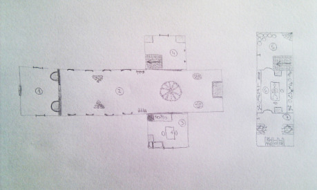
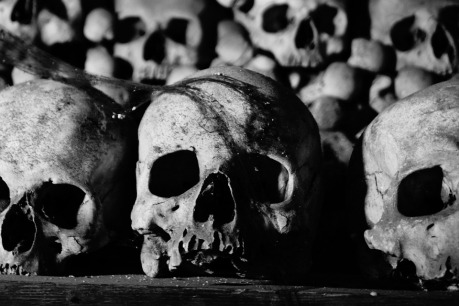

Necelý den cesty od vísky, ve které se družina právě nachází, je stará opuštěná kostnice. Sklad kostí z dob velkých válek, které se tu kdysi vedly, nebo alespoň tak se to říká. Je ale skutečně opuštěná? Nenachází se v ní nějaké cennosti či artefakty? A je něco pravdy na povídačkách o mizejících lidech? Snad zvědavosti za dost učiní právě vaše družina…

__Cesta ke kostnici__ vede přes travnatá luka (kdysi lány polí), na kterých by si nejeden člověk (či kůň) mohl vyvrtnout kotník. V noci se krajem prohánějí duchové a jejich kvílení, nářky a prosby mohou družinu strašit ve spánku. Duchové nemusí být nutně nepřátelští. Je možné, že některý z duchů družinu požádá, aby mu z kostnice přinesla nějaký konkrétní předmět…

__Okolí kostnice__ je zarostlé (kostnice sama stojí na okraji lesa) a nic neprozrazuje žádné stopy nebo nějaké známky osídlení. Okna jsou temně šedá, některá popraskaná a střecha zachovalá, neponičená. Zvenčí vypadá kostnice jako malý kostelík.

__Vstupní dveře__ – Masivní dvoukřídlé dveře ze starého dřeva lemují nyní již nečitelné symboly. Klika, zámek a západka jsou zrezivělé, ale stále funkční.

## 1 Vstupní místnost

__Kamenná podlaha, zašedlá okna__ – To platí v podstatě pro celou kostnici. Okno vpravo je dole rozbité.

__Dvě nádoby z kostí připevněné ke zdi__ – Kdysi plné svěcené vody, nyní prázdné.

__Dvoukřídlé dřevěné dveře__ – Jsou obloženy několika desítkami lebek. Na každém křídle dveří je připevněna lidská kostra. Táhla na dveřích jsou zhotovena taktéž z kostí. Nejpravděpodobněji z lopatek.

## 2 Hlavní sál

__Stěny a strop__ – Jsou pokryty desetitisíci kostí nejrůznějších velikostí a tvarů. Malé, velké, dlouhé, krátké, lidské, obří i hobití.

__Výklenky ve zdi__ – Taktéž zarovnány kostmi.

__Pyramidy z lebek__ – Každá je vysoká asi dva metry. Občas některá z lebek cvakne zuby.

__Stojany se zbraněmi__ – Je libo kostěnou dýku, kostěný meč či kostěnou kuši?

__Stojany s lebkami__ – Dva nádherně vyvedené, sametem vykládané stojany, ve kterých je umístěno jen pár desítek lebek. Nejspíše nějakých významnějších lidí. Lebky mají i popisky. Na některých jsou i nějaké malby. Většinou rostlinné či astrální motivy.

__Oltář s erbem__ – Z kostí sestavený oltář, na kterém jsou pozůstatky po dávno vyhořelých svících. Nad oltářem visí erb jakéhosi dávného rodu, sestávající se z mnoha set kostí.

__Lustr z lebek__ – Uprostřed dómu visí ze stropu těžký desetiramenný lustr. Taktéž z mnoha set kostí, dekorovaný bezpočtem lebek. Svíce na něm jsou už dávno vyhořelé.

## 3 Obydlí čarodějnice

V kostnici se před nějakým časem zabydlela zlá čarodějnice. Je sice pravda, že se o kostnici docela stará, ale její rejdy a nekromantské praktiky nevěstí nic dobrého. V družině uvidí pouze nové potenciální přírůstky mezi exponáty.

__Stůl se dvěma židlemi__ – Na stole leží talíř se zbytky čehosi nepoživatelného.

__Stůl s kuchyňským vybavením__ – Talíře, příbory, hrnce, nože… Příliš nepoužívané, ale přesto ve velmi bídném stavu.

__Pec__ – Jenom černota a saze.

__Postel__ – S černým polštářem a černou přikrývkou.

__Skříňka s knihami__ – Většinou knihy o (nejen lidské) anatomii. Také několik nekromantských knih psaných na černém papíře. Ve skříňce je také k nalezení pár dříve kouzelných prstenů, svitky (většinou reanimační kouzla) a křišťálová koule.

## 4 Skladovací místnost

__Truhlice s kutnami__ – Většina kuten je již zetlelých.

__Truhlice s pochodněmi, svícny a svíčkami__ – Překvapivě nejsou až v tak strašném stavu. Čarodějnice zásoby čas od času doplňuje.

__Držáky na pochodně__

__Schody do sklepa__ – Schody jsou sestaveny z lebek. Při chůzi po nich občas nějaká praskne.

## 5 Sklípek

Celým sklepením se nese velmi nepříjemný zápach a chlad.

__Mnoho sudů__ – V sudech je uskladněno především staré víno a olej. V jednom ze sudů se nachází lidská krev.

__Kout plný pavučin__ – Nachází se v něm také jejich obyvatelé pavouci. Sami si rozhodněte, jak jsou velcí.

__Držák na pochodně__

## 6 Dílna

__Stoly s kostmi a nářadím__ – Zde se kosti opracovávaly a sestavovala se z nich leckterá morbidní díla. Protože čarodějnice v práci pokračuje, je tu rozloženo mnoho kostí i mnoho praktického nářadí. Jsou tu také k nalezení svícny zhotovené z lidských lebek. Svíčky v nich jsou vyhořelé zhruba do půlky.

__Stůl s kostrou__ – Na stole leží lidská kostra, která silně zapáchá.

__Dvě dřevěné židle__ – Notně rozvrzané.

__Držák s pochodní__ – Pochodeň je vyhořelá zhruba do půlky.

__Dvě truhly__ – V jedné z nich se nachází provazy, železné pruty a další nářadí. Ve druhé leží černá skříňka obsahující velký kus ledu – srdce čarodějnice. Čarodějnice nebude nikdy zcela poražena, dokud její srdce neroztaje.

## 7 Putridarium

Neboli tlejírna. Na kamenných stolcích jsou usazeny tři mrtvoly v pokročilém stádiu rozkladu. Jejich tělesné orgány stékají do otvoru uprostřed stolců. Snad není třeba zmiňovat, že pach je zde k nevydržení a že družina právě našla ztracené lidi. Ti mohou mocí čarodějnice povstat jako ghúlové.

__Držák s pochodní__ – Pochodeň je vyhořelá zhruba do půlky.

## Poznámka na závěr

V celé kostnici samozřejmě platí, že kterákoliv z koster (či kostí) může kdykoliv obživnout a na družinu zaútočit nebo jí způsobit jakékoliv jiné potíže. Podle svojí potřeby můžete přidat mnoho dalších bytostí – kostěné netopýry, létající lebky, čarodějčinu kočku… Stejně tak můžete vymyslet mnoho dalších, hlubších motivů a zápletek, které družinu dovedou zrovna na toto místo. Přeji dobrou zábavu!
