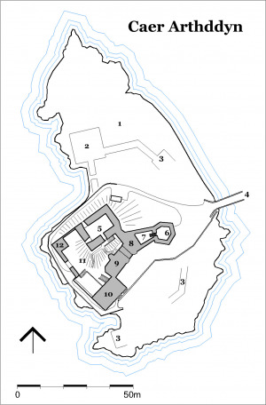
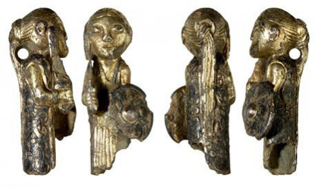
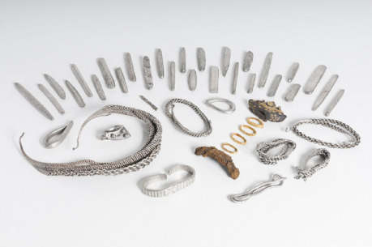

## Legenda o Caer Arthddyn

Caer Arthddyn, Hrad Medvedieho muža, je starý elfský hrad na západnom pobreží Vysočiny, ktorého pôvodné meno si už nikto nepamätá. Hrad pred mnohými zimami vyplienili severania, ktorí sa tam po úspešnom letnom ťažení a plienení usadili. Legenda hovorí o elfskej kňažnej, ktorá pred smrťou vyslovila kliatbu, že žiadny človek neprežije zimu na hrade.

Severania sa jej kliatbe smiali, ale len do chvíle, než ich sneh odrezal od zvyšku Vysočiny, jeden drakkar zhorel a ďalšie dva sa záhadne potopili. Severania sa začali záhadne strácať alebo umierať, raz na chorobu, inokedy s rozťatou hlavou, podrezaným krkom či šípom v hrudi, alebo v plameňoch horiacej veže.

Na jar obchodníci našli namiesto elfského hradu len ruinu, v ktorej bolo množstvo kostier, niekoľko napoly zjedených tiel a šialený jarl Árni Hrothulfsson, ktorý dookola čosi bľabotal o elfskej kliatbe, umieraní a striebornom poklade ako odmene tomu, kto ho zbaví prekliatia elfskej čarodejnice. Obchodníci hrad prehľadali, poklad nenašli, a zo strachu radšej z prekliateho hradu odišli. Árniho vzali zo sebou, ale ten pri najbližšej príležitosti skočil v horách z útesu a zobral si zo sebou tajomstvo strieborného pokladu. Hrad odvtedy neobývaný ďalej chátral.

Takmer tri tucty zím tam nik nebýval a všetci sa v strachu pred kliatbou hradu vyhýbali.

## Úloha pre odvážnych

Prečo by mali postavy liezť do ruín prekliateho opusteného hradu? Nižšie nájdete niekoľko možností, ako odštartovať dobrodružstvo.

- Postavy sa dopočuli o poklade, a chcú ho získať.
- Postavy rýchlo potrebuju veľkú sumu peňazí, ktorú musia zaplatiť ako výkupné za príbuzného či priateľa, a spomenú si na legendu o poklade.
- Postavy sú v službách Kráľovskej výzvednej služby, a dostali za úlohu overiť pravdivosť legendy, a získať poklad.
- Jedna z postáv je v príbuzenskom vyťahu s rodinou Árniho Hrothulfssona, a chce získať rodinný poklad naspäť.

## Počiatočné informácie pre hráčov

Hráčom na začiatku hry okrem dôvodu, prečo by sa mali vybrať na Caer Arthddyn, môžete prezradiť polohu hradu. Legenda je známa, dozvedia sa ju vpodstate okamžite, buď ako informáciu k účelu výpravy, alebo pri prvej príležitosti, keď sa s niekým lokálnym začnú o hrade baviť. V žiadnom prípade by postavy pred príchodom k hradu nemali tušiť, že je obývaný.

## Hrad

Caer Arthddyn stráži úžinu, kde sa stretávajú tri jazerá – na západe Loch Alsh, umožňujúce prístup k Západnému moru, oddeľujúcemho Vysočinu a Ostrovy v hmle, na východe Loch Long a Loch Duich, ktoré predstavujú dôležité obchodné cesty do vnútrozemia Vysočiny.

Ruina sa nachádza na malom ostrove, ktorý s pevninou spája dlhý kamenný most. Prístup z mosta k nedávno opravenej bráne stráži päťuholníková hradba, okrem nej stojí ešte budova v južnej časti hradu, aj keď má len slamenú strechu. Hlavná budova na severnej strane hradu je úplne zničená požiarom. Hradby hradu sú staré, zanedbané, ale stále stoja a plna svoju funkciu. Most je na ostrove prehradený drevenou bránou s malou drevenou vežičkou. Nad bránou ešte stále vidno prastarý elfský erb, na ktorom kráča medveď pod mohutným dubom.

Na hrade žije vyše tuctu _piktov_. Zvyčajne sa tu zdržujú traja - štyria _piktovia_ držiaci stráž, zvyšok je buď na hrade, opravuje si zbrane a výstroj, oddychuje po výprave prípadne sa líže z rán. Ak nie sú na hrade, sú na výprave s nejakou kupeckou karavánou, alebo po okolí hradu rozvešiavajú po stromoch zvieracie lebky, stavajú kamenné mohyly, vešajú duté palice a pišťaly do korún stromov, ktoré počas veterných dní klepocú a vydávajú dlhé kvílivé zvuky.

Postavy po priblížení sa k bráne zastaví strážnik, ktorý zároveň zatrúbi na roh. _Piktovia_ na hrade sa pripravia na návštevu – ozbroja sa a vyjdú na hradby. Ak sa rozhodnete, že na hrade bude len hliadka, na zdramatizovanie situácie môže po nejakej dobe z lesa vyjsť zvyšok _gylchu_ a uväžniť postavy na moste medzi bránou a húfom po zuby ozbrojených _piktov_.

1. Po __ostrove__ sa mimo hradieb potuluje niekoľko kôz, oviec a divokých prasiat. Je tu niekoľko kríkov a dubov, ktoré kryjú ostrov pred pohľadmi z pevniny. Piktovia ich špeciálne vysadili a udržujú neprehľadné.
1. Zo __strážnej veže__, ktorá stávala v tomtomieste, ostali len zvyšky obvodového múru.
1. __Zvyšky starého opevnenia__, v podstate len hromady kameňov.
1. __Kamenný most__ spájajúci ostrov s pevninou. Starý, neudržiavaný, ale stále funkčný. Po dĺžke mostu sa tiahne kamenný múr, po moste pohodlne vedľa seba prejdú dvaja jazdci. Most je na ostrove prehradený drevenou bránou s malou drevenou vežou. Vo veži sa nachádza hliadka, pikt v prešívanici ozbrojený lukom, kopijou, sekerou, tesákom a hlásnym rohom, aby mohol v prípade potreby vyvolať poplach. Občas sa prejde po lávke nad bránou, bdelo stále pozerá na most.
1. Kedysi __hlavná budova hradu__, úplne zničená požiarom. Z troch poschodí sa zachovali len obvodové múry. Je tu ustajnených niekoľko mohutných koní. Vnútri sú rebríky, ktoré vedú až úplne hore, kde je z dreva urobený malý prístrešok pre hliadku. Nachádza sa tu jeden _pikt_, vyzbrojený podobne, ako strážnik pri bráne. Vidí ďalej, vyzerá, či sa niekto náhodou neblíži k hradu. V rohu oproti vchodu do budovy je studňa, po kovových skobách sa dá zliezť až ku hladine vody.
1. __Šesťuholníková hradba s ochodzou__, z ktorej obrancovia hradu môžu ostreľovať kohokoľvek, kto prekoná most a bránu na moste. Ochodza je prístupná po rebríku z malého nádvoria.
1. __Malé nádvorie__ medzi hradbou a jednou z menej poškodených hradných budov.
1. __Ubytovňa__ je malá poschodová budova so slamenou strechou, býva tu niekoľko _piktov_. Na zemi maju porozkladané kožušiny, na vonkajšej stene je na prízemí aj poschodí krb, a popri stene je naukladaná zásoba dreva.
1. __Brána do hradu__, novo opravená, je chránená kamennou budovou s úzkymi oknami pre strelcov na poschodí. V prípade potreby môžu obrancovia hradu za bránu spustiť padaciu mrežu.
1. __Kuchyňa__ na prízemí má niekoľko krbov a v strede obrovský dubový stôl. Pod kuchyňou je do skaly vytesaná pivnica, kde majú _piktovia_ zásoby sušeného mäsa a rýb, klobás, soli, nakúpeného obilia a iných potravín. Poschodie je rozdelené medzi malú zbrojnicu so zásobami šípov, hrotov, oštepov a iných zbraní, a ubytovňu. Pod strechou majú svoje izby Blodwen, Berwyn a Berwynov pobočník Idwal.
1. __Nádvorie__, stúpa smerom k stredu ostrova, na vrchole nádvoria stojí zničená hlavná budova hradu. Pri kuchyni je pod improvizovaným dreveným prístreškom kováčska vyhňa s nákovou.
1. V __psinci__ je zavretých niekoľko wargov – obrovských vlkov, ktorých _piktovia_ používajú okrem koní tiež ako jazdecké zvieratá.

## Berwyn a jeho gylch

Pred asi tuctom zím sa na hrade usadil Berwyn, starý bielovlasý _pikt_ so svojou bojovou družinou - _gylchom_. Nikto o tom nevie, lebo k hradu sa ľudia nepribližujú zo strachu pred kliatbou, a Berwynovi _piktovia_ o tom nehovoria.

_Piktovia_ sú pôvodní obyvatelia Vysočiny. Nižší ako ľudia, ale mohutní, s dlhšími rukami, vysokým čelom, špicatými ušami a očami a tesákmi nočných šeliem – predátorov. Telá si zdobia veľkým množstvom tetovaní, prevažne so zvieracími, bojovými a ohnivými motívmi. Trpaslíci ich volajú _orken_, elfovia _orqui_, severania _maltemenn_, ľudia posmešne škreti pre ich šelmie oči a tesáky, ľudskí vzdelanci ich volajú _picti_ alebo _piktovia_ podľa kultúry tetovania a maľovania tiel. _Piktovia_ sami seba volaju _combrogi_.

__Berwyn__ je medveďodlak, biele vlasy a bradu si splieta do vrkočov. Nenosí brnenie, len obrovský obojručný meč, ktorým sa oháňa, ako keby nič nevážil, a sám Berwyn mal o dva tucty zím menej. Je nevrlý, málovravný, ale svojim zjavom vyvoláva rešpekt a sála z neho autorita skúseného veliteľa – bojovníka.

__Blodwen__ je šamanka, zažila už takmer tri tucty zím. Vysoká, šľachovitá, takmer celé telo má pokryté magickými tetovaniami. Pri stretnutí s cudzincami vyjednáva za celý _gylch_. Je Berwynova dcéra, raz prevezme velenie _gylchu_. Je prefíkaná, rázna, nenechá si skákať do reči a na urážky typu „nejednáme s prašivou samicou“ odpovedá najprv upozornením, a potom tesákom medzi rebrá.

Berwynov pobočník __Idwal__ je mohutný zjazvený _pikt_, vyšší ako mnohí ľudia. Dlhé havranie vlasy mu vo vrkoči splývajú na chrbát, do hustej brady má vpletené havranie lebky zdobené striebrom. Na chrbte nosí dve ukoristené elfské šable, za pásom dlhý jedenapolručný jazdecký meč a krížom cez hruď tesák.

Okrem Berwyna a Blodwen v ruinách hradu žije vyše tucta _piktských_ lovcov a bojovníkov. Vyzbrojení sú zväčša sekerami, prešívanicami, štítmi s maľbami medveďa, tesákmi, kopijami a zmesou lukov a kuší. Plášte si spínajú sponami v tvare medveďej hlavy.

Berwyn a jeho _gylch_ sú žoldieri, ktorých si na ochranu najímajú najmä obchodníci z _piktských_ klanov, keď schádzajú z hôr k ľudským usadlostiam predávať ovčiu vlnu, kožušiny, výrobky z rohoviny, železnú rudu a striebro, výmenou za nástroje, zbrane a obilie. Nie sú to žiadne trasorítky, hrad sú schopní ubrániť pred mnohonásobnou presilou. Nezľaknú sa ani priameho stretu, ale Berwyn sa vždy snaží o výhodu v boji, aby zbytočne neumierali _piktovia_ pod jeho velením. Lovci jazdia na wargoch, a slúžia ako predsunutá hliadka, bojovníci jazdia na mohutných bojových žrebcoch.

## Strieborný poklad

_Piktovia_ okrem Berwyna, jeho dcéry a pobočníka o poklade nevedia.

Poklad je ukrytý v tajnej miestnosti prístupnej zo studne. Niekoľko metrov pod hladinou studne je zatopená chodba, ktorá sa po pár metroch zdvihne nad hladinu vody, a vyústi do malej jaskyne pod ruinou hlavnej budovy [5]. Z miestosti vedie ďalšia podzemná chodba, ktorá ústi do lesa na pobreží. Je to stará tajná uniková chodba, ktorej tajomstvo zomrelo spolu s pôvodnými elfskými obyvateľmi hradu a severanom Árnim, ktorý sem poklad ukryl.

V olejom napustenom koženom vreci, zabalené do niekoľkých vrstiev lodnej plachty, sa nachádza 29 stireborných ingotov, strieborný nákrčník, niekoľko strieborných náramkov, zlatom vykladané kovanie rukoväti severského meča a amulet zobrazujúci valkýru.

> Ak hráte viac magickú hru, valkýra je artefakt, ktorý nositeľovi dáva dar premeny na havrana, alebo ochranu v boji. Magicky nadané postavy môžu vycíťiť prítomnosť magického artefaktu, alebo nahliadnuť do minulosti, a tak sa o poklade dozvedieť.

## Kliatba

Kliatba elfskej kňažnej účinkuje len na ľudí a severanov. Elfov, piktov ani trpaslíkov sa netýka. Ak sa v zimných mesiacoch vyskytne na hrade človek alebo severan, na hrade sa zjaví _Bean Sídhe_, bánší. Zjavuje sa v podobe elfskej pani, alebo vrany. Kvíli vysokým hlasom, svojím zjavom vyvoláva hrôzu a paniku a dotykom dokáže zmraziť človeku srdce.
