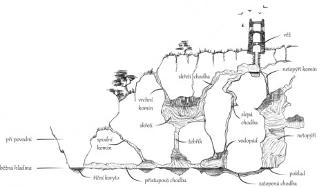
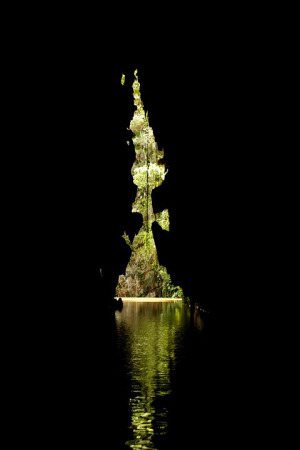

Dobrodruzi jsou posláni učinit přítrž řádění skřetí bandy, která se podle všeho usídlila v opuštěné strážní věži. Po příchodu na místo však shledávají, že přímo ve věži nikdo nebydlí. Zato tu dvakrát denně prolétává hejno přerostlých krvelačných netopýrů, kteří neváhají napadnout ani dospělého člověka. Pokud budou dobrodruzi pozorní a trpěliví, možná se nakonec dopátrají tajemství věže: Její studna je zároveň přístupovou cestou do komplexu krasových jeskyní. Právě zde sídlí hlavní hejno netopýrů i skřetí banda, která ovšem používá jiný přístup do jeskyně.

Skřeti mají z netopýrů hrůzu, a protože stejně jako oni jsou nočními lovci, cestu skrz studnu nepoužívají – jen těžko by se vyhnuli konfrontaci. Místo toho chodí skrz koryto řeky chodbou, kterou náhodou objevili. Tuto cestu mohou objevit i dobrodruzi, pokud si na skřety počíhají, nebo budou mít schopného stopaře. Případná snaha vypudit skřety z jeskyně však nebude bez překážek. Skřeti zde mají samé výhody. Znají prostředí, lépe vidí ve tmě, umějí šplhat po stěnách a obecně se zde pohybují mrštněji.

Zadní část jeskyně ukrývá kromě netopýrů ještě další tajemství, o kterém nevědí ani skřeti: Poklad loupežníka Borgila, který zde zahynul před mnoha lety.

## Dramatické finále

Průzkum jeskyně (pravděpodobně v noci, když jsou skřeti na lovu) nebo boj se skřety (ve dne) zkomplikuje přívalový déšť, který způsobí vzedmutí hladiny říčky a částečné zatopení jeskyně. Tím nejhrozivějším nepřítelem nakonec může být vodní živel, který hrozí zahubit bez rozdílu dobrodruhy i skřety.

## Popis jednotlivých částí jeskyně

__Netopýři__ obývají vysokou jeskyni, každý večer se vydávají na lov, každé ráno se vracejí. Skřeti z nich mají panickou hrůzu, proto se snaží vyhnout průchodu prostorami, kterými prolétají netopýři. V této jeskyni je možné přečkat povodeň, ovšem za cenu neustálých útoků rozzuřených netopýrů.

__Poklad__ se skládá ze stovek mincí různé hodnoty a několika šperků, které naloupila Borgilova banda.

__Přístupová chodba__ do krasové jeskyně je plná výběžků a nerovností. Při povodni se naplní vodou, takže zkoušet skrz ni projít je velmi riskantní.

__Říční koryto__ je zaříznuté hluboko do terénu, dno řeky je špatně přístupné, proto o jeskyni téměř nikdo neví.

__Skřetí chodba__ je jedinou volnou a bezpečnou cestou z jeskyně v případě povodně. Skřeti ji používají v nezbytných případech.

__Skřeti__ obývají nejrozlehlejší prostor v jeskyni. Mají zde vše, co potřebují ke svému nuznému způsobu života.

__Slepá chodba__ je při postupu seshora dolů ukončena zúžením. Níže pokračuje jen úzká puklina, kterou odtéká podzemní řeka. Zde také leží zbytky Borgilových kostí, které řeka nespláchla.

__Spodní komín__ je neprůlezný, a to i pro skřety. Kdo by jím chtěl uniknout v okamžiku, kdy se jeskyně plní vodou, toho čeká jistá smrt.

__Věž__ byla naposledy obývána bandou loupeživého Borgila. Ten jako jediný věděl, že studnou lze prolézt do podzemních jeskyní. Když byla věž obléhána, pokusil se uniknout právě tudy i s nakradeným majetkem, avšak zahynul kvůli zranění a vyčerpání. Svůj poklad v panice shodil dolů netopýřím komínem, avšak následně zjistil, že tudy nelze prolézt.

__Vodopád__ padá mezi krápníky z výšky několika metrů. Pokud se k němu někdo dostane se zdrojem světla, čeká ho překrásná podívaná. Pod vodopádem je skrytá zatopená chodba, která vede do netopýří jeskyně.

__Vrchní komín__ je průlezný pro osoby s velmi drobnou postavou (hobiti, děti), s rizikem uvíznutí.

__Zatopená chodba__ je jedinou přístupovou cestou do netopýří jeskyně pro tvory podobné lidem. Je třeba jí ovšem proplavat, což znamená značné riziko uvíznutí a utonutí.

__Žebřík__ sem skřeti umístili, aby si ušetřili namáhavé šplhání po stěnách. Pokud budou dobrodruzi útočit na skřetí sídlo touto cestou, můžou počítat s velmi tuhou obranou. Skřeti jim rozhodně žebřík nenechají, naopak po nich budou házet kusy krápníků, výkaly, kosti a podobně.
