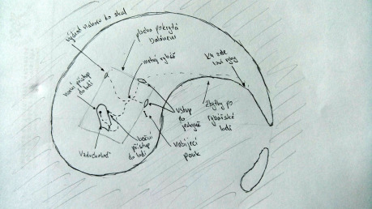
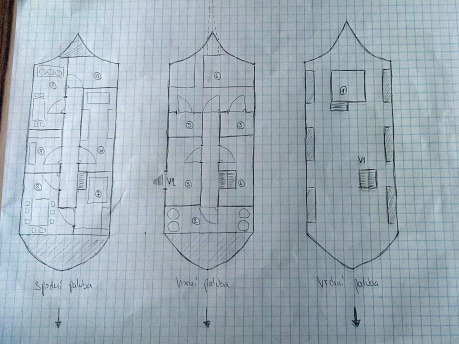
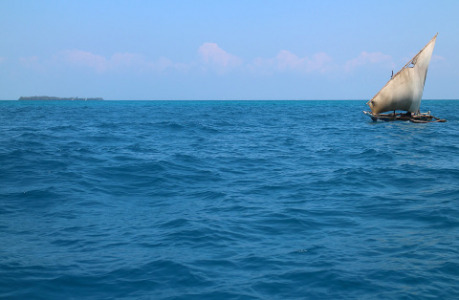

## 1 Intro

Ostrůvek se nachází nedaleko za hranou horizontu na moři nebo hladině rozlehlého jezera. Spíše než o ostrov se jedná o menší zpustlou neobydlenou skálu, kterou místní ani neměli snahu pojmenovat. Okolní vody jsou bohaté na ryby a není tomu dávno, co se zde lovící námořníci začali vracet s tajemnými zkazkami: Z ostrůvku se nesou nelidské zvuky a za šera a mlhy z něj vychází ostrá, ohni nepodobná světla. Poté, co se jedna rybářská loď plná zvědavců z ostrůvku nevrátila, vyhýbají se jí místní obloukem a mořští vlci v krčmách vyprávějí o duchu moře, který procitl ze spánku a nárokuje si své oběti. Co za tím vším tedy vězí?

## 2 Tajuplný ostrov

Ostrůvek je půlkruhovitého tvaru o průměru asi dvě stě padesát metrů se zátokou ve vnitřní části a výrazným rozšířením na západním okraji. Na vnější straně z něj ční až do výšky patnácti metrů skalní věže, které zde prudce klesají k hladině. Od těchto útesů směrem k vnitřní zátoce skály postupně klesají až do vody. Západní rozšířená část tvoří téměř jednolitou plochu, ve které skály formují malé nepravidelné bludiště věží, puklin, zákrut a jeskyněk. Většina povrchu je porostlá mechem, lišejníky, naplavenými chaluhami a místy malými keříky. Krom pár racků a zbloudilých želv na ostrůvku není živé duše.

### 2.1 Zřícená vzducholoď

V západním cípu ostrůvku leží již dávno ztroskotaná vzducholoď. Její balón po splasknutí zůstal viset na vrcholcích okolní skal, prostor pod sebou neprodyšně zakryl a během let jej zcela pohřbily nánosy prachu, kamínků a lišejníků. Bystrému pozorovateli možná neunikne, že spletenec západních jeskyní má zvláštně nestabilní strop, který se ve větru jakoby pohybuje. Pod balónem lze mezi skálami dojít až ke vzducholodi, která leží pod plachtou zcela skryta před okolním světem.

Dřevěná vzducholoď s kovovými výztuhami zvenčí na první pohled docela připomíná klasická vodní plavidla. Je zhruba třicet metrů dlouhá, deset metrů široká, má dvě patra s mnoha malými okénky a vrchní otevřenou palubu. Spodní patro sloužilo pro cestující, horní jako strojovna a sklady. Lze do ní vstoupit buďto přes horní palubu, nebo vchodem na pravé přídi spodního patra. Na některých místech je trup částečně proražen skalami a zde by bylo možné s trochou úsilí vytvořit další průchody dovnitř. Navzdory svému nešťastnému osudu je vzducholoď v docela zachovalém stavu, avšak nosný plyn z balónu je nenávratně ztracen a z ostrůvku jen tak neodletí.

### 2.2 Vzduchoplavcův příběh

> __Zápis z deníku 4305:__ A už toho mám dost! Dnes mne opět neohlášeně obtěžovali ti primitivové od armády. Tentokrát je zajímalo, kolik mohou na mou loď namontovat děl a zda unese čtyři tucty beden munice. Už není pochybu, že navzdory mému výslovnému zákazu mi můj vynález po dokončení vojáci zabaví a udělají si z něj klenot jejich už tak bohatého arzenálu. Po takovémto dni opět nemohu usnout. Obávám se, že se mi naskýtá jedna z posledních možností uniknout i s mým vynálezem. Bude-li mi přát příznivý vítr, měl bych si vybudovat dostatečný náskok. Mí věrní přátelé jsou připraveni, zásob mám dostatek. Zítra musím zkontrolovat stav lodi a rozhodnout se. Ne rozhodnout – zítra se musím odhodlat.

> …

> __Zápis z deníku 4307:__ Minula čtvrtá noc a má situace je stále zoufalejší. Vzducholoď naštěstí skutečně neutrpěla žádná závažná poškození a i mí pomocníci zvládli nechtěné přistání bez úhony. Balón je však zcela prázdný a na této bohem zapomenuté skále není nic, z čeho by šel extrahovat plyn a nachází se zde jen velmi málo potenciálního paliva. Prošel jsem již na dvakráte všechny své poznámky, deníky i plány prototypů, zatím jsem však nenalezl žádnou možnost zlomit nepříznivý osud. Musím arci jednat rychle, mé rány hnisají a horečka mi nedá odpočinout. Navzdory improvizovaným podmínkám jsem zatím zvládl připravit proces doplnění energie mým neúnavným pomocníkům, musím již jen dokončit kameny s novými rolemi. Včera jsem na obzoru na chvíli zahlédl loď, ale strach z mých pronásledovatelů mi nedovolil zkoušet signalizovat o pomoc. To už mi bude více po chuti můj milovaný vynález rozebrat a sestavit z něj nějaké plavidlo, se kterým bych snad měl dosáhnout pevniny. Přese všechny útrapy je stále nejdůležitější, aby má loď nepadla do nepravých rukou.

Vzduchoplavec zemřel krátce po dokončení posledního deníkového zápisu. Jeho Konstrukty zůstaly bez svých kamenů neaktivní po mnoho dalších let. Až mladý zvědavý rybář, který zde před časem zakotvil se svou posádkou, neodolal pokušení a vložil jeden ze zvláštních drahokamů do útrob tajemného kovového muže. Oči probuzeného Konstruktu se po desetiletích odpočinku opět zažehly, a protože vesmír má tendenci zůstat v rovnováze, vyhasl život mladého rybáře zanedlouho poté.

### 2.3 Konstrukty

Umělé bytosti, Konstrukty, jsou jedinými trvale „žijícími“ obyvateli na ostrůvku. Sestrojil je Vzduchoplavec jako svou loajální posádku na vzducholodi. Jsou tedy z lehké konstrukce, uzpůsobení k pohybu a práci na lodi. Jejich tělo je humanoidního uspořádání, připomínají však spíše kostlivce, kterému chybí tkáně i kůže. Konstrukty pohání zářící energetický kámen, který mají usazen uprostřed svého hrudníku. Oči probuzených Konstruktů září v barvě energetického kamene a nehybnými ústy jsou schopní promlouvat stejně jako jakýkoliv člověk. Energetické kameny získávají svou sílu ze slunce – jednou za čas je nutné je z Konstruktů vyjmout a pomocí složitelného a časově náročného procesu do nich sluneční energii uložit.

Konstrukty přemýšlejí jen omezeně v rámci hranic vymezených svou rolí (např. Uklízeč se nenechá přesvědčit, aby něco uvařil, ale sám nejlépe pozná, co je potřeba uklidit). Jsou schopné vést i komplikovanější rozhovory, jejich motivace a cíle jsou však pevně dány a nijak o nich nepochybují. Řídí se přísnou logikou s absencí jakýchkoliv citů. Krom toho se řídí základními pěti pravidly, která jim vštípil jejich tvůrce, a které jsou s nimi bytostně spjaty. Oproti úkolům, které může Konstrukt vykonávat různě, jsou základní pravidla neměnná a pevně hierarchicky uspořádána. Konstrukt se v rámci jednoho pravidla nikdy nezachová tak, aby porušil pravidlo nadřazené. __Pravidla chování__ zní následovně:

1. Neublížit pánovi
1. Nepoškodit majetek pána
1. Chránit svou funkčnost
1. Chránit funkčnost ostatních Konstruktů
1. Vykonávat zadaný úkol

Na ostrůvku se nachází sedm Konstruktů. Každý se ze všech sil snaží vykonávat zadaný úkol. Žádný není vyloženě agresivní, zpravidla nejprve upozorní narušitele, brání-li v jeho úkolu. Zároveň jsou však Konstrukty zcela loajální úkolům od svého pána, neznají strach ani pochyby. Nerozumí konceptu smrti – co lze vypnout, lze přece i znovu zapnout. Dobrovolně si však svůj energetický kámen vyjmout nenechají – nemohli by vykonávat zadaný úkol. U každého Konstruktu je uvedeno jeho označení, role, hlavní úkol a principy chování.

- __K1. Osobní strážce.__ Úkol: _„Nedopusť, aby mi bylo ublíženo.“_ Hlídá před kajutou Vzduchoplavce. Bude nepřátelský, pokud se přes něj někdo pokusí do kajuty proniknout a zaútočí, pokud někdo bude manipulovat s ostatky pána. Je ochotný podávat o Vzduchoplavci zajímavé informace.
- __K2. Dohlížitel.__ Úkol: _„Udržuj ostatní konstrukty v provozu.“_ Pohybuje se po lodi a jejím okolí, kontroluje správnost prováděných úkolů, vkládá energetické kameny do neaktivních Konstruktů (sám ale nedokáže provést proces nabíjení). Zatím nenašel na nabíjecím ponku dva chybějící kameny. Pokud je objeví, probudí s ním zbývající Konstrukty. Konzultuje s ostatními jejich úkoly, v případě nutnosti se je snaží opravit. Zaútočí, pokud je svědkem ničení jiného Konstruktu. Má informace o principech fungování Konstruktů, jejich mechanice a napájení.
- __K3. Uklízeč.__ Úkol: _„Udržuj interiér vzducholodi v čistotě.“_ Pohybuje se po lodi s improvizovaným smetáčkem a lopatkou a zoufale neefektivně se jí snaží uklidit. Neuvědomuje si mizérii svého úkolu a opakovaně tvrdí, že již za chviličku bude mít všechno hotové a v lodi bude zase útulně. Bude nepřátelský, pokud někdo v lodi dělá nepořádek (hrabe se ve věcech, vnáší nečistoty na botách apod.). Přímo nezaútočí, dokud mu někdo cíleně nebrání v úklidu.
- __K4. Kuchař.__ Úkol: _„Zajisti, aby bylo co jíst a pít.“_ Vychází ze vzducholodi na pláž, loví ryby nebo racky a ty připravuje v kuchyni na kamínkách, pod kterými zatápí nanošeným palivem od strojovny. Hotové ryby hromadí na jídelním stole a nezajímá ho, že je nemá kdo sníst. Pokusí se chytit a uvařit zvířecí doprovod postav. Na postavy přímo nezaútočí – lidé se přece nejí. Mezi skalami má improvizované odpařiště mořské vody.
- __K5. Topič.__ Úkol: _„Zajisti palivo do strojovny.“_ Shání cokoliv hořlavého mimo výbavu lodi a loď samotnou (viz pravidlo 2 – nesmí loď poškodit). Pokusí se postavám zabavit cokoliv, co vypadá hořlavě a budou-li se bránit, pokusí se to vzít násilím. Uvidí-li však nové bytosti na ostrově, nejprve beze slova bude na pláži hledat jejich loď, kterou rozštípe a nanosí dovnitř.

Následující dva Konstrukty jsou neaktivní. Jejich energické kameny se nacházejí na nabíjecím ponku v zátoce. Jeden z kamenů nemá vloženou žádnou roli – jím probuzený konstrukt přijme jakýkoliv úkol. Nemá ale žádné omezující hranice role a při jeho plnění se chová zcela nevyzpytatelně.

- __K6. Strážce vzducholodi.__ Úkol: _„Udržuj loď nepoškozenou.“_ Po probuzení začne po krátké prohlídce stahovat balón na horní palubu vzducholodi – strop jeskynního systému se začne hroutit. Je-li probuzený, zaútočí na každého, kdo se pokusí loď nebo její výbavu poškodit (něco rozbít, odnést apod.).
- __K7. Bezprizorní.__ Úkol: _Nemá._ Po aktivaci se zeptá, jaký úkol má provést a není-li v rozporu s pěti základními pravidly, pustí se ihned do práce. V opačném případě si vyžádá úkol jiný. Lze na něm otestovat, co všechno jsou ještě Konstrukty ochotné udělat.

## 3 Místopis

### 3.1 Ostrov

__Plocha pokrytá balónem.__ Hrubá oblast skalisek, která jsou zakryta splasklým balónem. V těchto místech lze strop jeskyní snadno prorazit. Pokud dojde ke snaze balón stáhnout na loď, zhruba tato oblast se začne bortit. Pokud někdo vystoupá nahoru a bude po balónu přecházet, zpozoruje nestabilní podloží. Na některých místech by se i mohl propadnout dolů.

__Vzducholoď.__ Pozice vzducholodi na ostrově s naznačenými vstupy.

__Vstupy do jeskyní.__ Místa, kterými lze nejsnáze vstoupit do skalnatého prostoru pod balónem. Lze u nich postřehnout stopy rybářů i konstruktů.

__Mrtvý rybář.__ Tělo nedávno zemřelého mladého rybáře. Má na sobě pouze jednu hlubokou sečnou ránu. V ruce svírá pár menších drahokamů. V kapse lze nalézt obrázek slečny a několik vytržených stránek, mezi nimi je i deníkový záznam 4305.

__Nabíjecí ponk.__ Pozůstatky stolu s nářadím a alchymistickou výbavou, zčásti zakryto hadry, kamením a chaluhami. Na stole lze zpozorovat v řadě vedle sebe pět zrezivělých stojanů, nad kterými jsou umístěna zvětšovací skla koncentrující sluneční paprsky. Dále v řadě lze pod kamením a nepořádkem nalézt další dva zasypané stojany, které obsahují zářící energetické kameny.

__Zbytky po rybářské lodi.__ Hromada lan, sítí, kovových košů a podobně. Nenalézá se zde žádné dřevo, pouze prach a třísky. Kousky dřeva zapadlé mezi kameny vedou na západ k jeskyním.

__K4 zde loví ryby.__ Místo, kam Konstrukt Kuchař chodí lovit ryby. Má zde odpařiště a zásobu pitné vody. Cestou může potkat postavy.

### 3.2 Vzducholoď

__Vrchní paluba.__ Je pokrytá kamením, zarostlá mechem. Po stranách se nacházejí kotvící místa držící balón – lana a hadice vedou kamsi ke stropu jeskyně. Zkušenějším námořníkům přijde paluba zvláštní, nepodobá se žádné známé lodi určené na moře nebo řeky. Schody do nitra vzducholodi jsou částečně zasypané, ale průchozí.

1. __Kormidlo.__ Vedle kormidla je soustava dalekohledů a další aparatury využívané k navigaci podle slunce a hvězd. Ve zpráchnivělé skřínce jsou fragmenty map.

__Horní paluba.__ Je zde cítit zatuchlina a nějaký další zvláštní zápach rozkladu. Ačkoliv mají jednotlivé místnosti malá okénka, z prostorů jeskyně pod balónem sem nedosáhne žádné světlo. U bočního schodiště jsou stopy krve, v sousedící vstupní místnosti hromádka cenností.

1. __Sklad.__ Nachází se zde náhradní díly k lodi – kování, lana a záplaty na balón. V koutech je k zemi přivázáno několik sudů. Plyn, který je v nich obsažen, se používá jako nouzová zásoba k plnění balónu. Po odvázání se vznesou ke stropu. Pokud z nich plyn unikne, působí na živé bytosti omamným účinkem a při reakci s ohněm hoří.
1. __Vstupní místnost.__ Těla tří námořníků. Podle zranění zemřeli násilnou smrtí. Lze odhadnout, že byli na útěku. Jeden má u sebe amulet ochraňující před hněvem duchů moře.
1. __Úschovna Konstruktů.__ Nachází se zde sedm kójí, dvě z toho jsou obsazeny neaktivními Konstrukty. Pod policemi leží hromada náhradních dílů. Na stěnách visí náčrty se znázorněním konstrukčních řešení. Lze zde vyčíst slabá místa na tělech konstruktů.
1. __Skladiště pohonných hmot.__ Obsahují pouze hromadu nahrubo nalámaného dřeva. Při bližším pohledu lze poznat pozůstatky rybářské loďky.
1. __Strojovna.__ Nachází se zde parní stroj, který pohání vrtule umístěné zvenku na zádi lodi. Na stroji jsou nejvýraznější obrovská kamna, ve kterých lze ještě nalézt zbytky popela. Krom toho skrz kamna prochází horký vzduch a dým, který mizí někde v přístroji. Kolem leží kovové harampádí a neuklizené nářadí. Pokud by do stroje někdo doplnil vodu, promazal ho a zatopil, vrtule by se roztočily. Vedle stojí menší stroj sloužící k tlakování balónu, vedou od něj částečné průhledné trubice na vrchní palubu.

__Spodní paluba.__ Je zde větší vlhko, podlaha a některé stěny se částečně propadají. V prasklinách se daří mechu a lišejníku. Ze zadní části se line odpudivý zápach.

1. __Ložnice Vzduchoplavce.__ Honosně vyzdobená místnost, přesto s praktickým uspořádáním. Neobsahuje více než velkou postel, skříň se ztrouchnivělým oblečením a police zaplněné knihami. Lze zde najít mnoho textů o historii, geografii a zoologii. Všechny knihy jsou velmi staré, některé lze považovat za zcela ojedinělé exempláře nebo již dávno ztracená díla. Pod postelí leží těžká kovová truhla se zabudovanou pastí uvolňující omamný plyn. V truhle se nachází Vzduchoplavcovy finanční rezervy a konstrukční plány vzducholodi.
1. __Pracovna vzduchoplavce.__ Dominuje jí velký jednací stůl s mnoha židlemi. Na stěnách visí police se svitky a knihami. Většina knih je na zámek, obsahují poznatky z oblasti alchymie a umělého života – jedná se spíše o akademickou literaturu. Na stole leží spousta rozházených knih, roztrhaného papíru a rozsypaných psacích potřeb. Stranou leží otevřený jasně největší svazek v místnosti – Vzduchoplavcův deník. Několik stránek je z něj vytržených. Je rozevřený na posledním deníkovém zápisku č. 4307.
1. __Alchymistická dílna.__ Panuje v ní hrozný nepořádek. Na zemi i stole se válí spousta rozbitých lahviček, ze kterých jsou vysypané podivně barevné prášky. Na dřevě jsou patrné stopy zaschlých tekutin. Ve váčcích a miskách leží různé drahokamy. Na pár místech vyrůstají mezi dřevěnými prkny prazvláštní světélkující rostlinky. Mezi tím vším se povalují fragmenty Vzduchoplavcových alchymistických poznámek a zápisů. Lze z nich pracně zrekonstruovat mnoho zavádějících informací.
1. __Konstrukční dílna.__ Zadní část je zasypána haraburdním. Na stolech po stranách leží ani ne zpola dokončené Konstrukty. Na nástěnce jsou poznámky ke Konstruktům – seznam inovovaných prvků, způsoby odstranění současných konstrukčních nedokonalostí. Mezi mnoha poznámkami lze nalézt malý papírek, na kterém je v pár bodech vysvětlen princip dobíjení energetických kamenů za pomocí slunce.
1. __Kuchyně a jídelna.__ Zdroj veškerého nepříjemného zápachu. V zadní části připravuje Kuchař ulovené ryby a jiné živočichy na roztopených kamnech, do kterých přikládá nanošené zásoby ze strojovny. Kouř z kamínek je odváděn k parnímu stroji na horní palubě. Hotové pokrmy vrství na hromadu, která již téměř pohltila jídelní stůl. Za stolem sedí na židli pozůstatky Vzduchoplavce – ten už mnoho let nic nesnědl. Lze u něj najít svazek klíčů.
1. __Toaleta a koupelna.__ V místnosti je velká kovová vana a jednoduchý záchod ústící někam pod loď. Skrz záchod prorůstá do lodi mladá břízka.

## 4 Tipy pro hraní

Prostředí je připraveno pro svět, ve kterém létající stroje běžně neexistují. Objevení a průzkum vzducholodi tak má představovat pro hrdiny napínavé dobrodružství už samo o sobě. V případě, že ve vašem světě nejsou vzducholodě žádnou zvláštností, doplň do Vzduchoplavcových zásob jiný zajímavý vynález, který by stálo za to ukořistit.

U Konstruktů záměrně není uvedena jejich výstroj a výzbroj. Předpokládá se, že jsou primárně určeny pro práci na lodi, ne pro boj. Lze si je ale představit stejně tak jako mírně nemotorné sluhy, nebo jako hbité a rychlé stroje s mnoha ostrými kovovými hranami, bodci na kloubech a končetinách a schopností se rozžhavit. Mohou být odolní vůči sečným a bodným útokům, nebo mohou pohlcovat působení ohně. Pravděpodobně budou velmi dobře držet na dřevěných površích a možná umí i šplhat po stěnách a stropech. Jejich zářící pohled může oslňovat. Perfektně znají vzducholoď a její okolí a dokáží využít každé menší výhody. Budou však vždy jednat tak, aby loď svými akcemi nepoškodily.

Je na vás, kolik „duše“ vdechnete Konstruktům. Je možné je hrát jako nemyslící stroje, které zvládnou pouze odpovídat na jednoduché otázky, ale je samotné nic nezajímá. Nebo naopak jako téměř lidské bytosti s vlastním pohledem na svět, pouze bez prožívaných emocí. Každopádně by hráči měli mít možnost s nimi interagovat i po dobrém. Konstrukty zde nepředstavují pouze nepřátelé k pobití, ale spíše bytosti překážející ve volném průzkumu vzducholodi a jejich tajemství. Nezapomínejte, že každý z nich má jinou roli a úkol a je potřeba k němu zvolit tu správnou cestu.

Pokud vám příběhy rybářů nestačí jako dostatečná motivace pro postavy k cestě na opuštěný ostrůvek, vymyslíte jistě více jiných vhodných motivací. Má některá z postav záhadně zmizelého předka vynálezce? Ztratil se na ostrůvku někdo postavám známý? Snaží se postavy dlouhodobě získat převahu ve vleklé a vyrovnané válce? Ztroskotaly postavy na ostrůvku během bouře? Vydaly se tam s původně zcela jiným posláním?

Je zde možnost sehrát dobrodružství více jako survival a nechat postavy na ostrůvku bez jejich loďky a možnosti snadného úniku. Nutnost vymyslet a zrealizovat jinou cestu na pevninu může být zajímavá, ale je to již trochu o něčem jiném, než o rozkrývání tajemství ztracené vzducholodi.

Využijete-li přiložené zápisy z deníku, nahraďte jejich čísla pro vás zajímavými daty.
