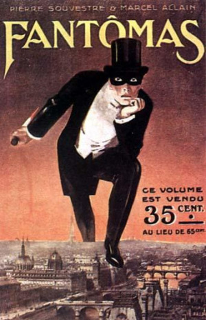
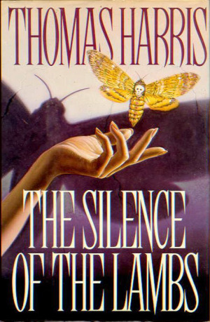

## I.

Možná se někdo po přečtení perexu tváří zmateně. Vystačil až dodnes s informací, že dialog je přímá řeč, takové to v uvozovkách. Třeba takto:

> „Fantomas!“
>
> „Prosím?“
>
> „Říkám – Fantomas!“
>
> „A co je to?“
>
> „Nic – a všechno!“
>
> „Tak co to znamená?“
>
> „Je to nikdo... a přesto někdo!“
>
> „A co vůbec dělá ten někdo?“
>
> „Nahání strach!“

Nějaký problém tu asi odhalí každý. Například není jasné, kdo s kým mluví. A ty zmatené výkřiky moc ani nedávají smysl, jak si právem stěžuje druhá mluvící postava.

Méně beznadějně to působí, když dodáme kontext; je to úplně první sekvence prvního románu o jmenované postavě; trajler, který má čtenáře rychle vtáhnout do děje. A to jediné skutečně dělá. Autoři při tom neměli moc času; napsali za několik málo let nepravděpodobných 32 románů o normálním rozměru přes 200 stran. Už z této sekvence to jasně čiší; děj se řítí vpřed, dozadu nehledí, co na tom, že to celé do pěti minut spadne. Podstatná je jen poslední replika, ke které to celé míří; to jediné nám chtěli sdělit a to je také jediný hubený výsledek rozmluvy.

Pokud si chcete občas něco podobně zběsilého dovolit, tak raději ne moc často. A velkou slávu dramatického mistra dialogů tím asi nezískáte.

## II.

Jen letmo připomenu, co všechno takový dialog opravdového mistra Shakespeara zvládne. Především, divadelní hra sestává výhradně z přímé řeči a dialogu. Herec sice může dělat nějaká ta gesta, ale Shakespeare k tomu moc scénických poznámek nenechal. Vše podstatné je v replikách postav. Charakteristika postavy; třeba i zrychleně v pár větách. Rozvoj postavy. Všechny motivy, plány, úmysly. Vývoj postavy. Reakce na úspěch či zklamání. Samozřejmě také děj a kompozice; repliky nám posouvají všechno kupředu, právě tak, abychom se zabývali jen tím podstatným a zajímavým. V díle pak není jiná nálada než ta, o které nám někdo řekl. A totéž platí pro popisy.

To vše se navíc děje jazykem, který odpovídá charakteru postavy; hloupé a obhroublé postavy mluví hloupě a obhrouble, chytré a vzdělané postavy chytře nebo vzdělaně. Nikdo nemluví jazykem autora, protože autor tu nemluví za sebe vůbec nikdy. A ještě navrch je to všechno veršované. A úsporné. Možná začínáte tušit, proč máme my, ubozí dialogoví kutilové, z podobných věcí tak upřímnou hrůzu.

## III.

Tohle jsou všechno důvody, proč dnes nebudu vaším průvodcem sám, nýbrž nám pomůže konkrétní dramatická dvojice. Asi jste o nich už něco slyšeli, takže je moc nemusím představovat. Slečna Clarice Starlingová a Dr. Hannibal Lecter. Jejich rozmluva nepochází z filmu Mlčení jehňátek, ale z původní knižní předlohy Thomase Harrise, kde na rozdíl od filmu nic nevidíme a jsme na dialog plně odkázáni. Právě jako na divadle.

Bližší pohled ukáže, že Mlčení jehňátek těží z dialogu opravdu hodně, i když to samozřejmě čistě dramatický tvar není a scénických poznámek se autor rozhodně nevzdává. Ale budoucí přepisovači do divadelní hry nebo filmu to měli usnadněné, protože dialogy už jsou vlastně z většiny úplně hotové a skoro by obstály i bez všeho ostatního. A rozhodně jsou i ve filmu třemi čtvrtinami všeho efektu.

V původním románu je rozmluv dvou hlavních protagonistů celkem pět a určují celé tempo románu tím, že rozvrhují kompozici na části. Samozřejmě stojí zato si to přečíst úplně celé, ale pro naše účely bohatě stačí rozmluva první, ta nejbohatší a nejsložitější. Je ve třetí kapitole a představuje jedinou velkou dvanáctistránkovou scénu. V místech, kdy se ještě čtenář stěží stačil orientovat, o co v příběhu vlastně jde a kdo je kdo. Tím autentičtěji sdílí pocity s Clarice Starlingovou, která je vržena přímo do jámy lvové a nic moc ještě nechápe. Stejně jako ona dostaneme v kapitole první a druhé krátkou úvodní instruktáž, kdo je Hannibal Lecter, spočívající hlavně ve strašení, abychom se báli úplně od začátku..

Motivace Starlingové k rozmluvě je nejjednodušší; dostala jako zadání předložit Dr. Lecterovi dotazník k vyplnění.

Netuší, že je to v pozadí složitější. Její nadřízený, Hannibalův hlavní protihráč Crawford, to zamýšlí jako test; moc si od akce neslibuje a účelem rozmluvy je jen navázat kontakt. Dr. Lecter totiž zatím nikoho doposud nebral vážně a nemluvil s ním doopravdy. V celkovém plánu jde Crawfordovi hlavně o nalezení jiného sériového vraha Bufallo Billa, ale z opatrnosti to neřekl ani Starlingové, neb se bojí, aby to nějak neprozradila.

No a Hannibal Lecter má jediný motiv; nudí se, chce si s někým povídat a při tom ho trápit, strašit a ponižovat. Má spousty času a nic už mu vlastně nehrozí.

Tedy vzhůru do toho. Bohužel musíme drasticky krátit, takže bez nálady a úvodních frází.

## IV.

„Studentka? Tady ve vašem pověření stojí studentka. Jack Crawford ke mně posílá na vyšetřování studentku?“

„Ano. Jsem stále ještě posluchačkou akademie,“ řekla Starlingová, „ale nebavíme se o FBI, mluvíme o psychologii. Rozhodněte se sám, jestli mám dostatečnou kvalifikaci na to, abychom si spolu mohli promluvit.“

„Hm,“ dumal Dr. Lecter, „je to od vás vlastně docela chytré. Barney, co myslíte, směla by agentka Starlingová dostat židli?“

„Doktor Chilton mi o židli nic neříkal.“

„A co vám říká vaše dobré vychování, Barney?“

...

„Tak, co vám vlastně Miggs řekl?“

„Kdo?“

„Deprivovaný Miggs, támhle v té cele. Něco na vás zasyčel. Co to bylo?“

„Řekl – cítím tvoji píču.“

„Aha. Tak to já ne. Používáte pleťový krém Evyan a nekdy L’Air du Temps, ale dnes ne. Dnes jste se rozhodně nenavoněla. Jak je vám z toho, co řekl Miggs?“

„Je nepřátelský z důvodů, které neznám. To je hodně zlé. Nesnáší lidi a lidi nesnáší jeho. Je to bludný kruh.“

„Vy k němu cítíte nenávist?“

„Mrzí mne, že jsem ho vyvedla z míry. Ale vždyť to byl vlastně jenom výkřik. Jak jste poznal ty vůně?“

„Cítil jsem je, když jste otevřela kabelku a vytahovala kartu. Máte rozkošnou kabelku.“

„Děkuji vám.“

„Vzala jste si svoji nejlepší kabelku, že?“

„Ano.“

„Je mnohem lepší než vaše boty.“

Zatím stačí. Zkusme si všimnout, co všechno se na tom malém prostoru stalo.

Obě postavy se nám vlastně představují; je to mnohem živější a zajímavější než prostý popis. Zejména v Lecterových replikách se občas daří představovat dokonce obě postavy zároveň.

Lecter ve svých holmesovských exhibicích s vůněmi stihne demonstrovat, že je chytrý, dále to, že má zneklidňující schopnost cítit neuvěřitelně přesně jako pes, a dále, že se rád předvádí. Je vystavěn na barkerovském kontrastu mísení naprosto nečekaných a protikladných vlastností. Zajímá se o vůně a chová se zdvořile, aby tím děsivěji co chvíli probleskla jeho úplná neschopnost empatie a naprostá bezohlednost. Skládá komplimenty stejně snadno jako provokuje, děsí a uráží.

A vlastně celou dobu drží v hovoru iniciativu. Obvyklá rovina vyšetřovatel–vyšetřovaný se nám tu nenápadně obrátila a dr. Lecter analyzuje svoji návštěvnici, jako kdyby seděl ve své ordinaci.

Poznámka o vůních a kabelce zároveň řeší, co je Clarice zač; snaživá studentka z dost prostředních poměrů, zřejmě z venkova, bez přirozeného vzdělání z rodiny, ale dost chytrá na to, aby se nepokoušela Lectera nějak přelstít, vypadat lepší, než je. Její docela prostá defenzivní taktika nese ovoce. Za zdvořilost poděkuje, pokusy ji rozhodit připomenutím epizody s Miggsem nemají zvláštní efekt, Clarice zachovává vzorný profesionální odstup.

„Vy opravdu neznáte Evangelium svatého Jana? Podívejte se tedy na Ducia, ten maluje ukřižování Krista správně. Jak se má Will Graham? Jak teď vypadá?“

„Neznám Willa Grahama.“

„Víte přesně, kdo to je. Chráněnec Jacka Crawforda. Ten je před vámi. Jak vypadá jeho obličej?“

„Nikdy jsem ho neviděla.“

„Tomuhle se říká – otevírat staré rány. Agentko Starlingová, vám to ale nevadí, že ne?“

Chvíle ticha, a pak vyrazila do útoku:

„Spíše než otevírat staré rány bychom měli otevřít pár nových ran. Přinesla jsem...“

„Ne. Takhle ne. To je hloupé a chybné. Nesnažte se nikdy žertovat, když se o něčem mluví opravdu vážně. Víte, když pochopíte vtip a chcete na něj rychle reagovat, nutí vás to k rychlému a povrchnímu hodnocení situace, až přestanete vnímat celkovou atmosféru. Tohle vůbec nezapadlo do nálady, ve které jsme se právě nacházeli. Vedla jste si velice dobře, byla jste zdvořilá a ochotná přijímat drobné zdvořilosti i ode mne. Získala jste si mou důvěru tím, že jste mi po pravdě řekla ty ohavnosti, co vám pověděl Miggs, a pak najednou během kratičké pauzy přejdete amatérsky na ten dotazník. Takhle by to opravdu nešlo.“

„Doktore Lectere, jste zkušený klinický psychiatr. Vy si vážně myslíte, že jsem tak hloupá, abych na vás zkoušela nějakou lest s náladami? Buďte trochu uznalý. Přišla jsem se vás prostě zeptat, jestli vyplníte náš dotazník. Buď ano, nebo ne. Vadilo by vám hodně se na to podívat?“

Skvostné místo.

Lecter zkouší rozhodit Starlingovou poukazem na minulé události, ve vedlejším plánu autora připomene čtenáři ještě první díl příběhu. A když jde Clarice rovnou k jádru věci a chce už vyplnit ten dotazník, v paradigmatu vyšetřovatel–vyšetřovaný, Hannibal paradigma rázně odmítne, použije techniku přerámcování do roviny učitel–žák.

Kromě toho v tomto výjimečném okamžiku máme možnost vidět, jak Hannibal doopravdy vidí debatu až do tohoto místa. Je zajímavá možnost nechat takto postavu odhalit, jak to myslí doopravdy; zvláště když je možnost, že by si toho mohl čtenář jinak nevšimnout.

Return Starlingové je ovšem neméně skvostný – drží se urputně svojí upřímné a jednoduché obrany. Prostě se zeptala, nic víc.

„Crawford musí mít hodně práce, když si najímá studenty.“

„Ano, má starosti.“

„Má spoustu práce s Bufallo Billem?“

„Zřejmě ano.“

„Ne. Žádné zřejmě ano, agentko Starlingová; vy moc dobře víte, že jde o Buffalo Billa. Myslel jsem, že vás Jack Crawford poslal, abyste se mě na to přeptala.“

„Ne.“

„Takže vy na tom neděláte?“

„Ne, přišla jsem proto, že potřebujeme váš názor na...“

Opět tu rozhovor řeší několik věcí najednou; Lecter jen tak mimochodem prokoukl Crawfordovo tajné zadání, odvedl podle přání autora rozhovor k jádru děje příběhu a navíc nám dává možnost úplně absurdně dotáhnout obrácení rolí; vyšetřovaný se vyptává na případ vyšetřovatele. A ještě se čtenář nenásilně dozví plno věcí o Buffalo Billovi.

A když Starlingová poví, co věděla, Lecter se uvolí podívat se na ten slavný dotazník. Na tomto místě se zajímavě ustanovil model hovoru, který funguje vlastně až do konce knihy; něco za něco, výměna informací. Obchodovat mohou i lidé, kteří se nemusí mít rádi. Lecter ještě v tu chvíli dotazník nevyplní; je stále od začátku rozhodnutý si popovídat a potom Starlingovou vyhodit, jak to dělá se všemi lidmi. Ale Clarice se nevzdává a přemlouvá dál.

„Myslím, že váš názor by mohl celý projekt posunout dopředu.“

„A z jakého důvodu bych to měl udělat?“

„Ze zvědavosti.“

„Na co?“

„Proč jste tady. Co se vám přihodilo.“

„Nic se mi nepřihodilo, agentko Starlingová. Já jsem se prostě přihodil. Nemůžete mne redukovat na soubor vlivů. Zaměňujete lidské chování za pojmy dobro a zlo, agentko Starlingová. Každého si předem označíte, jestli je dobrý, nebo špatný. Nic není nikdy ničí vina. Vezměte si třeba mne, agentko Starlingová. Můžete říci, že jsem zlý? Jsem zlý, agentko Starlingová?“

„Myslím, že jste destruktivní. Pro mne je to stejné.“

Mimochodem, v dalším pokračování ságy Harris na tuhle původní zajímavou ideu bohužel zapomněl a začal řešit prequel, co se doktoru Lecterovi přihodilo a jak se stalo, že je takový, jaký je. V původních příbězích je Lecter ještě v jádru čisté strašidlo; prostě je takový od narození, monstrum s úplně posunutým vnímáním významu lidského chování.

Hannibal tady přejde do finále rozmluvy, ve snaze rozhovor ukončit, přičemž jen tak mimochodem Clarice ponižuje docela přesnou analýzou. „Jeden tazatel mne také zkoušel kvantifikovat. Dal jsem si jeho játra s fazolkami. Vraťte se do školy, malá Starlingová.“

Jenže pak dojde k dalšímu neplánovanému obratu, který zaviní Miggs. Ten při odchodu z léčebny zasáhne Starlingovou spermatem. Tím nečekaně změní Hannibalovo rozhodnutí, takže přivolá Starlingovou zpět:

„Neměl jsem dovolit, aby k tomu došlo. Neslušnost se mi neuvěřitelně hnusí...

nebudete litovat, že jste se vrátila. Dám vám něco jiného. Dávám to, po čem toužíte nejvíc, Clarice Starlingová.“

„Co je to, doktore Lectere?“

„Kariéru, co jiného. Uvidíte, že to půjde. Mám radost, že jsem na to přišel. Den svatého Valentina mne donutil o tom přemýšlet. Pro svou valentinku si zajděte do Raspailova auta. Slyšela jste mne? Svoje valentinky hledejte v Raspailově autě. Už byste měla jít. Myslím, že Miggs už to nikdy neudělá, i když je to blázen, co říkáte?“

Tady se Hannibal sám rozhodl vmanévrovat do pro něho naprosto nezvyklé situace, že udělá něco dobrého pro někoho jiného. Jak neobvyklé toto chování u Lectera je, docení zřejmě jen on sám a Crawford, když si to oba uvědomí; Starlingová to rozhodně delší dobu nechápe. A čtenář, zavalený dojmy a drastickými efekty, také ne. Příběh má plno nitek, po kterých se může dále rozvíjet.

## V.

Uf.

Předpokládám, že z toho máte hlavu jako balón.

Netroufám si tvrdit, že jsem pochytal všechny významy, náznaky a plány v plánech jiných plánů; to ani nebylo účelem.

Účelem bylo demonstrovat, že takové úžasné multifunkční věci se s dialogem dají provádět, když se to umí.

A lze si odnést takovéto praktické rady:

1. Úplně první ze všeho je nutné si ujasnit, odkud a kam se ve scéně chcete dostat. Jaký je její smysl, co je výsledek pro děj další. Například to, že Starlingová má hledat Raspailovo auto a prohlédnout ho. Pokud bychom četli dál, ono je ale těch výsledků rozmluvy daleko víc; zejména jsme mnohem lépe informováni ohledně dvou hlavních představitelů příběhu. A doceníme jen tak mimochodem prohozenou další pointu v sedmé kapitole, že Miggs v noci po rozmluvě s Lecterem zemřel, když se zadusil vlastním jazykem. Můžeme tedy rozmluvou honit zajíců několik a v dalším ději postupně odhalovat, co všechno se nám podařilo vytěžit. Důležité ale je, že to, kam chceme dojít, musíme do rozmluvy dát už na začátku, i když to čtenáři ještě nemusí být jasné na první pohled. A kromě děje samozřejmě je účelné využít i další efekty, právě jako ukázka; představit hlavní postavy, exponovat děj, prozrazovat důležité informace a navodit náladu.
1. Pokud víme, odkud a kam chceme jít, pak je nasnadě otázka další – jakou technikou to řešit. Totiž, zda je vůbec dialog vhodný. Pokud je to například scéna, kde Poirot v závěrečné přednášce sezve všechny dohromady a řekne jim, jak to bylo, pak to vlastně není pravý dialog, nýbrž monolog, prokládaný jen občasnými užaslými výkřiky posluchačů (ale to je úžasné, drahý Poirote!). Poirot při tom může klidně mluvit stejným jazykem jako autor/vypravěč, ježto chybí porovnání, stejně se to nepozná. Vůbec se nám spousta věcí zjednoduší. Vadou podobného „přednáškového módu“ je, že když to přeženete, začne to být nudné. A dále je nutné si zajistit posluchače, kterému to budete celé přednášet; to Poirot z podstaty věci obvykle má. Ale mnohdy přistihnete podobného přednašeče, že říká dalším postavám něco, co musí dávno vědět, případně je to asi nezajímá; třeba princip středověkého vodního mlýna. Tady je víc než zjevné, že to autor touto cestou zkouší prodat čtenáři a působí to velice neobratně. Jiná cesta je se na dialog vykašlat úplně a napsat to tam jakožto vyprávění prosté. Například flashback do minulosti je možné řešit jak obyčejným vyprávěním, tak dialogem, kdy nám nějaká postava řekne, jak to bylo. Což nám například umožní manévr s nespolehlivým vypravěčem; náš informátor nám může něco zatajit. Otázka, zda vůbec dělat dialog, je tedy netriviální a je dobré jí věnovat pozornost. Devět z deseti Lovecraftů na tomto místě zjistilo, že to jde i jinak, a dialogu se různými triky vyhnuli.
1. Dobrá ale; není vyhnutí; zjistili jsme, že pro naše účely je dramatická forma ideální. Například právě v detektivce, kdy je třeba vytěžit z někoho hodně informací najednou, tak se přímo nabízí forma výslechu, právě jako v naší ukázce. Můžeme uštvat čtenáře tím přednáškovým módem, kdy ho zavalíme telefonním seznamem toho, co detektiv našel v podezřelém domě, ale mnohem napínavější je to důležité páčit z někoho, kdo nám to vlastně moc říct nechce. Jsme v konfrontační pozici dvou postav; každá chce dosáhnout něčeho trochu jiného, každá má nějakou tu sklenici vody, po které touží. Zde je zajímavé si povšimnout, že konfrontace dvou sil, která je základní konstrukcí jakéhokoli příběhu, výtečně funguje i pro dialog. Postavy, které spolu dokonale souhlasí, nevytvoří zajímavou rozmluvu. Pokud jedna postava ví vše a druhá nic, povede to k tomu přednáškovému modu. Konfrontace vznikne v případě, že každá z postav ví něco, něco chce říci, ale něco třeba ne; a dialog se zcela přirozeně komplikuje.
1. Ujasněme si proto, které sklenice vody jsou na počátku rozmluvy podstatné pro účinkující; je to velice důležité. I pro dramatiky platí základní zjištění, že čas je drahý a není dobré ho plácat svévolně. Život je sice plný prázdných řečí, „jaksemáš“ a „dášsikafe“ a „tojedlouhocojsme seneviděli“, ale slušný autor takových věcí čtenáře ušetří. Jakýkoli příběh se má soustředit jen na to podstatné a zajímavé. Konfrontačně psaný dialog, právě jako naše ukázka, je zajímavý právě tím, že tu prázdné řeči vlastně vůbec nejsou. Je to jako šerm, šachy nebo tenis; jeden úder následuje druhý, výpad, odražení, případně oboje zároveň. Jedna každá replika je důležitá a stojí za pozornost.
1. Konfrontace samozřejmě není jediná možnost. Lidé se neustále nehádají, někdy si jen tak povídají, někdy jsou to rovnou milenci. Nicméně i tady je dobré zachovat ten přirozený rytmus, místo urážek a podpásových triků tu prší komplimenty, žerty, překvapení; dialog je živý organismus. A napsat dobrý zamilovaný dialog je zřejmě ještě daleko těžší než napsat ten konfrontační.
1. Důležité je, že postavy v dialogu jsou odlišné; nemělo by se stát, že byste mohli jejich repliky beztrestně zaměnit, aniž by se cokoli stalo. Jeden něco ví a říká to tomu druhému. Jeden je chytřejší než ten druhý. Jeden je hrubší a brutálnější než druhý. Hlídejte proto jejich repliky, aby nevybočovaly z toho, co by ta postava říct mohla a co by zřejmě opravdu řekla. V Saturninovi je slavná scéna popisující, že nějaké pachole mělo na pustém ostrově zvolat: „Bohdá hlady nezhyneme!“ Je naprosto jisté, že žádné pachole v podobné situaci nic podobného zvolat nemohlo. Zde je dobrá a jednoduchá kontrola – vezměte si svého známého, co nejpodobnějšího vaší postavě, a zkuste si představit, že by v dané situaci takovou repliku opravdu řekl. A hned je jasné, nakolik je to přirozené. A možná vám najednou bude jasné, že by to řekl malinko jinak. A to je nejspíš přesně ta replika, kterou hledáte.
1. Předchozí bod – jazyk dialogu – je možná vůbec nejtěžší úkol ze všeho. Je třeba si uvědomit, že v tomto momentě autor vykračuje ze svojí postavy, svých řečových tiků a návyků, a převtěluje se do někoho úplně jiného. Stává se třeba – v našem příkladu – zjemnělým estétským vrahem s hromadou znalostí, takže přirozeně odkazuje na nějaké italské malíře, které čtenář zřejmě jen s obtížemi bude lovit ze dna paměti, a stejně spontánně užívá názvy dámských parfémů. Vrah, který couvne před vyslovením vulgárního spojení, raději to nechá vyslovit svůj protějšek. Vedle toho máme snaživou a inteligentní studentku, která stejně přirozeně užívá profesionální psychologické i policejní terminologie. _„Rozhodněte se sám, jestli mám dostatečnou kvalifikaci“_ není replika, kterou užije jakýkoli člověk z ulice, nicméně studenta napadne docela přirozeně. Autor při psaní postav není sám sebou, tedy vypravěčem. Jazyk postavy se může odlišovat – a někdy dokonce by se odlišovat měl.
1. Lidé neříkají vždy to, co si myslí. Velmi často něco jiného vyslovují a něco jiného tím naznačují; a ještě něco jiného plánuje autor. _„Váš názor by mohl celý projekt posunout dopředu,“_ říká nahlas Clarice Starlingová. Něco říct musí. Celkem vzato, je jí to jedno, jak projekt dopadne; už tuší, že asi spíš jde o Bufallo Billa, jak jí před chvílí potvrdil Lecter. A Lecterovi je nějaký projekt profilování v dotazníku ukradený ještě víc; právě proto zamíří v debatě jinam. K záhadě vlastní osoby, kde sleduje zase hned dva cíle; jeden pro čtenáře; představit se; a jeden pro Starlingovou; poučit ji a demonstrovat jí, jak do toho ještě nevidí. Právě k tomu všemu potřebujete hodně propracovaný jazyk, abyste toto zvládli, kdykoli bude potřeba.
1. Pokud tvoří dialog úplnou dramatickou scénu, pak by klidně mohl mít vlastní pointu, nějaký závěrečný efekt, největší překvapení. Je to vlastně uzavřený minipříběh. Právě jako zde, kde je jedním efektem Hannibalova „valentinka“, druhým je až nadpřirozeně působící vražda Miggse, spáchaná z uzavřené vedlejší cely. A můžete něco z toho uplatnit rovnou na konci rozhovoru; lakonickým dodatkem, že druhého dne se Starlingová dozvěděla, že Miggs zemřel, protože si po nočním rozhovoru s Lecterem spolkl vlastní jazyk.
1. A pokud vás něco podobného napadne, po podobné bombě už dialog moc dlouho pokračovat nemůže, protože tohle asi nepřebijete. Nechte si pokračování na jiné místo příběhu.
