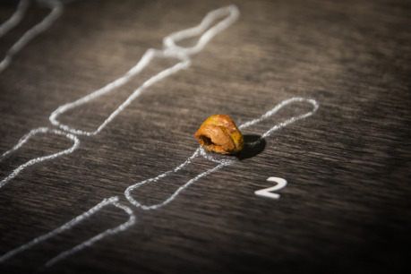
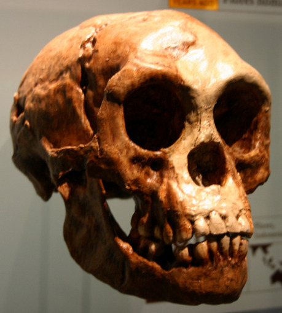
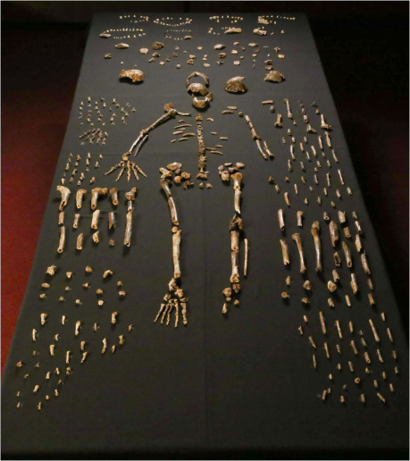

V Darwinově době jsme znali fosilie moderních lidí a neandertálců z Eurasie, ale otázka po kolébce lidstva – smysluplná právě od rozšíření myšlenek Charlese Darwina – zůstávala nezodpovězená. První fosilie považované za vzdálenější předky lidí byly nalezeny ve východní a jihovýchodní Asii, počínaje hlavně Duboisovým „Jávským člověkem“, později zařazeným do druhu _Homo erectus_. Po mnoha peripetiích ale přišel objev, který odstartoval zlatou horečku hledání předchůdců člověka v Africe: „Zinj“ Louise a Mary Leakyových, příslušník druhu _Paranthropus boisei_ nalezený v dnes již slavné Olduvaiské rokli. Hon na fosilie přinesl řadu nových objevů, z nichž nejslavnější je „Lucy“ Donalda Johansona a kolegů, kostra samičky druhu _Australopithecus afarensis_, dosud považovaného za přímého předka rodu _Homo_.

Původně testy protilátek, dnes analýza DNA ukázaly, že ze současných lidoopů jsou nám nejpříbuznější šimpanzi. Co se tedy dělo po oddělení těchto linií? Před zhruba 4 miliony let se tu objevil _Australopithecus afarensis_, před 2 miliony let už se na světě vyskytoval _Homo habilis_ a o necelý milion později _Homo erectus_. Poté se tu (přes občas vydělované _H. antecessor_ a _heidelbergensis_) objevili jednak moderní lidé, jednak neandertálci. Opravdu je to ale tak přímočaré? Ukazuje se, že nikoli…

## Neandertálci v nás

Člověk neandertálský je nejznámější vyhynulou větví člověka a inspiroval i řadu autorů SF od H. G. Wellse přes Poula Andersena až po Clifforda Simaka, Orsona Scotta Carda a mnoho dalších. Isaac Asimov ve své slavné novele _Ošklivý chlapeček_ nechá neandertálské dítě přenést do současnosti pomocí stroje času. Ukazuje se, že dítě prožívá stejné pocity jako my a je chytré a učenlivé, ale po skončení pokusu má být navráceno zpět do své doby, ačkoli si zvyklo na náš svět a stěží bude schopno přežít zpět v minulosti.

V nedávno vydané _Existenci_ od Davida Brina se také vyskytuje neandertálské dítě, zde přivedené k životu za pomoci genového inženýrství. To dnes, v době sekvenování prastaré DNA extrahované z kostí, není zcela nemyslitelné (i když bychom se museli uchýlit k mnoha pokusům a omylům) a možná k podobným snahám dojde, byť určitě zamotají hlavu mnoha etickým komisím. Jak bychom se vůbec tvářili na neandertálce, kdybychom jej dnes potkali na ulici? Jak se s oblibou traduje, kdyby byl oděn v motorkářské bundě a šátku, nejspíš bychom si na něm ničeho zvláštního nevšimli. Jejich větší mozkovna i výraznější nadočnicové oblouky nejsou tak daleko od běžné variability v naší populaci. Vykopávky postupně odhalily, že neandertálci byli schopnými lovci a velmi pravděpodobně měli umění a pohřební rituály. Konkrétní aspekty jejich kultur(y) nám ale nejspíše zůstanou navždy skryté.

Po neandertálcích nám ovšem nezůstaly jen kosterní pozůstatky a nástroje. Téměř každý z vás, kdo čtete tento článek, má v sobě drobnou stopu dávných setkání moderních lidí s neandertálci. Naše setkání se totiž neneslo pouze v negativním duchu, ale i v duchu potěšení a jeho následků. S neandertálci se totiž lidé migrující do Eurasie spářili. Z toho si všechny lidské populace kromě většiny Afričanů odnesly drobný příspěvek neandertálských genů. Kdybychom je všechny spočetli, daly by dohromady možná až šest procent našich genů. Nepředstavujte si ale, že mezi sebou máme nějakého šestiprocentního neandertálce; každý z nás má v sobě jen nepatrný úsek neandertálské DNA. Mezi našimi pomyslnými větévkami se tak objevily propojující výhony.

## Skuteční hobiti

To ale není jediný objev bořící představu žebříku směřujícího přímo k nám jako nějakým „pánům tvorstva“. Lidské počátky byly všechno, jen ne přímočaré. V době mezi oddělením od šimpanzů a vznikem toho, co označujeme jako lidský rod, se po Zemi prohánělo mnoho druhů australopithéků, ardipithéků, sahelanthropů a dalších a dalších druhů… Od počátku století jsme navíc uskutečnili několik objevů zcela nových druhů člověka.

Obrovskou senzaci vzbudil v roce 2003 objev člověka floreského neboli „hobita“. Tuto přezdívku si vyhynulý zástupce lidského rodu z indonéského ostrova Flores vysloužil kvůli svému malému vzrůstu. Šlo snad o populaci stiženou některou dědičnou poruchou vzrůstu? Tomu by ale moc neodpovídaly proporce koster. Šlo snad o případ ostrovního nanismu? Jejich směs archaických i moderních znaků však spíše nasvědčovala fascinující možnosti, že se jednalo o poddruh dávného _Homo erectus_: prvního člověka, jenž se vydal už před milionem let z Afriky.

Nové datování ukázalo, že na Floresu žil „hobit“ zhruba před 700 000 až 40 000 lety – tedy do doby, kdy se tam prokazatelně vyskytovali i moderní lidé. Ti se v Indonésii a dokonce Austrálii objevili už před 50 000 lety. Je vyhynutí člověka floreského záhy poté náhoda, nebo s naším příchodem nějak souvisí? Je možné, že jsme „hobity“ aktivně zabíjeli? Nebo jsme je pouze odřízli od zdrojů? Stejně tak dobře možné ale je, že jejich populace upadala už déle a náš příchod byl jen posledním hřebíčkem do rakve nebo ani tím ne.

Zatímco Tolkienovi dědicové protestovali proti použití slova hobit, autoři science fiction si mnuli ruce a někteří okamžitě nový námět využili. Ted Kosmatka ve své povídce _Prorok floreský_ ukazuje alternativní svět, kde kreacionismus zvítězil nad vědou a nález kostí floreského člověka zničehonic ohrožuje zažité náboženské dogma.

## Nový druh z článku prstu

Myslíte si, že na základě článku prstu a pár zubů dokážeme klasifikovat nový druh člověka? Donedávna by odpověď zněla „ne“. Jediná fosilie občas k učení nového druhu stačí, ale musí mít hodně morfologických znaků, které můžeme porovnat například s variabilitou v těchto znacích v naší současné populaci či lépe známých fosilních druzích. Články prstů ani zuby do této kategorie úplně nespadají. Objev učiněný před několika lety v jeskyni Denisova uprostřed sibiřského pohoří Altaj ale přišel uprostřed rozmachu nové generace sekvenování DNA a poté, co jsme již byli schopni analyzovat i těžce poškozenou a kontaminovanou DNA ze starých kosterních pozůstatků (což jsme si už vyzkoušeli třeba na neandertálcích). Právě DNA z těchto fragmentů ukázala, že patří nikoli moderním lidem či neandertálcům, ale zcela novému druhu pojmenovanému denisované.

Podobně jako neandertálci, ani denisované nevymizeli docela a po vzájemném křížení zanechali stopy v naší vlastní DNA, a to u populací kdysi migrujících skrz Asii dál na východ – dnešních Asiatů, Austrálců, Polynésanů a původních Američanů. U obyvatel Melanésie pochází od denisovanů dohromady více než pět procent genů. Podobně jako u neandertálského příspěvku se to však silně liší mezi populacemi různých oblastí. Odhady je navíc potřeba brát trochu s rezervou vzhledem ke kvalitě a početnosti vzorků DNA z fosilií. Nicméně navzdory možnosti, že ke křížení nemuselo docházet a podobnosti lze vysvětlit pomocí prostorového rozložení populací a genetickému driftu, se dnes zdá nejpravděpodobnější, že jsme se s neandertálci i denisovci alespoň několikrát úspěšně zkřížili.

## „Hvězdní lidé“

Můžeme ještě dnes nalézt dosud neznámý _pradávný_ druh člověka? Odpověď zní ano. Koncem minulého roku byly v jihoafrické jeskyni Rising Star nalezeny pozůstatky více než dvaceti jedinců vykazující zčásti archaické rysy podobné australopithékům, zčásti znaky odpovídající lidskému rodu. Předběžné datování odhaduje jejich stáří na až 2,5 milionu let – dobu ještě těsně předtím, než z jaké známe počátky _Homo habilis_. Pojmenován byl _Homo naledi_, podle místního výrazu pro hvězdu (viz název jeskynního komplexu). Největší senzace však spočívala v tom, že kosti ležely zvláštně rozmístěné v obtížně přístupné jeskyni… což by mohlo znamenat, že tam byly kdysi umístěny úmyslně. Máme snad důkaz více než dva miliony let starého pohřbu?

Doklady pohřbů jsme zatím znali pouze od moderních lidí a neandertálců, nejstarší z doby před asi sto tisíci lety. Není se tedy čemu divit, že objev možného pohřbu staršího možná o celé _dva miliony_ let vzbudil obrovské vzrušení. Jakou kulturu, jaké abstraktní myšlení, jaké rituály asi mohli mít tak dávní lidé? Výjimečná tvrzení však vyžadují výjimečné důkazy a podporou pro hypotézu pohřbu by byly až další obdobné nálezy a ideálně také nezávislé doklady dalšího rituálního chování. Musíme také počkat na přesnější datování nálezu. Nejspíš je ale jen otázkou chvíle, než se objevu chopí autoři fantastiky a nějakým vzrušujícím způsobem jej zpracují.

## Strom se rozvětvuje

Spíše než žebřík tedy naše linie připomíná hustě rozvětvený keř s mnoha větvemi, které nepřetrvaly dodnes, ale některé byly navzájem propojeny občasným křížením. Nejnovější objevy ukázaly, že náš obrázek o lidské evoluci stále není kompletní a její příběh se rozvíjí a komplikuje. Představy o tom, jak probíhaly některé etapy naší existence, jsou fascinující. Představte si, že bychom dnes sdíleli svět s úplně jinými druhy člověka. První anatomicky moderní lidé migrující z Afriky se tak mohli setkávat s neandertálci, denisovany, a dokonce i _Homo erectus_ včetně člověka floreského. Jak jsme reagovali na první kontakt s lidmi úplně jiného vzezření i kultury? První setkání různých nám známých civilizací jsou dost možná jen stínem toho, co se odehrávalo před mnoha desítkami tisíc let.

Představa podobného setkání nejenom skýtá příležitosti pro napínavé příběhy, ale může nám pomoci si i lépe představit první kontakt s civilizací, s níž bychom na rozdíl od těchto dávných lidí nesdíleli společné kořeny. Většina světa zůstává z hlediska paleoantropologie jen spoře prozkoumána. Některá z míst, kudy již moderní člověk před asi sto tisíci lety opouštěl Afriku, jsou dnes pod vodou například v oblasti Perského zálivu. Ještě dávnější lokality, kde žili naši předkové, se mnohde změnily k nepoznání. I tak ale máme šanci nacházet další a další pozůstatky našich předků či jejich současníků, což je fascinující výhled pro vědu i fantastiku. Ať už si v rámci své hry, povídky či knihy hodláte vymyslet fantastickou mytologii jiné lidské větve, alternativní svět ovládaný denisovany či příběh o objevování nových fosilií či jiných stop, dveře fantazie máte doširoka otevřené. Jen vězte, že skutečnost se možná ukáže ještě zajímavější.
