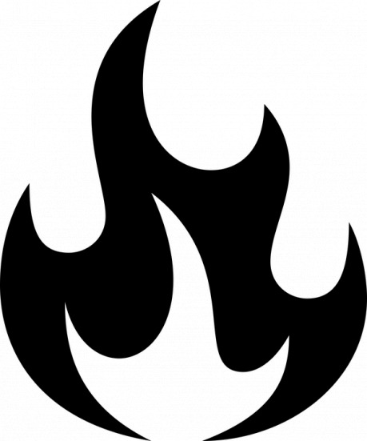

Vysoko, jako koruna travnatého vrcholu klenoucího se pahorku, jehož svahy byly při úpatí porostlé pokroucenými stromy pralesa, stál starý zámek mých předků. Po staletí jeho vznešené cimbuří chmurně shlíželo na divoký a drsný venkov okolo, sloužíce jako domov a pevnost pyšnému rodu, jehož významný rodokmen je dokonce starší než mechem zarostlé stěny zámku. Věkovité věžičky, poznamenané bouřemi generací, drolící se pomalým, ale mocným tlakem času, tvořily v době feu­dalismu jednu z nejobávanějších a nejmocnějších pevností v celé Francii. Z jeho předprsní, opatřených střílnami, a z ozbrojeného cimbuří, se bránili baroni, knížata a dokonce králové, nicméně nikdy se jeho prostorné komnaty nerozezvučely kroky dobyvatele.

Ale vše se od těchto slavných let změnilo. Chudoba, jen málo nad úrovní zoufalé bídy, spolu s pýchou jména, jež nedovolovalo výdělečnou činnost, zabránily potomkům mého rodu zachovat panství v původní nádheře; a padající kameny zdí, zarostlé parky, vyschlý a zanedbaný vodní příkop, špatně vydlážděná nádvoří a hroutící se věže venku, stejně jako zprohýbané podlahy, červotočivé obložení stěn a vyrudlá čalounění uvnitř, to vše vydávalo pochmurné svědectví o zašlé slávě.

Jak plynuly věky, nejdříve jedna, pak další ze čtyř velkých věží propadly zkáze, až nakonec pouze jediná z nich poskytovala útočiště smutně prořídlým potomkům dříve mocných vládců panství.

Bylo to v jedné z rozsáhlých a ponurých komnat oné zbývající věže, kde jsem já, Antoine, poslední potomek nešťastných a proklatých hrabat de C…, poprvé spatřil před devadesáti lety světlo světa. V těchto zdech, mezi temnými a stinnými lesy, v divokých stržích a slujích na svazích pahorku, tam jsem prožil první roky svého pohnutého života. Nikdy jsem nepoznal své rodiče. Můj otec byl zabit ve věku třiceti dvou let, měsíc před mým narozením, pádem kamene, který se nějak uvolnil z jedné rozpadající se předprsně zámku. Moje matka zemřela krátce po mém narození, takže péče o mne a mou výchovu připadly výhradně jedinému zbylému sluhovi, starému a spolehlivému muži se značnou inteligencí, jehož jméno, jak si vzpomínám, bylo Pierre.

Byl jsem jediné dítě a nedostatek kamarádství, který vyplýval z této skutečnosti, byl umocněn nezvyklou péčí, kterou mi můj letitý ochránce věnoval, vyloučiv mě ze společnosti venkovských dětí, které žily rozptýleně tu i tam na pláních, obklopujících pahorek. Pierre tehdy říkal, že toto omezení je dáno mým šlechtickým původem, který mě nadřazuje styku s tak nízkou společností. Nyní vím, že pravá příčina byla udržet mne z doslechu planých pověstí o hrozném prokletí mého rodu, o nichž si po večerech zveličeně vyprávěli prostí nájemci, když si potichu povídali v záři svých krbů.

Takto izolován a odkázán sám na sebe jsem strávil hodiny svého dětství, bedlivě prohlížeje starobylé svazky knih, které plnily knihovnu zámku, plnou temných stínů, nebo se potuloval bez dozoru a bez cíle věčným oparem strašidelného lesa na svazích pahorku. Byl to pravděpodobně vliv tohoto prostředí, že má mysl byla záhy zastíněna melancholií.

Tyto studie a výzkumy, které spolupůsobily s temnotou a tajemností přírody, silně přitahovaly mou pozornost. Pozoruhodně málo jsem se dověděl o svém původu, ale i to málo, jež jsem mohl získat, mě velmi stísňovalo. Možná, že zpočátku to byl pouze prokazatelný odpor mého starého pěstouna hovořit se mnou o mých otcov­ských předcích, který vyvolával hrůzu, již jsem vždy pocítil při zmínce o našem rodě.

Když jsem však odrostl dětství, byl jsem schopen složit rozptýlené útržky rozhovorů, které nedobrovolně uklouzly jazyku, jenž začínal zadrhávat s nastupujícím stářím, a které měly vztah k určité okolnosti, již jsem vždy považoval za zvláštní a která se nyní stala ponuře děsivou. Okolnost, na niž narážím, je časný věk, v němž hrabata mého rodu skončila svůj život. Zatímco jsem to zpočátku považoval za přirozený úděl rodu s krátce žijícími muži, později jsem dlouze přemýšlel o těchto předčasných úmrtích a začal je spojovat s blouzněním starého muže, který často mluvil o kletbě, která po staletí bránila držitelům mého titulu překročit třicátý druhý rok života.

Při mých jednadvacátých narozeninách mi dal starý Pierre rodinný dokument, který, jak říkal, byl po generace předáván z otce na syna a provázel každého držitele. Jeho obsah byl velice děsivý a jeho pročtení potvrdilo mé nejhlubší obavy. Tenkrát má víra v nadpřirozené byla silná a hluboká, jinak bych odmítl s pohrdáním neuvěřitelné příběhy, odvíjející se před mými zraky.

Dokument mě přenesl zpět do dnů třináctého století, kdy starý zámek, v němž jsem nyní sídlil, byla obávaná a nedobytná pevnost. Pojednával o jistém starém muži, který kdysi přebýval na našem panství, osobě s nemalými schopnostmi, i když původem byl jen něco víc než venkovan. Jeho jméno bylo Michel, který byl označován přízviskem Mauvais, Zlý, vzhledem ke své zlověstné pověsti. Studoval nepřiměřeně svému postavení, v touze objevit něco jako „kámen mudrců“ nebo „elixír věčného života,“ a byl považován za znalce tajemství Černé magie a Alchymie. Michel Mauvais měl jednoho syna, Charlese, mladíka stejně úspěšného v okultním umění jako on sám, pro což byl nazýván Le Sorcier čili Čaroděj. Tito dva, jimž se vyhýbal každý poctivý člověk, byli podezříváni z četných hnusných praktik. O starém Michalovi se říkalo, že zaživa spálil svou ženu jako oběť Ďáblovi a nesčetná zmizení mnoha malých venkovských dětí byla přičítána na vrub těmto dvěma. Nicméně temnou podstatou otce a syna prozařoval spásný paprsek lidskosti: ten hříšný starý muž miloval svého potomka s vášnivou silou a mladík projevoval vůči svému otci víc než synovskou náklonnost.

Jedné noci vypukl v zámku na kopci nejdivočejší zmatek, když zmizel mladý Godfrey, syn hraběte Henriho. Pátrací četa v čele se zoufalým otcem vtrhla do chalupy čarodějů a nalezla tam starého Michela Mauvaise nad velkým kotlem s bouřlivě vřící vodou. Aniž si potvrdil své podezření, v neovladatelném šílenství zuřivosti a zoufalství, hrabě uchopil starého kouzelníka, a dříve než uvolnil svůj vražedný stisk, jeho oběť nežila. Mezitím rozradost­nění sloužící ohlásili nalezení mladého Godfreye ve vzdálené, neužívané komnatě rozsáhlé budovy, oznamujíce to příliš pozdě, takže starý Michel byl zabit zbytečně. Když hrabě a společníci opouštěli alchymistův skromný příbytek, objevila se mezi stromy postava Charlese Le Sorciera. Vzrušené brebentění kolemstojících sloužících mu prozradilo, co se stalo, leč zpočátku se zdál nedotčen osu­dem svého otce, pak pomalu přistoupiv k hraběti vyslovil s mdlým, ale strašlivým důrazem kletbu, která od té doby pronásledovala rod C…

„Nechť každý šlechtic Tvé vražedné rodiny,ve stejném čase s Tvým se dočká poslední hodiny!“ pronesl, a uskočiv náhle zpět do temného lesa, vyňal ze svého pláště lahvičku bezbarvé tekutiny a mrštil ji do tváře vraha svého otce, aby pak zmizel za inkoustově temnou clonou noci.

Hrabě bez hlesu zemřel a byl pohřben druhý den, krátce po dosažení dvaatřiceti let od hodiny svého narození. Po útočníkovi se nenašla ani stopa, přestože skupiny venkovanů vytrvale pročesávaly sousední lesy a pastviny kolem pahorku.

Čas a nedostatek připomínek otupily vzpomínku na kletbu v myslích potomků hraběcí rodiny, takže když Godfrey, nevinná příčina celé tragedie a nyní nositel ti­tulu, byl během lovu zabit šípem ve věku dvaatřiceti let, nikdo nepomyslel na nic jiného, než na smutek z jeho od­chodu. Když však po letech další mladý hrabě Robert byl nalezen mrtev v nedalekém poli, vesničané si šeptali, že jejich pána, sotva překročil své dvaatřicáté narozeniny, překvapila předčasná smrt. Louis, Robertův syn, se utopil v hradním příkopu v témž osudovém věku a tak zlověstná kronika pokračovala staletími: Henriové, Robertové, Antoinové a Armandové byli vytrženi ze šťastných a plodných životů jen málo mladší než jejich nešťastný předek v době vraždy.

O tom, že mi zbývalo nejvýš jedenáct let dalšího života, mě přesvědčila slova, která jsem přečetl. Můj život, který dříve měl pro mě jen malou cenu, se mi každým dnem stával dražším, jak jsem se stále hlouběji nořil do mystérií skrytého světa černé magie. Izolován jak jsem byl, mo­derní věda mě neovlivnila a já se lopotil jako ve středověku, stejně ponořen jako starý Michel a mladý Charles do získávání vědomostí o démonech a alchymii. Nicméně jakkoli jsem četl, nijak jsem si nemohl vysvětlit strašlivou kletbu nad svým rodem. Ve vzácných rozumných okamžicích jsem zašel tak daleko, že jsem se snažil o přirozené vysvětlení, přisuzuje časná úmrtí svých předků zlověstnému Charlesi Le Sorcier a jeho dědicům; když jsem po pečlivém pátrání zjistil, že nebyli známi žádní alchymistovi potomci, vrátil jsem se k okultnímu studiu a ještě jednou se snažil najít kouzelnou formuli, která by osvobodila můj rod od onoho strašlivého břemena. V jedné věci ale bylo mé rozhodnutí pevné. Nikdy se neožením, neboť, protože neexistovala žádná jiná větev mého rodu, mohla by mnou kletba skončit.

Když jsem se blížil třicítce, starý Pierre se odebral na onen svět. Osamělý, pohřbil jsem ho pod dlažbu nádvoří, po níž zaživa tak rád chodíval. A tak jsem tu zůstal sám, abych přemýšlel o sobě jako o jediné lidské bytosti uvnitř velké pevnosti . Má mysl v naprostém osamění se vzdala marného protestu proti hrozící zkáze, aby se téměř smířila s osudem, který potkal mnoho mých předků. Většinu svého času jsem nyní strávil průzkumem zřícených a opuštěných dvoran a věží starého zámku, kterým jsem se v mládí ze strachu vyhýbal a o nichž mi starý Pierre jednou řekl, že tam po čtyři století nevkročila lidská noha. Zvláštní a hrozivé byly mnohé předměty, které jsem tam našel. Můj pohled odhalil nábytek pokrytý prachem věků a zničený hnilobou letité vlhkosti. Nikdy před tím jsem neviděl takovou spleť všudypřítomných pavučin a ohromné netopýry, mávající kostnatými a zlověstnými křídly v jinak neobydlené temnotě.

Pečlivě jsem vedl záznamy o svém věku, dokonce dny a hodiny, protože každý pohyb kyvadla masivních hodin v knihovně tolik vypovídal o mém osudném bytí. Nakonec jsem se přiblížil době, kterou jsem tak dlouho s obavami očekával. Jelikož většina mých předků zemřela krátce před dosažením věku, kdy hrabě Henri skonal, hleděl jsem vstříc neznámé smrti, která mohla nastat každým okamžikem. Nevěděl jsem, jakým neobvyklým způsobem na mě kletba dopadne; byl jsem rozhodnut, nebýt zbabělou ani pasivní obětí. S novou energií jsem se pustil do průzkumu starého zámku s jeho zařízením.

Za jedné z mých nejdelších objevných výprav v opuštěné části zámku, necelý týden před osudovou hodinou, která, jak jsem cítil, zřejmě určovala nejzazší hranici mého bytí na zemi a za níž jsem už neměl nejmenší naději, že budu dýchat, došlo k vrcholné události mého života. Strávil jsem větší část dopoledne lezením po polozbořených schodech nahoru a dolů v jedné z nejrozpadlejších starých věží. Jak dopoledne pokračovalo, ses­toupil jsem do nižších podlaží, kde zřejmě bylo středověké vězení nebo nedávno vyhloubený sklad střelného prachu. Jak jsem pomalu procházel po chodbě kryté ztvrdlým ledkem při úpatí posledního schodiště, dlažba byla velice vlhká a brzo jsem uviděl ve světle své plápolající pochodně, že mi holá mokrá stěna brání v další cestě. Obrátiv své kroky zpět, uviděl jsem přímo vedle svých no­hou malé padací dveře s kruhem. Po chvíli se mi podařilo s námahou je otevřít, načež se objevil temný otvor, odkud stoupal zhoubný dým, v němž má pochodeň prskala, a v mihotavém světle se vynořil vrchol křídla kamenných schodů.

Jakmile se pochodeň, kterou jsem vnořil do odporné temnoty rozhořela plně a klidně, začal jsem sestupovat. Schodů bylo mnoho a vedly do úzké chodby s kamennou dlažbou, která zřejmě musela být hluboko pod zemí. Byla to dlouhá chodba a končila masivními dubovými dveřmi, z nichž kapala vlhkost a které urputně vzdorovaly mým pokusům je otevřít. Po krátké době jsem se vzdal úmyslu pokračovat tímto směrem a vrátil jsem se kousek zpět ke schodům a tu jsem zažil nejotřesnější šok až k zešílení, jejž je lidská mysl schopna unést. Bez varování jsem uslyšel, jak se těžké dveře za mnou ve zrezivělých závěsech pomalu otevřely. Mé bezprostřední pocity se nedaly analyzo­vat. Setkat se se zřejmou přítomností člověka nebo ducha v místě tak zcela opuštěném, jako byl starý zámek, vyvolalo v mém mozku nepopsatelnou hrůzu. Když jsem se konečně otočil čelem k místu, odkud zvuk přicházel, oči mi málem vypadly z důlků při pohledu na to, co uviděly.

Ve starobylých gotických dveřích stála lidská postava. Byl to člověk s čapkou, oděný v dlouhé středověké tunice tmavé barvy. Jeho dlouhé vlasy a rozevlátý vous byly intenzívně černé a neuvěřitelně bujné. Jeho čelo nezvykle vysoké, tváře propadlé a hluboce vrásčité, jeho ruce dlouhé a sukovité, podobné pařátům, byly mrtvolně bílé jak mramor, jaké jsem nikdy u člověka neviděl. Jeho postava, vychrtlá jak kostra, byla podivně sehnutá a téměř ztracená v širokých záhybech jeho podivného oblečení. Ale nejpodivnější byly jeho oči, dvojice důlků propastné černě, temné výrazem pochopení, nicméně nelidské a nebezpečné. Nyní byly upřeny na mne, provrtávajíce nenávistí mou duši a přibíjejíce mě k místu, kde jsem stál.

Konečně postava promluvila drsným hlasem, který mrazil svou mdlou prázdnotou a skrytou zlomyslností. Řeč, kterou byl rozhovor veden, byla napodobenina latiny, kterou užívali vzdělanci středověku a mně byla známá dlouhodobým studiem děl starých alchymistů a démonologů. Přízrak mluvil o kletbě, která byla uvalena na můj rod, o mém blížícím se konci, obšírně vykládal o zločinu spáchaném mým předkem na starém Michelu Mauvaisovi a radoval se z pomsty Charlese Le Sorcier. Vyprávěl, jak mladý Charles, který prchl do noci, se po letech vrátil, aby zabil šípem dědice titulu, Godfreye, jakmile se ten přiblížil otcovu věku v době úkladné vraždy; jak se tajně vrátil na panství a nepoznán se usadil právě v této opuštěné podzemní komnatě, jejíž dveře rámovaly hrozného mluvčího; jak se zmocnil v polích Roberta, syna Godfreyova, přinutil ho polknout jed a nechal ho zemřít ve věku třiceti dvou let, zanechávaje tím odpuzující předzvěst pomstychtivé kletby.

Náhle jsem pochopil rozřešení největšího tajemství, jak byla vykonávána kletba od doby, kdy Charles Le Sorcier už musel být přirozeně mrtev, protože ten muž vypovídal o hlubokých alchymis­tických studiích obou kouzelníků, otce a syna, zejména co se týče výzkumů Charlese Le Sorcier, zaměřených na elixír, který mu měl poskytnout věčný život a mládí.

Na okamžik se zdálo, že zaujetí zbavilo jeho strašlivé oči temné zlovolnosti, která mě zpočátku tak děsila, ale náhle se vrátil ďábelský a upřený pohled a s šokujícím zvukem, podobným syčení hada, pozvedl vetřelec skleněnou lahvičku se zřejmým úmyslem ukončit můj život, jako ukončil Charles Le Sorcier život mého předka před šesti sty lety. Vyburcován pudem sebezáchovy, prolomil jsem kouzlo, které mě dosud poutalo do nehybnosti, a mrštil jsem hasnoucí pochodeň na bytost, která ohrožovala můj život. Uslyšel jsem třesk lahvičky na kamenech chodby, za­tímco se oděv vetřelce vznítil a osvětloval děsivou scénu s přízračnou jasností. Vřesk zděšené a bezmocné zášti úkladného vraha byl příliš pro mé již otřesené nervy a já upadl v mdlobách na kluzkou zem.

Když se mi konečně vrátilo vědomí, všude byla děsivá tma a má mysl při vzpomínce na to, co se stalo, se děsila myšlenky ještě něco vnímat; nicméně zvědavost převládla. Kdo byl tento muž zla, ptal jsem se sám sebe, a jak se dostal do zámeckých zdí? Proč se snažil pomstít smrt Michela Mauvaise a jak procházela kletba všemi dlouhými staletími od časů Charlese Le Sorcier? Letitý strach ze mne spadl, neboť jsem poznal, že ten, jehož jsem přemohl, byl původcem všeho nebezpečí kletby a nyní, když jsem se osvobodil, hořel jsem touhou dozvědět se více o zkázonosné záležitosti, která pronásledovala můj rod po staletí a udělala z mého mládí nepřetržitou noční můru. Rozhodnut pokračovat v průzkumu, sáhl jsem do kapsy pro křemen a ocílku a rozsvítil pochodeň, kterou jsem měl u sebe.

Nejdříve se ve světle objevila pokroucená a zčernalá postava tajemného vetřelce. Děsivé oči byly nyní zavřené. S odporem jsem se odvrátil a vstoupil do komnaty za gotickými dveřmi. Našel jsem zde něco, co se velmi podobalo laboratoři alchymisty. V jednom koutě byla ohromná hromada lesknoucího se žlutého kovu, který se ve světle pochodně nádherně třpytil. Mohlo to být zlato, ale nezdržoval jsem se zjišťováním příliš vzrušen tím, co jsem podnikal. Ve vzdálenějším konci místnosti byl otvor vedoucí do jedné z četných divokých strží v temném lese na svahu pahorku. Pln úžasu jsem se vracel, neboť nyní jsem poznal, jak se ten muž dostával do zámku.

Měl jsem v úmyslu projít kolem pozůstatků vetřelce s odvrácenou tváří, ale když jsem se přiblížil k tělu, zdálo se mi, že jsem zaslechl tlumený zvuk, jako by život z něj ještě zcela nevyprchal. Zděšen jsem se otočil, abych se podíval na zuhelnatělou a skrčenou postavu na zemi.

Potom se náhle ty strašlivé oči, temnější než sežehnutá tvář, do níž byly zasazeny, široce otevřely s výrazem, který nejsem schopen popsat. Rozpukané rty se snažily zformovat slova, kterým jsem dobře nerozuměl. Jednou jsem pochytil jméno Charles Le Sorcier a také jsem měl dojem, že z jeho sevřených úst vycházela slova „léta“ a „kletba“. Stále jsem se nemohl dobrat významu jeho nesouvislé řeči. Když mé nepochopení významu jeho slov bylo zřejmé, ještě jednou zlovolně vzplály jeho smolně černé oči, a já se otřásl, když jsem pozoroval svého již bezmocného odpůrce.

Náhle ten ubožák podnícen posledním výbuchem síly, zvedl svou bídnou hlavu z vlhké a propadlé dlažby. Když jsem se zastavil, paralyzován strachem, nalezl svůj hlas a se zmírajícím dechem vykřikl ona slova, která mě pak vždy děsila dnem i nocí.

„Hlupáku,“ vřískl, „nemůžeš uhodnout mé tajemství? Nemáš dost rozumu, abys poznal vůli, která po šest století naplňovala tu strašnou kletbu nad tvým rodem? Neříkal jsem ti o mocném elixíru věčného života? Nevíš, jak bylo rozluštěno tajemství alchymie? Říkám ti, jsem to já! Já! To já žil šest set let své pomstě, neboť já jsem Charles Le Socier!“
