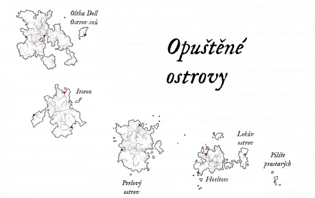

Na stránkách [http://maps.gamingkeep.sk](http://maps.gamingkeep.sk) je k dispozici náhodný generátor map, který sestavil dohromady Antharon. Nabízí hodně nastavení pro generování (při kliknutí na růžici vlevo dole) a tím prostor pro vytváření různorodých světů a prostředí.

Rozhodli jsme se proto s Antharonem generátor otestovat a vytvořit pro Drakkar kolektivní článek, pro který by každý účastník popsal jeden zajímavý ostrov, přičemž všechny ostrovy by společně utvořily jedno souostroví. Dali jsme dohromady „téma“ ostrovů (souostroví, které zčistajasna opustili elfové a začali je osidlovat lidé), aby měly alespoň trochu podobný ráz, ale zbytek byl na autorech. Každý ostrov mohli osídlit jiní lidé, takže se od sebe budou lišit. Zájemcům jsme rozeslali mapu jednoho ostrova s náhodným počtem měst, oblastí a zvláštních míst a na nich pak bylo vytvořit popis ostrova.

---

„Už se blížíme! Plachty na vítr! Kormidlo ostře vlevo, stýrimadúre!“

„Plachty na vítr, pane Jóne!“

„Kormidlo ostře vlevo!“

Zapraskaly provazy a ráhna, když posádka natočila plachty a opřel se do nich mořský vítr. Na stožáru se v závanu větru rozvinul prapor, na kterém dívka s vlkem po boku pozvedala do výše kalich plný krve. Stará a otřískaná koga zahnula směrem doprava, zatímco její zrzavý kapitán stál na přídi se založenýma rukama a sledoval skálu na levoboku, které se právě vyhýbali. Byla zahalena podivnou mlhou, která se plazila u hladiny. Otočil se, když za sebou zaslechl kroky:

„Vítejte, pane Ásmunde. Jsem rád, že jste se k nám mohl připojit. Máme dobrý vítr a vy i vaše zboží budete ve Vestri­byggdu načas.“

Holohlavý kupčík přivíral oči, jak se jeho zrak přizpůsoboval ostrému světlu po přítmí v podpalubí, zatímco se postavil vedle kapitána:

„To mne velice těší, pane Jóne. Kaž­dé zdržení mě stojí nemalou hromádku mincí.“

„Slíbil jsem vám, že vás tam dostanu a slovo držím.“

Pan Ásmund se poplašeně otočil, když se námořníci, kteří nebyli zrovna potřeba k řízení lodě, nahrnuli na levobok a někteří i vylezli do lanoví, aby lépe viděli. Všichni vyhlíželi do mlhy obklopující zvláštní ostrov, který míjeli. Jeden z nich vykřikl a ukázal před sebe, načež se z mlhy vynořil obrys ohromné kamenné sochy. Byla umně zpracována do podoby vznešeného elfího válečníka, opírajícího se o meč. Rysy sochy smazal vítr a déšť, ale stále se majestátně tyčila nad proplouvající kogou, čníc nad její nejvyšší stěžně. Ozval se výkřik dalšího námořníka, když se v mlze objevila další ohromná socha vytesaná ze skály do podoby vysoké elfské ženy s přísným pohledem. Proplouvali dál a na levoboku se z mlhy vynořovaly další a další sochy, vznešené a mlčenlivé.

„Odpusťe, kapitáne … ale co je to za podivné místo, kam jste nás to zavedl? Měl bych se bát o svůj náklad?“

„Nikoli, pane Ásmunde. Míjíme Pilíře prastarých. Skoro každá loď na cestě k Opuštěným ostrovům tudy proplouvá … je to vstupní brána k ostrovům a orientační bod, který zná každý kapitán a stýrimadúr, který se v těchhle vodách plaví. Všiml jste si, že kolem nás fouká svěží vítr, zatímco vlevo leží mlha? Ty skály neobklopuje počasí z tohohle světa … Pilíře prý postavili elfové, a i když jsou pryč, pořád tu vládne jejich řád. Bez ohledu na počasí venku jsou pořád zahaleny mlhou.“

„A kdo byli ti elfové, kteří jsou tu vytesáni, pane Jóne? Bohové? Králové a knížata? Velcí válečníci, nebo proroci?“

„To nikdo neví. Když elfové odešli, vzali si tajemství těch soch s sebou. Pokud vím, nikdo u nich nikdy nezkusil přistát a sochy samy nepromluví. Dobře, posádko! Pilíře jsou už téměř za námi, zpátky do práce! Opuštěné ostrovy na nás čekají!“

---

Jednotlivé ostrovy najdete ve webovém vydání jako samostatné články v [obsahu 58. čísla Drakkaru](.).
