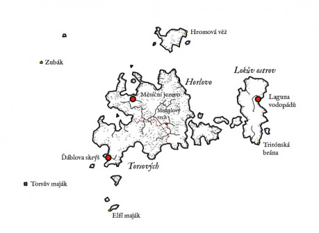
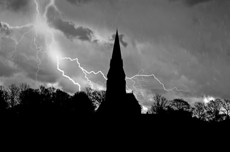

Seskupení dvou velkých a několika menších ostrovů si mezi sebe rozdělily tři klany z jihu. Největší ostrov si mezi sebe rozdělili Horl a Tors, zbylý velký ostrov obsadil Lok. Protože je tu mnoho místa a málo lidí, tito tři praotcové si se svými kmeny příliš nepřekážejí a každý si na svém území buduje domov podle vlastních představ. Po původních obyvatelích tu však zůstalo mnoho tajemných míst, kterým se noví osadníci raději vyhýbají a mnoho dalších tajemství jistě teprve čeká na své objevení.

## Ďáblova skrýš

Kamenné město v zátoce, kterému dominuje obrovský kamenný žlab směřující od moře až do veliké jeskyně. Ústí této jeskyně bylo otesáno do podoby zrůdné tváře, jejíž ústa tvořila vchod.

První odvážlivci, kteří do jeskyně vstoupili, tu našli nádoby s různým zrním, které však nově příchozí neznali. Vzali tedy trochu zrní, umleli z něj mouku a upekli chléb. Ti, kteří ochutnali, pak dva dny blouznili. Tors tedy nechal všechno zrní z jeskyně spálit.

Dnes slouží koryto vedoucí od jeskyně jako loděnice a jeskyně je využívána jako sklad materiálu. Místním se nelíbilo žít v blízkosti obří kamenné zrůdy, proto výzdobu kolem vchodu osekali. Kamenné domy v zátoce daly domov nejen Torsovu kmeni, ale i dalším nově příchozím, které mezi sebe přijali. Dodnes zůstávají některé domy neobydlené.

## Elfí maják

Na skalním ostrohu stojí vysoká socha z bílého mramoru, představující elfku, která v natažených rukách drží křišťálovou kouli a svůj pohled obrací k nebesům. Koule v noci i mlze vydává jasné modré světlo a varuje tak lodě mířící k Ďáblově skrýši před zrádnými skalisky. O maják se nikdo nestará. Jednak proto, že maják svítí sám o sobě, jednak proto, že ostrov ční vysoko nad moře a není tu žádné vhodné místo k vylodění. Na ostrově je malý háj, jinak je pokryt loukami, na kterých se pase zdivočelé stádo krav.

## Torsův maják

Ačkoliv se lodě bezpečně vyhýbaly skalám okolo elfího majáku, nezřídka se stalo, že ztroskotaly na skalách přímo proti Ďáblově skrýši, nebo se majáku vyhýbaly příliš velkým obloukem a uvázly na mělčině na západě. Tors proto nechal vystavět nový maják na malém ostrově, uprostřed zrádné mělčiny a lodě tak dnes do Ďáblovy skrýše plují mnohem bezpečněji. Sám Tors se stal na sklonku života strážcem majáku. Říká se, že ho společnost lidí natolik otravovala, že se raději uchýlil na maják, kam mu jen jednou týdně příbuzní vozili zásoby. Říká se také, že Torse na maják odklidili jeho synové, aby se mohli ujmout vlády dřív, než Tors zemře.

## Zubák

Dokonale hladká skála ve tvaru obřího zahnutého špičatého zubu. Z vnější strany jsou do skály vytesané schody, po kterých je možné vystoupat až na vrchol Zubáku. I při dobrém počasí tam ale fouká silný vítr a odvážlivci, který by se rozhodl na Zubák vystoupat tak hrozí pád do moře, nebo v horším případě na kameny u kořene Zubáku.

Nikdo neví, proč by někdo tesal schody do skály uprostřed moře. Někteří tvrdí, že vystoupat nahoru a pak skočit do moře byla pro elfy zkouška dospělosti. Čas od času se najde někdo, kdo chce na tuto tradici navázat, často s tragickými následky. Někdo si zase myslí, že odtud elfové shazovali odsouzence do chřtánu mořských příšer. Je však těžké si představit, že by po úzkém schodišti někoho vlekli proti jeho vůli. Někdo dokonce tvrdí, že na vrchu Zubáku končí duha a je po ní možné vystoupat do nebe. Pravda je ale nejspíš někde úplně jinde.

## Měsíční jezero

Za zátokou plnou nebezpečných skal je ústí řeky a jen kousek po proudu je jezero ve tvaru půlměsíce. Na jejích březích našli osadníci z Horlova klanu domy ze spletených větví stromů kamenný chrám, cesty lemované sloupy, jejichž vrcholy v noci svítí a mnoho překrásných fontán.

Chrám kdysi zasvěcený neznámým božstvům se stal velkým sálem, kde zasedá rada starších a o svátcích se tu schází celý klan na velkou hostinu. Lidé osídlili stromové domy a postavili si nové z kamene i dřeva. V řece i jezeře je hojnost ryb i raků a když by se jich náhodou nedostávalo, moře nenechá místní hladovět. Kousek nad jezerem se pasou stáda ovcí, která dávají mléko, maso i rouno.

V Měsíčním jezeře samotném i v krajině kolem něj se nachází nespočet soch elfů i jiných podivných bytostí. Místní často věří, že patří dobrým duchům, kteří přinášejí prospěch. Proto u nich zapalují svíčky a pokládají drobné obětiny. Pravdou je, že Měsíční jezero je místem skýtajícím svým obyvatelům bezpečí, hojnost i krásu.

## Mohylový vrch

Když lovce z Horlova klanu, putující po ostrově, zastihla uprostřed rašelinišť bouře, bylo zle. Naštěstí však nad řekou našli zalesněný kopec, kde se mohli ukrýt. Druhý den našli na kopci několik zlatých medailonů a pak i kamenné mohyly. Usoudili, že jde o pohřebiště a nechtěli jej znesvětit, tak si nechali jen medailony, které našli níž v lese a vrátili se do Měsíčního jezera, kde o svém objevu vyprávěli.

V následujících letech se sem vydalo mnoho chamtivých dobrodruhů, kteří si se znesvěcením elfího pohřebiště hlavu nelámali. Nakonec asi nebylo proč. V mohylách byly ukryty různé cennosti, ale ani stopy po kostech.

Dnes už je zlato z mohyl i lesa důkladně vybráno a kameny z mohyl posloužily ke stavbě domů. Lidé tu kácejí stromy a plaví je po řece do Měsíčního jezera. Kromě několika zalesněných vrchů jsou kolem jen mokřiny a tak se jiný způsob obživy nenabízí. Mnozí se diví, proč lidé Mohylový vrch neopustí a nevrátí se do Měsíční jezera. Mají je za podivíny. Zlí jazykové dokonce tvrdí, že topí pocestné v močálech.

Sami obyvatelé Mohylového vrchu vyprávějí o bludičkách nad mokřinami, smečkách bažinných vlků napadajících dobytek a šíleném jekotu, který se ozývá z mokřin za větrných dní. Do Měsíčního jezera ale odejít nechtějí. Ať je to tu jaké chce, je to jejich domov. Komu se tu nelíbí, může se vrátit odkud přišel.

## Laguna vodopádů

Celý Lokův ostrov je vyzdvižený nad moře. Jen na několika místech se na něj dá dostat, i tak se musí návštěvník proplétat mezi strmými skalisky. Laguna vodopádů je však něco docela jiného.

Když sem poprvé zavítal Lok se svými druhy, učarovala jim laguna, do které padala voda hned ze tří vodopádů. V samotné laguně pak byly kamenné cesty a mola, u kterých mohli snadno zakotvit svoji loď. Lokovi se zdálo divné, že cesty vedou k vodopádům a tak přelezl po skalách za stěnu padající vody. Našel zde prostornou jeskyni, osvětlenou lampami vydávajícími modré světlo. Z jeskyně vedlo několik schodišť vzhůru na ostrov i několik šachet s rumpály, kudy bylo možné tahat náklad.

Lok a jeho druhové se tu usadili se svými rodinami. Nad cestami do vodopádů zbudovali z mohutných trámů střechy, takže bylo možné do přístaviště dojet i vozem. Jeskyně za vodopády se stala vstupní branou na ostrov. Nejprve zde v chladu uchovávali potraviny, později zde dokonce zřídili tržiště. Atmosféra jeskyně osvětlené tajemným modrým světlem dává vydělat zejména prodejcům různých cetek a amuletů pochybného původu i účinku.

Na povrchu se místní živí především pastevectvím, lovem a někteří pěstováním zeleniny. Ačkoliv na ostrově nebyly žádné elfí stavby, v zemi každou chvíli někdo najde nějakou sponu, minci, šperk nebo rozbitou nádobu, co tu elfové zanechali. A na tržišti za takovou cetku obchodníci z jihu často zaplatí víc, než by dali za vlnu z celého stáda ovcí.

## Tritónská brána

Jediná původní stavba na Lokově ostrově. Nebo alespoň jediná známá původní stavba. Pět metrů vysoký kamenný portál, vytesaný do tvaru dvou delfínů ve skoku. K bráně vede od Laguny vodopádů kamenná cesta, která končí asi metr za branou. Ta totiž stojí na samém okraji útesu, několik desítek metrů nad mořem.

Vysvětlení, proč tu elfové bránu stavěli, je mnoho. Žádné z nich se nejspíš nezakládá na pravdě. Podobně jako u většiny záhadných staveb přisuzují lidé i této roli obětiště, nebo cesty do jiného světa. Někteří tvrdí, že to bylo přístaviště pro vzdušné koráby.

Asi nejoblíbenější legenda říká, že odtud elfové vyhlíželi příjezd Lokovy lodi. Ostrov střežili před nezvanými návštěvníky až do dne, kdy spatřili Lokovu výpravu na obzoru. Pak se sebrali a odešli neznámo kam.

## Hromová věž

Na nejvyšším místě jednoho z větších ostrovů stojí Hromová věž. Zbytek ostrova jsou jen holé skály, sem tam kus trávy, nebo kameny ohraničená políčka, o která se nikdo nestará a občas nějaký opuštěný domek. Dalo by se tu žít, ale nikdo nechce, právě kvůli Hromové věži.

Věž je postavena z čediče, ačkoliv se zde, ani na okolních ostrovech čedič nikde nenachází. Na jejím vrchu se jako jestřábí spár kroutí podivné výstupky, snad vyrobené z kovu. Věž nemá žádné dveře ani okna a vydává podivný bzučivý zvuk, který je při příznivém větru slyšet na míle daleko. Jen jednou se na ni pokusili vylézt průzkumníci z Horlova klanu, avšak prvního, kdo vylezl jen pár metrů do výšky srazil blesk, který vyšlehl z vrcholku věže.

Záhad kolem věže je však daleko víc. Jakkoliv zdejší moře často halí mlha, kolem věže vždy obtéká v uctivé vzdálenosti. Jako by i mlha měla z Hromové věže strach. Ta pravá hrůza však nastává při bouřce. Blesky do věže bijí jeden za druhým a z věže zas srší blesky zpět směrem k nebi. Jako by Homová věž bojovala s bouří jejími vlastními zbraněmi. Bouře nakonec přejdou, Hromová věž tu ale zůstává.
