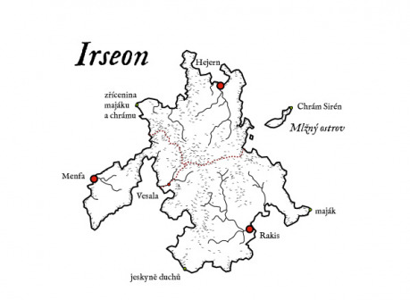

Téměř okamžitě po odchodu elfů k ostrovu dorazili první piráti. Nevěděli, jestli se původní obyvatelé nevrátí, a tak jen drancovali a ničili vše, na co přišli. Všechna místní města jsou tak nová, postavená na rozvalinách původních obydlí a často z materiálu původních domů a chrámů. Z původních elfských míst se tak zachovala jen dvě. Chrám na Mlžném ostrově (SV) a maják (V).

## Chrám Sirén na Mlžném ostrově

Z chrámu Sirén na Mlžném ostrovu stačili piráti ukrást jen jednu sochu. Podle legend se potom bůh moří, kterému je chrám zasvěcen, rozhodl piráty zničit. Potopil jim všechny lodě a zabránil jim v dalším drancování ostrova. Celý ostrov je zahalen mlhou, proto také ten název. Podle legendy je tomu tak proto, aby lidské oko už ostrov nespatřilo. Možné je ale také to, že se zde střetává teplý proud s chladnou vodou, což způsobuje, že je ostrov zahalen mlhou.

Dnes je chrám prázdný, nikdo neuctívá elfské bohy. Stále je to ale posvátné místo, kde bohové naslouchají. Bůh moří je nebezpečný stejně jako živel, který zastupuje. Pokud vstoupíte na jeho půdu, bude chtít dar. Kdo obdaruje boha, tomu bude dovolen návrat, kdo dá něco hodnotného, může být odměněn (bůh může někdy onoho dobrodruha zachránit před utonutím, v nouzi nejvyšší mu může najednou z vody podat zbraň či ztišit bouři). Nespokojí se ale s ledasčím. Nejde o hmotnou cenu daru. Spíše o jeho hodnotu pro majitele. Někdo tak může dát magický meč, ale jeho dar nebude dostatečný. Jiný jen kousek jídla a jeho dar bude přijat. Střezte se pokusit se sebrat některý z předmětů už zde ležících.

## Města na ostrově

Ostrov Irseon nikdy nebyl jednotný a nikdy nespadal pod společnou vládu. Platilo zde jen právo silnějšího. Přesto došlo ke křehké dohodě a rozdělení ostrova na určité sféry vlivu jednotlivých měst. Obyvatelé města Rakis si tak zabrali jižní část ostrova, Menfa západní a Hejern východní. Jen Vesala se vymyká a porušuje rovnováhu. Její maličký přístav, skrytý v ústí řeky a dostupný jen za přílivu, je ale vhodný jen pro malé lodě, a tak moc nedělá konkurenci velkým městům. Díky své poloze slouží často jediná místní hospoda jako místo setkání na neutrální půdě zástupců velkých měst. Napětí se dá potom krájet, když vládci jednotlivých měst v salónku hrají v kostky o poklady, lodě i s posádkou nebo o nadvládu nad některým sporným územím. Potom stačí jen málo…

### Možná dobrodružství:

Vražda, nebo naopak ochrana některého z účastníků setkání ve Vesale. Popřípadě pokud má družina loď nebo něco jiného dostatečně cenného, dostat se na hru a samozřejmě vyhrát.

V některém z měst je bar U Oběšence, vyhlášený to podnik především mícháním neobvyklých nápojů z alkoholu. Rum se vším možným tu teče proudem a rvačky jsou na denním pořádku. Jedním z nejhorších koktejlů je Rychlá smrt, směs, která většinu spolehlivě vyřadí. Uzavírají se sázky, jak dlouho nebohý pijan dokáže ještě stát na nohou. Tenhle dryják se navíc podává z kalichů vyrobených z lidských lebek. Měli jich tu slušnou zásobu. Při jedné z rvaček byla ale většina z nich rozbita. Z čeho teď budou Rychlou smrt pít? Družina je oslovena majitelem podniku. Potřebuje lebky, a kde je vezmou, je mu jedno. Pohřbívá se do moře, a tak nejde jen tak vykrást nějaký hřbitov. Kdo dnešní noci zemře? Nebo raději informovat stráže, kteří jsou také návštěvníky podniku? Z koho se asi pokusí obsluha baru získat lebku, když družina úkol odmítne? A budou stráže na straně známého podniku, nebo neznámých dobrodruhů?

## Maják

Na jihovýchodním cípu ostrova je elfský maják, bledé světlo podobné měsíčnímu vychází z otevřené dlaně ruky, kamenného sloupu čnícího vysoko z kamenného poloostrova. Jeho světlo je spíše vražedné a na pobřeží leží velké množství vraků, které sem byly zahnány bouřemi. Maják kromě světla má kolem sebe auru smrti, sílu, která zraňuje vše živé ve svém dosahu.

### Možná zápletka:

Donést tajemnou černou skřínku z jednoho z vraků, který ztroskotal v dosahu aury majáku. Skříňka obsahuje černé svíce a obětní dýku, takže pozor ať se zaměstnavatel neobrátí proti dobrodruhům vyčerpaným aurou majáku.

## Jeskyně duchů

Na jihu ostrova ve strmých útesech je Jeskyně duchů. Místo snad ještě z doby před elfy, které je přístupné pouze za odlivu. V jeskyni je množství hliněných uren s nemrtvými obyvateli. Nemálo dobrodruhů zkusilo štěstí a v některé z uren našli cennosti, které je zabezpečily až do konce života. Jiní zde našli smrt. Dnes už sem nikdo moc nechodí, příliš mnoho uren je rozbitých a příliš mnoho duchů je probuzených.

### Možná zápletka:

Družinu osloví paní Alienor. Před dvěma lety se vdala. Její manžel chtěl zkusit štěstí v Jeskyni duchů a už se nevrátil. Teď by se chtěla zase vdávat. Její nastávající je z velmi bohaté rodiny a ta jako důkaz, že je její manžel už po smrti, potřebuje přinést snubní prsten, který měl na prstě. Kopie nepřichází v úvahu, protože by to rodina jejího nastávajícího poznala. Duchové v jeskyni nemusí být hned ke všem nepřátelští. Budou útočit jen na ty, co se pokusí odnést něco z uren. Prstýnek může být někde blízko vchodu jeskyně nebo až někde ve vzdáleném koutě jeskynního labyrintu (v závislosti na schopnostech a vybavení družiny). Možná, i když velmi nepravděpodobná, je i varianta, že tam vůbec není a že bývalý manžel nastoupil na první loď a odjel. Nepravděpodobná proto, že prsten je prokletý. Muž, který si ho nasadí, se bezhlavě zamiluje do nositelky druhého prstenu a bude se snažit jí splnit jakékoliv přání, třeba i sebevražedné. Pozor na to, jak družina prsten ponese a hlavně kde.

## Rozvaliny majáku a chrámu

Na severozápadě ostrova býval druhý elfský maják. Ten byl součástí chrámu, který skončil podobně jako ostatní elfské stavby, v rozvalinách. I přes strategickou polohu zde nový maják postaven nebyl. Z rozvalin je totiž doteď slyšet zpěv a hudba, která láká k odpočinku. Není nic hezčího, než se zastavit a zasnít. V noci se hudba mění a ti, kdo zde zůstali přes noc, se už neprobouzí. Několik rybářů z Hejernu může družině povědět historky o duších, kteří zde za noci hlídají. Ale nikdo si nepamatuje, že by při obsazení ostrova zde zemřel byť jen jediný elf.

### Možná zápletka:

To, co zde ve skutečnosti straší, jsou kněžky zde pohřbené, které se probudily k neživotu po zničení a znesvěcení chrámu. Nemohou dojít klidu, dokud chrám nebude obnoven nebo dokud jejich ostatky znovu nespočinou v jiném chrámu stejné bohyně. Pokud tedy družina svolí (a asi v noci bude na výběr buď jen svolení, nebo smrt, navíc někdo z družiny musí umět elfsky, jinak se asi nedomluví) ukáží družině směr, kterým leží nejbližší chrám stejného boha a spolu s družinou nastoupí ve své nehmotné podobě na loď, aby družinu doprovázely na této strastiplné cestě. A kolik měst přijme do přístavu loď s přízraky? Pokud loď družiny kotví v některém z měst, bude zástup přízraků doprovázet družinu i do města.

Ke splnění úkolu stačí, aby družina symbolicky dovezla trošku země z rozvalin chrámu do jiného chrámu stejného boha (a onen chrám může ležet v novém působišti místních elfů). Jakmile se přízraky vydají na cestu, budou viditelné i ve dne a družina se tak bude muset stále potýkat s obtížemi s tím spojenými. Stejně jako s neustálými komentáři přízraků, které nebudou jinak do ničeho zasahovat, tedy pokud družina nesejde z cesty…
