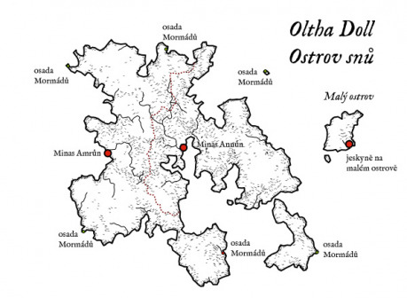

## Príbeh začína

V dávnych časoch sa elfovia na ostrove rozdelili na dve skupiny, aby zabránili stagnácii. Jedni založili mesto Minas Amrûn, mesto na východe, a druhí Minas Annûn, mesto na západe. Raz ročne medzi sebou elfovia súperili v rôznych disciplínach (šport, umenie, boj, mágia …) a toto súperenie ich motivovalo a posúvalo dopredu. Toto športové i umelecké klanie sa dialo na mieste zvanom Minas Endeth, mesto stredu, umiestnenom na najvyššej hore ostrova.

Pred stovkami rokov žila v Minas Amrûn elfka menom Priadka. Špecializovala sa na mágiu snov, veštenie a liečenie. Sny a snový svet je miesto, v ktorom i elfská myseľ môže zablúdiť a stratiť súdnosť. A tak Priadka pochopila, že bez pomoci nebude vedieť preskúmať priestor snov, ktorý ju tak fascinoval. Jej posadnutosť ju dohnala k tomu, že stvorila parazita, myšlienkovú bytosť, pomocou ktorej dokázala vnímať a ovplyvňovať sny ostatných. Množstvo prežitkov jej pokrivilo myseľ a ona zatúžila po niečom viac …

… a tak začala s mysľou elfov Minas Amrûn počas spánku manipulovať. Jeden po druhom striedali spánok s bdelým spánkom a vykonávali činnosti, ktoré im ona do snov vložila. Prestali rozoznávať, či bdia, alebo snia. Priadka sa potom kochala z citových prežitkov svojich pacientov, ktoré boli čím ďalej tým krutšie, krvavejšie, drastickejšie, násilnejšie. Stávalo sa čím ďalej tým častejšie, že elfovia Minas Amrûn v bdelom spánku zabíjali, mučili a týrali ostatných elfov, zvieratá i samy seba. Niektorí vo svojom bdelom spánku tvorili krvavé umenie ako kreslenie na kožu za živa stiahnutého elfa, alebo zohavenie a zakonzervovanie tela elfa alebo zvieraťa, i horšie veci, ktoré nemali so zdravým rozumom nič spoločné a iným sa pri pohľade naň podlamujú kolená.

Elfovia z Minas Annûn pochopili, že sa deje niečo zlé a počas výpravy do Minas Amrûn, povraždili všetkých. Všetkých! Až na jednu, ktorú varoval parazit v mozgu toho mála elfov z Minas Amrûn, ktorí sa nakazili. Až na Priadku, ktorá sa pred mágiou a silou mečov schovala v hibernickom spánku hlboko v tuneloch pod menším ostrovom na východe. I keď si elfovia z Minas Annûn mysleli, že hrozbu snového šialenstva zahnali, nedokázali viac žiť na ostrove, ktorý bol pre nich pripomienkou ich bratovražedného činu.

A tak Priadka na ostrovoch osamela. Sama v spánku, vo svojej snovej ríši, po dlhé desaťročia. V spánku, z ktorého sa pred niekoľkými rokmi prebudila. Do nového sveta, do nového času …

## Hlavní hráči, skupiny

__Mormádi__ – ľud Mormádov bol zo svojho pohľadu kruto utláčaný v starom svete, a tak bol šťastný, keď si našiel miesto pre život podľa svojich pravidiel a viery. Ide o silne náboženskú skupinu, ktorá neuznáva peniaze, neuznáva osobný majetok, neuznáva sebectvo ani rasové rozdiely. Sú jednoduchým národom, ktorý dodržiava desatoro prikázaní, so silnou vôľou, sebadisciplínou, uznávajúci mnohoženstvo i mnohomužstvo. Muž a žena sú v ich očiach rovnocenní, ale v spoločnosti zastávajú rôzne role. Muži chodia na týždňovky pásť ovce, kravy, kozy a ženy sa starajú o rodinu a polia. I keď sú pacifisti, muži i ženy prechádzajú v mladom veku výcvikom boja s palicou a prežitia v prírode. Tucet najstarších z nich tvorí snem, ktorý plní náboženskú, súdnu i politickú funkciu.

__Hladači pokladov__ – opustené elfské mes­tá sú vyhľadávaným cieľom lovcov pokladov a nájazdníkov. Minas Annûn síce elfovia opustili a zobrali si všetko z ich pohľadu cenné, nechali tam ale dosť vecí, ktoré niektorí ľudia považujú za poklady – hlavne knihy, umelecké predmety a nástroje. Minas Amrûn ostalo tak, ako ho nechali elfovia z Minas Annûn v okamihu vyvraždenia. Sú tu zbrane, predmety dennej potreby, umelecké predmety, magické zbrane i artefakty. A dajú sa tu nájsť i umelecké predmety stvorené elfami počas ich bdelého spánku. Predmety tak strašné, že ich predaj a vlastnenie je v niektorých častiach civilizovaného sveta trestaný smrťou i veľmi cenený zároveň. Hľadači i nájazdníci však spravidla nemajú disciplínu a silné zásady. Viac vynikajú vo fantázii, klamstve, pretvárke a hrubosti. A tak sú ľahkou korisťou parazita. Stáva sa, že nájazdníci napadnú Mormádov, ale ide prevažne o malé krádeže, ktoré sa zaobídu bez väčšieho krvypreliatia. Hlavne kvôli schopnosti ovládať palicu u celej populácie. Preto ženy Mormádov niekedy prezývajú amazónky.

__Myšlienkový parazit__ – mikroskopická myšlienková bytosť stvorená Priadkou sa živí jej vlastnými snami a pocitmi. Na oplátku jej za to sprostredkuje spojenie s mysľou obete, ktorú napadne. Napadnutie sa v prvom štádiu prejavuje zvýšenou teplotou, adrenlínom, ktorý zdanlivo posilňuje telo a výdrž, v skutočnosti ale motivuje obeť sa vyčerpať. Humanoidi so silnou zodpovednosťou, svedomím, kázňou sú voči nemu odolní. Humanoidi slabších mravov, holdujúci alkoholu alebo drogám a podobne, ľahko podľahnú jeho mámeniu. V druhom štádiu začne ovplyvňovať sny obete. Sny sú potom rovnako živé, ako by boli skutočné. Napadnutá osoba je v nich silná, schopná konať bez toho, aby ju ktokoľvek potrestal. Je schopná si v nich splniť svoje najtajnejšie priania, vyskúšať … veci … na ktoré sa ani neodvážila pomyslieť. V treťom štádiu je obeť neschopná rozoznať, či bdie, alebo sní. Všetko sa jej zdá ako sen, ktorý strieda iný sen bez toho, aby si pamätala ten predchádzjúci. Parazit je však fyzicky závislý na psychickom kontakte s Priadkou, a tak umiera, ak sa týždeň nedokáže najesť z jej pocitov.

__Priadka__ – po dlhých rokoch spánku je vyhladovená. Ani nie tak fyzicky, ale po spoločnosti snijúcich myslí. Rýchlo prišla na to, že elfovia odišli a že ostala na ostrove sama. Preto nakazila pavúky, ktorých bolo v podzemných jaskyniach neúrekom a na vlastné prekvapenie sa jej to veľmi ľahko podarilo. I keď sa pavúky vo svojom bdelom spánku o ňu starajú ako o kráľovnú, predsa len ich snové prežitky ju nenapĺňajú. Skúsila parazita i na ostatných zvieratách (pavúky ho šíri v lese), ale tie majú prekvapivo silnú odolnosť voči jej parazitu i vplyvu. Pri svojom pátraní však narazila na novú rasu, ktorá osídlila ostrov. I keď vo svojej viere a jednoduchosti sú Mormádi pre ňu ťažký oriešok, predsa len sa časom dostavujú dielčie úspechy v podobe preniknutia do spánku. Nie je to dosť na úplné ovládnutie (bdelý spánok), ale je to sľubný začiatok. Zároveň sa jej o zábavu starajú i hľadači pokladov, ktorí ľahko podliehajú nákaze myšlienkového parazita, ktorý prežil v ruinách Minas Amrûn.

__Oltha Doll__ – kolektívne myslenie fauny a flóry ostrova tvorí určitú formu bytosti, ktorá cíti negatívnu silu Priadky a snaží sa jej zbaviť. Priamo alebo nepriamo pomáha každému, kto sa snaží ukončiť pôsobenie Priadky na ostrove.

## Ostrov

Mierne trávnaté kopce sú zdrojom šťavnatej trávy pre ovce, kozy a kravy, ktoré Mormádi pasú. Husté lesy sú len v okolí elfských miest Minas Amrûn a Minas Annûn a v horskom páse ťahajúcom sa od nich na sever. V nich žije bohaté zastúpenie zverov i vtáctva. Mormádi sa usadili v malých osadách pri pobreží. V každej osade je minimálne jeden starešina, ktorý sa stará o chod obce a výmenu prebytkov s obchodníkmi, ktorí sem raz za čas zavítajú.

### Významné miesta

__Minas Amrûn__ – mesto východu (veľká červená bodka v strede ostrova). Vyvraždené mesto elfov, v ktorom na každom kroku leží zoschnutá mrtvola elfa, elfky alebo dieťaťa. Mesto pôsobí skľučujúcim dojmom, ako by nad ním visela kliatba. Je tiež hlavným zdrojom nákazy parazitom i zdrojom pokladov na ostrove. V meste je tiež úctyhodné množstvo pavučín, o čom na prvý pohľad svedčia ich krásne všadeprítomné siete. Mormádi majú od starešinov zakázané čo i len sa priblížiť k mestu. Nevedia síce prečo, ale o tomto rozhodnutí nepochybujú.

__Minas Annûn__ – mesto západu (veľká červená bodka na západe ostrova). Opustené mesto elfov. I napriek prachu, ktorý sa tu nazbieral za roky, pôsobí mesto dôstojne a malebne. Je to miesto odpočinku a relaxácie. Ale i informácií o neznámej nákaze, ktorá zachvátila ostrov a viedla ku hroznému činu elfov z Minas Annûn. Dajú sa tu nájsť vyšetrenia elfov, ktorý boli nakazení, prehľad štádií choroby. Z vyšetrení je jasné, že elfovia nevedeli prísť na to, čo chorobu spôsobilo a ani ako ju liečiť. I v tomto meste je možné nakaziť sa parazitom, i keď je šanca minimálna.

__Jaskyne na malom ostrove__ (veľká červená bodka na malom ostrove na východe). Systém jaskýň na malom ostrove umiestnenom na východ od Oltha Doll je výsledkom mágie elfov a snahy vyskúmať podstatu zeme. Ide o zložitý komplex chodieb prechádzajúcich cez rôzne vrstvy hornín, prirodzených puklín, podzemných jazierok i dažďových potokov. Je to sídlo Priadky a veľkého množstva pavúkov od veľkosti nechta až po veľkosť koňa. Priadka je v spojení so svojimi pavúkmi, a ak budú mať jej osemnohí bdelí sluhovia čas, upozornia ju na nebezpečenstvo, ktoré by jej prípadne mohlo hroziť.

__Osady Mormádov__ (malé červené a zelené bodky). Počas týždňa obývané prevažne ženami, deťmi a starcami. Starci, muži i ženy učia deti bojovať s palicou, písať, čítať a veriť. Ženy sa starajú o domácnosť, pole i spracovanie mlieka, mäsa i vlny. Cez víkend prichádzajú muži so stádami. Je to čas modlitieb, rodiny, spoločenstva.

## Nákaza

Okrem Minas Amrûn je možné parazita dostať i pri kontakte s pavúkmi, ktoré Priadka na ostrov vysiela. Oltha Doll tieto pavúky zabíja, ale niektoré veľké alebo rýchle stredne veľké pavúky dokážu prežiť dosť dlho na to, aby Priadke dodali informácie, ktoré si zažiada. Počas svojho života tak pavúky roznášajú nákazu na celom ostrove.

## Dobrodružstvo

Na prvý pohľad je ostrov Oltha Doll mierumilovné miesto, rajom pre Mormádov. Po desaťročia však starešinovia vedia o prípadoch detí a dospelých, ktorí trpia poruchami spánku. Vedia, alebo to dokonca zažili na vlastnej koži, o krvavých snoch plných násilia a obscénností. Za tie roky si dali dokopy, že väčšinou tieto nočné mory stretli ľudí, ktorý navštívili staré elfské mestá. Preto do nich zakázali vstup. Sú presvedčení, že nejaká temná bytosť, padlý anjel alebo dokonca démon, obýva tieto miesta. A tak, stále ak príde obchodník alebo skupina hrdinov, tajne ponúkajú odmenu za vyčistenie ostrova od tejto pliagy.

Druhá možnosť, ktorá privedie hrdinov na ostrov Oltha Doll, je výprava, na ktorú ich môže poslať alchymista, kúzelník alebo osoba, ktorá potrebuje špeciálnu prísadu. V týchto kruhoch sa vie, že elfské mestá na ostrove odolávajú rabovaniu a je v nich možné nájsť elfské recepty, kúzelnícke knihy, lektvary a pracovné pomôcky, ktoré nemajú páru v ľudskom svete.

Minas Amrûn a Minas Annûn sú neslávne známe i mimo Oltha Doll a možno hrdinovia alebo aspoň obchodníci, ktorí túto oblasť navštevujú, o nich počuli. O Minas Annûn sa hovorí ako o mieste, kde je len prach a nuda. Hovoria mu i prázdne mesto. Minas Amrûn je však obostreté tajomstvom. Veľa dobrodruhov a lovcov pokladov sa tam vydalo, ale len málo z nich sa vrátilo. I tí, čo sa vrátili, sa chovali ako zvery a podľa toho z nimi bolo naložené. Mali však u seba elfské artefakty a poklady ohromnej ceny.
