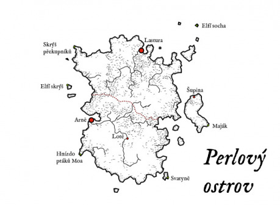

Jak se tento ostrov jmenoval v elfském jazyce, to už se nejspíš nikdo nikdy nedozví. Jisté je, že výpravy z lidských Království na jeho pobřeží objevily obrovská množství perlorodek, a proto o jeho současném názvu bylo rozhodnuto prakticky okamžitě.

Kolonizace ostrova probíhá už pár desítek let. V severní části se populace rozrostla natolik, až sběrači perel založili město Lastura, které dostalo oficiální královský status a je jednou z hlavních pokladnic říše. Na východním ostrově založili rybáři osadu s příznačným jménem Šupina. Jižní část ostrova (oddělena hranicí) zatím příliš osidlována není. Lidé se totiž bojí elfských kouzel a klamů, které tam elfové po sobě zanechali.

Ostrov je pokrytý především borovými lesy, které brázdí nespočet říček a tůněk. Tomu odpovídá i místní flóra a fauna, nicméně v jižní části lze najít i mnoho rostlin či zvířat magických a lze být i svědkem neobvyklých, spektakulárních jevů. (Většina z nich jsou rozesetá elfská kouzla.) Ostrov takřka po celý rok zahaluje mlha.

__Lastura__ – V největším městě Perlového ostrova žije několik stovek lidí. A všichni tu jsou z nějakého důvodu kvůli sbírání perel. Perlorodky a mořské ústřice na severním pobřeží plodí bílé perly, které jsou artiklem, díky kterému město neustále bohatne. Město je tedy velmi prosperující a (na poměry odlehlého ostrova) civilizované. Zákon tu vládne pevnou rukou (krást perly je zakázáno pod přísnými tresty) a na jeho dodržování dohlíží posádka královských gardistů. Lastura má i poměrně velký přístav, ze kterého míří do Království šalupa každý druhý týden. A i když se krást perly nesmí, tak se tu na soukromých lodích vyloďují dobrodruhové až příliš často. Gardistům většinou řeknou, že je perly nezajímají, a že jdou prozkoumat jižní část ostrova. (Což někdy je a někdy není pravda.)

__Šupina__ – Na východní části ostrova se velmi daří rybolovu. Proto tam poměrně přirozeně vyrostla rybářská osada, která v současné době čítá na pár desítek lidí. Rybáři ze Šupiny se také starají o maják.

__Maják__ – Vysoký bílý maják naviguje lodě z Království na ostrov. Ty na Perlový ostrov připlouvají právě z této strany a v mlhách by mohly připlout k ostrovu příliš blízko a mohly by uvíznout. Lodě se pak odchýlí severně, kde proplují kolem vysoké elfské sochy a pak přes Perlový záliv míří do Lastury.

__Obří elfská socha__ – Prostřední z ostrůvků na severovýchodě není nic jiného než obrovitá socha elfského válečníka. Podobně jako Pilíře prastarých, jde o důležitý orientační bod. Socha ztvárňuje elfského knížete Erunera – prastarého vládce tohoto ostrova. Jeho jméno, status a původ je možné rozšifrovat podle fresek v Arnë.

__Skrýš překupníků__ – V severozápadní části ostrova mají ve skalách skrýš překupníci perel. Ani posádka gardistů není schopna vymýtit všechny nekalé živly (obzvlášť, když několik z nich v tom jede s nimi). Na místě je k nalezení celý pytel perel.

__Arnë__ – Ruiny dávného elfského města. Za doby své slávy bylo Arnë velké – žila tu přibližně tisícovka elfů. Ti o perlách samozřejmě také věděli a sbírali je do svých překrásných klenotů. Nikdo neví, proč se elfové rozhodli souostroví opustit, ale stalo se. Kdysi krásné honosné třídy nyní prorůstají trávou, domy jsou pobořené, fresky vybledlé. Z města zůstaly jenom ruiny. Již mnoho hledačů pokladů tudy prošlo, a proto je tu také k nalezení poměrně málo. Elfové ukryli mnoho svých cenností na západním ostrůvku, a jestli něco zůstalo tady, tak to maskují elfská kouzla.

__Lótë__ – Na bystré říčce uprostřed borových lesů si elfové založili vesnici. Na tomto místě totiž i dnes rostou nádherné květy černého lotosu, který je nejenom známou magickou ingrediencí, ale i zdrojem duchovní a fyzické potravy. Z vesnice zůstalo pouze několik pobořených domů, ale lotosy rostou dál. Celé Lótë je ovšem skryto magickou iluzí, přes kterou je velmi těžké prohlédnout. I když elfí kouzla slábnou, je potřeba rozehnat všudypřítomnou mlhu a doufat ve štěstí. O černých lotosech se dobrodruhové mohou dozvědět z fresek v Arnë či z ukrytého elfího pokladu.

__Skrýš elfích pokladů__ – Předtím, než elfové ostrov opustili, schovali mnoho svých cenností do jeskyně na západním ostrůvku. Vchod do ní je skrytý iluzí pevné skály. Opět jenom rozehnání mlhy a patřičná dávka štěstí mohou vstup do skrýše vyjevit. Uvnitř se nachází truhly se šperky, perlami a zlatem, společně s několika knihami a květy černého lotosu. Možná si elfové mysleli, že se na ostrovy ještě někdy vrátí. A možná přijde čas, kdy se opravdu vrátí a budou svůj poklad hledat.

__Elfská svatyně__ – Na jihovýchodním ostrůvku jsou borovice vysoké a prastaré. V šumění moře a stromů se dobře rozjímá a elfové si tu postavili svatyni. Pietní místo označuje kruh menhirů a běda tomu, kdo by chtěl posvátné místo nějakým způsobem znesvětit.

__Hnízdo ptáků Moa__ – Jižní část ostrova obývají ptáci Moa. Jsou to nelétaví, pštrosům podobní ptáci s velmi ostrým, silným zobákem. Jsou velmi rychlí a na lidi útočí spíše ze zmatení, než kvůli potravě. Jejich počty rostou směrem k jihozápadnímu cípu ostrova, kde mají hnízdo.

## Možné zápletky

A jak do toho všeho zasadit právě tu vaši družinu? Inu, možná se doslechla o pobřeží plném perel, kterých si každý může nabrat plné kapsy. Nebo o pozůstatcích prastaré elfské civilizace a pokladech, které ukryla. Případně si družinu může někdo najmout na expedici za květy černého lotosu, které zde na ostrově rostou. Nebo může jít i o prostou práci vybíjení ptáků Moa, kteří znesnadňují průzkum ostrova směrem na jih. Možností je nespočet, tak se dobře bavte. :-)
