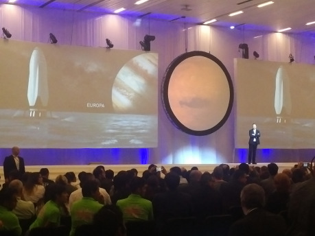
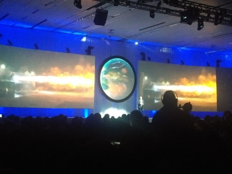
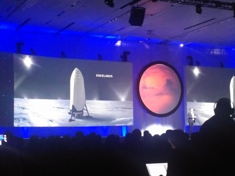
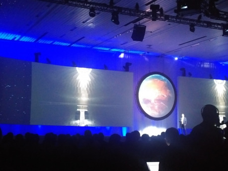
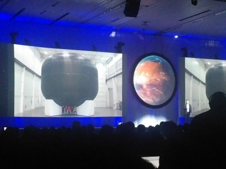

Na stránkách či plátnech science fiction jsme Mars navštívili nesčetněkrát, ať už ve starých pulpových příbězích od R. E. Burroughse, příbězích „kronikáře“ Raye Bradburyho, či v modernějších románech odrážejících nové vědecké poznání o Marsu, jako třeba marťanské trilogii Kima Stanleyho Robinsona či _Marťanovi_ Andyho Weira. Skutečnou pilotovanou výpravu jsme však ještě neuskutečnili a případná kolonizace Rudé planety je ještě mnohem dál … nebo ne?

## Megaloman, snílek, vizionář?

Mezinárodní astronautický kongres, Guadalajara, Mexiko; poledne místního času, hodina a půl před očekávanou přednáškou Elona Muska. Před největším kongresovým sálem už stojí fronta nedočkavců. Na žádnou jinou přednášku se nestála fronta, natož hodinu a půl předem. Musk je ale ve světě raketové techniky i mimo ni bez přehánění celebritou. Není příliš čemu se divit. Snem podnikatele, který pohádkově zbohatl prodejem svého PayPalu, odjakživa bylo vykročit ke hvězdám – alespoň maličko, v rámci naší soustavy. Roku 2002, téhož roku, kdy prodal PayPal, založil firmu SpaceX s cílem vybudovat komerční, opakovaně využitelné raketové nosiče. Do té doby byl jediným skutečně využívaným opakovaně použitelným nosičem americký raketoplán, a ani pro něj definice neplatila docela a každý let se prodražil. Scéna opakovaně využitelných nosičů (dále v krátkosti RLS neboli _reusable launch system_) byla teprve v plenkách, ač základní koncepty existovaly po desetiletí.

V roce 2004 se uskutečnil úspěšný let Space­ShipOne, ta je však schopna pouze sub­orbitálních letů; ani na nízkou oběžnou dráhu vám sama o sobě nic dopravit nepomůže. Na tuto scénu vstoupil SpaceX a už v roce 2008 jeho raketa Falcon 1 dosáhla oběžné dráhy. Pouhých deset let po svém založení se společnost začala účastnit zásobování Mezinárodní vesmírné stanice (ISS). Loni došlo k úspěšnému přistání prvního stupně rakety Falcon 9, přelomu v technologii RSL. Ačkoli na scéně jsou i další hráči, především firma Blue Origin jiného miliardáře a zakladatele Amazonu, Jeffa Bezose, SpaceX typicky budí nejvíce pozornosti. Není čemu se divit. Černý kůň v oblasti RSL se během pár let proměnil v jednoho z nejvýznamnějších hráčů a dnes není nepředstavitelné, že nás brzy dostane na Mars. Sám Musk je také zdrojem mediální senzace. Nadaný programátor-samouk v dětství, student fyziky a ekonomie, podnikatel, investor, propagátor kolonizace vesmíru a obnovitelných zdrojů, s nimiž ostatně souvisí i jeho společnost Tesla Motors vyrábějící elektromobily či SolarCity, zabývající se designem systémů na využití solární energie. Schopný inženýr, manažer i podnikatel s dalekosáhlou vizí … dalo by se pokračovat, ale asi už je zřejmé, proč ho média i fanoušci milují.

Historie SpaceX se však neobešla bez malérů. Pár nezdařených startů i nedávná nehoda na startovní plošině vrhají stín na reputaci firmy. Anebo ne? Musk zastává názor, že pokud se nesetkáváte se selháními, neinovujete dostatečně rychle. SpaceX ovšem plánoval už příští rok zahájit lety s lidskou posádkou, a obzvlášť po záříjové explozi na plošině na mysu Canaveral k tomu zřejmě nedojde. Navzdory tomu Musk na sklonku září představil světu svůj ambiciózní plán na kolonizaci Marsu, kterou by rád zahájil již v roce 2022. Vizionář? Megaloman? Nebo snad obojí? Podívejme se na jeho plány zblízka – ale ještě předtím si představme pár dřívějších konceptů osídlení Marsu …

## Na Mars od von Brauna po Muska

Pro některé z nejambicióznějších projektů na průzkum a osídlení Marsu se musíme vrátit o více než půl století. Původně německý, tehdy již americký konstruktér Wernher von Braun měl velkolepou vizi dobytí Marsu: _Das Mars­projekt_ z roku 1953 počítal s deseti loděmi na chemický pohon a posádkou sedmdesáti lidí! Jelikož šlo o dobu před vysláním meziplanetárních sond, netušil, že řídká atmosféra Marsu by neumožnila využití gliderů pro přistání a že lidé by potřebovali protiradiační ochranu. Také von Braunův spolupracovník Ernst Stuhlinger měl cílevědomý plán na vyslání lidí na Mars, který se i objevil v Disneyho naučném filmu _Mars & Beyond_ (1957). Popisoval flotilu šesti elektrických lodí beroucích energii z jaderného reaktoru. Kaž­dá by měla přídavnou raketu k přistání na Marsu a návratu na oběžnou dráhu k meziplanetárním lodím. Ambiciózní a také počítající s dnes zastaralými znalostmi o Marsu byl i projekt Philipa Bona na cestu pomocí raketoplánů. Dalších misí byla navržena celá řada, ale žádná z nich se ani nepřiblížila uskutečnění.

Dnes tu máme plány vesmírných agentur, které se také postupně vyvíjejí. S ruským MARS­POSTem dnes nikdo vážně nepočítá, evropský program Aurora pilotovanou misi příliš nespecifikuje, a tak zbývá NASA – a soukromí hráči. NASA by mohla využít spolupráci s firmou Lock­heed Martin, která svůj už dříve známý Mars Base Camp také podrobně představila na letošním Mezinárodním astronautickém kongresu. Projekt počítá s vysláním posádky na měsíce Marsu Phobos a Deimos, odkud by lidé ovládali roboty na povrchu Marsu. Absence přistání lidí na povrchu Marsu misi značně zjednodušuje, a pokud Lockheed Martin uspěje s testováním pohonných technologií pro svou meziplanetární loď, mohlo by jít o něco představitelného dejme tomu v příštích dvou dekádách. Pro NASA to ale není jediná možnost. Při využití své SLS (_Space Launch System_), těžkotonážní rakety, která by měla napřesrok projít testovacím startem, by mohla zřejmě během 30. let uskutečnit jinak koncipovanou misi; možná i s přistáním. Na současné plány se však nedá příliš spoléhat.

Zajímavě působí koncept Roberta Zubrina Mars Direct, formulovaný počátkem 90. let. Navrhuje nejprve na Mars vyslat bezpilotní modul, který by přistál a představoval zázemí pro pozdější posádku. Za využití marsovských zdrojů by produkoval methan a kyslík, a tak vytvořil část paliva pro zpáteční cestu. Teprve poté by byli vysláni i lidé, přičemž jejich obytný modul by rotoval okolo osy lodi a vytvářel tím umělou tíži. Misi by tak netrápily problémy asociované s dlouhodobou mikrogravitací. Od té doby vzniklo množství různých variant projektu a zdá se celkem rozumný, není ovšem jasné, jaká organizace by misi uskutečnila. Tedy … podívejme se už na Muskův koncept.

Elon Musk plánuje radikálně snížit náklady na cestu k Marsu, a to díky využití RLS, doplnění části paliva na orbitě a nakonec generování vhodného paliva přímo z místních zdrojů Marsu, a to methanu, přičemž jako oxidant by sloužil kyslík. Připomíná vám to něco? Ano, plán co do získávání paliva je stejný jako u Zubrina. To ale není nijak překvapivé. Sabatierova reakce, která z oxidu uhličitého a vodíku energeticky výhodně vytváří methan a vodu (kterou můžeme lehce rozložit na vodík a kyslík), není nic nového a využívá se například v recyklaci zdrojů na ISS. Muskův chystaný Meziplanetární dopravní systém (ITS, _Interplanetary Transport System_) ale překvapivý je. Jeho součástí je „BFR“ (_„Big Falcon Rocket“_, všeobecně překřtěná na _„Big Fucking Rocket“_), jejíž první stupeň by měl mít neuvěřitelných 42 motorů Raptor, které byly nedávno úspěšně testovány. Připomíná vám _tohle_ něco?

Pokud trochu znáte historii raketové techniky, možná si vzpomenete na sovětskou N1: Raketu, která měla být rivalem Američanů v závodu o Měsíc. Americký Saturn V však nepřekonala. Ani jediný ze čtyř pokusů o start nebyl úspěšný, jeden dokonce zničil značnou část kosmodromu. Jejích 30 motorů se zkrátka nepodařilo zvládnut. Někteří kritici srovnávají BFR vzhledem k počtu motorů právě s N1. Zásadním rozdílem je ale současná výpočetní technika, díky níž už ovládání mnoha motorů zároveň nepředstavuje tak významný problém. Musk pokládá počet motorů za výhodu – pokud některý selže, neznamená to nutně selhání celého systému, ostatní mohou jeho funkci snáz zastoupit. Kdyby selhal některý z pěti motorů Saturnu V při letu na Měsíc … řekněme, že moderní dějiny by se asi odvíjely jinak.

## Hlavní otázku možná známe, ale vyvstávají další

Čtyřicet dva motorů se nám jako fanouškům SF může líbit, možná už se konečně dostáváme k vytoužené hlavní otázce života, vesmíru a vůbec … Přejděme ale k dalším prvkům ITS. Velký tah rakety umožní zvolit přímější cestu k Marsu a zkrátí cestu na pouhých 80 až 150 dní podle startovního okna. Tradiční přístup by znamenal cestu trvající zhruba 180 i více dní. Kratší cesta snižuje riziko zdravotních problémů souvisejících s ozářením či mikrogravitací nebo konfliktů posádky potenciálně ohrožujících misi. Velký tah zároveň umožňuje s toutéž raketou vzlétnout ze Země, letět k Marsu, přistát tam a znovu odstartovat na cestu k Zemi. Většina jiných konceptů počítá se specializovanými přistávacími moduly, a tak tento přístup řadu lidí překvapil.

Možná ale není až tak zvláštní. SpaceX pracuje s tím, co umí, a nemusí vyvíjet další technologie de novo. „Předimenzovaná“ raketa navíc umožňuje právě již zmiňovaný kratší čas cesty a také je univerzálnější než speciální systém koncipovaný pro Mars. Musk doufá v uskutečnění prvního (bezpilotního) letu na Mars v roce 2022 a vyslání první lidské posádky dva roky nato. Jde o skutečně cílevědomý plán, obzvlášť vzhledem k tomu, že dosud neprošel testovacím startem ani dříve chystaný nosič Falcon Heavy. Ten měl původně odstartovat již předloni, nakonec by měl start proběhnout počátkem příštího roku. Podaří se tedy ještě výkonnější nosič (a další komponenty) postavit, otestovat a vyslat k Marsu během pouhých šesti let? A i kdyby nenastaly žádné technické potíže, kde na to SpaceX tak rychle vezme dost peněz? Náklady odhadované Muskem považuje většina expertů za silně podhodnocené.

Musk plánuje vyslat na Mars zhruba sto lidí v jedné misi, později i více, a postupně vybudovat stálou soběstačnou základnu. Cílem by bylo tisíc kolonistů do konce století. Tím však Musk nekončí. Díky generování paliva na místě, využití ITS a kapsle Red Dragon bychom se dle něj mohli po Marsu vydat i k měsícům Jupiteru a Saturnu a ještě dál. Šílené? Zatím ano; nedostatečná protiradiační ochrana, mnohaletý pobyt v mikrogravitaci i malé možnosti efektivního využití místních zdrojů vrhají stín na šance přežití posádky. Pro bezpilotní mise by to už tak nemyslitelné nebylo, ale o nich se Musk nezmiňoval.

## Raketa možná bude – ale co dál?

Na detaily mimo technické řešení rakety byl Musk obecně skoupý. Nedozvěděli jsme se nic o ochraně posádky proti radiaci, systémech podpory života, habitatech na povrchu Marsu, výběru posádky … Později se v diskusi s novináři Musk zmínil, že natočení motorové sekce směrem ke Slunci by mělo poskytovat dostačující ochranu před radiací při zvýšené sluneční aktivitě. U kosmického záření je ale situace jiná. Využije těžkou vodu, jak se dříve plánovalo? Nebude to představovat problém, co do hmotnosti? A co potom soběstačnost případné kolonie? V případě snahy o pěstování plodin v marsovské půdě bychom z ní museli odstranit látky jako těžké kovy či chlorečnany, které by pro nás byly škodlivé. Nebo vliv dlouhodobého pobytu lidí v nízké marsovské gravitaci? Data zatím schází …

Ostatně ani něco tak napohled snadného, jako již zmiňovaná výroba paliva, ve skutečnosti není jednoduchá z hlediska logistiky. Ač jde o snadnou chemickou reakci, potřebujeme energii k jejímu spuštění (řekl někdo doprava solárních panelů?), technické vybavení, někoho k jeho sestavení a údržbě … Mnozí (nabízelo by se říci zlí jazykové, ale nic zlého na jejich tvrzeních vlastně není) namítají, že Muskovy dalekosáhlé plány jsou především reklamním tahem pro SpaceX. Těžko říci; možná jsou zároveň tím i Muskovým hlubokým snem a přáním. Je tento sen ale reálný?

Jak to tedy dopadne: Podíváme se už v polovině příštího desetiletí na Mars? Netroufám si poskytnout jednoznačnou odpověď. Nepřipadá mi vůbec pravděpodobné, že by se Muskem nastíněný rozvrh dodržel, a pochybovala bych i o přistání lidské posádky na Marsu i ke konci 20. let, natož založení stálé základny v dané dekádě. Na opačné straně spektra se však nachází naděje a zvědavost. Nemyslím si, že se Muskův plán alespoň rámcově tak, jak byl představen, v příštích deseti či patnácti letech uskuteční – ale na druhou stranu v to trochu _doufám_.

Otázky financování i technické proveditelnosti kolonizace Marsu ve mně probouzí silného skeptika považujícího Muskův plán za příliš troufalý; hlediska přežití případných kolonistů a rizika zanesení pozemských mikroorganismů na Mars, což by snížilo naše šance na nalezení původního života nebo jeho pozůstatků, mě znepokojují; jako autorka science fiction a osoba všeobecně zvědavá ale plán nemohu jen tak zavrhnout. Ano, bude to po mnoha stránkách náročná snaha, ale jen si představte ten příběh: Dětský génius, miliardář, který se sám vypracoval na vrchol, a snílek v jedné osobě zatouží umožnit lidstvu osídlit Mars a založí první stálou kolonii mimo Zemi, přičemž předběhne tradiční korporace jako Lockheed Martin či Boeing i zdatnou konkurenci v podobě Blue Origin.

V Muskově osobě a jeho vizích se setkávají a prolínají science fiction s realitou. Možná i proto v lidech vzbuzuje takový ohlas, ať už pozitivní či negativní. Všichni tenhle příběh podvědomě známe. Začíná vždy podobně: velkými plány a sny … Bude ale končit utopií, dystopií nebo něčím mezi? Pokud kolonie vznikne, jak se bude vyvíjet? Dopsání příběhu už bude přímo na nás. Zatím můžeme s napětím sledovat, jestli se vůbec přehoupne přes expozici.
