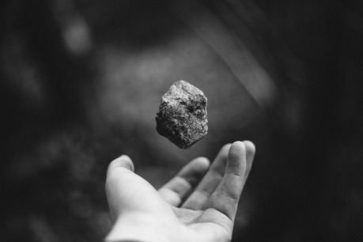

Mé zmatené a nevěřící mysli se pomalu se vnucovala strašná jistota.

Ztratil jsem se, beznadějně a dokonale jsem se ztratil v ohromném labyrintu Mamutí jeskyně. Ať jsem se obrátil kamkoli, v každém směru jsem marně hledal jakýkoli ukazatel k cestě ven. Nemohl jsem doufat, že ještě někdy uvidím požehnané světlo dne, nebo že budu pohlížet na milé kopce a údolí krásného venkovního světa. Naděje mě opustila. Ale byl jsem natolik vyučen životem, věnovaným filosofickým studiím, že mě nemálo těšil můj nevzrušený postoj. Ačkoli jsem často četl o divokých záchvatech, do nichž upadaly oběti v podobné situaci, nic z toho jsem nepociťoval, nýbrž jsem jen tiše stanul, když jsem si jasně uvědomil, že jsem ztratil směr.

Ani myšlenka, že jsem asi zašel za nejvzdálenější hranice obvyklých výzkumů mě nepřiměla ztratit na okamžik klid. Jestliže musím zemřít, uvažoval jsem, byla tato hrozná, ale majestátní jeskyně stejně vítaným náhrobkem, jakým by byl kterýkoli hřbitov. To pomyšlení mě spíše uklidňovalo, než aby mě uvedlo v zoufalství.

Byl jsem si jist, že mým osudem bude smrt hladem. Někteří lidé se za takových okolností zbláznili, to jsem věděl, ale cítil jsem, že takový osud mě nečeká. Za své neštěstí jsem mohl pouze já sám; protože bez vědomí průvodce jsem se odpojil od obvyklé společnosti návštěvníků; a jak jsem se tak přes hodinu toulal zakázanými chodbami jeskyně, už jsem nedokázal znovu najít ty točité chodby, kterými jsem chodil, když jsem opustil své společníky.

Pochodeň mi už začala dohořívat; za chvíli mě pohltí úplná a téměř hmatatelná tma v nitru země. Jak jsem stál v blikajícím, nejistém světle, bezmyšlenkovitě jsem dumal o tom, jak přesně dojde k mému nadcházejícímu konci. Vzpomněl jsem si, že jsem slyšel o kolonii souchotinářů, kteří hledali uzdravení v udánlivě zdravém vzduchu v podzemí, kde je stejnoměrná neměnná teplota, čistý vzduch a mírumilovné ticho. Usídlili se v této obrovské jeskyni a místo uzdravení tu našli podivnou a strašlivou smrt. Viděl jsem smutné pozůstatky jejich neohrabaných chatrčí, když jsme se skupinou šli kolem, a tehdy jsem se divil, jaký nepřirozený vliv by mohl mít dlouhodobý pobyt v této nesmírné tiché prostoře na zdravého silného jedince jako jsem já. Nyní přišla chvíle si to ověřit, řekl jsem si chmurně, nezahubí-li mě rychleji nedostatek jídla.

Poslední záblesky mé pochodně blikaly v temnotě a já se rozhodl neponechat nic náhodě a zkusit všechny prostředky záchrany. Takže jsem nabral do plic co nejvíce vzduchu a zkusil hlasitě volat, v marné snaze přivolat pozornost průvodce. Ale při tom volání jsem tušil v srdci, že je to marné a že můj hlas, zveličený ozvěnou o nekonečné zdi černého labyrintu kolem, neslyší nikdo, než já sám.

Najednou však jsem se lekl, protože se mi zdálo, že jsem zaslechl zvuk tichých kroků přicházejících po kamenné podlaze jeskyně. Že by záchrana přicházela tak brzo? Byly tedy všechny mé obavy a strachy zbytečné a průvodce si všiml mé nepřítomnosti, takže mě šel hledat v tom vápencovém bludišti? Zatímco tyto potěšující otázky vyvstávaly v mé hlavě, takže jsem skoro chtěl začít znovu křičet, abych byl objeven tím rychleji, najednou se při poslechu moje radost změnila v hrůzu; protože můj sluch, vždycky dobrý a nyní zostřený dokonalým tichem v jeskyni, přinesl mým zmámeným smyslům nečekané a hrozné přesvědčení, že tyto kroky nejsou kroky jakéhokoli smrtelníka. V nezemském tichu podzemí by kroky obutého průvodce zněly jako zřetelné dupání. Ale toto znělo jako měkké plíživé kroky pracek nějaké kočky. Ostatně chvílemi, když jsem dával pozor, slyšel jsem kroky čtyř, ne dvou nohou.

Nyní jsem pochopil, že jsem svými výkřiky vzbudil a přivolal nějaké divoké zvíře, možná horského lva, který náhodou do jeskyně zabloudil. Možná že pro mě Všemohoucí vybral rychlejší a milosrdnější konec, než smrt hladem. Přesto instinkt sebeobrany, nikdy úplně uspaný, se v mém nitru znovu pohnul, a třebaže únik před přicházejícím nebezpečím mě mohl ušetřit jen pro horší a pomalejší konec, přece jsem se rozhodl rozloučit se s životem za co nejvyšší cenu. Může se to zdát zvláštní, ale nečekal jsem od toho návštěvníka nic dobrého. Zůstal jsem proto naprosto zticha, doufaje, že neznámé zvíře, když mě nebude slyšet, ztratí směr zrovna jako já a tak mě mine. Ale tahle naděje se nesplnila, protože cizí kroky se pořád přibližovaly. Zvíře mě asi vyčenichalo v atmosféře jeskyně, prosté jakéhokoli jiného vlivu, na velkou dálku.

Když jsem viděl, že se musím ozbrojit na obranu proti strašidelnému a neviděnému útoku, začal jsem hledat v temnotě největší z úlomků skály, roztroušených na podlaze jeskyně všude okolo, popadl jsem do každé ruky jeden a čekal rezignovaně, co bude dál.

Mezitím se ošklivý zvuk plížících se pracek přiblížil. Chování zvířete bylo opravdu podivné. Většinou kráčelo jako čtvernožec, který ale špatně slaďuje přední a zadní nohy, chvílemi ale jako by se pohybovalo po dvou. Přemýšlel jsem, co je to za zvíře, co na mě zaútočí. Musí to asi být nějaký nešťastný tvor, jenž zaplatil za svou zvědavost, když chtěl prozkoumat jeden z vchodů do té strašné jeskyně, tím, že tam navěky uvázl v jejích nekonečných chodbách. Živil se jistě bezokými rybami, netopýry a jeskynními krysami, stejně jako obyčejnými rybami, které pronikly různými přítoky Zelené řeky, spojené tajemně s vodami v jeskyni. Zaměstnával jsem se v tom hrozném čekání groteskními představami, jaké změny mohl jeskynní život přinést ve fyzickém vzhledu toho zvířete, přičemž jsem si vzpomínal na to, jak strašně podle místních pověstí vypadali ti souchotináři, kteří zemřeli po dlouhém pobytu v jeskyni. Najednou jsem se ulekl, když jsem si uvědomil, že i kdybych dokázal útočníka zabít, nikdy ho neuvidím, protože pochodeň mi dávno zhasla a žádné zápalky jsem neměl.

Pociťoval jsem hrozné napětí. Zmatená fantazie mi z obklopující mě temnoty kouzlila ošklivé a strašidelné tvary, jež jako by na mě dorážely. Víc a více blížily se ty hnusné kroky. Cítil jsem nutkání pronikavě vykřiknout, ale i kdybych se k tomu odhodlal, stejně bych nevydal hlásku. Byl jsem zkamenělý, přikovaný na místo. Pochyboval jsem, zda mě pravice bude poslouchat, až v rozhodujícím okamžiku budu muset hodit kámen na toho tvora. Nyní byly kroky velmi blízko, téměř u mě. Slyšel jsem namáhavý dech zvířete, a i v mém zděšení jsem si uvědomil, že přichází z velké dálky a že je asi unaveno. Najednou se kouzlo zlomilo. Pravice vedená mým dobrým sluchem vrhla plnou silou ostrý kámen do místa, odkud jsem slyšel oddechování a kročeje, a chválabohu trefila skoro cíl, protože jsem uslyšel, jak zvíře poskočilo kousek dozadu, kde se zřejmě zastavilo.

Zpřesnil jsem svůj cíl a hodil svůj druhý kámen, tentokrát velmi úspěšně, protože jsem s radostí slyšel, jak se tvor zhroutil zřejmě definitivně a zůstal ležet. Úleva mě přemohla a skácel jsem se na zeď. Bylo pořád slyšet těžké dýchání, vdechy a výdechy, a já pochopil, že jsem zvíře jenom zranil.

Ztratil jsem úplně chuť toho tvora prozkoumat. Do mozku mi vstoupil bezúčelný pověrečný strach a já se ke zvířeti ani nepřiblížil, ani jsem na něj už neházel kameny, abych je dodělal. Místo toho jsem se rozběhl plnou rychlostí obráceným směrem, kudy jsem přišel, aspoň jak jsem mohl posoudit ve svém zdivočelém stavu.

Pojednou jsem uslyšel zvuk, nebo spíše pravidelnou řadu zvuků. V dalším okamžiku to bylo ostré kovové klepání. Teď už nebylo pochyby. Byl to průvodce. A já začal křičet, řvát, ječet, dokonce výskat radostí, protože jsem v těch chodbách postřehl slabé blikotání, které jistě bylo odraženým světlem přibližující se pochodně. Běžel jsem mu naproti, a než jsem pořádně pochopil, co se stalo, už jsem ležel průvodci u nohou, líbal mu boty a přes mé předešlé vychloubání jsem nesmyslně blekotal a vykládal svůj hrozný příběh a současně zahrnoval posluchače projevy vděčnosti. Nakonec jsem se jakžtakž vzpamatoval. Průvodce si všiml mé nepřítomnosti, když přišli návštěvníci ke vchodu do jeskyně, a podle vlastního intuitivního orientačního smyslu prošel postupně všechny vedlejší chodby kolem místa, kde se mnou naposled mluvil, a asi po čtyřech hodinách mě našel.

Zatímco mi toto vyprávěl, osmělil jsem se ve světle jeho pochodně a v jeho společnosti natolik, že jsem pomyslel na to zvíře, jež jsem zranil docela nedaleko v temnotě, a navrhl jsem, abychom při svíčce zjistili, co ta moje oběť byla zač.

Navrátil jsem se tedy s odvahou nabytou tím, že mám společníka, na scénu mého strašného zážitku. Brzy jsme spatřili na podlaze bílý předmět, bělejší ještě než svítivý vápenec. Opatrně jsme se přiblížili a společně jsme vykřikli údivem, protože ze všech podivných zjevů, jaké každý z nás kdy spatřil, tenhle byl zdaleka nejpodivnější. Vypadalo to jako velký lidoop, jenž snad utekl z nějakého potulného zvěřince. Srst měl sněhobílou, vybělenou zřejmě účinkem dlouhodobého pobytu v temných prostorách jeskyně, ale překvapivě tenkou, vlastně ji měl jen na hlavě, ale tam byla velmi dlouhá a hustá, že mu spadala až na ramena. Tvář byla odvrácená, protože zvíře leželo skoro hlavou dolů. Položení údů bylo také divné, což ale vysvětlovalo jejich střídavé užívání, kterého jsem si všiml, když zvíře někdy postupovalo po čtyřech, jindy jen po dvou. Z konců prstů na rukou a na nohou vyrůstaly nehtovité drápy. Ruce ani nohy nebyly chápavé, což jsem přičítal dlouhému pobytu v jeskyni, jak bylo vidět i z nezemské bělosti celého těla. Neviděl jsem žádný ocas.

Jeho dech velmi zeslábl a průvodce vytáhl pistoli se zjevným úmyslem ukončit jeho život, když tu zvíře vydalo jakýsi zvuk a pistole klesla nepoužita. Ten zvuk bylo těžko popsat. Neznělo to jako normální opičí skřeky, a já se domýšlel, jestli ty podivné zvuky neměly původ v tom dlouhodobém úplném tichu, do něhož nyní zazářilo světlo, jaké zvíře nevidělo od svého prvního příchodu do jeskyně. Ten zvuk, který bych se pokusil popsat jako hluboké mumlání, slabě pokračoval. Najednou zvířetem proběhl přelétavý záchvěv energie. Pracky se zachvěly a údy sebou křečovitě škubly. S trhnutím se bílé tělo obrátilo tak, že k nám leželo čelem. Na okamžik mě omráčila hrůza z pohledu na ty oči, takže jsem si nevšímal ničeho jiného. Byly smolně černé ty oči, tak černé, že to ošklivě kontrastovalo s bělostí vlasů a kůže. Byly to zapadlé oči jeskynního obyvatele, úplně bez duhovky. Když jsem přihlédl blíže, viděl jsem, že ta tvář nemá tak vystouplou čelist jako jiné opice a je mnohem vlasatější. Nos vystupoval docela zřetelně.

Co jsme tak zírali na ten podivný zjev, tlusté rty se otevřely a vyšlo z nich několik zvuků, načež se tvor uvolnil ve smrti.

Průvodce mě popadl za rukáv a třásl se tak, že se chvělo i světlo a házelo na okolní zdi třaslavé pablesky.

Nehýbal jsem se, stál jsem ztuhle a zíral na podlahu před sebou.

Tu mě opustil strach a místo něho nastoupil údiv, úcta, soucit a pohnutí, protože zvuky, které pronesla ta postava ležící na zemi, nám prozradily strašnou pravdu. Ten tvor, kterého jsem zabil, to divné zvíře v neznámé jeskyni byl, nebo kdysi býval, _člověk!_
