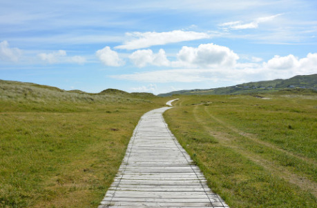
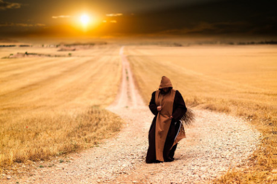
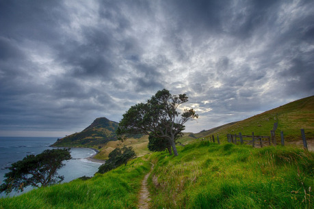

Na rychlosti cestování se ve velké míře kromě zvoleného dopravního prostředku a počasí podílí především terén a kvalita cesty. Než proto postoupím k výpočtu samotnému, nejprve je potřeba se podívat, jaké druhy komunikací ve středověku vůbec existovaly a mohou tedy hrát roli.

## Komunikační sítě ve středověku

Základními kameny středověké dopravní sítě byly dva typy komunikací – __stezky__ a __cesty__. Často se tyto dva termíny používají jako synonyma a zaměňují se, ale je mezi nimi významový rozdíl:

__Stezka__, něm. _der Steig_; angl. _path_ (stezka pro pěší), případně _trail_ (stezka v divočině – zvířecí nebo lovecká).

Stezky jsou nezpevněné a často neudržované komunikace a vyšlapané pěšiny. Zpravidla nebyly vhodné pro těžké vozy a užívaly se jen občasně. Sloužily především pro komunikaci mezi menšími a odlehlejšími sídly (často v horských oblastech) a místní obchod, kdy se zboží přesouvalo za pomoci lidské síly, případně na soumarech. Dnešními slovy řečeno fungovaly jako tzv. _komunikace nižšího řádu_.

__Cesta__, něm. _der Weg_, případně _die Straße_ (v případě zaniklé cesty _die Altsraße_); angl. _way_, popřípadě _route_.

V rámci středověku se cesta vyprofilovala jako stezka, která se začala trvale používat, byla do jisté míry upravována a také opravována. Se svým rozvojem města přestala být soběstačná a musela být zásobována (zejména potravinami), proto se začaly používat těžké vozy, které byly schopny tuto poptávku pokrýt. Ty právě využívaly systému cest, protože stezkami často nemohly projet. Kola těžkých vozů zejména po deštích vyrývala v cestách koleje (tzv. _glajzny_ z německého _das Gleis_), které mohly cesty znehodnotit, pokud nebyly opravovány. V některých oblastech tak vznikaly paralelní cesty, které vedly v těsné blízkosti původní cesty, a podle stavu obou se užívala ta, která byla zrovna sjízdná. Opět řečeno dnešními slovy byly cesty tzv. _komunikace vyššího řádu_.

Cesty byly na důležitých úsecích zpevněné kamenným podkladem nebo oblázkovým či štěrkovým posypem. V lesích se klestily průseky (často jen úzké na šířku jednoho vozu, protože udržování průseků bylo náročné a nákladné), na vlhčích místech cesty se pokládaly tzv. _hatě_ tvořené svázanými otepmi klestí, vázanými slámovými otepmi (kterým se říkalo _fašiny_) nebo se pokládaly hrubě otesané nebo neotesané trámy. Mýcení nových úseků cest a udržování stávajících úseků bylo finančně náročné, proto se vybírala mýta za přechod a užívání cest, případně za využití nějakého náročného prvku cesty (mostné za užití mostu, přívozné za užití přívozu, mýto za užívání hatí a podobně).

__Zemská stezka/zemská cesta__

Jako „zemské“ byly označovány komunikace dálkové, spojující různé země. Skrze zemské brány směřovaly k hlavním obchodním a správním centrům země. Zpočátku (pravěk až raný středověk) byly takovými trasami nezpevněné stezky, později s rozvojem vozové dopravy se tyto stezky postupně proměňovaly na zpevněné cesty. Především v horských oblastech ale části zemských cest zůstávaly ještě dlouho nezpevněné (na úrovni stezky).

__Zemská brána__

Zemské brány byly místa, kudy se dalo vstoupit do země a které zároveň sloužily jako oficiální hraniční přechody. Protože velkou část země obklopovaly hory a neprostupné hvozdy, byly zemské brány jediná místa, kde byl průjezd udržován a kudy se fyzicky dalo projet. Využívali je proto jak kupci, tak vojska pro průchod. Byly zpravidla střežené pomezními hrady nebo strážnicemi a byly zde zřizovány knížecí nebo královské celnice, které vybíraly poplatky za vstup do země. V blízkosti zemských bran vznikaly také tzv. boční stezky, které se nehodily pro vozovou dopravu a zpravidla sloužily pro pašování, aby se kupci vyhnuli nutnosti platit clo (nebo pro nečekaný přesun vojska, pokud toto mělo zkušené místního průvodce).

__Doprava po řekách__

Doprava po řekách byla dlouho nejrychlejším a nejspolehlivějším způsobem, jak přepravovat zboží na delší vzdálenosti. Pro obchod se většinou užívaly jen větší, dobře splavné řeky, na kterých se pohybují větší říční bárky. Menší řeky se užívaly spíše pro místní obchod a přepravu a loďky na nich byly mnohem menší, aby propluly mnohými mělčími místy. Říční bárky využívaly ke svému pohybu také z velké části plachty a vítr, ale často musely pro nepřízeň větru sáhnout ke skasání plachet a spoléhat se na vesla, odrážení se bidly nebo vlečení lodi ze břehu (ať už lidskou, koňskou nebo volskou silou). Říční lodě na rozdíl od námořních mohou zastavit na noc, a zpravidla také pluly jen za denního světla. Plavba bez přestávky by vyžadovala dvojnásobný počet námořníků (aby se denní a noční směny mohly vystřídat) a byla často nebezpečná, protože za tmy se v říčních korytech obtížně navigovalo a bárka mohla skončit na mělčině, případně vplout do jezu nebo vodopádu.

## Rychlost cestování

A teď už ke slíbenému výpočtu – rychlost denního postupu je do velké míry závislá nejen na zvoleném způsobu cestování, ale především členitosti terénu, stavu cest, počasí a dalších faktorech, které cestování ovlivňují. Na základě toho se ideální hodnoty základu rychlosti (uvedené v kroku 1) musí opravit dle níže uvedených faktorů (kroky 2–4).

### Cestování po zemi

Krok 1: Základ rychlosti

Na základě zvoleného způsobu cestování se vytvoří základ pro výslednou rychlost cestování (ta se pak pozmění o opravy, viz níže).

- pěší cestovatel – __30 km/den__
- volský povoz (volkové si musí v poledne odpočinout a pořádně se napojit, nemohou tak jít celý den) – __20 km/den__
- jezdec na koni – __50 km/den__
- kurýr (který jel ve dni v noci s výměnou koní) – __100 km/den__
- říční loď po proudu – __65 km/den__ (asi 6,5 km/h)
- říční loď proti proudu – __15 km/den__

Rychlost skupiny se samozřejmě počítá podle jejího nejpomalejšího člena. Pokud je kupříkladu kůň jednoho z jezdců přetížen (viz níže), ostatní musí zpomalit, aby mu neujeli. Výsledná rychlost skupiny tak bude dána rychlostí přetíženého jezdce. Stejně tak celková rychlost vojska na pochodu je určena nejpomalejší součástí – tedy vozovým trénem (těžké vozy se zásobami).

Krok 2: Oprava za terén

K výpočtu se jeden ze stavů připočítá vždy.

- dobrý terén (dobrá cesta; v případě řeky široké, dobře splavné úseky) – __rychlost cestování__ __×__ __1__
- špatný terén (neudržované cesty, stezka; v případě řeky nepřehledné, úzké úseky) – __rychlost cestování__ __×__ __0,75__
- velmi špatný terén (horský terén, rozmočené, nebo zasněžené stezky a cesty; v případě řeky nepřehledné nebo mělké úseky, kde se loď musí přenášet, případně vléct ze břehu) – __rychlost cestování__ __×__ __0,5__

Krok 3: Oprava za počasí

K výpočtu se jeden ze stavů připočítá vždy.

- dobré počasí – __rychlost cestování__ __×__ __1__
- špatné počasí (déšť, mrholení, silný vítr) – __rychlost cestování__ __×__ __0,75__
- velmi špatné počasí (mlha, husté sněžení, vichřice) – __rychlost cestování__ __×__ __0,5__

Krok 4: Dodatečné opravy

Na rozdíl od dvou předchozích oprav se tyto k výpočtu přidají, pouze pokud se jejich obsah projeví.

- terén – překročení brodu nebo menší říčky (je k němu potřeba alespoň půlhodina času) – __odpočítejte__ od výsledné rychlosti __několik kilometrů__ kvůli zdržení
- počasí – cestování v zimě (v případě lodí se započítává, pokud je řeka splavná; pokud je hladina pokrytá ledem, není možné cestovat lodí vůbec) – __rychlost cestování__ __×__ __0,75__
- náklad – těžký náklad (kůň nese kromě jezdce i rytířské brnění, pytle se zlatem a podobně) – __rychlost cestování__ __×__ __0,75__
- spěch – velký spěch – v případě, že postavy spěchají a rozhodnou se nedělat zastávky, štvát koně bez ohledu na vyčerpání a pokračovat i po setmění, mohou si opravit __rychlost cestování__ __×__ __1,5__. Takové tempo ale nelze udržet víc než jen několik dní, jinak postavy zchvátí koně, případně prostě padnou vyčerpáním.

### Příklady:

- Jezdec na koni po dobré cestě za dobrého počasí tak urazí až __50 kilometrů za den__ (50 × 1 × 1 = 50).
- Pokud se zhorší počasí a začne pršet, pak se tato vzdálenost na dobré cestě sníží na nějakých __38 kilometrů za den__ (50 × 1 × 0,75 = 37,5).
- Na stezce a v dešti ujede jezdec __28 kilometrů za den__ (50 × 0,75 × 0,75 = 28,1).
- Pokud by jezdec cestoval v zimě a začalo hustě sněžit, pak na zasněžených cestách urazí jen __9 kilometrů za den__ (50 × 0,5 × 0,5 × 0,75 = 9,4). Pěší cestovatel by v takovém zimním nečase urazil jen __6 kilometrů za den__ (30 × 0,5 × 0,5 × 0,75 = 5,6). Je otázka, zda v takové vzdálenosti naleznou nějaký úkryt, kde by mohli přečkat noc, nebo se vyplatí počkat, až přestane sněžit a pak ztrátu dohnat … případně riskovat přenocování v zimě a mrazu venku.
- Pokud by se jezdec z předchozího příkladu rozhodl štvát svého koně bez ohledu na únavu, mohl by urazit až __14 kilometrů za den__ (50 × 0,5 × 0,5 × 0,75 × 1,5 = 14). Je ale otázka, jak dlouho nebohé zvíře takové tempo vydrží, než dodělá v nějaké závěji.

### Příliš složité?

Při snaze získat uvěřitelné výsledky je potřeba započítat poměrně hodně faktorů – výsledkem tak je poměrně složitý vzorec, který je pro hraní nepraktický. Pokud nestojíte o počítání a zajímají vás jen cestovní rychlosti ve středověku, lze použít níže uvedené údaje, které budete opravovat podle citu a okolností.

- __pěší cestovatel__ – 20–30 km/den
- __volský povoz__ – 15–20 km/den
- __jezdec na koni__ - 30–50 km/den
- __kurýr__ – 80–100 km/den
- __plavba na řece – po proudu__ – 50–65 km/den
- __plavba na řece – proti proudu__ – 10–15 km/den

## Závěr

Rychlosti cestování se i v rámci středověku dost měnily. Docházelo k postupnému zvyšování rychlostí způsobenému řadou příčin – mezi nimi šlechtěním rychlejších koní, zlepšováním stavu cest, zřizováním přepřahacích stanic, budováním mostů a lepším zásobením lidí a zvířat po cestě. Čísla jsou tak spíš orientační a odpovídají více ranému a vrcholnému středověku než středověku pozdnímu.

Rozhodně by bylo možno debatovat, proč jsou některá čísla taková, jaká jsou a proč nejsou jiná (a v některých případech by určitě námitky byly oprávněné). Jak bylo zmíněno na začátku, tento hrubý výpočet může sloužit jako podklad pro přípravu Vypravěče … především proto, aby se takové debaty nemusely řešit při hraní. Výpočet by měl dát Vypravěči do ruky nějaký nástroj, kterým lze při cestování udržet nějakou udržitelnou strukturu a alespoň trochu uvěřitelné výsledky.
