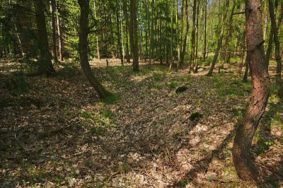
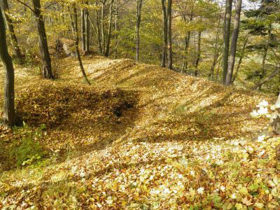
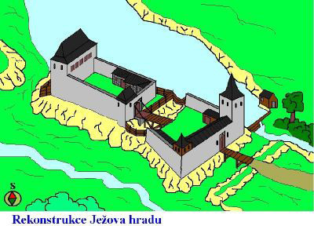

## Úvod

Kolegové, nyní vás čeká něco málo známého a pro většinu z vás nedostupného. Postupně zpracuji tři práce různého rozsahu o třech hradech, které se ukrývají v lesích vojenského újezdu Březina. Nedostupné proto, že mimo tento první, který bude tématem této první práce, tedy hrad Vícov, který je z újezdu lokálně vyjmut a je přístupný, pokud víte, kde jej najít, jsou ty dva druhé v prostorech, kam bez povolení není možný přístup bez možného vážného konfliktu s vojenskou a následně běžnou státní policií.

Já díky svému kamarádovi Čmeldovi, jeho celé jméno neprozradím, který měl dlouhé roky do tohoto prostoru povolen vstup a podařilo se mu mě i moji paní do své propustky doplnit, oba ty nedostupné hrady navštívil.

Tato práce bude o kulturní památce s názvem hrad Vícov, někdy známé jako Ježův hrad.

Druhá práce bude o Smilově hradu, což je velmi zajímavý hrad a k tomu i zajímavé místo.

Třetí potom o hradu zvaném Starý Plumlov. Ten je nejenom zajímavý, ale je to také zajímavé i kouzelné místo. Někdy se tam vrátím.

Každé toto místo je působivé jak z pohledu výběru pro vybudování fortifikace, jak dnes z pohledu zapomnění, tak i z vědomí, že poslední výzkumy se zde mohly provést těsně před tím, než tento prostor v roce 1936 zabrala armáda a už jej nikdy neopustila.

Snad tyto práce pro vás budou zajímavé a něco nového se dovíte.

## Vojenský újezd Březina

Vojenský újezd Březina, dříve se nazýval vojenský výcvikový prostor Dědice, je vojenský újezd na severu okresu Vyškov v lesnatém území Drahanské vrchoviny. Území újezdu zahrnuje mimo jiné 158,2 km² lesů. Újezd byl vytvořen vládou Československé republiky dne 17. dubna 1951 s platností od 1. května 1951 na základě zákona č. 169/1949 Sb., o vojenských újezdech, na území dosavadního vojenského tábora Dědice zřízeného vládou ČSR v roce 1936.

Na rozdíl od případů jiných vojenských újezdů nebyla při jeho zřízení vysídlena žádná obec. Újezdní úřad vojenského újezdu sídlí ve Vyškově a vykonává mimo jiné také funkci stavebního dozoru a matriky. Téměř celé území vojenského újezdu je zalesněno. Nezalesněné a odlesněné plochy tvoří především různé vojenské areály. Na území vojenského újezdu se nachází i Myslejovická nádrž, viz obrázky →

Počátkem 30. let došlo v Německu nástupem Adolfa Hitlera k moci k zásadní změně bezpečnostní situace naší země. Pro vybudování silné a dobře vycvičené armády bylo přijato mnoho opatření a jedno z nich datované dnem 7. února 1936 rozhodlo o vybudování vojenského tábora v jižní části komplexu Drahanské vrchoviny, které byly majetkem olomouckého arcibiskupství. Lesy byly postupně státem vyvlastněny a již k 1. listopadu 1935 bylo zřízeno Velitelství výcvikového tábora v Dědicích u Vyškova, o rok později přišla první osádka. Při intenzivních pracích došlo k vybudování dělostřelecké, pěchotní a letecké střelnice. V kasárnách byl umístěn pluk útočné vozby, vyzbrojený tanky LT-35 a obrněnými vozidly, a ve Vyškově bylo zřízeno Učiliště útočné vazby. V prostoru byly od roku 1937 stavěny cvičné železobetonové objekty pro výcvik osádek československého pohraničního opevnění, v tomtéž roce bylo zřízeno vyškovské vojenské letiště, dnes se nachází jako letiště aeroklubu hned vedle dálnice z Brna do Olomouce a je na něm i letecké muzeum.

Malý příklad prvorepublikových aktivit:

Zde je cvičný bunkr S1 u žárovic. Původně zde stály dva. Byly to S1 a S2, což byly betonové, k sobě zrcadlově otočené stejné stavby s jednou střeleckou místností. V této místnosti byly střílny pro zbraně: kanón ráže 40 mm, těžké kulometné dvojče a těžký kulomet. V betonovém zvonu byla střílna pro střelbu z lehkého a těžkého kulometu.

Mezi bunkry byl umístěn objekt pro řízení palby, později byl zničen a nahrazen objektem se segmentovou chodbičkou, který byl společně s poničeným bunkrem S2 v roce 2007 asanován. Mezi bunkry jsou také zbytky stavby – zvýšený betonový základ s pěti schody, která snad byla chatou sloužící k ubytování vojáků.

Přibližně 50 m od místa bunkrů se nachází objekt Skluz, který sloužil k nácviku používání granátového skluzu v objektech lehkého a těžkého opevnění.

Poblíž bunkrů byla také vybudovaná vybetonovaná snížená plocha, která sloužila jako cvičný okop při výcviku s obrněnou technikou.

Po vzniku Protektorátu Čechy a Morava a obsazení státu nacistickým Německem byl 26. března 1939 vojenský prostor převzat Němci a přejmenován na Truppenübungsplatz Wi­schau. V kasárnách na Kozí horce byla umístěna Německá praporčická škola tankových vojsk. V roce 1940 vydal říšský protektor Konstantin von Neurath výnos o vystěhování 33 obcí Drahanské vrchoviny. Účelem toho bylo jednak dočasně rozšířit vojenskou střelnici, ale hlavně vytvořit německý koridor, který měl propojit německé národnostní ostrůvky na Litovelsku a Olomoucku přes německý ostrůvek u Vyškova s německými obcemi na Brněnsku.

Nejzajímavějším objektem po německých ozbrojených silách je zcela jistě památník o němž nemohu napsat nic než ocitovat:

> Roku 1942 chystali Němci novou velkou ofenzívu, jejímž cílem bylo ovládnutí Kavkazu a jeho ropných polí a zasazení drtivého úderu Sovětskému svazu. Jak se traduje, probíhal výcvik německých vojáků určených pro boje na východní frontě právě v tomto prostoru, který byl v době okupace navíc rozšířen o území 33 vysídlených obcí a mohl tedy pojmout značné množství cvičících jednotek před tím, než byly vyslány vstříc válečné mašinérii na východě. Němci tehdy ještě věřili, že můžou válku vyhrát a po stránce materiálních a lidských rezerv pro to měli stále předpoklady.
>
> Pro zdůraznění vojenské převahy a pro zvěčnění dosažených vojenských úspěchů bylo započato se stavbou monumentálního památníku, jenž měl oslavovat německé vítězství ve druhé světové válce a německou nadvládu nad Evropou. Pro jeho umístění byla vybrána kóta Dlouhá seč, která se tehdy nacházela v jihozápadním cípu střelnice č. 5 Buchtelka, nedaleko křižovatky Hanácké cesty se silničkou zvanou Eichlerka, která zde odbočuje do Napajedelského žlíbku. Kopec byl přejmenován na Viktoria Höhe (Výšina vítězství), z čehož později vznikl i český ekvivalent Vítězná. Na stavbu památníku byli údajně nasazeni nejen ruští zajatci, ale pracovali na něm prý i obyvatelé okolních obcí. Stavbu se podařilo dokončit pravděpodobně na přelomu let 1942 a 1943. Podle některých zdrojů vedl k situování objektu do těchto míst i fakt, že okolní reliéf připo­mínal terén v blízkosti Stalingradu. Ne­jasná zůstává osobní zainteresovanost ge­nerála Pauluse ve stavbě monumentu. Rov­něž přítomnost osoby samotného Adolfa Hitlera, který měl údajně navštívit TÜP Wischau při inspekci svých vojsk pro východní nasazení, patří spíše do říše pohádek.
>
> Je však známo, že po dokončení bylo u objektu slavnostně zahajováno a zakončováno každé větší cvičení, což mělo zdůrazňovat válečnou převahu Německa a u vojáků cvičících jednotek upevnit víru v konečné vítězství. Historie tomu však chtěla jinak a svou předčasnou realizací si Viktoria předurčila svůj neblahý osud.

Za dobu druhé světové války zde bylo vybudováno mnoho objektů pro vysoce kvalitní výcvik tankových posádek, dělostřeleckých obsluh a pěchoty. Vystěhované vesnice byly poškozeny, nejvíce utrpěly ty, které sloužily jako cvičné cíle. Po ukončení války se lidé, kteří byli násilně vystěhováni, začali vracet zpět do svých domovů. Dne 29. května 1945 bylo rozhodnuto, že Vyškovská vojenská střelnice zůstane v rozsahu, v jakém byla před okupací v roce 1939.

Vojenský újezd je poset mnoha stavbami, které vybudovaly celkově čtyři armády. Napřed československá prvorepubliková, potom wehr­macht a potom znovu československá, která se změnila v Československou lidovou armádu. Mnoho z nich jsem viděl a je to neskutečný military skanzen výcvikové techniky a výcvikových zařízení. Ale to není to, co se budu snažit vám, čtenářům, přiblížit.

Před nějakou dobou jsem zde avizoval tuto výstavu, budu citovat sám sebe:

> Kolegové palbáci!

> V prostějovském muzeu v části zvané Špalíček, což je poslední pozůstatek židovské čtvrti, je ke zhlédnutí neuvěřitelná expozice.
>
> Výstava si klade za úkol přiblížit tajemnou historii dnešního Vojenského újezdu Březina v letech 1934–1945, uzavřeného území, které je již bezmála osm desítek let pod správou obranných složek státu.
>
> Opravdu to stojí za to a myslím si, že nikde nic takového nikdo nedal dohromady. Hlavního autora znám osobně, dnes jsem absolvoval komentovanou prohlídku a musím uznat, že to, co jsem viděl a slyšel, na mě udělalo hluboký dojem. Ti lidé vykonali neuvěřitelnou práci.

Nyní mohu dodat, že ten hlavní autor je výše zmíněný Čmelda, který mi neskutečně pomohl s hrady na tomto újezdě. A nejen s hrady. Nevím, proč bych nosil třísky do pralesa – na jejich stránkách – jsou na letáku, najdete mnoho zajímavého. Já jsem si uložil jiný úkol.

## Kudy k hradu a trochu historie

### Zeměpisná vložka

Jak jsem už uvedl, tento hrad se nachází ve Vojenském újezdu Březina. Jenže vzhledem k tomu, že újezd je prolomen cyklotrasou, která vede od obce Hamry takzvaným Repešským žlebem do obce Repechy, a ta vede přímo kolem něj, je samotný hrad a část ostrožny, na níž leží, z prostoru vyjmut a je přístupný. Není to klasický turistický cíl, ale je pro turistiku využitelný.

Zde máte výřez turistické mapy, která to ukazuje ↑

Když tam jedu já, jedu až na konec Hamrů, odbočím na cyklotrasu a asi 200 metrů za dvojitým rybníkem je malé lesní parkoviště. To je mimo vojenský prostor a lze si tam auto nechat. Potom už vyrážíme s mojí manželkou po cyklotrase, která je tvořena kvalitní komunikací až k hradu. Že jste těsně pod hradem, vám ukáže pěkné odpočívadlo s informační tabulí, které máte na úvodní fotografii.

Dále jdeme podél říčky Okluky, tedy směrem na obec Stínavu – je na rozcestníku. Po ujití asi 50 metrů je malý most se zábradlím a za ním po 300 metrech odbočíme vlevo. Následně vystoupáme po klikaté, ne zrovna zřetelné pěšině až do prvního hradního příkopu. A potom už nás, a tedy i vás, pokud tam vyrazíte, vítá samotný hrad.

Zde je poslední část lesní cesty, kterou se přichází k prvnímu hradnímu příkopu (↓) a druhý snímek ukazuje, jak vypadá tento příkop, pokud jej najdete a blížíte se k němu.

Když projdete prvním hradním příkopem a vystoupáte na pokračování ostrožny směrem k opyši, naskytne se vám na příkop tento pohled. Je to velký příkop, ale ty další jsou podstatně větší. Směrem doleva nahoru je cesta k jádru hradu, jak skutečně vypadá, ukazují třetí a čtvrtý snímek. Je pohodlná až k dalšímu příkopu, pak končí a je to jak pro horskou kozu.

## Něco málo o historii hradu

Na [hradech.cz](http://hrady.cz) se dozvíte, že se jedná o malé zbytky hradu. Nic není vzdálenější tomuto tvrzení. Uvidíte, že se jedná o velkou masu hmoty hradu, neuvěřitelně velké terénní úpravy a samotný hrad je překvapivě velký.

Hrad se správně jmenoval Vícov podle nedaleké vsi. První zmínka o něm se objevuje až roku 1355. V roce 1358 držel Vícov Henzlín z Vícova. Roku 1379 zastavuje hrad markrabě Jošt Oldřichovi z Boskovic. Při trestné výpravě proti Janu Ozorovi z Boskovic roku 1389 byl hrad vojskem markraběte dobyt a jeho zboží dostal lénem Petr z Kravař.

Následně držel Vícov Jan Kuna z Kunštátu, který jej roku 1408 prodal svému bratrovi Heraltu Puškovi z Kunštátu. V roce 1418 je uváděn Vícov jako zboží, které náleželo k hradu Otaslavice. V té době byl Ježův hrad již patrně zříceninou, nebo se tomuto stavu blížil.

Poslední zmínka o něm je z roku 1512, je uvedena v listinách, kde se uvádí „ves Vícov s hradiskem“. Tou vsí Vícov je zcela jistě nazýváno opevněné městečko dnes zvané Městisko. zaniklo asi současně s hradem nebo krátce po této události a pár slov o něm v této kapitole uvedu.

Od té doby se již hrad, lidově zvaný dle Jana, dobově Ješka, Ješkovým, tedy Ježovým hradem, neuvádí. Stručně řečeno, více se o něm neví. Existoval příliš krátkou dobu.

Ale to není všechno, k okolí se vztahuje další archeologická a vědecká záhada.

Jak už jsem výš uvedl, pod hradem se nacházelo středověké opevněné městečko, dnes nazývané Městisko. Máme zde velký, těžce opevněný hrad. Zatím se neví, zda vznikl s Městiskem současně, dřív, či později. Velká část badatelů ale tvrdí, že obě místa vznikla současně.

Je velmi zajímavé, proč hradu před na maltu opevněným předhradím zůstala víceméně volná plocha zvaná v minulosti lidově Zahrádka v prostoru prvního předhradí. Možná zde mělo vzniknout pár domů s ubytováním rodin lidí určených pro obsluhu hradu. Jenže hrady se nestavěly na jednu generaci, ale na celá staletí. Je tedy možné, že tato plocha byla určena pro budoucí rozvoj hradu.

Vzhledem k velmi krátkému časovému úse­ku existence hradu a jeho podoby je zřejmé, že hrad nikdy nebyl dokončen. Pokud opravdu sídlo a Městisko vlastnil rod z Lešan, vysvětlí to také, proč opevněné městečko později zaniklo. Možná ani nebylo městské sídlo celé dokončeno. Jestliže lokalitu budoval Albert z Lešan a jeho potomci, měli k tomu velmi krátkou dobu. Pokud se započalo se stavbami za života Alberta, tak hrad musel být v době jeho smrti, ke které došlo v roce 1287, v základech, jinak by se po něm určitě tituloval. Z toho vyplývá, že na celou akci měli jeho potomci, kteří se titulovali z Vícova, něco málo přes 50 let.

Roku 1350 se již sídelní oblast tohoto rodu začíná rozpadat. Celý podnik musel být velmi nákladný a byl spuštěn asi s vidinou budoucích výnosů z těžby a tavby rud. Koneckonců i název nejbližší vesničky – Hamry – ukazuje na zařízení pro drcení rud.

Jak se tedy opevněná osada městského charakteru jmenovala? Existují názory, že nesla stejné jméno jako hrad. Tedy – Vícov. První písemná zpráva z r. 1353 dává predikát Bohuslavovi z Vícova, který byl ve funkci hofrychtáře na dvoře markraběte Jana Jindřicha. Jestliže se jmenoval po hradu a později existovala vesnice Vícov, těžko by byla na dnešním místě! Mezi hradem a dnešním Vícovem stojí právě Městisko. Při různých pohybech majetků je nadále uváděna ves Vícov. Nikdy se nikdo nezmiňuje o městečku.

Když hrad získávají Boskovicové – jako noví vlastníci – je celá lokalita v těžké krizi. Roku 1384 získává nějaké vícovské majetky Ješek Puška z Kunštátu, ale hrad je nepochybně nadále Boskoviců. V roce 1388 totiž Jan Ozor z Boskovic nepodepsal landfrýd a vede na Moravě soukromou válku. Je proti němu rok poté vedeno tažení a mezi zničené hrady patří i Vícov. A není nikdy obnoven.

Protože ves Vícov jako podhradí byla opevněna, jistě byla též zničena. Když pak Vícovské zboží získává od markraběte Jošta Petr z Kravař, který měl sousední Plumlov, neměl zájem hrad s podhradím obnovit – měl vlastní hrad v Plumlově. Po této akci staré městečko Vícov, dnes Městisko zaniká, a jeho jméno přebírá asi nová osada, kterou založili jeho původní obyvatelé.

Na závěr bych ještě zmínil obec Stínavu, která je velmi starobylá. Traduje se u studánky i přítomnost Cyrila a Metoděje. Patřila též do zboží hradu Vícova. Žádné jiné pojmenování polesí a okolí místa však nenese jiný název. Jako jistou zajímavost uvádí pan Blekta pečeť obce Vícov. Nejstarší vyobrazení pochází z 16. století, je na ní ježek pod kvádrovou branou s cimbuřím a nápis Ježův hrad.

Vesnice se jednoznačně hlásí k hradu, k opevnění a má heraldický styl pro městské sídlo. Není však jistě původní, neboť nemá souvislost s žádným panským rodem, kteří hrad a vesnici vlastnili. Lešanští měli symbol lišky ve skoku, Boskovicové hřeben, Kravařové zavinutou střelu. Autor pečeti asi pouze věděl, že původní Vícov byl podhradní městečko.

Samotné Městisko leželo na částečně svažitém pahorku asi o rozměrech 270 × 210 m. Celkem asi 3,5 ha plochy bylo systematicky osídleno a dodnes se zachovaly pozůstatky pravoúhlých základů sedmnácti domů o rozměrech 5 x 7 m a hloubkou asi 1,5 m. Z několika dalších domů se dochovaly náznaky.

Zde jsou dvě fotografie ukazující terénní příznaky zaniklých domů. →

Na místě se nachází i zbytky pecí s pozůstatky strusky. V místě byla nalezena četná keramika, podkovy, hřebíky, klíč, nůž, ostruha s kolečkem a další.

Plocha Městiska byla opevněna v oblé linii. Jižní část byla zabezpečena srázem a boční strany byly vnitřně prohnuty, snad z důvodu lepší střelecké obrany. Město chránil val kolem 14 m široký s hloubkou kolem 3,5 m. Ten zajišťovala palisáda nebo navrstvený kámen. Byly zjištěny dvě brány. Třetí do údolí se zatím předpokládá, ale byla by logická vzhledem k místu. Samotné Městisko se velmi podobá středověkému Frankštátu u Šumperka, které bylo též hornického vysazení.

Jméno Městisko je asi poprvé doloženo roku 1590, kdy vícovští půlláníci platili za louky pod Městiskem. Název trati se pak měnil na Měznisko či Měsníkova cesta. Místo samotné skýtá mnoho možností jak pro archeology, tak pro pátrání v písemných archívech. A my se podíváme blíže na hrad.

## Popis pozůstaků hradu a jejich interpretace

Hrad se skládal z lichoběžníkového zděného předhradí a vlastního hradu, kde tvořil jádro hradu věžovitý palác. Podél severní brány se nacházejí zbytky silné parkánové zdi. Ale jak se zdá, tento popis není úplně korektní. Ještě než hrad a jeho okolí byly zabrány armádou, proběhl zde archeologický výzkum archeologem Josefem Blektou. Byl to jeden z prvních hradů na Moravě prozkoumaných moderními metodami.

Následuje dokonalý – myslím zaměřením a potom věcným zjištěním stavu – plán tohoto archeologa, který ukazuje situaci celého hradu a jeho okolí. ↑

Od prvního příkopu směrem k opyši ostrožny, na které je hrad, je prostor, který je tvořen rozeklanou skálou. V jednom místě jeví zasekanou úpravu. Není jasné, co zde bylo, ale možná zde byla malá stavba s věží, k přímé kontrole křižovatky do Repech a do Stínavy, a také z ní, pokud zde byla, bylo možno sledovat dění v zaniklém městečku jménem Městisko, které se nacházelo severovýchodně od hradu.

Mezi prvním příkopem a druhým příkopem se nachází místo, které se v 30. letech nazývalo Zahrádka. Bylo odlesněno a v jeho středu je nevýrazná vyvýšenina – val. Interpretace je jasná. Je to pozůstatek příčné fortifikace – palisádové stěny, zezadu, tedy od hradu podepřené hliněným zásypem. V této lehčí fortifikaci nebyla brána.

Z prvního příkopu procházela přístupová cesta na jižní stranu hradu a šla po umělé terase směrem k hradu, na úrovni sníženiny vystoupila šikmo svahem na plošinu předhradí, které nebylo opevněno kamennou hradbou. Zde musela být brána, ale nejsou po ní ani po branském areálu žádné stopy.

Na Zahrádce byl asi technický prostor hradu – stáje, kovárna, plocha pro parkování povozů a spřežení. Jsou zde vidět obdélníkové prohlubně, našel jsem jich pět, to jsou asi stopy po budovách. Opevnění zde asi bylo jen od sníženiny a po severní a jižní straně, na straně směrem k hradu nebylo potřeba, v případě dobytí by naopak chránilo útočníka před palbou z hradu.

Je zajímavé, že cesta se při stoupání na předhradí dělila a druhá větev běžela podél celého hradu k druhému, třetímu, a dokonce i ke čtvrtému hradnímu příkopu. Je jasně vidět a byla udělána velmi kvalitně. Dodnes je vidět její zpevnění směrem od hradu silnou kamennou zídkou. Asi sloužila pro přepravu stavebního materiálu získaného vysekáváním příkopů na stavbu hradu a potom zde zůstala jako užitková plocha. Po celé délce byla ostřelovatelná z obou kamenných částí hradu.

První snímek (↓) ukazuje poslední část obvodové komunikace před čtvrtým hradním příkopem. Druhý snímek (↑→) je potom další část opěrné zídky obvodové komunikace.

Hradní příkopy jsou zde naprosto impozantní dílo. Už ten první, nejméně důležitý je velký, v horní části široký asi 10 metrů.

Zde je na něj pohled od jihu a je to fakt dílo. Na jižní straně je to dokonce skoro kolmá skalní stěna:

Druhý hradní příkop je ještě větší. V koruně je široký neuvěřitelných 20 metrů a hluboký dnes od 6 do 12 metrů, je zavalen sutí ze stěn hradu.

Zde je celkový pohled na druhý hradní příkop od jihu. Vysekaný materiál skončil ve stěnách hradu, opěrné stěně obvodové komunikace a možná i jako stavební materiál pro zaniklé městečko pod hradem:

Třetí hradní příkop odděloval na maltu postavené předhradí od samotného jádra hradu.

Snad tato fotka (↓), pohled do třetího hradního příkopu ukazuje jeho rozměry. Je to příkop široký místy až 14 metrů, hluboký i 10 metrů a jeho přemostění mohlo být ukázkou pěkné mostařské práce tehdejší doby. To ale platí pro každý most na tomto hradě.

Nyní se podíváme na čtvrtý hradní příkop. Je největší a odděluje hrad od celé velké ostrožny. Je nejširší a nejhlubší.

Než se pustíme do dalšího popisu hradu, podíváme se na blízké okolí. Pokud vystoupáte po chodníčku, který vede na ostrožnu a vydáte se po ostrožně směrem na severozápad, jako první potkáte středověkou cestu. Ta končí kousek před čtvrtým příkopem a stáčí se po vrstevnici směrem do Repešského žlebu. Kam přesně vede, nevím, je hustě zarostlá.

Na druhém snímku je vidět, jak ji okovaná kola povozů zahloubila do podloží.

Cesta směřuje k vrcholku, který byl v době, kdy byl tento prostor prost lesního porostu, nazýván místními lidmi Biskoupka. A u této výšiny cesta protíná val – pozůstatek hradby a příkopu pravěkého hradiště.

Hradiště je v literatuře označeno jako hradiště Biskoupka nebo též hradiště Stínava či Terasa nad Hloučelou. Leží ve výšce asi 415 m nad mořem na námi sledované ostrožně. Osídlená plocha pokračuje od výše popsané fortifikace východním směrem, kde zdejší sníženou část ostrožny využil, jak už víme, hrad Vícov neboli Ježův hrad. Zvýšená západní strana Biskoupky je pak oddělena nevýrazným sedlem a podél něj je vedeno opevnění dvěma valy. Vnitřní část měla podobu terasy, do které byla vložena palisádová stěna vedená ve žlabu. Vnější opevnění zajišťovala hradba, která je z většiny zničená.

Její materiál byl rozebrán a zřejmě použit ke stavbám v okolí. Že bylo opevnění odstraňováno ve středověku pro další využití, potvrdil nález shromážděných kamenů. V prostoru Ježova hradu je možné, že existovalo též původní opevnění tohoto hradiště, které tak bylo následně upraveno a využito ze strategických důvodů k obraně středověkého hradu. Nebylo by to neobvyklé. Lokalita není bohužel kvalitně prozkoumána a zůstává několik nejasností.

Pan Blekta prováděl výzkumy i zde. V roce 1936 na Biskoupce našel pouze nevýznamné pravěké artefakty, ale na východní straně v prostoru Ježova hradu naopak při výzkumu r. 1935 našel významné nálezy. Materiál byl datován do slezské fáze kultury lužických popelnicových polí a též doby halštatské. Na Biskoupce byly objeveny archeologem Hebrem v roce 2003 četné stopy po milířích, haldy strusky, kutací objekty a jiné pozůstatky po těžbě železné rudy. Jestli byla i pravěkého původu, nevím.

Zde (↑) je potom plán zděného předhradí a samotného hradního jádra s mohutnou parkánovou hradbou

Plán je velmi výmluvný, jsou na něm i rozměry, které dnes díky nánosům, které trosky hradu pokryly za 80 let od jeho výzkumu, nelze bez opakování odkrytí zdiva přeměřit. Ale pověstná přesnost tohoto skvělého odborníka, kterou jsem si osobně ověřil u pravěkého hradiště u Žárovic, zvaného „Oberská vrata“ nebo „Války nad Brněnkou“, mě vedou k názoru, že prostě přesná jsou.

První část pan Blekta nazval zděným předhradím a je po stránce hradní architektury velmi zajímavé. Je obehnáno obvodovou zdí, ale jen ze tří stran. Na straně k jádru hradu žádná hradba není. Ze zdiva je zde jen zbytek vyzděné patky pro uložení spojovacího mostu. Základní síla této obvodové stěny je 2 metry kvalitního zdiva. Ve středu čelní stěny je prolomena brána, byla uspořádána do podoby kleštiny a asi byla věžovitá.

Prostor byl po obvodu obestavěn hospodářskými budovami, které nebyly do obvodové stěny vevázány, ale jen přistavěny. Z toho plyne, že prvotní byla obvodová stěna a přístavky se budovaly dle potřeby jako další kroky. Mezi zástavbou byl rozlehlý dvůr. V severovýchodním nároží předhradí byla vysoká věžovitá stavba. Část zástavby byla podsklepena.

Vlastní hradní jádro leží za třetím příkopem. V jeho čele se zachovaly patky pro uložení mostu. Obvodová zeď je zdě mocnější než u předhradí, má 2,3 metru. Včele byla brána, celá zděná, asi byla zničena ohněm, našlo se její kování a spousta hřebíků. Celé jádro bylo postaveno na do roviny zasekané skále a odsekaný kámen byl použit na místě ke stavbě. Místnosti byly podsklepené a po zničení hradu se zde zachovaly vrstvy mazanice a zbytky omítek.

Směrem k ostrožně, tedy konec hradu tvořila vysoká stavba, palác nebo rozměrná obytná věž, která prostor hradu kryla před ostřelováním z ostrožny. Síla zdiva v tomto směru dosáhla dokonce 2,5 metru. Bylo to nejpevnější místo hradu.

Veškeré zdivo hradu je vázané, kladené na maltu. Obytné místnosti byly omítnuty. Není úplně jasné, do jaké výše byly stěny vyhnány, zda to nebylo tak, že na kamenných podezdívkách byly dřevěné nástavby. O tom byl přesvědčen i pan Blekta. S výjimkou paláce jádra věžovité stavby předhradí. Ale to je jen spekulace. Obrovské množství kamenné suti naznačuje, že šlo o plnohodnotný hrad, který byl zničen v průběhu své výstavby.

O jeho nedostavěnosti svědčí i to, že na severní straně, tedy od cesty do Stínavy, bylo vybudováno plných 63 metrů parkánové hradby o síle zdiva 2,5 metru. Plánována byla ale po celé délce této strany hradu, svědčí o tom zachovaná do skály zasekaná terasa pod předhradím.

Nyní jedna zajímavost, která návštěvu hradu činí atraktivní pro malé děti.

Je to tento malý dráček (←), který se už před staletími usídlil v kořenech mohutného buku, který vyrostl na troskách hradního paláce. Je hodný, nikomu neubližuje a rád se fotí. Už jen proto se vyplatí sem vyrazit. Kde jinde něco takového najdete?

## Něco z nálezových zpráv

Jak jsem uvedl, výzkumy zde prováděl hlavně pan Josef Blekta. Něco málo o něm je [na Wikipedii](https://cs.wikipedia.org/wiki/Josef_Blekta).

První obrázek (→) ukazuje kovové artefakty nalezené panem Blektou při archeologickém výzkumu na samotném hradě a v jeho okolí.

Jak je vidět je zde vše důležité: sekáč, nože, kladiva, podkovy, přezky do postrojů i opasků, kování dveří, klíč, hřebelce a další kousky.

Další dva obrázky ukazují nálezy keramiky.

I zde je ledacos, ale pan Blekta píše, že ani jednu nádobu se nepodařilos složit celou. Asi po dobytí a likvidaci bylo vše použitelné odneseno a zbyly jen trosky a střepy.

Hradem se zabýval i Miroslav Plaček a další autoři, například Dobroslava Menclová. Na tabuli u odpočívadla pod hradem je tato hmotová rekonstrukce. →

Co se týká hradu, asi bych neměl výhrady. Velké výhrady mám k proporcím velikosti ostrožny na které hrad stál. Je několikrát vyšší a zde hrad působí, jako kdyby byl skoro v rovině. Převýšení dna čtvrtého příkopu je nad rovinou obou žlebů cca 50 metrů, to z této rekonstrukce rozhodně nevyplývá.

Níže je fotografie políčka, které bylo kdysi rybníkem. Patřil k hradu i Městisku a byla to velká zásobárna vody. Na samotném hradu nebyla studna možná a cisternu se nepodařilo nalézt.

A to je, kolegové, vše. Na hradě jsem byl celkově šestkrát. Jednou se Čmeldou, v ostatních případech s manželkou Ladou. Fotky jsem použil ze všech návštěv. Jak víte, nás dva vždy doprovází bytosti kosmické či komické. A tak jako poslední obrázek zde máte fotografii našich věrných souputníků ufounů. Také vás zdraví.

Zde je máte. Mám je rád, jsou věrní, vždy připraveni kazit fotky, překážet. Ale jako ten dráček, jsou ve své podstatě hodní.

## Závěr

Kolegové, tak máte za sebou čtení a dívání, které vám mělo přiblížit jeden ze tří hradů, které ukrývá vojenský újezd Březina. V další práci vám předložím dva hrady najednou – Smilův hrad a hrad Starý Plumlov.

Ty nejsou přístupné vůbec, a tak moje fotografie budou asi to jediné, co z nich uvidíte. Ale nebudu se na nikoho vytahovat, na internetu fotky těchto hradů jsou, dostat se na ně dalo a dá i dnes. Někdy je to ale spojeno s jistými riziky.

## Základní zdroje:

Mimo v textu uvedených

- [http://www.hrady.cz/?OID=2389](http://www.hrady.cz/?OID=2389)
- [http://www.hrady.cz/?OID=12298](http://www.hrady.cz/?OID=12298)
- [http://www.hrady.cz/?OID=12394](http://www.hrady.cz/?OID=12394)
- [http://stredovek-dv.webnode.cz/hrady-na-drahanske-vrchovine/jezuv-hrad-vicov-/](http://stredovek-dv.webnode.cz/hrady-na-drahanske-vrchovine/jezuv-hrad-vicov-/)
- Doležel, Jiří. _Městisko: zaniklá městská lokace 13. století na Prostějovsku._ 2008.
- Blekta, Josef. Ježův hrad. In: _Ročenka národopisného a průmyslového muzea a města Prostějova a Hané_, roč. XIII, 1936, Prostějov, str. 61–71.
- Čižmář, Miloš. _Encyklopedie hradišť na Moravě a ve Slezsku._ Praha: Libri, 2007.
