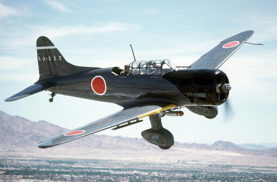
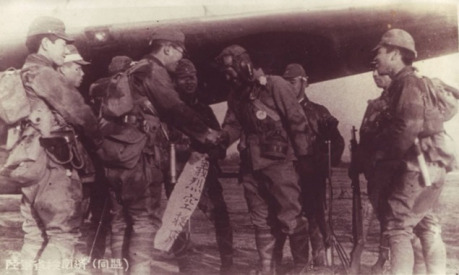
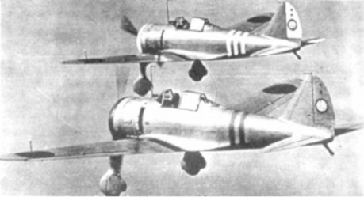
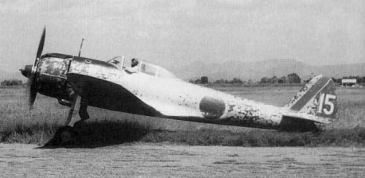

Protivníky hráčů a jejich pilotů z řad AVG je nový nepřítel – Japonské císařské armádní letectvo, které se výrazně odlišuje od protivníků, se kterými se spojenečtí piloti setkávali v Evropě a Severní Africe. Chtěli bychom vám nabídnout náhled na tohoto nového protivníka, nová pravidla, která tato strana má a jednu japonskou stíhačku.

## Japonské císařské armádní letectvo

> (Dai-Nippon teikoku rikogun kókútai)

Japonské letectvo zahájilo válku s velice kvalitními piloty, jejichž výcvik trval téměř 30 měsíců a každý z nich měl nalétáno 400 hodin (mnohem více než spojenečtí piloti). S narůstajícími ztrátami ale jejich výcvikový program nebyl schopen dostatečně rychle trénovat náhrady a kvalita nově příchozích pilotů prudce klesala. Nad Barmou a jižní Čínou se ale spojenečtí piloti setkávali s elitními piloty a veterány války v Číně (která v době útoku na Pearl Harbor probíhala už tři roky).

### Organizace

Základní bojovou jednotkou císařského armádního (ale i námořního) letectva byla _Hikó Sentaj_, zpravidla zkracována pouze na __Sentaj__ („Letecká bojová skupina“). Velel jí zpravidla _Šho-sa_ (major) nebo _Ču-sa_ (podplukovník). _Sentaj_ stávala ze tří __čútaj__ (letek), kterým velel _Tai-i_ (kapitán). Každou _čútaj_ tvořily tři __šótaj__ (roje), každý o 3 letounech. Spolu s rezervními letouny a velitelským rojem měla _Sentaj_ zpravidla bojovou sílu 45 stíhačů (v případě stíhací letky), nebo 30 bombardérů (pro bombardovací letku).

Dvě nebo více _Sentaj_ (často jako stíhací skupina, bombardovací skupina, nebo skupina pozemní podpory) tvořily společně __Híkodan__ (obdobu křídla v USAAF), kterému velel _Tai-sa_ (plukovník). Dva až tři _Híkodany_ pak tvořily __Híkošidan__ (Leteckou divizi), které velel generál.

V jihovýchodní Asii byla proti Malajsii nasazena _3. Híkošidan_ pod velením generála Mičio Sugawary a tři vyčleněné _Sentaj_ z _5. Híkošidanu_ generála Hidejoši Obaty (ta byla mezitím nasazena proti Filipínám). Až do 23. prosince 1942 se nad Rangúnem neobjevila žádná japonská letadla, díky odporu, který kladli britští obránci v Malajsii. Teprve, když se tam situace obrátila v japonský prospěch, mohl generál Sugawara přesunout část sil na barmskou frontu. S obsazením Malajsie a Singapuru v polovině ledna se pozornost _3. Híkošidanu_ přesunula k Nizozemské východní Indii a zbytek _5. Híkošidanu_ (který se po nasazení na Filipínách přeskupil na Taiwanu) se přesunul na thajská letiště a připojil se ke svým zbylým _Sentaj_, aby zahájil hlavní leteckou ofenzivu proti Barmě.

### Taktika

_Šótaj_ (tři letouny) využívala formace tří strojů podobné „formaci V“, kterou používaly v té době i jiné státy – v podobě jednoho vedoucího stroje a dvojice wingmanů. Japonská verze ale byla více flexibilní, než standardní „formace V“. Oba doprovázející letouny si držely větší odstup od vedoucího stroje a mohly flexibilně proměňovat formaci. Japonští piloti trénovali dlouho a tvrdě, aby zvládli formaci a dokázali ji držet i během zuřících bojů. Někteří dokonce tvrdili, že si vyvinuli _išin denšin_ (šestý smysl) pro to, co udělají ostatní piloti a dokázali létat s mistrovskou synchronizací. Taková souhra ale vyžadovala dlouhý trénink a zkušenost. Jinak byla formace tří letounů spíše na překážku, než ku pomoci, a piloti měli co dělat aby ji v soubojích udrželi.

V boji používali Japonci i větší formace – celá _čútaj_ (tedy tři šótaj) mohla společně letět ve formaci v podobě velkého V. Dvojnásobná formace (tedy 18 letounů) se nazývala _dajtaj_, ale její udržení v boji (navíc často bez rádií, viz níže) byla v zásadě nemožná.

### Dorozumívání

Bombardovací a průzkumné letouny využívaly zpravidla radiotelegrafu, kterým se dorozumívali za pomoci Morseovy abecedy. Něco takového ale nebylo přijatelné pro rychlý souboj stíhačů a proto už ve třicátých letech začali Japonci do letounů montovat rádia. Byly ale poruchové a často se stávalo, že během misí nefungovaly a posádky se musely nezřídka obejít bez nich. Některé jednotky je pak úplně odstranily, aby odlehčily letouny. Piloti se postupně stali mistry v dorozumívání za pomoci ručních signálů, kývání křídly a dopředu domluvenými významy z kokpitu vystřelených různobarevných světlic, stejně jako zmíněného šestého smyslu pro to, co udělají ostatní.

## Akce

Japonští piloti mají k dispozici dvě nové akce:

- __Sanbutaj__ (angl. „sanbutai“, jap. „trojice“)

> Jak bylo zmíněno výše, japonští piloti létali nikoli ve dvojicích (jak umožňuje běžná akce _wingman_), ale ve trojicích. Nemohou tak použít základní akci _wingman_ z hlavní knihy, namísto toho mají k dispozici akci _sanbutaj_.
>
> Až dva piloti mohou zvolit tuto akci, aby doprovázeli jeden vedoucí stroj (celkem tři letouny, z nichž 2 dávají akci _sanbutaj,_ tak vytvoří jednu _šótaj_). Vedoucí letoun může provádět své vlastní akce, zatímco ho oba piloti s akcí _sanbutaj_ jej kryjí. Akce (stejně jako u akce „wingman“) trvá pouze jedno kolo. Pokud chtějí piloti udržet formaci dlouhodobě, musí dávat tuto akci opakovaně.
>
> Pokud se vedoucí pilot zavěsí za protivníka a má přitom za sebou členy své _šótaj_ (piloty, kteří dávají akci _sanbutaj_), pak má bonus ke střelbě +4 (+2 za každý stroj, s bonusem za zavěšení a oba doprovodné letouny celkem +9). Pokud se pilot zavěsí za stroj, který má za sebou doprovodné letouny, má naopak střelbu sníženou o 2 za každý stroj (takže v případě obou letounů nikoli bonus za zavěšení +5, ale jen +1), protože musí hlídat celkem tři stroje (nejen jeden).
>
> Stíhací letoun i bombardér mohou mít dva letouny, které jej doprovázejí (a společně tvoří _šótaj_). V případě bombardéru nedávají doprovázející letouny bonus na střelbu, pouze snižují bonus ke střelbě útočníka, který se za něj zavěsí.
>
> Pokud piloti doprovázejí vedoucí letoun, který získává výšku, získávají jejich stroje také žeton výšky (jako by stoupali sami). Stejně tak, pokud je pilot zavěšený za protivníkem, který získává výšku, obdrží také žeton výš­ky, protože se drží těsně za ním. Pokud naopak wingman následuje letoun, který využívá (a tedy ztrácí) výškový žeton (a má výškové žetony vlastní), pak žádný neztrácí.

- __Džibaku__ (angl. „jibaku“)

> „Tennó heika banzai!“
>
> Od japonských pilotů se očekávalo, že pilot s poškozeným strojem zemře ve stylu samurajské tradice – když narazí do nepřátelského letounu, lodi nebo jiného cíle … a vezme s sebou tolik nepřátel, kolik jen může. Pokud japonský letoun __vypotřeboval veškerou svou munici__, případně __je poškozen__ a hrozí, že nemůže dokončit misi, může se pokusit vrazit vlastním letounem do protivníka a zničit tím oba stroje. V takovém případě se výsledek této akce rozhodne dvěma hody na Pilotáž – japonský pilot má při nich postih −2 a napadený pilot proti němu hází svou Pilotáží. V případě, že japonský pilot v obou hodech neuspěje, pak mu protivník unikl a navíc nedokázal vyrovnat kolizní kurz a rozbil se s letounem o zemi. Pokud uspěje v jednom hodu, pak částečně uspěl a za cenu zničení vlastního stroje poškodil protivníka (protivník dostává 1 Poškození). V případě, že japonský pilot uspěje v obou hodech, byly zničeny oba letouny.

## Letadla (stíhačky)

__Nakadžima Ki-43 Hajabúsa__ (v japonštině „Sokol stěhovavý“) / spojenecké označení __„Oscar“__

Jednomotorový stíhač, který startoval z pozemních základen, a hlavní typ stíhacího letounu Japonského císařského armádního letectva během druhé světové války (první operační nasazení v říjnu 1941). Bylo jím vyzbrojeno celkem 30 sentají a 12 nezávislých čútají. „Oscar“ byl mezi piloty velice oblíbený pro svou manévrovatelnost a příjemné řízení. Byl velice obratný a dokázal snadno vymanévrovat protivníky, měl ale stejně slabosti jako jeho předchůdce ­Ki-27 „Nate“ a jeho námořní obdoba A6M „Zero“ – slabé pancéřování a absence samouzavíracích palivových nádrží způsobovala těžké ztráty v boji, navíc výzbroj pouhých dvou kulometů se ukázala jako nedostatečná proti těžce pancéřovaným spojeneckým letounům.

### Zvláštní pravidla:

- Letoun má 10 čtverečků munice.
- __Obratný__ – Letoun je velice obratný, má bonus __+2 na Pilotáž__.
- __Slabá výzbroj__ – Letoun je vyzbrojen pouze dvojicí kulometů a škody způsobené nepříteli často nejsou vážné. Má postih __−____2 na Střelbu__.
- __Snadno hoří__ – Letounu chybí pancéřování a je velice křehký. Pokud bylo výsledek úspěšného hodu, který jej poškodil sudé (japonsky _čó_), pak je letoun sestřelen. Pokud je sudé (japonsky _han_), pak pouze získá poškození jako obvykle.
