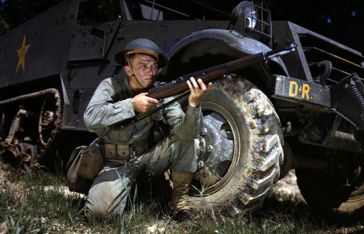
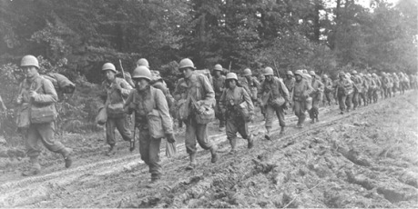

## Bojisko

Rovnako ako v klasickej Hrstke aj tu je situácia na bojisku veľmi abstraktná. Bojisko si môžeme predstaviť ako členitú krajinu s rozmermi o desiatkách i stovkách metrov. Na bojisku určite nájdeme množstvo skrýš a zákutí a každý sa bude kryť, koľko len bude možné.

Konkrétny vzhľad bojiska, ako aj skutočná poloha vojakov na ňom je skôr na škodu než na úžitok. Hráči by však mali mať dobrú predstavu o tom, ako krajina vyzerá pre potreby rozprávania.

## Vlastnosti

V Hrstke sa v boji spoliehame na dve základné vlastnosti. Prvou je streľba. To sa nemení ani v pozemnom boji a používať sa bude rovnako.

Samozrejme schopnosť pilotovať lietadlo nám tu nie je bohviečo platná, a tak všetky akcie, ktoré používali pilota, budú teraz používať vojaka. Vojak tu reprezentuje skúsenosti z boja a taktiku.

Čo sa týka zásahov, postava má dva životy. Ak jeden stratí, je zranená a ďalej má postih −5 na všetky hody.

## Akcie

- __Streľba__ – tá ostáva rovnaká ako predtým. Hráč si hodí 3d6, pripočíta bonusy, streľbu, a ak má vo výsledku viac než 16, súpera zasiahol.
- __Získanie pozície__ – postava sa presunie na novú, výhodnejšiu pozíciu. Získa tým pozičný bod. Pozičné body sa dajú premeniť na bonus +2 k hodu rovnako ako výškové žetóny v leteckom súboji.
- __Prepadnutie__ – špeciálny manéver. Postave sa podarilo nepozorovane dostať na skvelú pozíciu, odkiaľ vie zasiahnuť nekrytých nepriateľov. Ak má hráč aspoň 3 pozičné body, môže ich použiť a zaútočiť dvakrát s bonusom +6.
- __Dostať sa do chrbta__ – postava sa dostane do boku súperovi a zameria sa na neho. Funguje rovnako ako zavesenie v Hrstke. Hráči si proti sebe hodia na vojaka, a ak útočník zvíťazil, má ho obranca v chrbte a môže na neho útočiť s bonusom +5 na streľbu. Postava má útočníka mimo zorného poľa, a tak o ňom nevie a nebude na neho útočiť
- __Získanie krytu__ – v závislosti, ako veľmi sa jej súper dostal do chrbta, môže si postava skúsiť všimnúť útočníka a rýchlo získať kryt z tejto strany. Znova si proti sebe hodia na vojaka. Ak hráč uspeje, presunie sa na iné miesto, čím súperovi zruší jeho bonus.
- __Hrdinská intervencia__ – postave jej inštinkt skúseného veterána vraví, že niečo nie je v po­riadku, otočí sa a uvidí plížiaceho nepriateľa a bez váhania po ňom vypáli. Na zásah stačí hodiť na vojaka 16, rovnako ako u Immelmannovho manévru.
- __Parťák__ – postava môže robiť svojmu spoluhráčovi parťáka. Drží sa blízko pri ňom a dáva na neho pozor. Postave, ktorá má parťáka, sa nedá dostať do chrbta. Navyše, odbremenená od sledovania okolia sa môže poriadne sústrediť na streľbu a má bonus +2. Ak postava s parťákom získa pozičný žetón alebo žetón úniku, Parťák si ho môže zobrať tiež.
- __Útek z bojiska__ – postava získa únikový žetón.
- __Zahnanie do pasce__ – postava si hodí na vojaka proti súperovi s únikovým žetónom. Ak uspeje, cieľ stratí jeden únikový žetón.

## Zbrane a vybavenie

Každá postava si môže zobrať dva kusy vybavenia z nasledujúceho zoznamu:

- __Puška (15)__ – Stálica vojenskej scény. Nie je síce v ničom špeciálna, no má hromady munície a skúsený strelec s ňou dokáže divy.
- __Pištoľ (10)__ – Pištoľ je vďaka svojej kompaktnosti veľmi vhodná počas plíženia a presunu. Tiež je možné rýchlo ju tasiť, keď sa nám súper dostane do chrbta. _V kole keď je používaná má postava bonus +1 k všetkým hodom na vojaka._
- __Ostreľovačská puška (5)__ – Okrem toho, že je veľmi presná, je táto zbraň ťažká a nemotorná a je dôležité sa s ňou rozložiť na správnom mieste. _Z ostreľovačskej pušky je možné strieľať iba pri použití aspoň jedného pozičného žetónu. Poskytuje bonus +2 k streľbe._
- __Samopal (6)__ – S príchodom automatických zbraní sa vojna zmenila. Vďaka ich vysokej kadencií je ľahšie zasiahnuť súpera, avšak muníciou sa pri tom nešetrí. _Samopal poskytuje bonus +1 na streľbu._
- __Guľomet (10)__ – Tento ťažký kus techniky dokže strieľať jednu strelu za druhou, je však veľmi nepresný. _Guľomet dokáže vystreliť dvakrát za kolo. Postava, ktorá ho používa má postih_ _−__2 do hodov na vojaka i streľbu._
- __Kontaktné zbrane__ – Nože, bajonety i meče, všetky tieto zbrane boli vo vojne použité. Samozrejme rozbehnúť sa proti ozbrojenému súperovi bolo šialenstvo. _Kontaktné zbrane sprístupňujú akciu Útok – ak má postavu súper v chrbte, je možné použiť túto akciu. Útočník a cieľ si hodia na vojaka. Ak útočník vyhral, obranca dostane zranenie. Ak vyhral obranca a tiež je ozbrojený kontaktnou zbraňou dostane zranenie útočník._
- __Granáty (2)__ – Na použitie granátov je potrebné dostať sa k súperovi na dosah. Napriek tomu tá sila stojí za to. _Je možné použiť ich iba pri útoku od chrbta. Pri zásahu zrania súpera za dva životy._
- __Raketomet (1)__ – Raketomet je vlastne kovová rúra obsahujúca protipancierovú raketu. Je určená k likvidácií ťažkých cieľov, tankov a podobne. _Postava, ktorá je vybavená raketometom má postih_ _−__4 k vojakovi. Po výstrele je možné ho zahodiť._
- __Balistická vesta__ – Prvé balistické vesty z tohoto obdobia sa nedajú porovnávať s modernými zbrojami, avšak dokázali zachrániť človeka zasiahnutého šrapnelmi a odrazenými guľkami. _Balistická vesta pridáva nositeľovi jeden štvorček životov. Aj keď oň príde, stále sa nepočíta ako zranený._
- __Balíček prvej pomoci__ – V boji nie je čas na to zachrániť ťažko zranenú postavu. Je však možné zastaviť postrelenému druhovi krvácanie a postaviť ho spať do rady. _Hoď si na osobnosť. Ak hodíš 12 a viac, zastavil si cieľu krvácanie a nemusí si ďalej počítať postih za zranenie._
- __Munícia (2)__ – Zásobiť sa pred dlhým bojom muníciou sa môže zdať ako poverčivosť. Skutočnosť je taká, že na nedostatok nábojov umrelo príliš veľa ľudí. _Munícia umožní ako akciu doplniť muníciu v zbrani na maximum._
