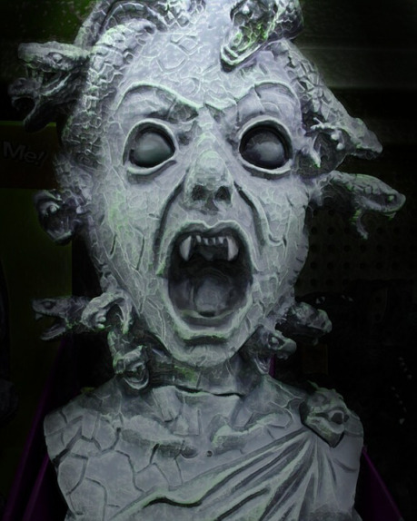
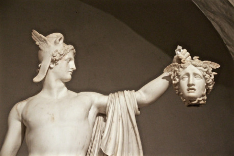
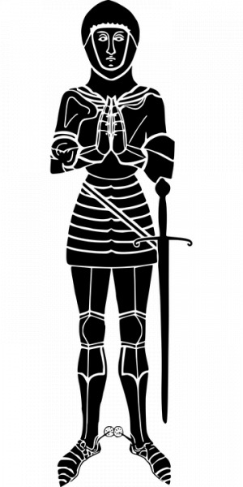

## Čestné prohlášení

Na začátek – tohle je jen rant, rozhořčený výkřik způsobený z velké míry křivdou, ať už zdánlivou, či skutečnou. To musíte posoudit sami. Odehrál jsem však v 5. edici D&D tolik her (a ve 4. edici ještě víc), že si osobuji právo považovat svůj názor za závažný.

## Vyhoďte ho z kola ven!

Co je tedy na stavu _stunned_ (česky také _ochromení_) tak špatného? Beztak si stěžuje jen proto, že nemohl jedno nebo dvě kola jednat za svou postavu, říkáte si snad. No – ano. A jsem přesvědčený, že to je opravdu, opravdu špatně.

Se stavem _stunned_ (postava přichází o všechny svoje akce i reakce) se setkáte spíš až u monster na vyšších úrovních a chápu záměr autorů, byl-li to tedy jejich záměr, vytvořit hrozbu pro postavy. Něco, co by motivovalo hráče jednat takticky a zajišťovat se i – jak se říká ve sportovní terminologii – zezadu. Jenže má to dva háčky, a podezřívám autory, že o nich [věděli](http://www.d20.cz/clanky/produkty/4823.html) …

První problém je, že tento efekt vyřazuje hráče ze hry. Třeba jen na jedno kolo, jenže – pokud dobře počítám, jedno kolo trvá u běžné skupiny na vyšších úrovních cca 10 minut. Pokud jste rychlí, pak kolem 5 minut, anebo pokud rychlí nejste, tak i dvacet minut (prakticky ověřeno). Postava přichází o celé kolo, protože až na jeho konci si hodí záchranný hod, a tak nemá hráč co dělat do svého tahu a pak ještě 5–20 minut do svého dalšího tahu …

… když uspěje v záchranném hodu. Říkáte si, ale jo, vždyť je ta cílová hodnota tak nízká, že to hodí. Inu, když už jste to jednou nehodili, buď jste měli smůlu, anebo možná pravděpodobněji máte malý bonus k záchrannému hodu, a pak – ho nehodíte znovu. Navíc, řekněte mi, proč mívá tento efekt nízké cílové číslo? Aby to pokud možno každá postava hodila a nikdo nepřišel o možnost jednat? Nebo aby to nezdržovalo hru? (_ťukám si na čelo_)

A tím se dostáváme k druhému problému: Prodlužuje to střetnutí. Postava nejedná, nepřispívá k zneškodnění monster a hra se tím zpomaluje. Pokud je mezitím zraněna (lze ji snadněji zasáhnout), je třeba ji léčit místo jiných, třeba útočných efektů. (Já vím, já vím, postavy můžou střetnutí i prohrát …)

Celkový efekt je tedy takový, že taktickou výzvu (natož taktickou volbu) stav _stunned_ nepřidá žádnou, jen jeden hráč (či víc) nejmíň čtvrt hodiny nehraje a zároveň se tím nejspíš protáhne střetnutí.

## Dítě vylité, vanička zůstala

Proč ale píšu jen o 5. edici? Ve čtvrté je přece taky stav _stunned_, tam mi nevadí?

Nevadí, nebo přinejmenším ne tolik. Ve čtvrté edici totiž stav _stunned_ (vedle jiných stavů, kterých pravda bylo ve čtvrté edici až moc) taktickou volbu vytvářel. Téměř každé povolání s rolí _leader_ a tuším i některá s rolí _controller_ totiž umožňovala v rámci některých schopností, tj. třeba společně s útokem, jiné postavě hodit si záchranný hod mimo svůj tah. Znamenalo to tedy oslabit svůj útok nebo zvolit jinou schopnost, než bylo v plánu, a získat tím možnost zbavit družiníka stavu _stunned_. Některá povolání (určitě v PHB2, ale snad i v PHB1) dokonce měla schopnost hodit si záchranný hod na začátku svého kola, nikoli až na konci, a tak i postava s nízkým bonusem měla větší šanci vůbec jednat.

Do páté edice se ale toto změnilo. V hráčské příručce jsou dohromady snad dva efekty, které umožňují zbavit se stavu _stunned_, přičemž jejich cena je tak vysoká, že pokud už ji vůbec může některá postava zaplatit (kouzlo 5. úrovně), nejspíš si to její hráč rozmyslí a nechá svého kamaráda na čtvrt až půl hodiny na holičkách. A co je nejhorší, z taktického hlediska udělá většinou dobře.

## Co s tím?

Popravdě nevím. Tedy vím, nepoužívejte monstra, která umí udělit stav _stunned_. Nebo si dejte tu práci a přepracujte je, nebo aspoň jejich schopnosti – nahraďte _stunned_ stavy _restrained_ (pohyb postavy je 0) či _frightened_ (nemůže se přiblížit, nevýhoda na útoky), pokud chcete postihovat postavy s útoky na blízko; nebo třeba stavem _blinded_ (nevýhody na útoky, výhody pro útoky na postavu), pokud vám jde i o útoky na dálku nebo příležitostné útoky. Anebo dejte postavám možnost nějak se zbavit stavu _stunned_ během kola, ať je to něco stojí, ale ať to není nedostupné. Anebo nakonec vymyslíte něco ještě lepšího, nepřekvapilo by mě to.

Ale prosím, nevyřazujte hráče ze hry. Mohl by nakonec dát namísto hraní s kamarády (ve skutečnosti před jedním záchranným hodem za čtvrt hodiny) přednost třeba cigárku. Nebo jiné zábavě.
