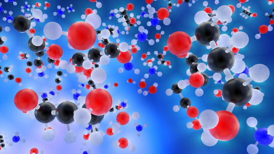

## Fantastické sloučeninya kde je hledat

Křemíkový život je v kruzích vědeckých spekulací i SF už jistou tradicí. Chemik Friedrich Wöhler, kterého známe díky syntéze močoviny, už krátce po polovině 19. století lehce spekuloval o možných variantách organické chemie založených na křemíku. V závěru 19. a počátku 20. století došlo k řadě objevů v oblasti organosilikonů, látek s vazbami uhlíku a křemíku. Některými, především mimo samotnou komunitu chemiků, to bylo bráno jako potvrzení silné analogie mezi uhlíkem a křemíkem co do šancí na život. Jistý učitel biologie v novinovém článku v roce 1894 poeticky napsal: „ … člověka takový nápad přiměje k fantastickým představám: vizím křemíko-hliníkových organismů – proč ostatně ne křemíko-hliníkových lidí? – procházejících se pod nebem plynné síry třeba na břehu moře tekutého železa tisíce stupňů nad teplotou rozžhavené pece.“ Byl jím H. G. Wells. Ve své vědecko-fantastické tvorbě však křemíkový život (bohužel) nikdy nevyužil.

Křemík jen neochotně tvoří dvojné vazby, které jsou v organické chemii důležité, a některé z jeho vazeb s jinými prvky se zdají až moc stabilní na průběh reakcí, jiné naopak příliš křehké. Je to ovšem nepřekonatelný problém, když vezmeme v úvahu širší škálu podmínek co do teplot, tlaku a typu rozpouštědla? Brzy však začínalo vycházet najevo, že silná analogie mezi rozmanitostí chemie uhlíku a křemíku a představa křemíkového života za extrémně vysokých teplot mají i další trhliny. Vědělo se, že organosilikony a některé další skupiny sloučenin křemíku vykazují velkou rozmanitost a určité paralely s organickou chemií. Jenže pak se předpokládalo, že by mohl existovat život v teplotách vhodných pro tavení oxidu křemičitého – křišťálu a příbuzných minerálů. Ovšem za takových teplot se většina skutečně zajímavých a rozmanitých sloučenin křemíku dávno rozloží. Má tedy představa života na bázi křemíku vůbec nějakou vědeckou hodnotu?

Vyloučené to není. Kromě organosilikonů, které nabývají poměrně rozmanitých podob, jsou stabilní za poměrně širokého spektra podmínek a odpuzují vodu (na Zemi bychom tedy organosilikonový život moc neočekávali), mají vůči organické chemii mnoho funkčních analogů silany (a jejich deriváty silanoly): sloučeniny křemíku s vodíkem. Za jakých podmínek bychom mohli pátrat po hypotetickém silanovém životě a vyskytují se takové vůbec na nějakém známém tělese? Silany se snadno vznítí už za pokojové teploty, nejsou stabilní ve vodě ani za přítomnosti kyslíku. Takový život by tedy vyžadoval bezvodé, bezkyslíkaté chladné prostředí. Jaké rozpouštědlo se pak nabízí? Podle britského biochemika Williama Bainse kapalný dusík. Ten typicky známe z lékařských ordinací, skladování biologických vzorků nebo experimentů s molekulární kuchyní, ale na některých tělesech by se mohla vyskytovat celá moře kapalného dusíku. K tomu by však potřebovala tlak zhruba o řád menší než atmosférický tlak na povrchu Země a vyšší. Zatím známe celou řadu těles bohatých na dusíkový led, například Neptunův měsíc Triton nebo trpasličí planetu Pluto, ale jejich nepatrné atmosféry by musely být o několik řádů hustší, aby dovolily existenci dusíku v kapalném stavu i jen za velmi úzkého rozmezí teplot.

Představitelné by snad byly dočasné kapsy či potůčky kapalného dusíku pod povrchem, kdyby docházelo k ohřevu zářením pronikajícím skrz ledový povrch nebo rozpadem radioaktivních prvků, ale kapalný dusík je lehčí než jeho led (na rozdíl od situace u vody), a tak by se nejednalo o stabilní situaci. Nicméně si můžeme představit, že až se Slunce stane rudým obrem a krátce dosáhne nejvyšší zářivosti, odpaření ledů na Plutu by vytvořilo dostatečně hustou atmosféru na alespoň velmi krátkověká dusíková moře. Život by ale moc času na vznik a vývoj neměl – nejspíš pouhé miliony let.

## Jiné stavební kamenyči rozpouštědla – a jejich nevýhody

Kromě nejčastěji zmiňovaného křemíku se v souvislosti s analogy organické chemie někdy skloňují bor, dusík, fosfor, síra a některé polokovy jako například germanium, někdy dokonce i některé kovy. Zatím se však zdá, že se jedná o ještě letmější analogie než u křemíkových sloučenin. Některé z nich by měly i tu nevýhodu, že jsou mezi prvky zastoupeny relativně málo. Uhlíku najdeme všude mnoho …

Co taková jiná rozpouštědla? Život na Zemi v tomto směru využívá vodu. Ta je polární rozpouštědlo s poměrně širokým rozsahem teplot a tlaků, za nichž je v kapalném stavu, má velkou tepelnou kapacitu a za běžných tlaků je led díky své krystalické struktuře lehčí než kapalná voda (která má nejvyšší hustotu při 4 °C), a tak plave navrchu, což zabraňuje vymrzání vodních ploch ode dna a snižuje pravděpodobnost jejich úplného zamrznutí. Díky tvoření iontů napomáhá mnoha chemických reakcím, i když někdy může její reaktivita životu i škodit.

Je něco, co by ji mohlo nahradit? Ještě širší teplotní rozmezí kapalnosti za atmosférického tlaku má formamid, ale musí být ve zcela bezvodém prostředí, protože ve vodě se rozkládá. Podobně jako voda je to polární molekula. Usnadňuje některé reakce, které potřebuje život na Zemi, například syntézu ribózy nebo některých nukleobází; případný život ve formamidu by asi mohl využívat obdobné látky. Je ale otázka, nakolik se dá očekávat výskyt kapalného formamidu. Je sice běžný v zrníčkách v protoplanetárních discích a molekulárních mračnech, ale představa oceánů nebo alespoň jezer formamidu není snadno udržitelná. Jelikož se jeho teplotní rozmezí z větší části překrývá s vodou, najít pro něj vhodné prostředí se nezdá úplně jednoduché.

Co takový hydrazin, který je kapalný za v podstatě stejného rozmezí teplot jako voda? Nadšenci nejen do kosmonautiky určitě zvolají, že dostat na svět s hydrazinem kyslík, máme pořádně výbušnou směs … Hydrazin se používá jako raketové palivo, ale dipólový moment i některé další vlastnosti má vcelku podobné vodě. Jenže je nesmírně reaktivní, takže by to chtělo teploty blízko u bodu mrznutí a rozhodně bezkyslíkaté prostředí, aby posloužil našemu účelu. Mohla by v něm fungovat nějaká analogie organické chemie, v tomto případě asi také uhlíková? V principu snad ano, ale podmínky nás hodně omezují; opět nevíme o žádných hydrazinových jezerech na jakémkoli tělese.

## Mars, Io či Titans exotickým životem?

Takový peroxid vodíku by hlavně ve směsi s vodou mohl posloužit hypotetickému životu na Marsu, jelikož by zabraňoval zamrznutí buněk a tvorbě ledových krystalků. Je navíc hygroskopický – „přitahuje“ vodu. V kombinaci s ní by se tedy v chladných prostředích (kde by také byla menším problémem jeho vysoká reaktivita) nejednalo o nemyslitelnou možnost. Tím navržené možnosti nekončí – máme tu kyanovodík, fluorovodík, všelijaké sloučeniny síry nebo i elementární síru v kapalném stavu … Autor SF by si mohl vymyslet skutečně exotický život v kapalném sulfanu nebo oxidu siřičitém třeba pod povrchem Jupiterova vulkanicky velmi aktivního měsíce Io, ale moc pravděpodobná se taková možnost zatím nezdá.

To třeba čpavek ze srovnání vychází lépe. Vyskytuje se ve vesmíru hojně a mohl by tvořit nezanedbatelnou část vnitřních oceánů vzdálených měsíců či trpasličích planet – směs vody se čpavkem má mnohem nižší teplotu mrznutí než samotná voda. Je také polární, poměrně zásaditý a má nižší viskozitu – dá se říci, že „snáz teče“ a tím může usnadňovat průběh chemických reakcí, jelikož se reaktanty „jednodušeji najdou“ (naopak velkou viskozitu má z nám dobře známých tekutin třeba med). Mohl by navíc posloužit biochemii s drobnými obměnami podobné té pozemské.

Jednoduché uhlovodíky jako metan či etan by se také mohly uplatnit jako rozpouštědlo pro hypotetický cizí život. O možnostech života v metanových jezerech Saturnova měsíce Titanu se ostatně spekuluje už řadu let. Stejně jako pozemský by byl pravděpodobně založen na uhlíku, ovšem voda (která se na povrchu Titanu nevyskytuje) by pro něj byla jedem. Molekulárního dusíku jsme se už dotkli u silanů. Tyto látky jsou ale kapalné za nízkých teplot – postačilo by to pro dostatečnou rychlost reakcí, aby mohl vzniknout život? Není zřejmé, kde leží tato hranice, a navíc za velmi vysokých tlaků mohou i takováto rozpouštědla zůstat v kapalném stavu i za teplot, jaké jsou běžné pro pozemský život.

Přejděme ale k ne zcela typickým kapalinám (jakkoli nám v běžném životě i ty dříve zmíněné přijdou velmi netypické) – a to superkritickým kapalinám. Jedná se o fázi spojující v sobě některé vlastnosti kapalin i plynů, která nastává po překročení kritické teploty či tlaku. Může fungovat jako rozpouštědlo podobné kapalině, má hustotu blízkou kapalině, ale je stlačitelná a má nízkou viskozitu blížící se plynu.

Superkritický molekulární vodík se pravděpodobně nachází v nitrech plynných planet, u některých z nich i za teplot a tlaků přijatelných pro život, jak ho známe (byť případný život v superkritickém vodíku by určitě byl spíš rázu, jaký neznáme!). Superkritická voda také existuje, ale už za vyšších tlaků a teplot, chová se nepolárně a jde o kyselé prostředí. V superkritickém stavu je oxid uhličitý na bázi atmosféry Venuše – ale chtělo by to najít prostředí s podobně vysokým tlakem a nižší teplotou, tedy výrazně dál od Slunce (oxid uhličitý je silný skleníkový plyn), abychom mohli uvažovat o jeho možném využití exotickým životem. Ten by v tomto případě zřejmě nemusel být tak výrazně odlišný od pozemského, v superkritickém oxidu uhličitém jen s pár molekulami vody některé mikroorganismy přežijí. Navíc se oxid uhličitý nachází téměř všude a odpadá tak častá výtka proti konceptům alternativní biochemie – že dané stavební kameny či rozpouštědla se zkrátka vyskytují příliš vzácně.

## Kam nás zavede vědači fantazie (a která setam dostane dřív)?

Zatím jsou veškeré představy o možnostech exotického života velmi spekulativní a zakládají se na někdy nejistých závěrech vyvozovaných z pozemské chemie. Chování různých chemických systémů za pro nás extrémních podmínek (nízké či vysoké teploty a tlak, záření) nám ve většině případů není dobře známé a může se ukázat, že naše spekulace byly směšné – nebo že případný exotický život je naopak ještě podivnější, než by se nám snilo. Asi ještě po dlouhou dobu zůstane spíše doménou sci-fi snílků – a proto nám nezbývá než se při hraní či psaní pustit právě do spekulací.

Můžeme si představit život na planetě s oceány tvořenými směsí vody a fluorovodíku, fotosyntézu produkující nikoli kyslík, ale chlor, život v patrně extrémním (a nám neznámém) prostředí planet pulsarů, život s chemickou kostrou založenou na nekovalentních vazbách, křehké silanové organismy v kapénkách kapalného dusíku vznikajících při zahřátí dusíkového ledu paprsky vzdáleného slunce, život ve čpavkem obohacených vodních oceánech hluboko pod ledem uvnitř měsíců či trpasličích planet nebo pod hustou vodíkovou atmosférou bludné planety vyvržené ze své soustavy. Obzvlášť když vyjdou z dosavadních reálných znalostí a přenesou je dál do krajiny neznáma, mohou být takové fantazie skutečně fascinující a přenést nás do cizích světů, ze kterých se nám bude tajit dech.
