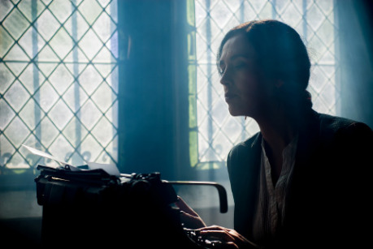

## I. Příběh – pokus o definici

O technice psaní jsem tu uveřejnil už leccos, ale se zpožděním si uvědomuji, že tu chybí shrnující pohled na problém vcelku. Vynechal jsem pár samozřejmostí, které možná leckomu úplně samozřejmé nepřipadají. Asi jsem také nezačal úplně od začátku; zapomněl jsem zřejmě napsat, o čem je celou dobu řeč. Pokud tedy někdo sleduje můj psací seriál systematičtěji, neudělá chybu, pokud tento díl předsune před všechny ostatní a dá ho na úplný začátek.

Co je to ten příběh?

Wikipedie praví, že slovem příběh obvykle označujeme dvě různé, i když navzájem propojené záležitosti. V hlavním významu příběh znamená něco, co se opravdu stalo, označujeme jím nějakou reálnou událost (nebo i skupinu navzájem propojených dějů a událostí), nějaký skutečný děj, který měl svůj jasný počátek i zřetelný konec, něco, co se opravdu stalo.

Řekl bych, že tato definice je především dokonale zmatená.

Mám vážné pochyby, že slovem příběh se označují _dvě navzájem propojené záležitosti._ Dál se ukáže, co tím autor zřejmě myslel, ale takto napsané je to dost matoucí. Dožil jsem se slušného věku, aniž by slovo příběh tímto způsobem přede mnou někdy někdo použil. Třeba – _Věk našich obyvatel se zvýšil, protože se zlepšila zdravotní péče v kardiologické oblasti. Není to nádherný příběh?_

Když vezmeme _hlavní význam_ (pro wikipedistu zřejmě odlišný od _obvyklého významu_), znamená prý příběh _něco, co se opravdu stalo_. I tohle je pro mne překvapivá novinka. Nemám problém s tvrzením, že _Schindlerův seznam_ je velkolepý příběh. Mate mne ale, že podle wikipedie není velkolepý příběh _Pán prstenů_, ježto ten se evidentně nestal. A tato myšlenka je na konci definice ještě pro jistotu zopakována.

Naštěstí se v této definici mihne něco, co pokládám za opravdu důležité. _Děj, který měl svůj jasný počátek i zřetelný konec._ Myslím, že kdybych všechny předchozí wikipedické podivnosti zahodil a nechal jen tohle, dojdu tím k docela ucházející definici příběhu:

> Příběh je děj, který má jasný začátek a konec.

Všimněme si nejprve slova _děj_. O něm už padlo leccos v dílu jménem [Kompozice](http://drakkar.sk/35/co-je-kompozice-a-prace-s-casem.html). Každá literatura nemusí mít nutně děj. Výstraha před nebezpečím, lyrická báseň, zamilovaný dopis, popis terénu pro turistu nebo úřední rozhodnutí děj nemají. Nechme stranou, zda mají či nemají umělecké ambice. Podstatné je, že se v nich nic neděje, nezachycují pohyb v čase a tím z okruhu naší pozornosti zcela vypadávají. Co nemá děj, to nás nezajímá, podobně jako filmaře nezajímají jednotlivé fotografie.

Nicméně, ne každý děj je nutně příběh. Příběh je pouze takový děj, co má nějaký začátek a konec. Tedy, liší se asi jako úsečka od přímky; vede jen od A k B, dál nepokračuje.

Zmatená vstupní sekvence wikipedie se zřejmě pokoušela naznačit, že __mezi tím začátkem a koncem je nějaký vztah__. Nejsou to dva náhodné libovolné body na vesmírné pláni, ale body, které nám z nějakého důvodu připadají logicky svázané, asi jako počátek křižákova putování v jeho domově a cíl v Jeruzalémě. Vidíme, že tato zvláštní „logika příběhu“ nemá nic společného s topografií nebo geometrií, kde jsou všechny body z principu stejné, ale souvisí velmi s lidskými osudy a lidskou zkušeností a také kulturou. Mimozemšťanovi nesnadno vysvětlíme, proč měl Frodo dojít právě k Hoře osudu, a ne jinam, ale čtenáři knihy je to naprosto zřejmé i bez velkého vysvětlování.

Příběh může být kolosální jako _Pán prstenů_, nebo miniaturní jako _Červená Karkulka_. Může být vážný jako _Schindlerův seznam_, nebo vesele praštěný jako _Saturnin_. Přesto má jasný začátek a konec ve všech čtyřech případech. Na rozdíl od wikipedie také tvrdím, že je naprosto jedno, jestli se příběh stal doopravdy, nebo si ho celý někdo vymyslel.

Dokonce mám vážné podezření, že realita jen málokdy tvoří ucelené příběhy. _Ráno vstanu, jedu do práce, pak zase jedu domů._ Je to velmi reálná a běžná dějová zkušenost, ale jako příběh to moc nefunguje. Nemá to ten jasný začátek a konec. Mohli jsme to klidně skončit i příští den, kdy jedu zase znova do práce, nebo také dříve, na obědě v té práci. Na konci ani začátku není vůbec nic význačného nebo zajímavého. Aby to byl příběh, který má smysl někomu vyprávět, musím do věci vložit nějaký výrazný začátek a vést to k nějakému jasnému konci. Takže třeba: _Ráno jsem jel do práce, ale dům byl zavřený. Tak jsem pátral, co se děje. A ukázalo se, že jsem si spletl dům!_

Nehleďme na to, že příběh je i nadále trochu debilní. Už se nám tu ale klube jakási jasná příběhová linka – začátek čili expozice (problém: jak to, že je zavřeno?) a finále, pointa (jsem úplně jinde). Ty dva body k sobě neoddělitelně patří. Pokud je vůbec stvořila realita a autor si to třeba celé nevymyslel, i pak je tu jasný autorský zásah; ze všech možných bodů, kde to celé mohl začít nebo skončit, tak si vybral přesně tyto dva body, které jsou nějak důležité a které vzájemně souvisí.

Příběhy jsou uměle oddělené úseky reality, ke kterým má tendenci tíhnout naše myšlení. I v příběhu, který se skutečně stal, je vždy alespoň minimální autorský zásah, spočívající v tom, že ho někdo z té reality šikovně „vyřízl“ zdůrazněním toho začátku a konce.

A těch autorských zásahů bývá povážlivě víc.

Tím se příběh liší vyprávění od reality prosté; na scéně je jen to, co je tam potřeba a má tam smysl; podstatná postava, důležitá rekvizita, významná část děje.

Autor netvrdí, že v jeho světě už nic dalšího neexistuje, že tam nejsou další lidé a že neprožívají spousty dějů dalších; ale nemá potřebu to čtenáři všechno nutit. Není důvod ho vycpávat informacemi, které nepotřebuje. Nemusí se učit postavu, která v ději vlastně nevystupuje. I když víme, že lord Derby měl deset sluhů, komorníka a čtyři kuchařky a několik nemanželských dětí, přesto není důvod je detailně vypočítávat, když nikdo z nich příběhu nehraje a lord je celou dobu v Africe se dvěma postavami úplně odlišnými.

Vztah výsledného příběhu k realitě může být tedy poměrně volný. Zásahy vypravěče do děje mohou být daleko drastičtější, než povinné vyznačení začátku a konce, a vyházení všeho, co tam není potřeba.

Vezměme si předlohu, která klidně mohla být reálná: _Maminka zapomněla, že má babička svátek, a taky moc neměla čas, takže narychlo poslala k babičce s dárky přes les Karkulku. Ta došla k babičce a odevzdala dárky._ Přísně vzato, už tohle je příběh; má to jasný začátek, expozici – kdo odnese babičce ty dárky? Následuje děj, kde dostaneme odpověď – Karkulka.

Nejspíš cítíme, že by to ještě něco chtělo. Příběh to je, ale zatraceně slabý. Nic moc zajímavého nebo dramatického na tom není. Autor nám to oživil přímo geniálními zásahy:

- Vypustil nudnou úvodní část, co všechno maminka Karkulce nařídila a maminku vlastně z vyprávění skoro vyhodil.
- Přidal fantastického mluvícího vlka.
- Rozhýbal to hororovou scénou, kdy si Karkulka spletla vlka s babičkou.
- A nakonec dílo korunoval biopunkem, kdy je babička i s Karkulkou vyřezána z vlkova břicha a zázračně oživena.

Předloha je k nepoznání změněná. Výsledná pohádka může být těžko označená jako realistická. Ale koho to zajímá! Právě takto divoce změněný příběh je pozoruhodně úspěšný. Dětem je už po dvě století úplně jedno, zda se to stalo doopravdy a jak to přesně bylo.

Léta jsem věřil, že právě tato nejzákladnější pravda o příběhu, že má totiž jasný začátek a konec, je sdílena všeobecně. Zkušenost mi ukázala, že tomu tak vždy není; mnoho nadšených spisovatelských experimentátorů naráží už v této první lekci. [Hraničář Xaxy](http://www.fantasyplanet.cz/uncategorized/jak-nepsat/), vděčný to objev literární kritiky, ukazuje snad úplně všechny chyby, jakých se může autor dopustit, a obsahuje i tuto základní. Má jasný začátek; Xaxy najde zbraň po otci a vyrazí z domu hledat dobrodružství. Ale chybí mu konec. Jeho putování nemíří k žádnému konkrétnímu cíli, na rozdíl třeba od Karkulky. Xaxy má situaci; konkrétní partu skřetů, na kterou se svým kamarádem narazí, a přemůže je. Ale nemáme dojem, že by to byl jasný cíl a smysl jeho putování. Místo jasné katarze, finále a zakončení příběhu, se stane přesně toto: _Brzy nato vtrhly skřeti i do vesnice, všechny zabili a Xaxy a Wave je začali pronásledovat. Tak začalo jejich první společné dobrodružství, protože už měli povolání._

Tedy – Xaxyho dobrodružství poslední větou nekončí, neuzavírá se, jak bychom očekávali, ale podle autora prý začíná. Xaxy a Wave mohou pokračovat a jít vstříc dalším skřetům nebo jiným potvorám; z principu jich může být nekonečné množství. Určitě dost, aby se čtenář bezpečně začal nudit, když pochopí, že se žádného jasného konce nikdy nedočká. Zneklidňující zjištění je, že kdyby vám takový příběh nakladatel nedodal celý, třeba by chybělo deset posledních odstavců nebo deset posledních stran, nepoznali byste to. Není jak.

Pokud vyženete svého hrdinu ze dveří, aby prožil příběh, pak si nejlépe už v těch dveřích položte otázku, kde přesně ten příběh skončí a proč. Pokud to nevíte, a v bezradnosti necháte hrdinu bloudit krajinou jako autor Xaxyho, pak si tu otázku co nejdříve položte znova. A to opakujte, dokud nedostanete jasnou odpověď. Pokud totiž konec nenajdete vůbec, je prakticky jisté, že váš příběh zemře někde v půli porodního procesu. Nikdy to nedokážete dopsat. A vězte, že to bude jedině dobře; svět nepotřebuje dalšího Xaxyho.

## II. Most coby model příběhu

Příběh je útvar prastarý a spolu s Karlem Čapkem věřím, že zřejmě prehistorický. Vznikl přesně v tom okamžiku, kdy neznámý pračlověk objevil, že není vůbec vázán tím, co se opravdu stalo; reálný děj může vylepšit o nějaký ten detail a ušít z něho příběh, třeba tak, jak jsme předvedli s Červenou Karkulkou.

Jiní badatelé tvrdí, že vznik literatury a potažmo i příběhu je podobně starý, jako architektura. Dokonce objevují mezi literaturou a architekturou pozoruhodné souvislosti. Vypůjčím si proto tuto užitečnou metaforu.

Vezmete dva kameny, zapíchnete je do země, a položíte přes ně třetí napříč. To je asi úplně nejjednodušší architektonický útvar, co můžete postavit. Odborně a u Keltů se tomu říká _trilit_, ale ještě vděčnější je to chápat jako jednoduchý most. Pokud vypracujete konstrukci tak, aby přes ni šlo projít, pak se vám kus cesty vznese do vzduchu!

Přesně taková prehistorická konstrukce se skrývá uvnitř příběhu. Dva stojící pilíře či sloupy, spočívající pevně na zemi, to je náš Začátek a Konec, často také nazývaný __Expozice__ a __Finále__. Jsou to dva body zcela zásadní, protože vlastně definují, že to vůbec je příběh, o čemž vás měla přesvědčit předchozí kapitola.

Na těch dvou pilířích leží vlastní tělo příběhu, děj uprostřed, __Peripetie__, který díky těm dvěma sloupům létá nad zemí. Vidíme tu zajímavý rozdíl příběhu proti ději prostému, který létat nepotřebuje. Pokud tam nebudeme mít ty dva důležité základní body, pak ten prostředek vůbec do vzduchu nedostaneme. Vznikne nám jen zcela nedramatická řada kamenů, válející se po zemi. Dláždění cesty, která se vine jako had a žádný jasný konec ani začátek nemá. Může to být i řada dlouhá, přímo kolosální, ale pořád v ní nebude patrná ta jednoduchá logika, že se máme dostat z A do B, a to vzduchem.

Metafora také vysvětluje myšlenku Poeovy _Filosofie básnické skladby_; jak je možné konstruovat příběh _od konce._ V zásadě je totiž jedno, ze které strany most stavíte. Můžete to udělat klidně i proti směru jako Poe, právě proto, že ty dva základní body máte. Pokud je nemáte, bude práce naopak složitá z kteréhokoli směru.

A jdeme dál. Most vede vždycky _přes něco_. Překonává nějaký problém, odpor. Překonává řeku, železnici, silnici; nebo ještě atraktivněji, propast. Stejně tak je příběh svázán se __situací__, jakousi nebezpečnou gravitační silou, která číhá pod tou částí ve vzduchu a vlastně to celé žene kupředu a vysvětluje, proč vlastně musíme vzduchem. V případě Červené Karkulky je to ten vlk, který ohrožuje titulní hrdinku a dodává tomu napínavost.

Situace sice nemusí být ihned patrná, právě jako nevidíme na první pohled tu gravitaci pod mostem, přesto tam je jakožto další základní součást celé konstrukce příběhu. Děj prostý situaci mít nemusí. Příběh musí, jinak příběhem není. Když jsem šel v tom úplně prvním příkladu do práce, situace chyběla a neobjevila se až do konce, tak jsem jel zase domů. Význam situace byl už podrobněji popsán v pojednání [Proč horor](http://drakkar.sk/34/proc-horor.html).

Situace způsobí také to, že je příběh něčím __neobvyklý__. Kdyby Karkulka šla k babičce, jak popisovala původní realistická verze, tak by to byla celkem banální záležitost a asi by nebyl důvod s tím někoho obtěžovat. Případ s cestou do práce a záměnou domu už má náznak zajímavosti, takže to můžete někomu pár větami vyprávět někde ve výtahu, ale víc od toho asi očekávat nelze. Určitě to není něco, co by vás mělo donutit sednout ke stolu a hned to napsat. Jako vážněji pojatý příběh musíte mít něco ještě zajímavějšího, něco, co se vymyká běžné zkušenosti, něco, co čtenáře překvapí, co nečekal a co v něm vyvolává otázku, __jak to dopadne__. Taková otázka nemohla u prvního případu s cestou do práce vzniknout vůbec, protože vše víte už dopředu; jel jsem do práce a pojedu zase domů.

To, že vás příběh nudí a nezajímá je první varovné znamení, že s ním není všechno v pořádku. A v devíti případech z deseti je problém někde v situaci; buď je slabá a nezajímavá, nebo dokonce chybí vůbec. Jako není dostatečným důvodem k postavení mostu myší díra, tak potřebujete situaci silnou úměrně k délce příběhu. Dokonce, čím větší překážka, tím lépe; to se zase dostáváme ke kořenům [kompozice](http://drakkar.sk/35/co-je-kompozice-a-prace-s-casem.html). Pokud síla nepřízně osudu vaší situace má energii na deset stran, napište povídku, short story. Pokud je síla větší, donese vás k novele a pokud je překážka veliká jako Gibraltarská úžina, vyleze vám z toho kolosální věc o rozměrech Pána prstenů.

Neobvyklost situace bývá typicky dvojdílná; klade vedle sebe dvě skutečnosti, které jsou v nějakém překvapivém poměru. Když parafrázuji Václava Havla z _Anatomie gagu_ – když jde Karkulka za babičkou, není to nápad. Když vlk číhá na babičku, není to nápad. Když ale vlk číhá na Karkulku a vydává se za babičku, nápad to je.

Most nepostavíte bez plánu. Abyste mohli začít vyprávět příběh, potřebujete __nápad__. Ten je z podstaty věci dvojdílný. Karkulka samotná je k ničemu, vlk sám je k ničemu, ale ta kombinace více prvků je nečekaná a zajímavá. K napsání musíte mít obě dvě části, nějak důmyslně propojené; teprve tím to ožije a má smysl se tím zabývat. A řeknu ještě, že ty dvě části mají často dost jasný vztah k tomu A a B, k počátku a konci příběhu. A tohle jsme řešili v kapitole o [Intuici](http://drakkar.sk/36/intuice.html).

## III. Uvěřitelnost versus neobvyklost

Jak jsem naznačil, hodně těch věcí už bylo probráno ve speciálních článcích, takže nemá smysl se jimi zabývat znovu.

Je ale řada souvislostí, o kterých ještě řeč nebyla. A řada učitelů českého jazyka mnoho z nich před žáky tají, zřejmě díky vrozené zlomyslnosti.

Pokud bylo zmíněno, že příběh má být neobvyklý, jinak vlastně nemá smysl ho vyprávět, pak proti tomu stojí neméně mocné pravidlo, že musí být zároveň uvěřitelný. Nejde tu o to, zda se příběh stal doopravdy, jak tvrdí wikipedie; jde o to, zda se do příběhu nechá vtáhnout čtenář či posluchač.

Sledujte pozorně dítě, které poslouchá vaše vyprávění o Červené Karkulce. Nemusíte být nijak skvělí vypravěči. Přesto zjistíte, že někde v tom kritickém momentě, kdy Karkulka vchází do chaloupky a narazí na vlka v posteli, uvidíte, že kouzlo funguje; ježíšmarjá, co bude dál?

A nejen to; působí to i opakovaně; dítě sice ví, že přijde myslivec a Karkulku z toho vyseká, ale přesto tu nejlepší část nadšeně projíždí znova – A babičko, proč máš tak velké oči?

A než dítě odsoudíte coby naivní, přiznejte si, že u vašich oblíbených příběhů se často děje to samé. Vlastně už všichni víme, že Frodo ten prsten do sopky nakonec hodí. Vlastně víme, že hobiti neexistují. Vlastně víme, že v žádném prstenu světa není ukryta moc zlého Saurona. Ale koho to zajímá; po dobu trvání kouzla jsme ochotni tomu uvěřit a převtělit se do hrdinů.

Opravdový kámen úrazu je, že __Uvěřitelnost stojí proti Neobvyklosti__. To je Skylla a Charybda, mezi kterou jest proplouvati všem vypravěčům odedávna. Můžete si libovolně namlátit na kterékoli z těchto skal. Přidáním hodně bizarních ingrediencí k té neobvyklosti se vám podaří zničit uvěřitelnost. Pečlivým hlídáním uvěřitelnosti vám zase uplave neobvyklost a bude to nuda.

Opravdový vyprávěcí antitalent dokáže utonout dokonce na obou skalách zároveň. Xaxy, už zase. Je dokonale neuvěřitelný po mnoha stránkách, třeba když coby mladý hoch mlátí hromady skřetích válečníků na potkání. A zároveň je mimořádně obvyklý; podobné věci jste už četli a slyšeli tisíckrát. To je podstata klišé; prvek tak často opakovaný, provařený a známý, že už nikoho neokouzlí.

Takže, co s tím. Univerzální návod na příběh zároveň neobvyklý a zároveň uvěřitelný pochopitelně neexistuje. Ale existuje řada osvědčených triků, jak na to jít.

Asi nejctihodnější metoda je __důkladnost reálií__. Příběh _Pána prstenů_ má paradoxně mnoho společného s hraničářem Xaxym; ostatně, je to jeho pradědeček. I zde se vyskytuje celá řada v reálném světě neznámých entit, třeba hobiti, elfové nebo dokonce mluvící stromy a ohnivý balrog, Přesto je mnoha čtenáři vnímán jako uvěřitelný. Popisy všech zmíněných entit jsou totiž velice důkladné a nedůvěřivý čtenář je přímo zavalen podrobným vysvětlením všeho.

> Balrog? Ten je přece v trpasličích dolech Moria, u kořenů hor, vykopali ho trpaslíci, když těžili mithril, a dostal se tam v dávných dobách, kdy takových balrogů existovala celá vojska ve službách Morgotha.

A tak dále. Na každou vaši otázku, byť jen myšlenou, dostanete odpověď, nebo rovnou dvě, a ta vás povede dál a dál, až vaše pochybnost zcela zemře, uštvána jak po přednášce z fyziky.

Jak si kdysi trefně všiml Ondřej Neff – _učebnice je možná nudná, ale příšerně reálná._

Můžete tvrdit velkou šílenost, ale když to dovodíte mnoha podrobnostmi, případně obrázky a grafy, přesvědčíte kdekoho o kdečem.

Přesně opačná technika je __samozřejmost__. V Červené trávě užívá autor Boris Vian důsledně místo slova „pes“ slovo „senátor“. Tato úmyslná záměna napřed mate, pak provokuje a nutí k přemýšlení a nakonec si čtenář tak nějak zvykne; pes je senátor, to je přece jasné. Vy jste to netušili? Váš problém!

Vezmete světu doposud neznámou entitu, a začnete o ní vyprávět. Prostě to tak je. Začnete tvrdit, že mrtví poslední pátek v měsíci vstávají z hrobu a chodí pokecat se živými do hospody. A když to uděláte v příběhu víckrát, čtenář to už začne brát jako hotovou věc.

Třetí klasika je odvolání na __všeobecně sdílený kulturní základ__. Draci jsou, jak každý ví. Upíři jsou, jak ví kdekdo. O obou se dočtete už v Bibli. Nemusíte o tom čtenáře moc přesvědčovat, protože armády vypravěčů to už udělaly za vás.

Čtvrtá základní technika je __nepřehánět to__. Podle mne je možná vůbec nejdůležitější a nejlepší. Pokud jste se rozhodli napsat příběh o upírovi, nemusíte k tomu přibalit ještě deset dalších fantastických bytostí, když o nich váš příběh nepojednává. Pokud vaši upíři sají krev a prchají před světlem, což je ve vašem příběhu čímsi podstatné, nemusí k tomu ještě ovládat vlky a měnit se v mlhu. Tohle je třeba základem problému [strašidel běžného typu](http://drakkar.sk/39/pribeh-o-strasidle.html); potřebujete udělat všechno nadpřirozené jenom tak, jak je třeba.

Uvěřitelnost samozřejmě funguje úplně stejně i v realistickém příběhu. I tam můžete narazit na to, že čtenáře prostě nepřesvědčíte. To, že Hitler vyhrál druhou světovou válku a Hus šel po koncilu klidně domů a žil jako úspěšný reformátor ještě mnoho let, to není nic fantastického, protože takové věci se klidně stát mohly. Jenomže každý čtenář je od mládí bombardován tím, že se nestaly. Proto vnímá tuto možnost jako zajímavou a překvapivou. Můžete tu narazit stejně, jako když tvrdíte, že Hitlera uneslo UFO. I tady se proto musíte uvěřitelností zabývat. S výhodou, že problém neobvyklosti tu už máte vyřešený dopředu.

Uvěřitelností je dobré se zabývat úplně ve všech příbězích. Za každou fantastickou nebo nepravděpodobnou věc musíte zaplatit pomyslnými body uvěřitelnosti. Za každým podařenějším vyprávěním se skrývají podobné úvahy a důležitá rozhodnutí.

Pokud vypravěč vrhl na scénu mluvícího vlka, oslabil tím uvěřitelnost svojí historky. Přesto to udělat musel, protože bez vlka coby základu situace by to celé nefungovalo. Rozhodně ale není třeba to drama hnát do krajnosti a nechat Karkulku sežrat a pak ji zase oživovat. V Hollywoodském filmu by nejspíš myslivec dorazil na scénu asi dvě vteřiny před tím, než bude Karkulka zabita; utrpí jen napravitelné škrábance a kousnutí. A i to je dnes klišé, mimochodem; zkuste hledat ještě chvilku dál.

Stran vlkova mluvení to můžeme řešit těmi důkladnými reáliemi ze scifi – je tam mocné radioaktivní záření, které mění vlkům mozek a hlasivky. Nebo pomocí samozřejmosti – mluvící vlci jsou normálka, říká se jim vlastně vlkodlaci.

Ale možná se rozhodnete, že i mluvící vlk je příliš silné kafe. Že to je všechno marná snaha a že to na dospělé prostě nebude fungovat. Takže je tu možnost vykašlat se na vlka a nahradit ho jinou entitou, která bude mluvit s větší pravděpodobností, ale přesto zvládne i vlkovy funkce, totiž ohrožovat Karkulku. Třeba to může být sadistický pedofil.

A najednou jsme někde úplně jinde a polovina vašich pohrdlivě usmívajících se čtenářů se právě usmívat přestala.

## IV. Mocný umělecký dojem

Příběh, jehož základů se tento rozbor chce dopátrat, je v jádru prosté zařízení. Přesto těch několik ingrediencí mít prostě musí, ať je o čemkoli. Jinak nebude fungovat. Musí tedy mít __Nápad__, podstatu příběhu, který skrývá __Situaci__, ohrožující čímsi __Hlavní postavu__, hrdinu, a určující __Začátek a Konec__ příběhu. Na začátku se situace představí, na konci vyřeší. Nebo nevyřeší, i když jsme mysleli, že ano (a to je ta pointa, často u hororu).

A mělo by to být natolik __Zajímavé__, aby to stálo zato vyprávět, a natolik __Uvěřitelné__, aby to čtenáři přijali a neprotestovali, že to je úplný nesmysl.

No, a když tuhle rovnici ve zdraví rozetneme, pak je možno dosáhnout i nějaký __Mocný umělecký dojem__. Neboť Benchleyho a Spielbergův žralok, vyspělejší varianta Červené Karkulky, vyřešil tuto rovnici natolik skvostně, že vyvolával v lidech úlek a snahu prchat z kina; kombinaci ohromení s překvapením, úžasem, okouzlením; šok, střídaný nadšením; strach, mísený s hrdinským odhodláním; zkrátka takovou hromadu pocitů, že plno kritiků mělo dojem, že to celé znamená ještě něco dalšího a že je za tím skryto nějaké hluboké autorské poselství.

Již dříve se totéž zadařilo mnoha jiným vypravěčům, třeba těm, co vyprávěli o chlapíkovi, který byl zavražděn ukřižováním, ale kupodivu vstal z mrtvých. A velmi úspěšně přesvědčili plno lidí o tom, že to skutečně něco hlubšího znamená. A následné rozbory kritiků i odpůrců zaplnily zaručeně mnohonásobně víc místa, než samo původní dílo, které bylo docela stručné.

V tomto místě si může být umělec dokonale jist, že zvítězil. Ať měl skutečně v úmyslu v rouše beránčím propašovat rafinovaného vlka hlubších významů, nebo se mu tento dojem podařilo jen nechtěně vyvolat, je to ve výsledku jedno – jeho příběh se stane stejně nesmrtelný jako Červená Karkulka a bude vyprávěn znovu a znovu ve spoustě verzí, mnoho kritiků ho bude rozebírat a mnoho nových vypravěčů se na něm bude učit.

Nezbývá, než vám popřát, aby se vám stalo něco podobného.
