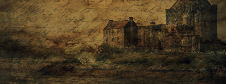

Nahodili jsme skicu mapy města (o kterém jsme nevěděli vůbec nic), na které byly písmeny označena místa. Kdokoli se mohl připojit tak, že si písmenko na mapě zabral a popsal jej. Při tvorbě se musely dodržet následující pravidla (z velké části inspirovaná právě pravidly Jasona Morningstara):

## Pravidla

1. Město je fantasy a doba odpovídá zhruba rané renesanci – po vynálezu knihtisku, ale před vynálezem muškety (takže z palných zbraní píšťaly a hákovnice). Obývají ho pouze lidé, neměly by se v něm vyskytovat žádná monstra a magie smí být pouze jemná a utajená.
1. Abychom udrželi společný charakter, používejte prosím jména [z následujícího seznamu](https://dl.dropboxusercontent.com/u/10337992/Mapa_mesto_drakkar_jmena.pdf) (jsou použity z projektu [Chrise Laninga](https://www.s-gabriel.org/names/christian/fairnames/givennames.html)).
1. Vyberte si písmeno z mapy a popište zajímavou lokaci, která se tam nachází. Používejte materiály a prvky z již vytvořených částí města a nepopírejte, co již bylo vytvořeno.
1. Pokud máte pokušení si z toho udělat legraci, pak mu prosím odolejte.
1. Autoři budou určitě rádi za zpětnou vazbu a nápady, ale prosím vás, abyste neposílali destruktivní kritiku typu „to je blbost“, „takhle to nikdy nebylo“ a „kde tam máš vodu“. Autoři mohou na základě komentářů své příspěvky vylepšit, pokud o to budou stát.
1. Každý smí popsat pouze jednu lokaci (vybrat si jedno písmeno)!

Ve výsledku se během jednoho měsíce sešlo celkem 16 příspěvků a s každým dalším se město dál a dál rozvíjelo, obohacovalo a prokreslovalo. Z bezejmenného města se stal Ravnsburgh, postupně se prokreslily jeho jednotlivé části, zjistili jsme, že ve městě vládne Hanza a původní šlechtický rod earlů (který dodnes vlastní Citadelu) už nemá velké slovo a město získalo hlavního obchodního konkurenta Dayhaven … a výsledkem je město, které si můžete přečíst na následujících stránkách.

Jak bylo zmíněno výše, budeme rádi, pokud se jím pro své hraní inspirujete – můžete ho použít celé a jen je zasadit do reálií vašeho světa (přejmenovat celé město, případně obchodního konkurenta na město, které již máte), vzít některou ze čtvrtí, použít nějaký prvek, případně jen nějakou zápletku. Pokud vás článek inspiruje a najdete pro nápady v něm obsažené využití, pak splnil svůj účel.

{:.map}

## Místa na mapě

#### A. Citadela

Ostrovní pevnost, chránící vstupy do ravnburského přístavu a sloužící jako rodové sídlo earlů z rodu Lochbearerů.

#### B. Brokátová čtvrť

Brokátová čtvrť je navenek ta nejútulnější a nejspořádanější část města. Její bohatí obyvatelé jsou sofistikovaná elitistická komunita a navzájem si tolerují tajné zvrácené koníčky, od incestu po kanibalismus.

#### C. Zlaté nábrežie

Zlaté nábrežie je cechová štvrť na serverom brehu ravnburského prístavu. Sídlia tu najbohatšie cechy, banky, pobočka Hanzy a žoldnierska kompánia Morskí vlci.

#### E. Slatina

Čtvrť postavená na bývalém močálu, kde neplatí zákony města a zdejší obyvatelé si vytvářejí svá vlastní pravidla. Změť přístavišť, rybáren, náleven, skladů překupníků, nevěstinců, obchůdků s pašovaným a kradeným zbožím.

#### F. Koliště, cvičiště pod hradbami

Na pláni pod hradbami se nachází cvičiště a střelnice městské stráže, jednou ročně se zde koná střelecká soutěž. Kapitán Beer vítá dobrodruhy jako cvičné protivníky, pokladník stráže Felbrigg kšeftuje se střelným prachem.

#### H. Zelená pevnost

Zelená pevnost, jeden z opěrných bodů městské obrany, v dobách míru trošku přehlížené, který má ve svých základech tajemnou starou svatyni.

#### I. Dobytčí trhy

Smrdutá část kus za městem, kde vládne životu trh s dobytkem a bourárna masa. Občas se vyplatí ztracené hledat zde, nebo naopak nechat tu něco zmizet.

#### K. Všelátná čtvrť

Čtvrť lékárníků, filosofů a alchymistů

#### L. Doky

Doky jsou čtvrť uzpůsobená práci na tvorbě lodí, voní dřevem a smolou. Účelovosti je podřízeno vše, právě z ní vychází péče o prosté dělníky. Slušné živobytí je vykoupeno prací a důsledně hlídaným pořádkem. Doky jsou skutečným zdrojem moci a bohatství Ravnburghu.

#### M. Malsterovo pole

Malsterovo pole je rozlehlé pohřebiště, kde se přes den scházejí počestní lidé k pamětním hostinám. V noci je naopak dějištěm pokoutných jednání nekalých živlů, jakož i cílem zhýralé mládeže provádějící zde nepřístojnosti.

#### N. Kapitulní škola sv. Leonarda

Kapitulní škola a knihovna bratří leonardiánů, mnichů v šedých kutnách

#### P. Rybářská vesnice Sharprock

Osada rybářů, dělníků a lesníků s vysokou mírou nezávislosti, situovaná východně od Ravnburghu. Nenápadná vesnice je ve skutečnosti tajnou základnou vyzvědačské sítě Červená perla, kterou zde pod patronátem sousedního města Dayhaven řídí bratři Foxové.

#### Q. Južná pevnosť – Nomam

Uhladený, usporiadaný, čistý a spokojný výzor Nomamu je zásterkou a reklamou bankového domu rodu Kentovcov i žriedlom informácií, ktoré zhŕňajú Červené Hviezdy. „Za peniaze je možné kúpiť všetko.“ – toto konštatovanie sa stalo neoficiálnym heslom Južnej Pevnosti.

#### S. Stoky

Tajuplné a rozlehlé stoky, které tu byly dříve než město samo.

#### Æ. Ægirsker, ostrovní svatyně

Ægirsker je staré obřadní místo svázané s bohy moře, které i dnes hraje důležitou roli v duchovním životě místních. Tajemný ostrov je plný připomínek dávno minulých časů a opředen mnoha zkazkami a lokálními pověstmi.

#### Œ. Cobhamův útes

Nevelký ostrov se strmými břehy, spíš útes čnící až na hraně šelfu. Je místem zapomínání, odevzdávání věcí a někdy i životů moři. Málokterý převozník vás na něj vezme, pověrčivý lid přístavu ho nemá v lásce.

#### Z. Řetěz přes záliv
