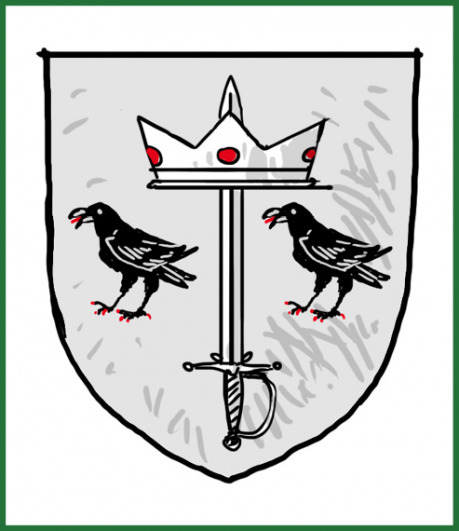

Citadela je sídelní ostrovní pevností vládnoucího rodu Lochbearerů. V jejím centru stojí earlova věž, známá spíš jako stará věž, neboť její původ nelze v zápisech vysledovat. Zbývající části jsou výsledkem postupné dostavby. Oblast kolem staré věže odděluje vnitřní hradba. Památka první přestavby, kdy kolem věže vyrostl hrad. Za vnitřní hradbu mohou pouze členové rodu, jejich nejbližší přátelé a služebnictvo. Mezi vnitřní a obvodovou hradbou se nachází nepatrné městečko, jehož obyvatelé jsou svázáni s vládnoucím rodem. Služba rodu se stala dědičnou.

Obvodová hradba je posázena několika věžičkami. Dvě boční věže stráží a obsluhují řetěz a dle délky řetězů se jim také říká Malá a Velká. Jsou jedinými, které měly vždy posádku – a to i tehdy, když na rod přišly hubené časy. Další dvě věže chrání maličký přístav, který zajišťuje spojení Citadely s městem. Zbývající věžičky nejsou ničím jiným než většími střílnami, které slouží palným a vrhacím zbraním.

Citadela byla (a Lochbearerové věří, že i bude) mocenským centrem města. Legendy se liší ve vyprávění o zakladateli rodu, ale shodnou se, že šlo o mladšího bratra krále Williama, který získal město a titul earla. Postupem času ovšem z rodiny vyrostla mocná a bohatá konkurence. Napětí vyvrcholilo občanskou válkou. Někteří historici tvrdí, že právě chaos války byl hlavní příčinou vzniku hanzy a obecně cechů, neboť bylo nezbytné zastoupit chybějící vládu. Válku ukončila mírová dohoda, která garantovala městu do té doby nevídanou autonomii. Autonomie neznamenala nezávislost pouze na královské moci, ale též ve vztahu k earlům. Hanza se dočkala oficiální legitimizace a díky půjčkám svých členů jednotlivým stranám konfliktu se stala významným hráčem. Nastala doba, kterou bratr Ciril popisuje jako vítězství pokladníků nad rytíři. Hanza použila svoji oblíbenou strategii a v městské radě prosadila snížení berní na úroveň, která umožnila pouze provoz města. Pánům Citadely zůstali jen vlastní příjmy a velké dluhy z války. Vykonávat všechny funkce spojené s vládou městu pro ně bylo finančně nemožné. Hanza jim ráda půjčovala, ale tím jen zvyšovala svůj vliv.

Vše se změnilo s nástupem děda současného pána Citadely. Ronald Mazaný mu říkali otevřeně, ale za jeho zády mu nikdo neřekl jinak než Svině úskočná. Ronald opustil tradice ve prospěch pragmatismu. Byl prvním, kdo nepřijal křest ve slané vodě z vůle „Mořského starce“ (viz Æ. Ægirsker). Všechny překvapil, když si za ženu vzal dceru Allena Kenta, stejně překvapující bylo i věno. Mnozí říkají, že na velikost věna měl vliv i fakt, že Allen Kent získal z rukou Ronalda dědičné právo na pevnost Nomam (viz Q. Jižní pevnost – Nomam). Svazek dvou pragmatiků se ukázal být velmi výhodný pro obě strany a od této doby se pánové z Citadely nežení dle urozenosti, ale dle věna.

Tím se dostáváme k současnému earlovi a vládci Citadely Malcolmovi a jeho synům. Henry, prvorozený a dědic Citadely, v jeho chování se odráží to „nejlepší” z Brokátové čtvrti (B). Zaplétá se s děvami lehkých mravů, dokonce se říká, že jednu si plánuje vzít. Jeho perverzní choutky a dekadentní životní styl ohrožují vzestup rodu. Druhorozený Gregory je jako zjevení z dávných legend. Rád by přijal křest ve slané vodě, ale jelikož není dědicem, tak mu byl odepřen. Na odiv dává rytířské ctnosti a s mečem je tak dobrý, že by jej dokázal porazit pouze Avery Askew (viz L. Doky). Jenže nechvalně proslulý kapitán Kožených krků je jeho nejlepším přítelem. Oba svedl dohromady meč a touha po disciplíně a řádu. Piloval své umění na nádvoří Citadely. Brzy bylo jasné, že pouze Gregory s ním dokáže držet krok. Podobný pohled na svět a hlavně na dekadentní poklesky je ještě více spojil a Gregory se od něj hodně přiučil při modernizaci Strážců Citadely.Gregory touží vládnout tvrdou rukou vojenského velitele. Přestože pohrdá obchodníky a jejich způsoby, tak přijal za své motto Ronalda Mazaného „Účel světí prostředky”. Šušká se, že by si velmi přál, aby město zabředlo do války s Dayhavenem. Dokonce, že tomu nepomáhá. Jeho procházky do Sharprocku tomu napovídají. Ve válce totiž nerozhodují obchodníci, ale utíkají pro pomoc k válečníkům. Lid nevěří, že by ctihodný Gregory byl něčeho takového schopný, přesto je ta představa děsí. Gregory i přátelé ví, že toho schopný je, ale zůstávají klidní, protože jim je jasné, že pokud otevře nepříteli brány, tak jen proto, že za branou bude čekat tisíc kuší a hroty Strážců.
