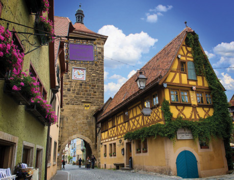

Brokátová čtvrť sice patří ke starému městu, ale je od jeho zbytku prakticky k nepoznání. Staré kamenné budovy nejsou nahrazené ani výrazně přestavěné, naopak. Vše je perfektně opraveno a zrestaurováno, omítnuto sytými barvami a doplněno o mnohá tesařská rozšíření; terasy, balkony, zvýšená podkroví, podloubí, dokonce i mosty nad ulicemi. Vše je architektonicky konzistentní, řemeslně perfektní, ozdobené květinami a sebevědomě na hraně kýče a vřelé útulnosti.

Ulice každý den ožívají stánky, voňavým jídlem, překrásným uměním a veselou hudbou. Brokátová je vzorem poklidné civilizace a oblíbeným místem mnoha měšťanů a zejména projíždějících cestovatelů.

Zdejší obyvatelé jsou na svou pověst hrdí a dbají, aby ji nikdo nepošpinil. Slouží jim jako věrohodná maska, za kterou skrývají všechny své zvrácené koníčky. V celé čtvrti žijí pouze bohaté rodiny se svým služebnictvem a všichni se mezi sebou znají. Dokonce mají interní hierarchii a sofistikovanou etiketu, kterou neradno porušit. Svátky, narozeninové oslavy, svatby, čtvrtletní schůze, to všechno doprovází roztodivné zvyklosti jako ‚hostitel sedí vždy vedle nejbohatšího návštěvníka‘ nebo ‚nejmladší dívka nesmí nikdy mít honosnější šaty než nejstarší žena‘.

Nejpodivnější je ovšem jejich ochota plně přehlížet úchylné chování svých sousedů. Nejedná se jen o hlasitý sex nebo ponižování služebnictva, ale o skutečné bakchanálie; krvavé orgie, incest, zvířecí masky, vivisekce, harémy otroků, kanibalismus, omamné látky, vzývání zapovězených bohů. Prakticky každý nějaké tajemství skrývá. Přesto jsou schopni o nich na společných akcích konverzovat a pomáhat si, i když nikdy nic neprozradí explicitně.

Není divu, že se musí čas od času uchýlit k nezákoným zákrokům, aby svůj dekadentní ráj zachovali. Nepřizpůsobiví sousedé záhadně umírají, žebráci přes noc mizí, městské stráže jsou podplacené a nová budova úřadu je přímým tunelem propojena s tavernou U Oběšence (viz E).

#### Možné zápletky:

- V boháčovi se na smrtelné posteli hnulo svědomí a odkázal své majetky chudým, včetně dvou domů. Znechucení sousedé potají najímají družinu hráčských postav, aby diskrétně nevhodné obyvatele vystrnadily.
- Vlivný obchodník najímá družinu hráčských postav, aby po dobu příštího týdne sloužily jeho nejstarší dceři jako osobní strážci. Dcera prochází rebelskou fází dospívání a otec při uzavírání kontraktu implikuje důležitost ochrany jejího panenství. Na konci týdne ji předloží démonům, aby mu později porodila magicky nadaného potomka.
- Arthur Urswick (viz N) již několik měsíců marně proniká do tajů podivných zvyků zdejší smetánky. Nadešel čas obětovat peníze řádu k najmutí družiny hráčských postav k infiltraci vyšší společnosti v Brokátové čtvrti. K rozbití a odsouzení bohatých nestačí náznaky a nepřímé důkazy. Arthur je ovšem pragmatický a krutý; pokud jeho agenti selžou, nechá je napospas osudu, přestože jim předtím nasliboval mnoho podpory.
