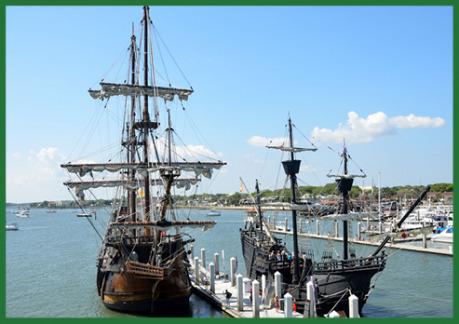

Zlaté nábrežie je cechová štvrť mesta pomenovaná po svojej južne orientovaných honosných priečeliach cechových sídiel takmer stále zaliatych slnkom. Neoficiálne je štvrť nazývaná Zlatým nábrežím hlavne preto, lebo je tu koncentrovaného veľa bohatstva – sídla bohatých cechov, pobočka Hanzy, niekoľko menších obchodníckych bánk a slávnej žoldnierskej kompánie Morských vlkov.

 Boháči majú z cechových sídiel pekný výhľad na súkromnú, relatívne tichú a čistú časť prístavu, kde môžu pristávať len ich súkromné lode, ktoré majú cez Malú reťaz prednostný prístup k mólam.

Hanza v Ravnburghu združuje cechy, spoločnosti a rodiny venujúce sa luxusnému a drahému tovaru a službám: zlatníkov, nožiarov, puškárov, bankárov, obchodníkov s korením, zástupcov troch najstarších (a najbohatších) šľachtických rodov: Grofhurstovcov vlastniacich strieborné bane, Lumbardovcov vlastniacich železné bane a Sansberryovcov vlastniacich soľné bane, Konvent, Archivárov a Morských vlkov.

__Hanza__ svojim členom zabezpečuje lepšie obchodné podmienky a nižšie clá vo všetkých mestách združených do Hanzovnej ligy, mestách mimo ligu, kde má Hanza svoje pobočky (takzvané kontory) alebo v prípade veľmi vzdialených či malých prístavov len svojho zástupcu či sklad. Okrem toho Hanza sprostredkúva ochranu cechových sídiel, dielní, lodí a karaván cez sieť preverených a spoľahlivých žoldnierskych kompánií vrátane Morských vlkov, na hanzovnom súde rieši obchodné spory svojich členov, alebo im poskytuje právne služby v sporoch a jednaniach s tretími stranami.

Hlavou ravnburskej Hanzy je vojvoda Oswyn Marchefort, v jeho neprítomnosti ho zastupuje hlavný advokát barón Tobias Mowfurth. Sídlo Hanzy chráni vlastná Hanzovná stráž pod velením kapitána Arthura Trebonwella. Hanza v poslednej dobe dostala niekoľko stažností o chýbajúcich lodiach, ktoré sa nevrátili načas aj napriek najatej ochrane. Tlak na vyšetrovanie sa stupňuje a Hanza bude musieť niečo veľmi rýchlo urobiť, aby nestratila svoju autoritu.

__Morskí vlci__ sú slávna žoldnierska kompánia, ktorá poskytuje svoje služby výlučne členom Hanzy. Špecializujú sa najmä na ochranu kupeckých lodí, ale ak tovar putuje aj po zemských cestách, ochraňujú ho na celej trase, vode i zemi. Momentálne Vlkom velia súrodenci Oliver a Emma Raynsfordovci. Vlci sa rekrutujú z radov gallowglasských klanových bojovníkov v tradičných kiltoch a plášťoch.

Morskí vlci vlastnia dve väčšie lode, Muninna a Huginna, a pať menších, Gunnr, ­Hildr, Hrist, Mist a Sigrún. Muninn aj Huginn sú troj­sťažňové karavely 22 metrov dlhé a 6 metrov široké s výtlakom okolo 150 ton, posádkou 60 Vlkov a ôsmimi delami. Menšie lode sú dvojsťažňové karavely, 15–16 metrov dlhé s výtlakom okolo 50–60 ton, niekoľkými menšími strelnými zbraňami a posádkou okolo 20 Vlkov. Špecifickým poznávacím znamením vlčích lodí sú červené plachty s bielou vlčou hlavou a skríženými zbraňami – obojručným mečom (claymore) a sekerou (sparth axe).

Posádku tvoria dôstojníci (kapitán, strelmajster, bocman, chirurg) a žoldnieri rozdelení na strelcov (s píšťalami, hákovnicami, lukmi a kušami) a bojovníkov (s obojručnými mečmi a tradičnými sekerami na dlhej násade). Aj strelci aj bojovníci majú okrem hlavných zbraní dlhé nože, sekery, helmy a krúžkové košele oblečené cez prešívanice (ktoré však do boja na mori zvyčajne nenosia).

Vo Vlčom brlohu, sídle kumpánie, sú väčšinou aspoň dva tucty bojovníkov na menšie práce a doprovody, nováčikovia vo výcviku alebo zotavujúci sa zranení Vlci.
