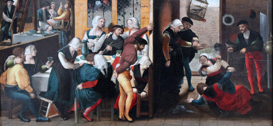

Za severními hradbami Starého města se přístavní uličky zužují a zamotávají, přičemž ústí do labyrintu průchodů, můstků, schodů a úzkých koridorů, jež vytvářejí Slatinu. Tato čtvrť je z velké části postavena na bývalé mokřině, do které se celá pomalu potápí. Je tvořena změtí přístavišť, náleven, skladů překupníků, obchůdků s pašovaným a kradeným zbožím a nevěstinců, namačkaných na sebe. Městská stráž se většinou do zdejších uliček odváží jen málokdy. A to vždy jen ve velkých počtech a za denního světla, kdy je doprovází temné pohledy přihlížejících. Místní si dělají vlastní pravidla a odpovědí na otázky strážců zákona je jen zaryté mlčení. I pro náhodného návštěvníka to může být nebezpečné místo, kde si musí dávat pozor. Každý, kdo překročí nepsané zákony, dostane jen jedno varování. Další prohřešek většinou znamená, že provinilec prostě zmizí a už ho nikdo neuvidí. Šušká se, že takoví skončí pohřbení pod základy domů, které se propadají do mokřadů, případně zatížení kameny a shození do moře kus od břehu.

Slatina je domovem rybářů, psanců, upr­chlých otroků, říčních tuláků, cizinců, kterým je zapovězen vstup za hradby, pirátů a pašeráků. Celá čtvrť smrdí sušícími se rybami a sítěmi, ale kromě právě rybaření mají místní největší zisky z pašeráctví. Slatina poskytuje lodím přístaviště ještě před řetězem, který chrání vjezd do přístavu. Umožňuje jim tak vyhnout se placení mýt a cel. Vyložené zboží je pak pašováno dál do města v barelech s rybami, tunely (jejichž existence a umístění je tajemství známé jen málo lidem), případně za bezměsíčných nocí na vozech po cestách dál.

Nekorunovaným králem celé čtvrti je Gilbert Ayleward, který má pod palcem většinu obchodu s pašovaným zbožím. Ve Slatině se nic nepohne, aniž by o tom Ayleward nevěděl, případně to neschválil. Jeho muži s červenými šátky na pažích vybírají poplatky od překupníků, hostinských a nevěstek a dlouhými holemi udržují ve čtvrti pořádek. Samotného Aylewarda lze s jeho kapitány většinou najít v zaplivané taverně U Oběšence, odkud řídí svoji živnost. Stísněná a zakouřená nálevna, do které se nevejde víc než několik dlouhých stolů, u kterých se mačkají námořníci a rybáři, podle knih patří tlustému hostinskému Gobberdovi. Ten sice leští sklenice u baru, všichni ale ví, že o všem v hostinci i celé čtvrti ve skutečnosti rozhoduje nenápadný muž v rohu místnosti, jehož oči bystře sledují nově příchozí.

#### Možné zápletky:

- Postavy ve Slatině někoho hledají (Snad přítele? Protivníka? Uprchlíka, který se tu skrývá a platí si za ochranu?), ale odpovědí na otázky je jim nevraživé mlčení. Místní se nebudou bavit s cizinci, kteří navíc mohou být špehové městské stráže. Dalším vyptáváním mohou také přijít k úrazu, družina ale potřebuje nutně danou postavu najít. Odváží se tedy oslovit Gilberta Aylewarda? Bez jeho souhlasu se ve Slatině prý nepohne ani myš, takže určitě něco ví … Je ale otázkou, jaká bude jeho cena za to, že promluví.
- Několik holek od Šilhavé Ellen (jednoho ze slatinských bordelů) osloví ve městě nejistě postavy a nabídnou jim práci. Bohatý šlechtic z Brokátové čtvrti (viz B) si zaplatil za čas s Margery, jednou z nich – ale v jejím pokoji ji omráčil a zohavil. Dívky se také dozvěděly, že Margery nebyla první napadenou. Zkoušely se obrátit na městskou stráž, ale kvůli pár zohaveným děvkám se nikdo nepostaví proti důležitému členovi Hanzy. Pokud ale dívky nemohly dostat spravedlnost, spokojí se s odplatou – přestože nejsou bohaté, složily se na odměnu pro toho, kdo zvráceného šlechtice zastaví.
- Postavy potřebují dostat z města dceru významného šlechtického rodu, která chce utéct před nerovným manželstvím, do kterého je nucena. Kvůli poplachu ve městě ale nemohou dámu dostat přes brány ani přes řetěz a městská hlídka začíná prohledávat domy v oblasti, kde se ukrývají … Jako jediná možnost se rýsuje kontaktovat pašeráky ze Slatiny.
