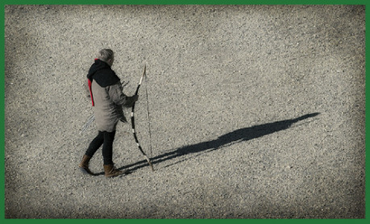

Od malé, tzv. Zelené brány v západních hradbách Starého města vede cesta k Zelené pevnosti (viz H), jež získala své jméno podle nazelenalé břidlice, z níž je vystavěna. Pod hradbami a podél cesty se pak rozkládá pláň zvaná Koliště. Nachází se zde cvičiště městské stráže a téměř pod svahem Zelené pevnosti také střelnice pro městské lukostřelce a kušiníky.

Na střelnici se jednou ročně tři dny před letním slunovratem pořádá lukostřelecká soutěž o ceny, které nemají příliš velkou hodnotu, ale dobré umístění většinou znamená, že se seznámíte s vlivnými lidmi ve městě. Naopak při prvním sněhu (anebo tři týdny po zimním slunovratu) se postupně celá hlídka na střelnici vystřídá, aby si každý člen připomněl anebo se naučil střelbu z hákovnice a píšťaly – trénovat přesnost střelby by postrádalo smyslu, a tak jde jen o to, aby obránci města dokázali zacházet i s těmito novotami.

Na cvičišti se téměř každý den aspoň pár hodin pohybuje kapitán Mathias Beer, aby cvičil členy stráže. Připojit se ale téměř vždy můžou i dobrodruzi, protože jsou vítanými cvičnými soupeři a kapitán Beer se rád přiučí leckteré fintě – a když má dobrou náladu, může leccos naučit i dobrodruhy. Stejně jako na „plac“, můžou dobrodruzi i na střelnici, ale zde se smí používat pouze městské šípy a šipky, které prodává v malé kanceláři u Zelené brány pokladník stráže Edmund Felbrigg. Střelivo není drahé, ale vzhledem k tomu, že není povoleno šípy sbírat, hlídka si tímto způsobem přilepšuje rozpočet. A občas si prodejem střeliva (nejen obyčejného), či dokonce střelného prachu vylepšuje rozpočet sám Felbrigg. Beer to nevidí rád, ale pokud se neprodává velké množství, přivírá oči. Proto tímto způsobem běžně získáte nejčastěji 5–10 dávek do houfnice a je (téměř) vyloučeno dostat víc než dvoulibrový balíček.

Pokud hledáte nějakého dobrodruha, chcete se seznámit s někým z městské hlídky nebo se toužíte naučit novou bojovou fintu, je Koliště vaše místo. Pokud je vaším záměrem pořídit nějaké šípy nebo trochu střelného prachu, vyhledejte Felbrigga … a nachystejte si pár mincí, ať ho jen neurazíte.
