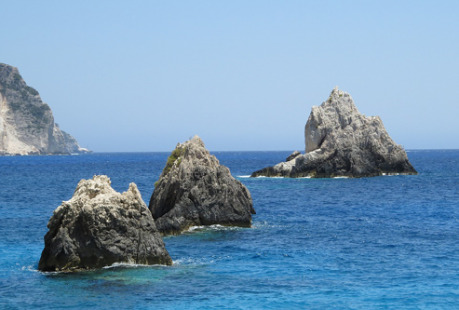

Skalnatý ostrov, jehož černé útesy se vzdorovitě tyčí nad burácejícím příbojem. Ægirsker, jak se mu říkalo od nepaměti, je záhadným a tajemným místem, které uchovává památky na dávné časy. Východní útes ostrova byl opracován a zpola z něj vystupuje obrovská mužská postava hrubých rysů, třímající v natažené paži mísu. Říká se jí Pán moří. Nikdo neví, zda ji vytesali předkové dnešních obyvatel města, nebo jiný národ z šerého dávnověku, ani proč nebyla řádně dokončena. Dávní obyvatelé také zanechali všude po ostrově rytiny a ve skalách vytesané příbytky a chodby. Proplétají se celým ostrovem jako labyrint a jen některé jsou dost vysoké, aby umožnily pohodlnou chůzi.

Přímo pod útesem Pána moří stojí vztyčené a kameny s rytinami uspořádané do kruhu. Největší kámen, nacházející se přímo pod nohama nedokončené sochy, nese nápis ᚫᚷᛁᚱ. Za přílivu voda sahá až do poloviny kamenů, ale když přijde odliv, dá se na místo dojít suchou nohou. Právě na tomto místě se v minulosti obětovalo. Jak šel čas, měnila se jména mořských bohů, ale některé zvyky a tradice zůstávaly. I v dnešní době, kdy uctívání starých bohů ustupuje reformovaným náboženstvím, má Ægirsker stále pevné místo v duchovním životě obyvatel města.

Říká se, že pohanští předkové obětovali u kamenů dobytek nebo i děti, aby si usmířili rozběsněné živly, zajistili si bohaté úlovky nebo bezpečnou cestu do dalekých krajů. Dnes už se takové oběti nekonají, jen pověrčiví rybáři nechávají na obřadním kameni skořápky mušlí, aby utišili hněv moře a nezastihla je na moři bouře. Někteří ale věří starým povídačkám a připlouvají sem obětovat ovce nebo kozy v naději, že Pán moří se za krev odmění zlatem nebo jinými poklady, které moře čas odčasu může vyplavit.

Na ostrově žije jediná živá duše – „Mořský stařec“, poustevník, který se stará o místní svatyni. Pod jeho vedením se tu kdysi konaly obřady a z jeho vůle přijímali dávní pánové Citadely křest ve slané vodě, aby potvrdili svůj nárok vládnout. Rituál se ale už více než půl století nekonal, snad proto, že teď město řídí Hanza, snad proto, že poslední vládci Citadely zanevřeli na staré zvyky. Živou tradicí je ale Vítání úhořů a během tohoto svátku vyráží ráno k ostrovu průvod zdobených lodí, od malých rybářských bárek po větší plavidla. Na jejich palubách se hoduje a veselí až do noci, a když je dobrý rok, lze spatřit světélkující úhoře, kteří připlavali z řeky, aby se v moři rozmnožili.

Poněkud pochmrunější je Svátek bludných, kdy po setmění vyráží k ostrovu loďky ověšené lampiony, lidé se shromažďují pod sochou Pána moří, zapalují svíce a vzpomínají na ty, kteří se utopili nebo ztratili na moři. Někteří posílají na moře malé vyřezávané lodičky se vzkazy či osobními předměty, věří se, že si najdou svého adresáta, ať už je kdekoliv. Tu noc také prý mořská bríza přináší hlasy ze záhrobí a po půlnoci noc patří mrtvým. Vypráví se, že v tu dobu připlouvají lodě duchů a mrtví na ostrově zanechávají vzkazy živým. Nikdo soudný na ostrově po půlnoci nezústává. Kromě Mořského starce, ten ostrov nikdy nepouští.

Stařec je i správce majáku a stará se o zásoby dřeva, které sem pán Citadely posílá. Když je tma nebo mlha, zapaluje oheň v obrovské míse, kterou drží socha Pána moří, aby lodě nenajely na skaliska. Chodbami ve skále se dá dostat až na ramena sochy, ale dojít přes paži až k míse je obtížný úkol kvůli zrádně kluzkému kameni a silnému větru. Traduje se, že poustevník nemůže zemřít, dokud svůj nelehký úděl nepředá, ale to může jen trosečníkovi, kterého vyvrhne na ostrov samo moře.

Odliv odhalí kamenitý šelf plný ostrých skalisek, porostlých řasami a slávkami. Ostrov pak připomíná bizarní hřbitov. Mezi kameny vězí kostry velryb a jiných mořských obrů a také zpuchřelé zbytky potopených lodí. Říká se, že za odlivu se dá skrze některé chodby sestoupit hluboko pod ostrov, do míst, která nesou stopy opracování, ale nikoliv lidskýma rukama. Svítí tu prý přízračné světlo, chodby mají nepřirozené tvary a dají se tu najít zvláštní artefakty z perleti a jiné poklady. Vzácně takové věci vyplaví moře i na břeh. Většina těch, co se tam vypraví, už se ale nevrátí. Městem kolují zkazky o mořských příšerách, rybích lidech či o tom, že pod ostrovem je vstup do Podsvětí.

#### Možné zápletky:

- Slatinou obchází strach. Kolují řeči o dvou sourozencích, kteří podezřele rychle zbohatli – krátce poté, co měl jejich třetí bratr „nehodu“ na moři. Zlé jazyky tvrdí, že to nebyla žádná nehoda, ale že ti dva svého bratra obětovali u Ægirova kamene. Bratři začali rozšiřovat podnikání a začala se kolem nich formovat skupina následovníků. Pak se záhadně ztratil jejich obchodní rival. Od té doby se na ty dva každý bojí byť jen křivě podívat, ze strachu, že ho odvlečou v noci z domova a obětují u kamene. Je na těch řečích něco pravdy anebo je to celé jinak? Krále pašeráků Gilberta Aylewarda (viz E) to rozhodně nenechává chladným, ale chce skrýt své zapojení – proto bude ideální najmout někoho mimo Červené šátky …
- Citadela (viz A) má nového pána. A ten nedávno veřejně prohlásil, že se chystá nechat pokřtít od Mořského starce na Ægirskeru. Něco takového nepamatují ani nejstarší pamětníci. Hanze dělá takovéhle prohlášení vrásky, rituál totiž v minulosti stvrzoval nárok vládnout nejen Citadele, ale i městu. Navíc se mezi lidmi šíří zvěsti, že nový pán Citadely je potomek dávného rodu, který kdysi vládl celému městu i kraji. Co nový pán Citadely zamýšlí? Je to jen politická hra, úcta k starým tradicím anebo je za tím něco jiného? Baron Tobias Mowfurth (viz C), hlavní advokát Hanzy, hledá někoho, kdo celou záležitost diskrétně prošetří …
- Mladý šlechtic se chystá o Svátku bludných na výpravu na Ægirsker v naději, že se zde po půlnoci setká se svou dívkou, která utonula před několika měsíci při lodním neštěstí. K tomuto pošetilému podniku ho ponoukl jistý učenec, se kterým se setkal ve vetešnictví Adama Sayera (viz N). Starý sluha má ale o mladého pána strach, a tak naléhá, aby si pán alespoň sehnal někoho, kdo ho ochrání před duchy a přízraky. Nebo snad jiným nebezpečím? Nemá snad onen učenec nějaké jiné motivace? O zapojení dalších lidí ale mladý pán nechce slyšet, takže věrný sluha musí jednat za jeho zády …
