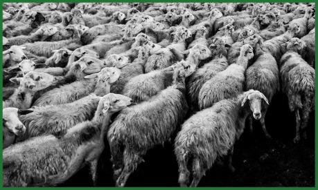

Každý den ráno, sotva se rozbřeskne, je slyšet již z dáli na cestách řev honáků, pastevců a bučení dobytka. Rytmicky je doprovázejí zvonce zvířat a štěkot psů … Přesně s osmým úderem zvonu na Citadele, přesně podle pravidel se otevírají ohrady trhů.

Jatka, smrad, chlast, okradení farmáři či překupníci s plnými měšci a truhlicemi, kteří jsou od poledne buď u Bučícího Vola, hospody třetí kategorie, zato s pěknou prsatou šenkýřkou Bowel Fawres, nebo u Vyschlého rypáku, nálevny stejné úrovně, zato pod vedením starého krkavce Jadera, zvaného rypák. Člověk si moc nevybere, pokud by musel, tak se raději doporučuje Rypák, tam nehrozí, že vás nějaká kurva zatáhne do pokojíčku a okrade i o poslední peníze, co z trhu nesete. Je úplně jedno, jakou trhy mají pověst, každé ráno stojí farmáři znovu u brány a večer, když se zavírá, vesnice ožívá nefalšovaným životem předměstí. Ruleta, karty, souboje na nože a kohoutí zápasy.

Ale pravou šedou eminencí je majitel tržnice a jatek Gard. Každé kilo váhy dobytka je jeden stříbrňák jemu do kapsy. Z těchto milodarů si platí luxusní dům v Brokátové čtvrti. Největším zlatým dolem je obchod s kafilerním masem do hospod, kde si jeho sousedi pochutnávají na vyhlášených specialitách.

Snadno zde dojde neopatrný člověk k úrazu nebo snadno necháte někoho zmizet … Práce na jatkách přináší časté úrazy. Vojáci se celkem často dostavují, hlavně když je pošle Hanza, aby Gardovi přišlápla nohu v tom jeho kvapíku a honu za penězi. Většinou se ale spokojí s obětí nějakého dělníka, kterého odvlečou do lochu, pár penězi či pozvánkou na jeden z Gardových mejdanů s děvkami v jeho paláci. Pokud ale dojde na nutnost něco ztratit, nebo naopak doručit bez kontrol, tak hovězí žaludky dokážou skrývat různé poklady.

Mimo špínu a prach je zde každý měsíc konána soutěž ve výběru nejhezčího černého býka, zbytek tradice, kdy tento býk byl na obecní náklady zakoupen a potom v čistém bílém rouše s bronzovým zvonem kolem krku veden městem a obětován u svatyně. Legendy říkají, že jednou městem pojede nevinná pana na hřbetu dvoumetrového býka, a na koho se podívá, ten najde doma bohatství. Ale čert vem legendy z loutny ožraly barda Marigolda … Šup mu decku šňapsu, aby začal pět o očích madam Rosmery, nejhezčí děvky města, teda budoucí paní Citadelníkové …

#### Možné zápletky:

- Je pár dní před slavností a ze střežené ohrady se ztratil právě jeden ze skupiny kandidátů na vola roku, tedy zvíře, co se má obětovat … Je za tím konkurence chovatelů nebo snaha narušit očekávanou slavnost?
- Jedna ze zásilek masa obsahovala tajemný vzkaz na kousku svitku v pečínce. Dostala se na stůl prominenta a teď je z toho haló. Ono taky když ze steaku na vás po rozříznutí vypadne prst s prstenem významného člověka města …
- Co to tam jen ten šejdíř Gard kuje? Postavu si najme jeden z učenců, aby přišel na kloub tomu, co ho zajímá …
- Jistě omylem družina propila vše, co má, a záhadný člověk za ně zaplatil dloužek u Bowel. Jenže nic není zadarmo a návrh Bowel odpracovat dluh na jejím kyprém sádelnatém těle by byla procházka rájem. Místo toho se musí vydat do jatek. Najít a zachránit bratra postavy … Jenže, co když on není ani tak unesen a nepotřebuje zachránit, jako spíš to, že zde likviduje oběti, které unáší on sám …
