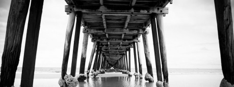

Pod západní hradbou jižní části města vyrostly Doky. Patří Hanze, alespoň většina z nich, ovšem faktickým pánem doků je Henry Clopton. Původem prostý hanzovní tesař se vypracoval přes všechny námořnické a loďmistrovské pozice až k vlastní vlajce. Jenže té si dlouho neužil, v bitvě s privatýry sloužícími Dayhavenu přišel o nohu, a co hůř, utrpěl zranění hlavy, což ho přinutilo opustit moře – stal se příliš náchylným na mořskou nemoc. Svou energii a přičinlivou mysl tak cele vložil do reorganizace městských loděnic. To se mu dařilo tak dobře, že se stal kapitánem všech doků ve městě, nejen hanzovních. Jeho metody nejsou složité – věděl dobře, co dělníci potřebují k tomu, aby mohli odvádět slušnou práci, a zajistil jim to. Takže se z doků stala možná nejspořádanější, ale také nejnudnější čtvrť ve městě. Velká část starých domků byla nahrazena uniformními stavbami organizovanými samotným Cloptonem. Někde dokonce vznikly přímo ubytovny pro tovaryše a pomocné síly. Péče o své lidi, posádku lodě Dock, jak sám s pýchou říkává, mu vynesla to, že přezdívka Černá tvář (další následek zranění) je užívána spíše s úctou než s posměchem. Ovšem pouze za jeho zády, Henry hodně lpí na oslovení Kapitán. Asi stejně jako touží po právu přestěhovat se do Brokátové čtvrti (viz B), již vnímá jako symbol skutečné urozenosti. To je mu však přes nesporné zásluhy a značný majetek pro jeho nízký původ zapovězeno.

Domky a ubytovny jsou zřízeny ve tvaru podkovy kolem obrovského skladovacího prostoru, kde kromě desítek bud, kolen a přístřešků jsou snad nekonečné řady dozrávajících kmenů – dubů, borovic, habrů, jilmů a desítek dalších. Jejich vůně dodává celé čtvrti něco z atmosféry horské vesnice. Sklady smoly pak byly důvodem, proč Doky jako jediná z ravnburských čtvrtí mají stálou požární hlídku. Poslední strana skladů pak přímo přiléhá k vlastním loděnicím. Nalézt tu lze jedinou hospodu – Ráhno, nacházející se na západním okraji poblíž vody. Slouží spíš jako sociální a náborové centrum, kde se shánějí noví pracovníci a podobně.

Hned vedle Ráhna je zbrojnice Kožených krků, požární hlídky pojmenované podle lidového označení lodních strážců. Haledéři mají za úkol strážit sklady cenného dříví, ale s Cloptonovým svolením i celou čtvrť a pořádek v ní. Jejich dohled je dosti nekompromisní – tak jako i malý požár v prostoru přeplněném dřívím, smolou a plachtami. Kožené krky nosí dlouhé původně mooringové háky, kterými strhávají hořící střechy a případně celé domy, aby se oheň dál nerozšířil. I druhý nástroj se vyvinul původně z lodního vybavení – krátké sekery se hodí jak do pranice, tak na nouzové otevírání dveří. S oběma zbraněmi absolvují náročný a důkladný výcvik. V případě potřeby mají k dispozici i dvouranné kuše, osobní palné zbraně nepoužívají. Jejich konstrukce je přísně střeženým tajemstvím a zřejmě Henryho vlastním vynálezem. Kromě Doků haledéři střežili i rozsáhlé pozemky na jih od města, jež Henry nechal osazovat dubovými a borovými háji, aby i za 150 a více let bylo z čeho stavět lodě.

Koženým krkům velí kapitán Avery Askew, vysoký, štíhlý a pohledný elegán, vynikající šermíř a neméně schopný taktik. Jako vzdálený potomek jednoho z urozených rodů nosí dlouhý meč, ve městě lze najít nemálo rodin, jež přišly o nějakého svého člena v souboji s ním. Zatímco pro Cloptona je pořádek nástrojem k dosažení cíle – budování stále lepších lodí a jejich rychlé opravy – tak pro Askewa je přímo posedlostí, kterou rád přenáší na své požárníky … V důsledku toho nejsou Doky zrovna nejpříjemnější čtvrtí pro cizince či jiná podezřelá individua. Ta nejpodezřelejší pak čeká rozhovor s otcem Simeonem, Strážcem tajemství Doků. Přesto je zde mnoho důvodů, proč se sem vypravit – práce je zde vždycky dost (a zdaleka nejen dělnické), najdete zde ty nejlepší řemeslníky z oborů využitelných na moři, školu ranhojičů, bochaus – neoficiální cech lodních poddůstojníků.

Otec Simeon, bývalý lodní kněz a Cloptonova pravá ruka, má za své poslání zabránit tomu, aby se některé z nesčetných tajemství ravnburské stavby lodí nedostalo do rukou konkurence, ať již obchodní, nebo válečné. A že těch tajemství je požehnaně – Clopton, ač konzervativní jako každý námořník, si je dobře vědom významu pokroku a neváhá vynaložit velké částky na získání tajemství druhých nebo na výzkum těch vlastních. Za trosky jakési velmi exotické lodě a jediné dva přeživší členy její posádky zaplatil Mořským vlkům (viz C) dokonce generální opravou obou jejich velkých lodí. Tenhle výměnný obchod skončil málem krvavě, na lodích nezůstalo prkno na prkně. Po prvních několika bitvách Vlci Cloptona a jeho muže odprosili – jejich lodě neměly sobě rovné.

#### Možné zápletky:

- Postávám je nabídnuta bohatá odměna, když zapálí sklad smoly, který se nachází v nejstřeženější části Lagerholzu – ústředního skladiště. Mise je to riskantní sama o sobě – zapálit desítky tun smoly nejde bez značného rizika. Ale bdělost haladérů z ní dělá misi prakticky nemožnou. Navíc chtějí postavy vyvolat požár, který dost možná zahubí stovky dokařů? Nezkusí spíše najít toho, koho nikdo nechce vidět, obávaného otce Simeona, a nepředají mu informace? Třeba dostanou odměnu od něj.
- Postavy si najme jako doprovod a ochranu Rose Rous, hlavní akvizitor Henryho Cloptona. Sympatická a usměvavá zrzka je dobrá společnice a štědrá patronka. Nicméně rozhodně nemá o nepřátele nouzi. Jak vyjde najevo, může za to její urputnost a nesmlouvavost při zajišťování další a další půdy pro výsadbu Cloptonových lesů. Bude chtít družinka dodržet smlouvu, když zjistí, že si Rose může za ohrožení sama? Nebo budou o to víc stát na straně ženy, která chce zabránit vypálení a rozorání každého kousku půdy v širokém okolí Ravnburghu?
- Avery Askew vyzval k duelu Mowfurthova (viz C) bratrance Barnabyho, nikdo přesně neví proč. Zato se dobře ví, že Barnaby se sice vytahuje se svým uměním, ale proti Askewovi nemá šanci. Baron Tobias nabízí hodně slušnou odměnu za to, když postavy zajistí, aby Barnaby souboj přežil. Jakýmkoliv způsobem. Mohou zkusit odstranit příčinu výzvy, ale přimět Barnabyho k omluvě nebude vůbec snadné. A bez omluvy se nevzdá Askew – Barnaby označil Kožené krky za „akorát naparáděné požárníky“.

#### Doky – shrnutí

Řadové dřevěné domky a ubytovny, vůně dřeva, smoly a spousta práce.

__Místa:__ hostinec Ráhno, námořní škola, Chrám poznatků, zbrojnice Kožených krků, ústřední skladiště Lagerholz.

__Lidé:__ _Henry Clopton_ – šéf doků, námořní veterán, oddaný Hanze a Ravnburgu, svérázný, touží po právu bydlet v Brokátové čtvrti.

_Avery Askew_ – šéf Kožených krků, pedant, sadista, velmi schopný, duelant.

_Otec Simeon_ – Strážce tajemství doků, lovec nápadů a talentů, seschlý mužík středního věku, jeho snem je najít kouzelníka ovládajícího vítr.
