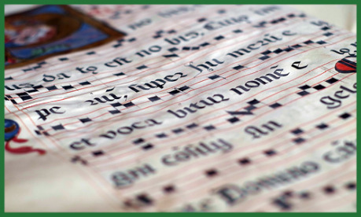

Jižní Nové město, uzavřené v objetí městských hradebních zdí, nabízí oproti živelněji založenému severnímu Starému městu jiný pohled. Ulice jsou zde spořádaně symetrické, široce stavěné, prostranství s kašnami sloužící jako tržní místa kvalitně vydlážděná, okna řemeslnických domů zde zdobí květiny v keramických květináčích a vůně čerstvě napečených housek a caltů se mísí s vůní vařeného piva a nad vším ruchem z obchodů a dílen zní rytmické dusání okovaných bot městské hlídky.

Uprostřed idyly řemeslného rozkvětu na Pekařském náměstí stojí Kapitulní škola svatého Leonarda. Cihelná budova s výstavným průčelím, kterému vévodí velká rozeta zdobená barevnou vitráží, skrývá vstup do majestátních prostor klášterní školy. Celý komplex s ambitem ve svém středu zavírá zahradu a ruch města zde utlumen ustupuje atmosféře vědění a studia. Leonardiáni v šedých kutnách převázaných stříbrnými řetězy tu se sklopenými hlavami přecházejí s knihami v rukách a jen polohlasně debatují nad teologickými i čistě světskými vědeckými teoriemi.

Bratři leonardiáni obývající kapitulní školu tvoří ostrov vědění v Novém městě. Sami bratři často takřka nevycházejí z jejích prostor, s velkou výjimkou svátku svatého Leonarda, kdy jde průvod mnichů v kutnách, kteří nesou lucerny, a lidé z města od nich zapalují svíce, dokud ve všech oknech nehoří plamen vědění patrona řádu. Bratří zde žije jen něco málo přes dva tucty, ale přes den sem docházejí laičtí studenti z města a rovněž jsou zde ubytováni přespolní studenti, neboť ravnburská kapitulní škola je vyhlášená i za hranicemi města.

Probošt kapituly Robert Staverton, podsaditý chlapík se sklonem ke tloušťce, je člověk přívětivý a snad až naivně dobromyslný. Ve věcech pravidel kapitulní školy je smířlivý, a když laičtí studenti – většinou synkové kupců a bohatších řemeslníků – ztropí nějakou výtržnost, sám se zaručuje za jejich nevinu nebo alespoň za pokání a nejčistší úmysly. Desátník městské hlídky Thomas Gomfrey s ním letos už několikrát jednal o potrestání výtržníků, avšak pokaž­dé bezvýsledně. Je jasné, že peníze ze školného studentů přinášejí podstatnou část příjmů a umožňují mnichům věnovat se bádání.

Bratrům leonardiánům, vázaným přísahou řádu, vládne pevnou rukou kanovník Arthur Urswick, vysoký a šlachovitý muž, jehož přísnému pohledu nic neunikne. V kontrastu s dobrotou hlavního představeného řádu je to právě Urswick, který má na svědomí fakt, že za posledních pár let se již několik bratří rozhodlo porušit přísahu a vzít nohy na ramena. Šušká se, že mladý bratr Christopher, který si vzal život koncem loňského léta, tak učinil právě kvůli Urswickovi.

V kapitule je rovněž obsáhlá knihovna, kterou spravuje bratr knihovník Jerome Everard, je to člověk, který žije mezi knihami a žije i v knihách, nebýt péče ostatních, určitě by se zapomněl i najíst. Velká část nákladů na knihovnu, stejně jako značné množství knih je hrazeno Stephenem Grofhurstem, hlavou rodu stříbrobaronů ze Starého města (viz C). Povídá se, že Jerome je nemanželský potomek rodu Grofhur­stů, nebo je také možné, že starý Grofhurst platí za to, aby některá tajemství z matričních knih, které leonardiáni spravují, doputovala k těm správným uším.

Není bez zajímavosti, že v jedné z užších ulic, které Kapitulu svatého Leonarda obklopují, stojí zapadlé vetešnictví Adama Sayera, kde shrbený šedivý majitel v omšelém kaftanu nabízí všelijaké krámy, od zašlých stříbrných nožů přes křišťálové flakóny, v lihu naložené hady až po vycpanou mořskou pannu. Rovněž zde koupíte zaručeně funkční ochranné amulety a masti přinášející štěstí a přízeň opačného pohlaví. Po večerech se sem pak pod rouškou tmy schází nesourodá skupinka přátel okultních záležitostí a nad zaprášenými pergameny za svitu černých svící mumlají své mantry, které mají přivolat bytosti ze zásvětí. Nejeden z nočních návštěvníků Sayerova obchodu zakrývá pláštěm tonzuru a šedou kutnu.

#### Možné zápletky:

- Jeden z přespolních laických studentů, kteří bydlí v kapitulní škole, zle pobodal bezvýznamného vandráka při opilecké hádce v hospodě, kde družinka právě večeřela. Na jedné straně sporu je desátník Gomfrey a na druhé probošt Staverton. Svědectví, které postavy podají, bude hrát důležitou roli a jistě jim zajistí výhodu na straně jedné a zavřené dveře na straně druhé.
- Potulný bard zastavil u Adama Sayera svou loutnu. Když ji přišel vyplatit, nástroj, který dostal zpět, je jiný, nedokáže přesně vysvětlit čím, protože vypadá přesně jako jeho loutna, ale odmítá na něj hrát.
- Bratr Edvard Swan, který má zrovna dnes službu u brány, má také na starosti olej do luceren pro nadcházející svátek svatého Leonarda, peníze, které dostal od bratra Urswicka ale místo nákupu oleje s kupcem Walterem Manstonem prohrál v kartách. Už jen pár dní a bude muset s barvou ven, karabáč ho jistě nemine.
