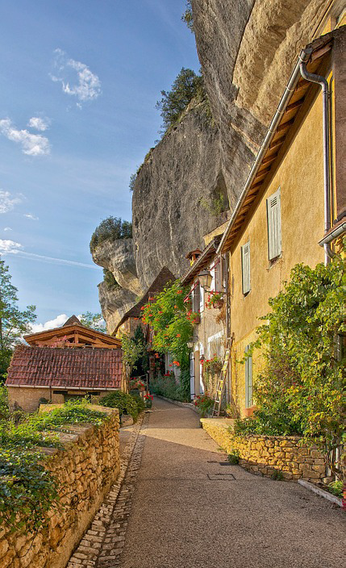

Na vysoké břidlicové skále leží obyvateli centra Ravnburghu přehlížená a napůl zapomenutá vesnice Sharprock. V dávných dobách se zde nad pobřežím tyčila mohutná pevnost, ze které do dnešních dní zbyly jen trosky obvodových zdí a sklepy vytesané ve skále a mnoho spletitých chodeb. Dnešní obyvatelé zachránili ze zříceniny maximum a jejich malebné domky často využívají pozůstatků pevnosti ve svých konstrukcích. Celkově působí vesnice velmi sklíčeným, ale přesto útulným dojmem a svou malebností si nezadá s většinou městských čtvrtí. Směrem dolů k pobřeží vybavili rybáři strmou skálu důmyslným systémem žebříků a nákladních jeřábů, které sahají až k molům na hladině moře.

Místní obyvatelé se většinou živí jako rybáři, pár rodin spravují přilehlá políčka a hrstka zdejších mužů tráví čas v nedalekých lesích na lovu a při obstarávání neustále potřebného dřeva. Namísto v pytukách popíjejí ve volném čase u svých sousedů. Jediné místo, kde přespávají případní pocestní, je u místní léčitelky Helen. Vesničané žijí spořádaným životem jako soudržná komunita a minimální zájem zhýralých a prohnilých měšťanů jim dlouhodobě vyhovuje. Hlavním důvodem je pocit křivdy z několik let starého sporu s rybáři ze Slatiny o loviště, kdy vedení města zcela nepochopitelně přisoudilo drtivou většinu vod v okolí města slatinským. Úlovky ryb proto již delší dobu zdaleka nedokážou nasytit všechny hladové krky. A ačkoliv by tedy většina vesničanů měla být velmi chudá, lze z každé části Sharprocku vyčíst podezřele vysoký životní standard, oslnivost a uhlazenost.

Za těžko odůvodnitelné bohatství Sharprocku mohou její letití vůdci, dvojčata Bernard a Barnaby Foxovi. Oficiálně majitelé několika rybářských lodí a správci zvolení vesnicí, kteří ale ve skutečnosti již několik let tajně spolupracují se sousedním městem Dayhaven, ležícím dva týdny cesty podél pobřeží na východ. Místní vládci mají eminentní zájem rozložit Ravnburgh zevnitř a Sharprock využívají jako centrum jejich vlivu a operací. Bratři Foxovi vedou jako pečlivě vyškolení emisaři tajných služeb své operace a za odměnu inkasují z Dayhavenu ohromné částky, bez kterých by vesnice již nejspíše upadla v chudobě do zapomnění. Transport peněz a informací zajišťují v pravidelných intervalech protřelí bývalí dobrodruhové, kteří se ve vesnici rovněž vydávají za místní prosté rybáře, dělníky a řemeslníky.

Oblasti zájmu bratří Foxových zahrnují v podstatě vše od vydírání, špionáže a podplácení přes únosy, občasná zmizení a ovlivňování městského pořádku. Jejich práce je organizována přes tajnou síť špehů a vyzvědačů pojmenovanou jako Červená perla, kterou se její členové také prokazují. V síti je zapojeno mnoho vesničanů a mají své agenty i ve většině čtvrtí Ravnburghu. V současné době mají Foxovi kolem prstu čerstvě omotaného pokladníka stráží Felbrigga (viz F) a jejich momentální zájem je namířen zejména na Gilberta Aylewarda (viz E) a Brokátovou čtvrť (viz B). A aby toho nebylo málo, plní se v mezičasech sklepení pod Sharprockem moderními zbraněmi a výzbrojí, kterou si zde vládci Dayhavenu připravují pro případnou vojenskou intervenci. A jak je vůbec možné, že tak rozsáhlé spiknutí Sharprock stále drží pod pokličkou? Každý vesničan o spiknutí ví a všichni z něj profitují – přece jen je to v posledních letech jediný důvod jejich prosperity. Jako jedna velká rodina drží pospolu a ublížit jednomu vesničanovi zde znamená obrátit na sebe hněv celého Sharprocku. A dokonce i mnoho místních dětí nosí v kapse červenou kuličku nebo alespoň jeřabinu.

#### Možné zápletky:

- Bohatý měšťan z Brokátové čtvrti Good­rington shání skupinu neohrožených dobrodruhů na drsnější prácičku. Postavám prozradí, že je vydírán šarlatánkou ze Sharprocku Ruth a potřebuje od ní získat kompromitující dopisy, a to jakýmkoliv způsobem. Postavám za odměnu slíbí využití svého vlivu mezi měšťanstvem. Ruth je stará žena na odpočinku, která žije se svou vnučkou Helen. Na první pohled působí jako neškodná stařenka, která ale až podezřele mnoho času tráví se svými třemi psi ve sklepení pod domem. Podaří se postavám získat dopisy ukryté ve sklepě nenápadně, nebo násilím? A jak se zachovají v případě, že je při návratu ke Goodringtonovi přepadne skupinka ozbrojenců, která se jim pokusí dopisy vzít?
- Na postavy se obrátí s žádostí o pomoc předák rybářů Henry Brook. Tvrdí, že několik jeho lidí bylo v posledních týdnech přepadeno pašeráky ze Slatiny poblíž Ægirskeru (viz Æ) a utopeno v hlubinách okolo Cobhamova útesu (viz Œ) i se čluny a výbavou. Brook by potřeboval získat nezvratný důkaz, který by přiměl vedení města zahájit oficiální vyšetřování. Slíbí zajímavou finanční odměnu, ale nechce prozradit, co rybáři ze Sharprocku pohledávali po setmění v okolí ostrovní svatyně. Podaří se postavám nalézt potřebné důkazy? Nebo se naopak ukáže, že jde o promyšlenou provokaci cílenou na Gilberta Aylewarda?
- Postavy jsou při noční procházce Sharprockem svědky přepadení – na slušně vypadajícího osamělého muže zaútočí dva vrahové. Ukáže se, že napadeným je sám Gregory Lochbearer (viz A) a že najatými vrahy jsou neschopní rybáři ze Sharprocku, kteří i bez případné pomoci postav nedokážuo Gregoryho významně ohrozit. Gregory bez váhání pověří postavy okamžitým diskrétním vyšetřením případu. Skrývá se iniciátor útoku někde v Sharprocku? A proč by posílal nevycvičené amatéry na tak důležitý cíl? Nejedná se náhodou jen o záludné testování schopností a loajality postav Červenou perlou?
