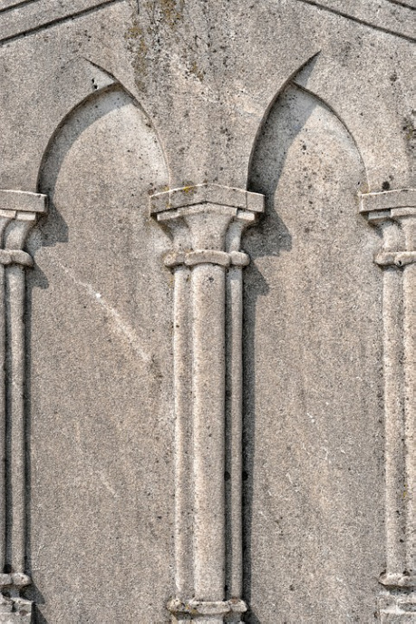

Južná pevnosť bola založená ako ochrana vodného toku do vnútrozemia. Pôvodná obranná veža sa v neskoršom období rozrástla o nádvorie a hospodárske budovy i stálu posádku nie len na patrolovanie pobrežia, ale i na obsluhu obliehacích strojov schopných poškodiť každú loď vhodnú na splavenie rieky.

Vznikom prístavu a rastom samotného mesta však strácala na význame a začala chradnúť. Jej posádka sa zredukovala na tucet vojakov vykonávajúcich funkciu colníkov a mýtnikov.

Zlaté obdobie a prerod zažila pred štyrmi generáciami, keď ju získal do dedičného práva Allen Kent. Bývalý bohatý obchodník začal prerod pevnosti na obraz toho, ako je známa teraz.

Dostala meno Nomam.

Pevnosť Nomam je fyzickým znázornením úhľadnosti, svetlosti, jednoduchosti a účelnosti. Pôvodná veža sa stala jadrom 21 metrov širšej hranatej tehlovej veže vysokej 27 metrov. Jednoduchosť jej vonkajších tvarov so strohými úzkymi obdĺžnikovitými oknami, kontrastuje s bohato zdobenou fasádou. Domy, ktoré okolo vznikli sú umiestnené do štvorcov tak, aby z odvrátenej strany od veže tvorili súvislú tlustú kamennú hradbu so strechou naklonenou k veži. Takto vytvorené prstence domov oddelené od seba širokými ulicami a spojené chránenými foyermi tvoria dokonalú geometrickú harmóniu. Jednoduchosť tvarov a princíp opakovania dáva návštevníkovi dojem, že sú mu ulice pevnosti známe a pôsobí ukľudňujúcim dojmom.

Čistota, poriadok a zdanie spokojnosti domácich, má svoje verejné tajomstvo. Rod Kentovcov, momentálne zastúpený jeho hlavou Solomonom Kentom, sa venuje bankovníctvu a každý v podhradí je zamestnancom rodu. Drtivá väčšina ako byrokratický personál zamestnaný evidencou a správou finančného toku Kentovcov a samotná fyzická ochranka, ktorú chráni i poriadok na uliciach. Nad všetkým tým bdie neoficiálna tajná služba podriadená priamo hlave rodu. Jej úlohou je získať najtajnejšie informácie o potencionálnych bohatých klientoch a dohliadať na to, aby každý zamestnanec bol spoľahlivou osobou. Služba, ktorá medzi obyvateľstvom získala meno Červené Hviezdy alebo len Céhá, podľa preukazu, ktorý im dáva právo nad životom a smrťou zamestnancov rodu Kentovcov, je veľmi nechválne známa svojou oddanosťou, metódami a bezškrupulóznym spôsobom získavania informácií a vymáhania dlhov.

Nomam žije zdanlivo svojim vlastným životom nezávislo od okolia. Opak je však pravdou. Práve pôžičky, investície a informácie sú zdrojom jej nezmerného bohatstva. Oficiálne má pevnosť otvorené brány pre každého, kto si chce požičať a má čím pôžičku založiť, ale neoficiálne je najdôležitejším klientom smotánka z okolia. I preto rod Kentovcou usporadúva kaž­dých 27 dní bál, na ktorý sú pozvaný všetci šľachtici, obchodníci i významný ľudia.

#### Možné zápletky:

- Hrdinovia sú v prezlečení za šľachticov na bále, kde tajne odovzdajú šľachtične dopis od milenca. Situácia sa skomplikuje, keď nájdu dvojicu hostí vo fajčiarskom salóniku mŕtvych. Jeden bol otrávený a druhý prebodnutý. Rod Kentovcov musí vyriešiť vraždy rýchlo a exemplárne, aby nestratil dôveru svojich klientov. Bál je uzavretý a hľadá sa vrah. Alebo aspoň niekto, na koho by sa vraždy hodili. Hrdinovia musia zachovať svoje utajenie pokiaľ nebudú vraždy vyriešené, alebo získať dosť informácií, aby sami zločin vyriešili. Prečo otrávil bohatý obchodník miestneho šľachtica a ten ho cítiac smrť prebodol? Išlo o vyrovnávanie účtov? Nesúvisí zločin z listom, ktorý hrdinovia priniesli?
- Hrdinovia sú najatí kapitánom Červených Hviezd, aby získali dôvernú informáciu. Je etické odovzdať informáciu ČH a zhrabnúť odmenu? Je bezpečné im informáciu zatajiť alebo ich dokonca oklamať? Nie je výhodnejšie spraviť si „očko“ u Červených Hviezd?
- Miestny účtovník je vydieraný, aby spreneveril dokumenty Kentovcov a vymazal dlhy nemenovaného obchodníka. Červené Hviezdy mu však hľadia na ruky. Pomôžu hrdinovia sfalšovať dokumenty? Odstránia agentov Červených Hviezd? Vysporiadajú sa s vydieračmi? Z čoho budú mať najväčší zisk a z čoho najväčší profit?
- Hrdinovia získajú informáciu alebo žiadaný predmet od umierajúceho muža a potrebujú ju dostať z Nomamu. Ťahová naháňačka po meste na štýl hry Mlyn (samozrejme s viacerými uzlami), pri ktorej môžu hráči využívať svoje znalosti osôb (agenti ČH, miestna stráž, …) a miest (krčma, strážnica, predajne, zmenárne, …) Nomamu, aby získali náskok pred prenasledovateľmi. Prenasledovať ich budú tajní agenti, najatí zabijaci i spiaci agenti. Ak si postavy trúfnu, môžu porušiť „pravidlá“ a zliezať múry jednotlivých okruhov alebo inak získať výhodu nepredvídateľným správaním. Slučka sa však okolo nich bude zužovať! Využijú postavy priechodnejšie cesty mestom na rýchly únik, alebo sa spoľahnú na anonymitu masy? Budú ochotný zahodiť svoje vybavenie a zamaskovať sa, alebo radšej poštvú na svojich prenasledovateľov miestne stráže? Spravia rozruch a „hodia“ to na niekoho, aby mohli zmiznúť v tme podchodov? Komu môžu veriť a kto je skrytý nepriateľ?
