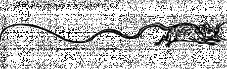

Proč vznikly dvě nejbohatší čtvrti právě v místech, kde vznikly? Může za to vhodná strategická pozice? Přístup k Dokům? Vhodné podloží? Dostatek materiálu? Ano, samozřejmě. Ale hlavní důvod, proč vznikly Brokátová čtvrť (viz B) a Zlaté nábřeží (viz C) právě v místech, kde je můžeme nalézt, je původní systém kanalizace a akvaduktů, který se stará o zásobování čtvrtí pitnou vodou a odvod nečistot a splašků.

Původ kanalizačního systému není přesně známý. K jeho částečné rekonstrukci však došlo v době osidlování Brokátové čtvrti. Akvadukty jsou zásobovány soustavou podzemních studní a poháněny Velkým čerpadlem. Přebytečná voda je současně používána k provozu kanalizačního systému, který ústí do zálivu (u písmene S). Čerpadlo a údržba systému je pod správou Kontrolora. Pozice Kontrolora je dědičná, v držení rodiny Crispů. Kontrolor a jeho zaměstnanci jsou financování z peněz Brokátové čtvrti a jednotlivých cechů Zlatého pobřeží.

Celý systém tvoří nepřeberné množství kanálů, akvaduktů, stok a potrubí. Část z nich je prozkoumaná a udržovaná, větší část, která se aktuálně nepoužívá, a tedy nikdo neplatí za její údržbu, je opředena tajemstvím. Nikdo neví, co v kanálech žije a kam až kanály sahají. Podle zkazek sahal původní kanalizační systém podél pobřeží až ke Kapitulní škole sv. Leonarda. Původní, nyní neudržované části, jsou odděleny mřížemi od používaných částí systému.

#### Možné zápletky:

- Během oprav došlo k náhodnému odkrytí původní části stok. Co skrývá? Vyplatí se někomu podniknout průzkumnou výpravu? Byl nález skutečně náhodný? Opravdu může být pod městem ukryt poklad?
- Zločin v rodině Kontrolora. Jediný syn kontrolora zmizel. Šlo o únos? O vraždu? Nebo jen utekl, protože nehodlá následovat stopy své rodiny? Má jeho zmizení něco společného s dalšími lidmi, kteří záhadně mizí a jejichž těla byla ve stokách nalezena?
- Brokátová čtvrť se navenek blýská. Co se ale děje pod ní? V podzemí? Co vše odnáší voda směrem k zálivu? Jak se rodiny zbavují nepohodlných svědků? Odkud berou oběti pro své rituály? A co se stane s obětinou, když je spláchnuta do kanalizace? Proč začíná voda podivně zeleně zářit?
- Co je pravdy na dětských povídačkách o Králi Krysovi? Opravdu v kanálech žije někdo, koho poslouchají krysy pod celým městem? Opravdu je jedním z nich? Proč by někdo vytvářel takové povídačky?
- Nikdy nevyhazujte zlaté rybky a želvičky do kanálu, netušíte, co se z nich pod Brokátovou čtvrtí může stát.
