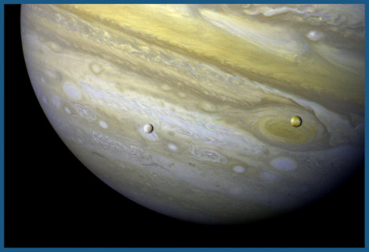

## Diamantové světy

Vzpomínáte si ještě na Clarkovu _2061: Třetí vesmírnou odyseu?_ Posádka kosmické lodi _Universe_ v ní zkoumá podivnou horu na Europě, o níž se ukáže, že je tvořena čistým diamantem. Jak se tam dostala? Po přetvoření Jupitera na hvězdu exploze vyvrhla materiál z nitra planety, kde extrémní tlak i teplota a dostatek uhlíku umožnily vznik diamantů neuvěřitelných rozměrů. Nejde o nic nepředstavitelného (tedy pokud pomineme premisu zažehnutí termojaderné reakce v Jupiteru). V zemském nitru vzniká typicky zřejmě v hloubce mezi 140 až 300 km v plášti pod kontinentální kůrou. Uměle se vyrábí většinou za tlaku kolem 5 GPa (zhruba 50 000× více než na povrchu Země) a teploty 1 500 °C.

Jupiter může mít vzhledem ke složení své atmosféry relativně vyšší podíl uhlíku než většina naší soustavy (dokonce existuje hypotéza Jupiteru jako „uhlíkové planety“), a tak by v některých vrstvách planety skutečně mohly vznikat diamanty, o jakých si na Zemi můžeme nechat jedině zdát. Možná i Jupiter by ale byl zahanben planetami jiných sluncí. Některé soustavy mohou mít poměr uhlíku a kyslíku relativně vychýlený vůči naší sluneční soustavě a být obohaceny na uhlík. V takových systémech by vznikaly dramaticky odlišné planety oproti těm, jaké dobře známe. Dokonce i světy o hmotnostech „superzemí“ by tak mohly obsahovat hluboko pod povrchem vrstvu diamantu. Na „diamantovou planetu“ byla před několika lety překřtěna 55 Cancri e, než přišla přesnější měření poměru uhlíku a kyslíku její mateřské hvězdy a ukázalo se, že není natolik vychýlený oproti Slunci. Složení planety spolehlivě neznáme. Ale nějaké diamantové světy se v galaxii téměř nepochybně najdou …

## Kovový vodík

Poslední dobou ale pozornost vědců budí spíše jiné látky vznikající za extrémních tlaků, a to především kovový vodík. Látka, kterou známe jako bezbarvý, nejlehčí, ale silně hořlavý plyn (stačí si vzpomenout na katastrofu Hindenburgu), se už podle bezmála století starých představ změní v kov, látku s volnými elektrony schopnou vést elektrický proud a teplo. Když se řekne kov, asi si představíme třeba železo nebo měď, ale některé prvky mohou být kovy i nekovy v závislosti na podmínkách. Mezi ně patří i vodík. Už od meziválečné doby se na základě propočtů jeho fázových přechodů předpokládá, že za extrémních tlaků přechází do kovové formy. Ve vesmíru by se měl nacházet například v jádrech plynných planet jako Jupiter a Saturn.

Vypočítaný fázový diagram však není vždy zcela spolehlivý, a tak přichází ke slovu experimenty. Tekutý kovový vodík se za vysokých tlaků a teplot zřejmě podařilo vytvořit už několikrát, ale jeho pevná fáze zůstává vždy „za rohem“. V roce 2011 vědci Mikhail Eremets a Ivan Troyan z Institutu Maxe Plancka vydali oznámení o vytvoření pevného kovového vodíku za tlaku 270 GPa. Jak se jim to mělo podařit? Jako u jiných výzkumů chování látek za extrémních tlaků stlačili nepatrný vzorek zkoumané látky „diamantovým lisem“. Diamant vydrží tlak okolo 600 GPa, aniž by se rozbil, a tak se dá použít ke stlačení jiných látek. Má to ale své nevýhody. Zatím se tak dá pracovat jen s nepatrnými objemy vzorků, obvykle menšími než objem lidské buňky.

Stlačený vzorek se pak studuje nepřímo, a to především spektroskopií. U většiny látek to není takový problém, ale vodík se jako nejmenší atom pod tlakem snadno „vmáčkne“ dovnitř diamantového krystalu, což jednak dělá diamant křehčím a náchylnějším k popraskání, jednak zhoršuje jeho průhlednost. Vrstva další látky na povrchu diamantového lisu tomu může zčásti, ale ne úplně dokonale zabránit. Za tlaku 270 GPa naznačovala spektroskopická měření možný fázový přechod a vzorek se stal lesklým – jako typický kov. Také snadno vedl proud, měl velmi nízký elektrický odpor. Nelze však vyloučit, že vodík reagoval s vrstvičkou chránící diamantový lis … Jiné práce ukázaly, že vodík zůstává dvouatomovou molekulou a nemá kovovou strukturu přinejmenším do 360 GPa. Autoři původní práce nakonec objevili novou fázi vodíku (takzvanou pevnou fázi typu IV), ale o kovový vodík se nejednalo.

## Noví hledači svatého grálu

Pevný kovový vodík je „svatým grálem“ vysokotlakového výzkumu, protože se předpokládá, že by měl být supravodivý – vést proud bez odporu – a to i za pokojové teploty. Eremetsův tým v jiném experimentu připravil supravodič fungující za dosud nejvyšších teplot: sulfan je za extrémních tlaků supravodivý kolem „teploučkých“ −70 °C. Supravodivost kovového vodíku by mohla stát za magnetickými poli obřích planet. Možná nám více napoví i měření sondy Juno, která loni zahájila svou misi u Jupiteru.

Počátkem letošního roku se kovový vodík znovu dostal do hledáčku médií. Ranga Dias a Isaac Silvera z Harvardu koncem ledna publikovali o jeho přípravě článek v časopisu Science. Dostali se na tlak bezmála 500 GPa (teď už vám diamanty nepřipadají tak pozoruhodné, že?), zatím však neměli jak pokus zopakovat a kritici tvrdí, že údajný kovový vodík mohl být spíše pozorováním chování vrstvičky oxidu hlinitého, která chrání diamantový lis. Za takto extrémních tlaků nejsou fázové přechody oxidu hlinitého pořádně zmapovány.

Jako každý svatý grál i pevný kovový vodík by měl mít řadu revolučních uplatnění. Supravodivostí to nekončí – mohl by sloužit i jako velmi stlačené a vysoce účinné raketové palivo. Spekuluje se také o tom, že by mohl být metastabilní – tedy vydržet v pevné kovové formě i za atmosférického tlaku (což je případ diamantu – nezmění se na grafit, když je vynesen na povrch Země). Většina odborníků se shoduje, že to není pravděpodobné, ale zcela vyloučit to zatím nelze. Metastabilní kovový vodík je rozhodně úžasnou SF rekvizitou: jen si představte právě ty supravodiče, magnetickou levitaci, úžasné stavby a jiná uplatnění!

Podařilo se vědcům doopravdy připravit kovový vodík? Mohl by být metastabilní? Nakolik se od běžného vodíku liší fázové přechody jeho těžších izotopů deuteria a tritia? A co takové kovové helium – existuje, a pokud ano, leží v nitru obřích planet slitina kovového vodíku a helia? Na odpovědi si asi ještě nějakou dobu počkáme, i když vědci jsou pod pořádným tlakem dosavadní výsledky zopakovat …

## (Ne)známý led

Nemusíme ale jít do natolik extrémních tlaků, abychom se dostali do neznámého teritoria. Stačí se dostat alespoň nad 210 MPa a naše stará známá voda se z kapaliny změní na pevnou látku; záleží ale i na teplotě. Za tlaku přibližně 10 GPa a vyššího už půjde nezávisle na teplotě _vždy_ o pevnou látku – takzvaný vysokotlaký led. V něm jsou molekuly vody pod tlakem natěsnané tak, že led má logicky vyšší hustotu než kapalná voda, a na rozdíl od nám známého krystalického ledu typu I tedy nebude plavat na hladině; zůstane stlačen na dně, ať už jde o jakýkoli z jeho deseti typů v závislosti na konkrétním tlaku a teplotě. Možná si říkáte, kde na takový exotický led narazíme – ale odpověď je, že překvapivě blízko.

V naší soustavě je hned několik těles, v jejichž nitru předpokládáme podpovrchový oceán kapalné vody. Navrchu je slupka běžného ledu – ale na dně oceánů větších těles bychom nalezli vysokotlaké ledy. Jedná se především o Jupiterovy měsíce Ganymed a Callisto a největší měsíc Saturnu, Titan. Největší měsíc celé naší soustavy Ganymed svou velikostí převyšuje i planetu Merkur, Titan mu těsně sekunduje a také překonává Merkur. Callisto už je o něco menší. Uvnitř menších měsíců obsahujících vodní oceány, například Europy, už panuje nižší tlak a nemáme důvod tam očekávat vysokotlaký led.

V jiných soustavách mohou existovat i celé oceanické planety, ať už chladné s ledovým povrchem, nebo teplejší s otevřeným oceánem. „Vodní světy“ jsou oblíbenými rekvizitami science fiction. Často jsou zobrazované jako celoplanetární oceány podobné těm pozemským. Podobaly by se jim ale doopravdy? Pokud budou mít na dně vysokotlaký led, odpověď zní spíše ne … Led na dně by totiž bránil styku kapalné vody s horninou a výrazně zpomalil jakékoli geochemické cykly nezbytné pro život. Je možné, že nad horkými místy – sopkami či hydrotermálními vývěry – by mohly v ledu vznikat „vodní sopky“ nebo by mohlo v ledu probíhat proudění, což by cykly látek usnadnilo, i tak by se však jednalo o svět s podmínkami hodně odlišnými od naší Země.

## Do neznáma

Uhlík, vodík, sulfan, voda … to je jen zlomek látek, které už byly alespoň sporadicky testovány za extrémních tlaků. Ty jsou ale zároveň jen zlomkem všech látek, které by za těchto tlaků mohly ve vesmíru existovat. Více vědomostí o této říši neznáma pomůže nejen geofyzikům snažícím se rozklíčovat vnitřní strukturu a vývoj planet nejenom v naší sluneční soustavě. Co takové chemické reakce složitějších směsí za vysokých tlaků? Můžeme díky nim něco zajímavého vyrobit?

Zatím se takovými otázkami pohybujeme spíše v říši science fiction. Ale snad nám věda poskytne náznaky odpovědí už brzy. Do té doby alespoň vymýšlejme co nejzajímavější příběhy …
