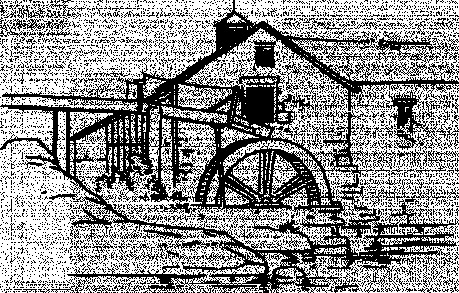

## Kyra, žena mlynáře Jakuba od Struhy

Dlouho ji vůbec nenapadlo, že by mohl mlýn na Struze skrývat nějaké tajemství. Byla to hodně složitá stavba; tři desítky let postupného budování stvořily mnoho drobných přístaveb, kůlen, průchodů a komor. Přesto vše, co bylo důležité, tedy mlýnské kolo, soukolí, žernovy, sklad mouky a sklad zrní, jakož i obydlí mlynáře Jakuba a jeho ženy, bylo pěkně nad povrchem a málokoho napadlo, že by tu mohlo být cokoli dalšího.

Kyra na takové věci na počátku manželství vůbec nemyslela. Měla tehdy úplně jiné starosti.

Když byla o něco mladší, přemýšlela o tom, jaké to bude, až ji jednou požádá nějaký muž o ruku. Bude vysoký, s tmavými vlasy – světlé vlasy jí připomínaly strýce Lacka, kterého neměla ráda – a pod bělostnou košilí se mu budou rýsovat svaly. A kdo se na ni jen křivě podívá, toho probodne svým mečem. No, mečem možná ne, připouštěla po pár dalších letech, on asi nebude urozený, ale, dejme tomu, srazí ho jedinou mocnou ranou pěstí. A bude dozajista umět jezdit na koni. Bude se často smát. Bude pozorný a něžný. A o ruku ji požádá pod rozkvetlými třešněmi, takovými, jaké kvetou na Strahově. Budou spolu žít v Praze, v domě blízko řeky. Za tím domem bude lavice se starou lípou, kde budou spolu sedávat a pozorovat řeku a večer koukat na hvězdy. A v noci, to budou …

Kyra to měla promyšlené do nejmenších podrobností. Její sny byly barevné a na jejich divadelní výpravě se rozhodně nešetřilo. Pocházela z rodiny Michala Stříbrníka, muže, který měl za úkol osobně razit stříbrné denáry, nyní již královské, a hlídat jejich kvalitu. Žili proto pod Pražským hradem a v jejich domě bylo k vidění mnoho krásných věcí, které by se jiným dívkám do snů tak snadno nedostaly.

Kyra nebyla o mnoho starší, bylo jí právě sedmnáct let, když zjistila, že skutečnost a sen se mohou povážlivě lišit. Její rodiče totiž nečekaně zemřeli při povodni v roce 1157. Poslední zbylý člen rodiny, starší bratr, se rozhodl Kyru provdat, a to pokud možno rychle. Sestra pro něho představovala neužitečnou přítěž. Chopil se první přijatelné příležitosti, která se nabídla, aniž příliš přemýšlel o následcích. Co si o tom myslela jeho o dost mladší a často zasněná sestra, to ho moc nezajímalo.

Mlynáře Jakuba mu jako vyhovujícího manžela doporučilo několik vážených mužů. Jakub je mladý vdovec po Johaně Kovářově, která půl roku po svatbě spadla do náhonu a utopila se, chudinka. A nikdy ji nenašli. Jakub měl trochu smůlu. Ale je výtečně zaopatřen jakožto náchlební mlynář bohatého rodu Hrabišiců, řídí mlýn úplně samostatně, takže co chtít více.

Když zkoušela Kyra svoje sny najít i v té skutečnosti, jejich dům rozhodně byl blízko Vltavy a byl v Praze. Přesněji řečeno, stál na potoce, řečeném Struha, který se do Vltavy vléval kus od mlýna. A také byla pravda, že v zahradě, která k mlýnu patřila, stála starobylá lípa, pod kterou by šlo udělat lavičku a odtud večer pozorovat hvězdy.

Jenomže tím to končilo. Lavičku nikdo neudělal a Jakub rozhodně nebyl člověk, který by marnil čas zíráním na hvězdy. Měl určitě tmavé vlasy, ale byly rozježené a suché, úplně jiné, než měly podle snů být; a také nebyl vysoký, ale dost tlustý; a pod jeho docela čistou košilí se určitě nerýsovaly svaly, ale spíš různé neforemné vrstvy tuku. Rozhodně to nebyl muž, o kterém by dívky snily.

A už za několik dní po svatbě jí bylo jasné, že tyto na první pohled viditelné nedostatky jsou to nejméně důležité a daly by se klidně přehlédnout. Ukázaly se věci daleko horší. Svatební noc, navzdory jejím velkým očekáváním, nebyla vlastně vůbec, protože Jakub se na svatbě opil a celý ten slavný večer prospal. A když se jí pokoušel o pár dnů později zmocnit, nějak se mu to nezdařilo a ke Kyřině úžasu to přičetl za vinu jí. Byl hrubý a křičel. Zprvu cítila jenom ohromení. Ale za dalších pár dní se údiv změnil v noční můru. Tentokrát nezůstalo u křiku, protože ji nemilosrdně ztloukl.

Kyra nevěděla, co má dělat. Zkušenosti s muži neměla, na něco podobného ji nikdo nepřipravil. Nebyl nikdo, kdo by jí poradil. Nebyl nikdo, kdo by se jí zastal. Pochopila, že ženy jsou pod ochranou svých otců, a jakmile se provdají, tak u svých mužů, a nikoho jiného na světě. Že se stane muž sám ohrožením ženy, s tím se nijak nepočítalo. Žádný soud a žádný rychtář by nerozsuzoval soud mezi mužem a jeho vlastní ženou; předpokládalo se, že takové věci si vyřeší pán domu pod vlastní střechou.

Opakovalo se to.

Jakub svoji ženu bil, protože byl opilý. Bil ji, protože k němu přišlo málo sedláků, vydělal málo peněz a rychtář pana Hrabiše mu zkrátil odměnu. Bil ji, protože se mu nedařilo ji pomilovat. Bil ji, protože se mu děti se sousedství posmívaly. Bil ji, protože si tak připadal méně ztracený, bezmocný a směšný. Bil ji, protože pochopil, že mladá a hezká žena je příčinou všech jeho nehod.

Někdo to všechno přece zavinit musel.

Kyra se přestala usmívat a přestala večer pozorovat hvězdy. Na její tváře a různě po těle se nastěhovaly různé modřiny a škrábance. Šířilo se o ní, že je velice nešikovná a zřejmě také tajně trochu pije.

No, koho to překvapuje, když má takového muže. Celý mlýn na Struze za moc nestojí; jděte raději k vedlejším mlynářům, pane.

Tak uplynul hodně svízelný rok. V prvních týdnech a měsících nevnímala kolem sebe nic, jen bezmocně bloudila po domě. Nedařilo se jí posbírat ani trosky svých snů, aby se jich mohla držet. Neznala svého muže dobře, teprve se učila, jak se mu správně vyhnout a kdy je třeba mu jít z cesty.

Potom si začala všímat. Že Jakub hodně často pije. A pak je vlastně neškodný; většinou v opilosti vymýšlel úžasné plány, co všechno udělá, co dokáže a jak ho všichni budou obdivovat. Další den býval naopak nebezpečný; to když zjistil, že se těm jeho plánům nedaří. Hledal někoho, komu by se pomstil.

No a potom byly dny, kdy na dlouhé hodiny zmizel. To byly pro Kyru nejlepší chvíle; pouze je kazilo to, že nikdy jí nebylo jasné, kdy se vrátí a kolik má ukradeného času. Musela být neustále ve střehu, mít připravenu nějakou domácí práci, kterou by se mohla zabývat ve chvíli, kdy se Jakub zjeví na prahu.

Bylo důležité zjistit, jak se to má s Jakubovým mizením. Kde je a co dělá. Většinou byl někde mimo dům; a to znamenalo, že neměla způsob, jak ho bezpečně sledovat. Kdyby zjistil, že odešla bez dovolení z domu, bylo by zle. Jenomže někdy se ztrácel náhle a stejně nečekaně se objevoval; nemohl tedy být moc daleko. Mlýn stál v místech, kde bylo k nejbližším dalším stavením docela daleko. Takže musel mít nějakou skrýš přímo v domě nebo těsně u něho.

A tím se dostala k přemýšlení o skrytém tajemství mlýna.

Trochu nepřehlednou půdu prohlédla snadno; všechny kouty byly prázdné. A pokud ne, nebylo tam nic důležitého – něco zbylé mouky a sena, nějaké dřevo a louče.

Jiná možnost by byl skrytý sklep. Na straně k vodě pochopitelně dům moc hluboké sklepy mít nemohl a také tam skutečně nebyly. Našla tu jen několik malých prostor, které vznikly, když se stavěly nábřežní zdi podél vody. A nic důležitého v nich nevydrželo dlouho, protože tam bylo neustále vlhko. Jen pár dobře pálených džbánů s pivem nebo s kořalkou.

Takže jediná naděje pro sklep byla strana směrem od vody, v místech, kde byl hlavní vchod. Břeh Struhy tam byl vzdálenější, země vyšší a kamenitější. Vchod představovaly dveře do domu, a hned vedle nich krytý průjezd pro vůz. Větší množství mouky bylo možno spouštět stropem v pytlích přímo na vůz a také tu bylo možné snadno vykládat zrní do postranních dveří v patře mlýna. Proto se v průjezdu neustále válely plevy, zrní a mouka, směs, která byla postupně drcena v jemný prach. Kyra se jednou na počátku manželství pokusila průjezd zamést, ale dostala vynadáno, že to je zbytečná práce. A když si na to o několik měsíců později vzpomněla, uvědomila si, že v Jakubově tváři tehdy viděla úlek, když zjistil, o co se Kyra pokouší.

To byl klíč. V tom prachu na zemi zřejmě bylo něco, co neměla vidět. Našla to velice snadno; pod silnou vrstvou prachu se skrývaly padací dveře. Byly umístěné tak, aby na ně vůz nevjel a neprolomil je, aby zůstaly mezi koly.

Kyra několik dní kolem těch dveří jen obcházela. Nebylo snadné je otevřít, i když nebyly vlastně ničím zajištěné. Byly docela veliké a těžké. Vyzkoušela, že musí použít silnou motyku, aby poklop vypáčila, a zajistit ho polenem, aby se mohla protáhnout mezerou, která vznikla. Obrazotvornost jí při tom ihned vykreslila několik hodně ošklivých představ. Nejjednodušší byla ta, že dveře spadnou a zlomí jí záda, když poleze dovnitř. Nebo to, že dveře zapadnou a uvězní ji uvnitř, v kamenném sklepení vedle červů a koster, které tam dozajista jsou.

Nebo konečně, že se Jakub vrátí a přistihne ji. Což byla ta úplně nejvážnější obava.

Jenže zvědavost a touha odhalit tajemství byla silnější. Jednoho dne to nevydržela, zajistila dveře tím polenem a protáhla se dovnitř, v ruce zapálenou louč, která jí dost překážela. Popolezla po několika schodech dolů, pak bylo konečně dost místa na to, aby se postavila a rozhlédla.

Na první pohled tu nebylo nic pozoruhodného. Čtvercová kamenná místnost, nijak moc veliká, hluboká jen tolik, aby se tu člověk mohl pohodlně postavit. Okna žádná. Jediné, co porušovalo úplnou symetrii, bylo schodiště, po kterém přišla, a také podivná kulatá díra v podlaze před protější zdí. Vlastně to byla studna, vedoucí k podzemnímu rameni Struhy. Vodu bylo jasně slyšet sotva sáh pod roubením, a když se tam naklonila, tak ji snadno i viděla; překvapivě silný a dravý proud, který mizel ve tmě. Bylo jasné, že se někde dál vrací do Struhy, nikdy si toho dříve nevšimla. Pokud chtěl někdo vylít nějaký odpad, voda ho rychle odplavila pryč. Nebo si tu naopak mohl nabrat vodu, úplně čerstvou a čistou.

A pak se obrátila a zamířila světlem do protilehlého kouta.

V tu chvíli měla pocit, že se její sny zase zhmotnily. Nebyla úplně překvapena; už ji to několikrát napadlo, ale vždy se sama okřikla, že to s těmi sny přehání. Jenže toto byla ta nejskutečnější skutečnost.

U kamenné zdi bylo pečlivě ustlané lůžko. Na lůžku bylo čisté bílé prostěradlo a kolem byly zbytky dohořelých svící. A také květiny, ještě ne příliš zvadlé. Na posteli ležela kostra člověka, který musel zemřít před řadou měsíců, možná i před rokem. Byla oblečena do zbytků šatů; zřejmě původně svatebních.

Obrazy, které se přímo nabízely, byly bez výjimky ohavné. Někdo, kdo vyměňuje květiny vedle hnijící mrtvoly. Někdo, kdo vyměňuje prostěradlo pod hnijící mrtvolou. A vysvětlení, proč to někdo všechno dělal, bylo ještě horší, než všechno předchozí.

A nakonec to všechno zastínil ještě temnější závěr; někdo způsobil, že tu vůbec nějaká mrtvola je.

Bylo více než snadné dosadit oběma postavám jména. Jakubova první žena Johana se neutopila v náhonu, jak se věřilo. Spousta nenápadných poznámek, které Jakub za ten rok pronesl, začala najednou dávat smysl. Stýskání nad tím, že Kyra není jako Johana a je horší ve všech myslitelných ohledech. Kyra celý rok nevěděla, jestli má na Johanu žárlit; ale najednou jí bylo úplně jasné, že by ji měla litovat. Johana uvízla ve stejné pasti, jako ona sama; s mužem, který na ni sváděl všechno špatné, který ji nenáviděl, který ji nakonec v záchvatu vzteku zabil, ale potom ji najednou dodatečně měl přesně tak, jak chtěl od začátku; oddanou, poslušnou, zbožňující, andělskou, pokornou.

Protože byla mrtvá.

Bylo více než jasné, co to znamená do budoucnosti. Kyra nakonec skončí přesně na stejném místě. Možná nahradí již zvetšelou mrtvolu svojí předchůdkyně. Možná tu budou ležet spořádaně obě vedle sebe.

Louč dohořela a spálila jí prsty. V pravý čas jí připomněla, že vyčkávání na tomto místě k ničemu dobrému nepovede. Takže se s obavami proplížila znovu pod těmito dveřmi – Bože, ať se nepohnou – a potom rychle uvolnila poleno, kterým je předtím podložila, aby zapadly zpět. A zakryla je znovu prachem. A odnesla zpět motyku a to poleno. Nezapomněla opravdu na nic a byla pečlivá.

Ale stejně měla několik dní pocit, že odhalené tajemství musí mít jasně napsané ve tváři a Jakub je musí uhádnout.

Nestalo se to.

Kyra měla od té doby sny i nadále. Ale ty se začaly měnit. Bylo v nich stále méně krásných mladých mužů s rýsujícími se svaly. Už vůbec v nich nebyly žádné vášnivé noci; takové věci jí začaly nahánět hrůzu. Ale začaly se v těch snech vyskytovat nože, sekery, provazy a oheň.

A také voda, mizící v bezedném tunelu pod sklepem.

## Bernard Soběslavic, Rytíř s kaprem

Rozhodně neměl žádný důvod ke stížnostem. Bylo mu něco málo přes dvacet let, byl dospělý muž a k tomu všemu ještě urozený.

A konečně, byl slavným hrdinou. Což může říci o sobě opravdu málokdo. Pokud někde vyslovil svoje jméno Bernard Soběslavic, potom trvalo jenom pár okamžiků, než si jeho protějšek vzpomněl; aha, _ten_ Bernard Soběslavic, Rytíř s kaprem. Jeden z hrdinů krále Vladislava, který na jeho nejproslulejším válečném tažení k Milánu přebrodil rozvodněnou řeku a objevil tím cestu pro celou výpravu císaře Fridricha Barbarossy.

Každý vypravěč by na tom hrdinském příběhu viděl jediný kaz; že to je vlastně celé. Jedna věta; a vyprávění bylo u konce. A jakékoli snahy o rozvíjení a vylepšení nevedly k moc lepším výsledkům. Například bylo možné zdůraznit, co všechno znamenala pro císaře i pro Čechy a že se kvůli tomu kníže Vladislav stal králem. Nejspíš by se tam opakovala slova jako „slavný“ nebo „velkolepý“.

Nebo by šlo více rozvíjet ten samotný čin; že tam byli tehdy ve skutečnosti rytíři dva, Bernard Soběslavic a Odolen Střížův, a že se do té vody pustil Odolen o kus dřív, než Bernard. Také by bylo možné více popsat tu samotnou cestu vodou, asi se tam vyskytnou „bouřlivé vlny“ nebo „vzpínající se koně.“ Pak by bylo možné ještě vyprávět, že od té doby má rod Soběslaviců na Česticích erb s kaprem a Odolenův rod na Chýších má zase ve štítě tu řeku. A tím se staly jedněmi z prvních erbovních rodů v celé zemi.

Také je možné to víc přiblížit pravdě; že oba mladíci úplně přesně nevěděli, co dělají, byl to jen chvilkový nápad, myšlenka, která nemá u lidí tohoto věku moc daleko k činu, kdy obvykle není uvažováno o důsledcích. Prostě vehnali koně do řeky, pak byla chvíle šplouchání a spousty vody všude, a najednou byli na druhé straně, a o pár hodin později, když se stejně přeplavilo celé vojsko, tak z nich byli hrdinové.

Čin byl jednoduchý a vyprávění o něm je na všechny způsoby k uzoufání krátké. Pár okamžiků ve vodě a Bernardův život byl vzhůru nohama. O jeho činu se od té chvíle neustále mluvilo. Bylo proklatě snadné uvěřit, že je opravdu výjimečný hrdina. Mohl si užívat slávy a vykračovat si jako páv v jejích paprscích; stačilo, aby ho někdo představil, a urozené dívky se jen draly o jeho zájem. Je dobré být urozeným; ale být mladým hrdinou, to je teprve něco. A úplně nejlepší je k tomu všemu jako hrdina vypadat. Kdyby měla Kyra tu nepravděpodobnou možnost, určitě by Bernarda uznala jako zcela vyhovujícího hrdinu.

Bernard toho dokázal náležitě využít. Neměl na starosti nic jiného, než svoji vlastní rytířskou slávu. Časté stížnosti jeho otce Soběslava, že by měl možná už začít dělat něco vážnějšího, zatím nebral na vědomí. Vůbec nesdílel otcův názor, že správný pán se musí věnovat zejména počítání, kolik vynese které pole a kolik zrna je možno z něho vzít, aby se poddaným dobře dařilo. Bylo rozhodně příjemnější být ozdobou slavností, tančit a milovat se s dívkami, hnát se na koni na nějakém lovu, popíjet s kamarády nebo konečně se utkat v nějakém turnaji za hranicemi a ukázat, že jeho pověst hrdiny má svoje dobré důvody.

A pokud očekáváte, že i na Bernarda dokročí v našem vyprávění nepříjemný osud a vtáhne ho do nepříjemné skutečnosti, tak se rozhodně nemýlíte.

Rodinné sídlo Soběslavova rodu v Česticích už bylo hodně staré a zasluhovalo opravu. Peníze k tomu ale chyběly. Pan Soběslav proto nechal vyklučit les na druhé straně potoka a chtěl tam založit novou ves, aby zvýšil příjmy. Ale bohužel v roce 1159 přišlo sucho a lidé na tom nebyli tak dobře, aby bylo možné od nich žádat další daně. Pan Soběslav tedy zcela nevyhnutelně obrátil pozornost i k hospodaření svého syna. Pár týdnů nemohl rytíře Bernarda objevit, protože se potuloval v cizině. Jenže potom ho napadlo zamířit do Prahy, na velký ples u příležitosti královniných narozenin. A tam se konečně setkali.

Bernard zrovna vyprávěl o posledním turnaji svojí společnici, v níž Soběslav poznal dceru maršálka Slavibora, jednoho z králových oblíbenců. V Soběslavovi se v tu chvíli smísila závist k daleko úspěšnější rodině a hněv nad nezdárným synem; a přerušil jejich rozmluvu tónem, který nepřipouštěl odpor:

„Dáma dovolí. Musím si promluvit se svým synem.“

Dívka, překvapená tím nevlídným šlechticem, rozhodně nebyla zvyklá, aby se s ní jednalo takto nezdvořile. Ale nezmohla se na odpor a uraženě odešla, když zjistila, že Bernard se jí nijak zvlášť nezastal. Bernard se nebránil, i když se na rozhovor vůbec netěšil. Tušil, že mu otec vyčte spoustu věcí. A to se rozhodně nemýlil.

„Takže, milý Bernarde … do měsíce se budeš ženit.“

Bernard překvapeně a s úsměvem zamrkal. „A koho si vezmu, otče? Vždyť svoji nastávající ještě ani neznám.“

„To je to nejmenší. Jmenuje se Hildegarda ze Žďáru. Je ze starého rodu, její matka je ze Saska. A je bohatá, protože má vdovský podíl.“

Bernard si stále nebyl jist, jestli se mu to nezdá. „Otče, snad nemyslíš, že si tu ženu opravdu vezmu? Předpokládám, že to je jen hodně krutý žert.“

Soběslavova tvář se zalila hněvem. „Žert! Vypadám snad jako někdo, kdo má náladu na žertování? Myslíš si, že tvoji lidé, co nemají nic k jídlu, chtějí žertovat? To jen ty žertuješ; jen se bavíš, nic ti není svaté. Visíš mi na krku jako mlýnské kolo. Ty vypelichaný hrdino! Nevidíš, že jsi všem jenom pro smích? Všechny ty tvé výtržnosti jsou jen za peníze, které ti platím já, které někdo musí vydělat, jsou za obilí, které se musí zasít a vypěstovat a sklidit, za chleba, který je třeba upéct.

Ale teď to snad konečně pochopíš. Do příští neděle požádáš ve Žďáru Hildegardina strýce pana Heřmana o její ruku. Je to její nejbližší příbuzný, nikoho jiného nemá. A nejspíš do žní se Hildegarda vrátí z cesty od svatého Jakuba v Compostelle, kde si byla vyprosit zdraví.“

„Cože? Ona je snad nemocná?“

„Říkají, že je slabá na plíce,“ odpověděl Soběslav se zlověstnou lehkostí. „Ano, vím; to může znamenat souchotě nebo jinou nemoc; ale co je mi po tom, když má vdovský podíl.“

Bernard vytřeštil zrak. Takto si vlastní svatbu rozhodně nepředstavoval. S Hildegardou nebude všechno tak, jak po léta předpokládal. Představoval si, že až si jednou – v budoucnosti – sám vybere nevěstu, bude pochopitelně mladá a krásná. Teď se před ním rýsovala vidina postarší Němky se špinavě plavými vlasy, unavené ze dvou manželství, a ještě nemocné.

„Jak jsem řekl,“ pokračoval pan Soběslav neúprosně, „Hildegarda se vrátí a někdy nejpozději do svatého Václava bude svatba. Raději bych ještě o dost dříve. Jedině tak ti připadne její vdovský podíl … abys měl peníze na svoje další výtržnosti.“

Bernard stále ještě nevěřil svému rozumu. Pomalu začínal chápat, co mu otec připravuje za osud. „Přece musíte mít slitování,“ řekl nakonec nejistě.

„Slitování? Ty nešťastný hlupáku, já měl pro tebe tolik slitování, tolik dobrých slov, tolik odpuštění … celé roky tě zkouším mírným slovem přivést zpátky k rozumu, celé roky tě zapřísahám, ale všechno marné, vůbec neposloucháš. Ale ta paní už zkrotila jiné. Budeš jejím třetím mužem; ty dva předchozí pohřbila.“

„Ale já přece na tom nejsem tak zle, vždyť přináším z turnajů velkou kořist.“

„O tom jsi mi mluvil mnohokrát. Dal jsem ti peníze na koně. Chlubil ses, jak ti ten kůň přinesl trojnásobek svojí ceny. Takže očekávám, že mi tu cenu konečně vrátíš. Nežádám trojnásobek; jen to, co jsem ti dal, utrhl z peněz, které opravdu potřebuji. Kde je to stříbro?“

„No, kdybys chvíli počkal, otče…“

„A to přesně dělám!“ zvolal rozzlobeně. „Čekám, čekám a zase jenom čekám. Ale právě dnes mne to omrzelo, pravím ti. Stříbro není; bude tedy Hildegarda, ta má stříbra dost. Jediná možnost, jak zabránit, aby k nám přišla do Čestic opravdová bída.“

A teprve zde se Bernard začal opravdu probírat a uvědomoval si, že to jeho otec myslí smrtelně vážně. Sen končil.

„Co když mne ta Hildegarda nebude chtít?“ začal.

„Sám tomu nevěříš, znamenitý hrdino,“ usmál se jeho otec. „A kromě toho, neponechal jsem to náhodě a domluvil to s panem Heřmanem, který nemá žádných námitek.“

„A co když se budu protivit tvé vůli, otče …“ zkusil ještě opatrně.

A odpověď ho zdrtila. Jeho otec se totiž celý rozzářil zlomyslnou radostí; bylo vidět, že má konečně navrch. „Pak ti přísahám, že ode mne už neuvidíš ani tolik stříbra, co by vyvážilo ptačí peříčko. Nikdy. Budeš vyděděn a nebudeš nadále mým synem.“

A tu Bernard poznal, že jeho otec v sobě celé roky živí zuřivý hněv; a že si toho ve svojí zaslepenosti nevšímal. Jeho šťastné roky jsou sečteny. I kdyby jeho žena – zachvěl se, když si představil, jak vlastně vypadá – zemřela, bude mít pověst muže, který se oženil pro peníze s ženou, kterou nemiloval. To ho bude provázet navěky. Dívky připojí k vyprávění o něm soucitný pohled a muži takový ten opovržlivý úsměv. Už není a nikdy nebude okouzlujícím hrdinou.

## Hildegarda ze Žďáru

Bernardova představa nebyla správná. Kdyby měl možnost si svoji nastávající prohlédnout, byl by asi překvapen. Seděla na lavici v chrámu, obklopená spoustou jiných lidí, a čekala na mši. Navzdory německému jménu po matce měla vlasy výrazně černé. A vůbec nebyla stará a nepůsobila unaveně. Vlastně byla docela hezká, i když ve tváři měla v některých chvílích nečekaně tvrdé rysy.

„Překážíš, Dora,“ štěkla na svoji služebnou vedle sebe. Ta rychle vstala a umožnila Hildegardě si zcela zbytečně upravit šaty. Říká se, že do třiceti má každý takovou tvář, s jakou se narodil, ale po třiceti si může sám za to, jak vypadá. Hildegarda byla v tomto výjimka; za svoji tvář si mohla již podstatně dříve. Rodiče jí zemřeli a nechali samotnou už v dětství, vychovávali ji různí strýcové, kteří jí dávali obvykle najevo, že jim trochu překáží a že na ni nemají čas. Byla proto zvyklá se starat sama o sebe. Ta dvě manželství stihla během pouhých dvou let; vlastně byla mladší, než Bernard. Žádnými bláznivými sny o lásce nikdy netrpěla a oba ty pány si vzala docela prostě pro peníze. A spočítala si to dobře, protože ani jeden z nich nevydržel déle než rok. V prvém případě tomu napomohl pokročilejší věk muže a ve druhém skupina náhodných lupičů.

Nápad, že by se mohla vydat na pouť do Compostelly, pocházel od místního kněze. Prý se tak její zdraví může hodně zlepšit, zásluhou četných zázračných míst na cestě. Pochopitelně, jasně cítila, že to je spíš výraz bezradnosti; moc nevěděli, co s ní. Někde ve vzduchu se vznášel nápad, že by také mohla jít do kláštera; ale taková věc vyžadovala její spolupráci. Pouť na konec světa, trvající skoro rok, byla smírné řešení pro všechny. Zpočátku byla proti tomu, ale pak si uvědomila, že bude úplně sama na cestě, bude mít peníze a bude zcela bez dohledu všech strýců. Může dělat spoustu věcí. Například být něčí milenkou. Nebo se v cizině dokonce vdát, kdyby ten muž za to stál.

V chrámu Notre Dame v Beaune se ale v této chvíli moc spokojená necítila. Seděla na kostelní lavici ve svých nejlepších nedělních šatech. Ale neměla dobré místo. Chrám byl plný lidí a čelní lavice zaujímali místní měšťané a šlechtici, přes které ani neviděla. Špatnou náladu si vybíjela na jediné služebné, která to trpělivě snášela.

Mše ještě nezačala a všichni Burgunďané se jen bavili navzájem; zřejmě o obchodech a o jídle; nic jiného tihle lidé v hlavě zřejmě nemají. Když se pozorněji rozhlédla, zjistila, že asi dvě řady před ní sedí žena, kterou odněkud znala. S mužem, který seděl vedle ní, mluvila … nebylo tomu dobře rozumět, ale přízvuk byl nezaměnitelný. Byla to čeština.

Nicméně, ani tohle zjištění její náladu nezlepšilo. Ti dva se jí také nelíbili. Podle délky vlasů bylo jasné, že žena není urozená. I když vypadala velice elegantně. Ten muž, který se k ní nakláněl velmi blízko – bezpochyby milenec, spíše než manžel – také patřil nejspíš mezi nějaké služebnictvo bohatého pána. Nebo ani to ne. Rozhodně měli lepší místo než ona, a to nebylo správné.

Přemýšlela, kde tu ženu viděla. Bylo to velice nedávno. Neurozená, hodně drahé oblečení … a už to měla. U té ženy si nedávno koupila šaty. Prodávala je v Praze všem bohatým dámám včetně královny.

A měla lepší lavici v chrámu než ona, urozená dáma.

Hildegardy si vůbec nikdo nevšímal a nikoho nezajímala.

Když o hodinu později mše skončila a vycházeli z kostela, rozhodla se Hildegarda věci změnit. Rázným gestem odstrčila Doru od sebe a nařídila jí, aby ji na chvíli nechala samotnou. Pak vyšla ven z chrámu, postavila se těsně za křídlo dveří a v okamžiku, kdy se blížil jeden z místních šlechticů, vyrazila nečekaně před něj, takže ji nevyhnutelně srazil na zem. Tedy, vlastně ji tak úplně nesrazil, ale nikdo to dobře neviděl a ona se válela po zemi a tiše sténala. Samozřejmě se kolem ní seběhli a začali ji zvedat a litovat. Během několika okamžiků se na ni přenesla všechna pozornost. Jako by ji pokropili živou vodou; byla okouzlující; také trochu trpící; a odpouštějící; chápavá, pokorná; hned několik mužů se pokoušelo vyvolat její přízeň.

A přitom uměla latinsky jen pár slov. A ti muži kolem ještě méně.

Urozený pán Günter von Orschwihr to na ten večer vyhrál; uměl totiž německy s hornosaským nářečím, stejně jako ona. Bylo mu přes třicet let, ale zjevně byl hodně bohatý a urozený, již delší dobu vdovec a navíc zřejmě i dost významný. S jeho pozorností získala i pozvání na večerní slavnost, kterou pořádal místní hrabě ­Thierry de Chatillon. Pan Günter von Orschwihr byl zván jako většina důležitých hostů zrovna pobývajících ve městě. A protože neměl vhodný doprovod, našlo se pro ni místo.

Když se s Dořinou péčí připravovala na večer, viděla Hildegarda svět již podstatně příznivěji. Pokud se jí nepodaří získat srdce rytíře von Orschwihr, užije si s ním alespoň příjemné chvíle v noci. Nebo se jí na té slavnosti podaří získat pozornost ještě někoho dalšího.

Večer v mnohém splnil Hildegardino očekávání. Von Orschwihr měl zjevně doopravdy v úmyslu s ní strávit noc, možná i více nocí. Hrabě de Chatillon, jejich hostitel, potom představoval tak vysokou šlechtu, že zcela překonával veškeré Hildegardiny představy. Tolik světel! A ta spousta hudebníků!

Jenže brzy se objevilo něco, co jí zase náladu trochu zkazilo. Zjistila, že těžko může doopravdy vyniknout a zazářit. Protože zde, v Beaune, je hvězda jediná a předem daná; důvod, proč se sem sjížděli významní, bohatí i docela prostřední lidé a proč si tu ti nejbohatší z nich stavěli domy.

Červené víno.

Hildegarda ze Žďáru se ocitla uprostřed podivného nevyhlášeného řeholního řádu, zasvěceného zřejmě Dionýsovi; všichni, ať muži nebo ženy, mluvili hlavně o víně. Mnohokrát vyslechla nekonečné tlachání mužů o lovech, o psech, o koních a také o válečných výpravách. Rozhodně ale nezažila, že by nějací lidé dokázali tak dlouho a tak důkladně zabývat něčím tak obyčejným, jako je pití. Víno se prostě nalije a vypije. A je dobré, nebo špatné; a většinou zlepší náladu. Ale co víc se o něm dá vykládat?

No, ti okolo měli na věc úplně jiný názor. Vydrželi se dohadovat větší část večera, jestli je lepší jedna vinice, nebo druhá; jestli je dobré sázet víno víc na východním svahu, nebo na jižním; jestli je správné vyházet staré keře v okolí Beaune a rozšířit tam révu z Clos de Vougeot; a jak to celé ještě vylepšovat nějakým školením v sudech. Ty sudy! Hildegarda měla pocit, že se jí o nich bude zdát; velké, malé, dubové, nové, staré. Žádná žena, žádný válečný kůň nemohl vyvolat takové nadšení těchto lidí, jako nějaký starý sud. Dokonce měla dojem, že čím starší, tím lepší; to už bylo dočista neuvěřitelné a měla dojem, že špatně slyší.

Ale ne, vážně; hrabě z Chatillonu dal přinést třicet let starý soudek vína, toho zatraceného Clos de Vougeot, a každému z hostů nalili do poháru. A všichni se tvářili, že je to nejméně krev Kristova, mana nebeská a nápoj mládí v jednom. Pochopila, že tu na ni zbývá celkem trapná úloha chválit víno. Nikdy nedokáže říci nic chytrého o červeném vínu, o kterém v životě neslyšela.

Ale možná to bylo tím všeobecným nadšením, možná tím vypitým vínem, ale nakonec si velice neochotně musela připustit, že jí ta čertovská věc chutná a rozpaluje mysl. Rozhlédla se. A překvapeně si uvědomila, že ti dva Češi, švadlena a její milenec, tu jsou v té nejvybranější společnosti také. Nepochopitelné! Byl s nimi ještě třetí chlapík, říkali mu André, a ten byl podle všeho vinař. Všichni tři hovořili s nějakými cisterciáky. Jak zkoušejí – hlavně ten André, zřejmě – pěstovat to proslavené červené víno v Praze.

To, že se na ně dívala delší dobu, to byla asi chyba, protože si jejího pohledu všiml von Orschwihr. A za chvíli se ten urozený pán dal do řeči s těmi mnichy a měšťany o tom, zda a jak by bylo možné zkusit pěstovat červené víno i u něho doma!

No, a potom nechal pan hrabě nalít další víno, které bylo uvedeno jako Clos de Béze a prý je jiné a ještě vzácnější, než ten Clos de Vougeot, ale v čem je mezi nimi rozdíl, to už Hildegarda neposlouchala. Sledovala, jak švadlena a její druh upíjejí střídavě obě vína, kdy si v jeho poháru nechali to staré a v jejím to nové víno, a dohadují se, které z nich je lepší. Ten André tvrdil, že svým pánům rozhodně zkusí dovézt oboje. Měšťanka a její druh dospěli k podobnému závěru, že asi bude nutné přivézt oboje. A von Orschwihr a ten André a cisterciáci se do toho zkoumání samozřejmě zapojili také, a ona bezmocně pochopila, že není žádný způsob, jak by donutila von Orschwihra, aby věnoval pozornost čemukoli jinému. Mluvil již trochu nahlas a jeho pohyby nebyly jisté. Pokud ji čeká vášnivá noc, tak dnes to rozhodně nebude.

Kromě toho najednou cítila velikou slabost. Kusy masa s omáčkou – z červeného vína, samozřejmě – a husí játra – s červeným vínem – a pečené houby na nějakých plackách – s červeným vínem – bylo toho opravdu nějak moc a cítila, že její slabé plíce žádají o urychlený odpočinek. Takže se ani nerozloučila se svým společníkem a vyšla ven.

Nikdo ji nepostrádal. Večerní vzduch byl chladný, hvězdy svítily trochu smířlivě, a ani se už vlastně nezlobila, že to dopadlo jinak, než zamýšlela. Jen ať ji nechají všichni chvíli prospat.

Její poslední myšlenka, když usínala, byla, že by nebylo špatné, kdyby takové pozoruhodné víno měla na svojí příští svatbě. Rozhodně tím upoutá pozornost.

Koho si vezme, to už nebylo tak důležité.

## Jakub Mlynář od Struhy

Toho dne neměl Jakub v krčmě u Kozla štěstí. Začalo to, když vešel a na jeho oblíbeném místě se roztahoval švec Konrád. Drze se usmíval a vypadalo to, že se těší, že vyvolá s Jakubem Mlynářem hádku.

Jakub ustoupil. Vždycky ustupoval. Když se na něj obořil chlap o hlavu větší, ztuhly mu ruce a nohy a nebyl schopen dělat vůbec nic. Raději si zalezl do kouta na konci lavice a pomalu nasával z malého džbánku pivo. Hostinský, řečený Kozel, mu nalil, ale Jakubovi připadal džbánek méně plný, než ty, které dostali jeho sousedé.

Myšlenky, které mu táhly hlavou, byly ještě horší.

Koupit ženě nové šaty byla pravidelná společenská nutnost. Bylo třeba ukázat, co si může majitel živnosti dovolit. Jakub uznal, že jeho žena má oblečení hodně sešlé a nedělá mu to dobré jméno. Takže už před několika týdny souhlasil s tím, že by si měla něco vybrat. A možná to byla chyba.

Samozřejmě, mohl by dohlížet na ten obřad výběru šatů sám, ale mohlo by to vyvolat dojem, že se bojí o peníze. Zákaznic bylo na místě obvykle více a máloco bylo podrobeno tak důkladné pozornosti jako výběr nejlepšího oblečení. Jakékoli zaváhání a nenápadný ústup od toho nejlepšího, co se nabízelo, byl pro měšťanku roven prohrané bitvě. Jakub tušil, že je ve hře jeho dobrá pověst.

Protože hlavní snahou Jakuba Mlynáře bylo, aby on sám působil jako úctyhodný měšťan. A z nějakého nepochopitelného důvodu se mu to nedařilo. Jeho mlýn měl vždy o něco méně zákazníků. Také se tu dlouho nedrželi žádní pomocníci. A pokud místní kluci na někoho pokřikovali, házeli bláto a dělali mu naschvály, tak to byl vždycky on. Jakuba od Struhy muži z okolí prostě nebrali dostatečně vážně. Ať se snažil, jak chtěl. Nějakým šestým smyslem odhalili jeho skrývanou slabost. Věděli, že ve skutečnosti udělá cokoli, aby se vyhnul všem vážnějším střetnutím. Mnohokrát to vyzkoušeli, že za jeho častým láteřením – pronášeným trochu směšně pištivým hlasem – žádná skutečná hrozba není. Takže si z něho tím raději utahovali.

Muži ponechaní sami sobě jsou hrozná sebranka.

Ale se ženami se cítil možná ještě hůře. Pyšné a bohaté měšťanky, které Jakub potkával, na něho shlížely s neskrývaným opovržením; jako na zatoulaného psa, který se do jejich blízkosti dostal zjevně nedopatřením. Občas si špitaly – bezpochyby nějaké posměšky.

A to nebylo ještě to nejhorší. Jakub správně tušil, že opravdové potíže by přišly v okamžiku, kdy by jeho žena Kyra mezi nimi získala nějaké známé. Mohlo by se totiž stát, že by ji některá z těchto žen i vyslechla. A to by mohlo vzbudit pozornost úplně jiného druhu. Tím by se mohlo ukázat, že Kyra není jen nešikovná nebo opilá, jak se věřilo, ale že je za tím něco úplně jiného.

Proto Jakuba dost zaskočilo, když zjistil, že si jeho žena šla vybírat šaty k Juditě od Dolního brodu, ženě písaře Argonanta. Judita sháněla šaty většině místních šlechtičen i samotné královně. Byla chytrá, samostatná a měla plno nebezpečných známostí. Každý si rozmyslel, než se s ní pustil do nějakého sporu. Až dodatečně zjistil, že na tom prvním setkání byla právě Judita. Naděje, že to prvním setkáním skončí, trvala jen pár okamžiků. Pak mu Kyra řekla, že si ještě nevybrala, ale teprve jí poradili, co by měla chtít a co by se jí zvláště hodilo; a ty šaty měly do Prahy teprve dorazit a možná je bude třeba trochu upravit. Takže to znamenalo několik návštěv, několik zkoušení a několik možných delších rozmluv.

A tím se Jakub vrátil zase k počátku úvah; zda by neměl být se svojí ženou, dohlédnout na ni, aby k nějaké nežádoucí rozmluvě vůbec nedošlo. A znovu se přesvědčil, že by v takovém případě vypadal ještě nápadněji. Dokonce by možná sám musel odpovídat na plno všetečných otázek.

Dopil džbánek, nechal ho stát na lavici a zamířil rozhodným krokem domů. Už se šeřilo.

Bude to muset udělat jako obvykle, říkal si, když rozhodným krokem mířil po ulici od Kozla ke Struze. Bude třeba Kyru opravdu zastrašit, aby se neodvážila vyprávět vůbec nic. Protože kam by člověk přišel, kdyby ho neuznávala ani vlastní žena?

Určitě ji zbije. Je to nutné, přesvědčoval se. A v koutku duše připouštěl, že mu je to docela příjemné. Když už nedokáže vyvolat rozkoš, alespoň vyvolá bolest a strach. Není totiž nic horšího než opovržení. To, že ho někdo nebere vážně.

A zatím vždy dokázal, že ho alespoň jeho ženy braly vážně. Johana, ten zlatovlasý anděl, křičela bolestí a strachem mnohokrát. Tenkrát to ovšem opravdu přehnal, bít ji polenem nebyl dobrý nápad; a už vůbec ne do hlavy. Lidské tělo nevydrží všechno. Když zjistil, že stojí nad nehybnou ženou, byl to okamžik opravdové hrůzy. Ta představa, že ho takto najdou! Měl tehdy strach pustit tělo po vodě; věděl, že se může snadno někde zachytit nebo vynořit. Kdyby si někdo všiml, že má mrtvá zezadu rozbitou hlavu, možná by …

Na to nesmí myslet. Johana je mrtvá; je přesně tak tichá a poslušná, jak by žena měla být. Jenom, bohužel, ji nemůže ukázat sousedům. Takže je tu místo ní Kyra. Mladá, hloupá, všetečná. Vzal si ji, aby nějakou manželku mohl občas na veřejnosti předvést; ale bylo s ní podstatně víc starostí, než s Johanou. No, už je chytřejší; rozhodně si dá pozor, aby ji úplně nezabil.

Ale když se blížil k mlýnu a viděl, že nikde nesvítí žádné světlo, jeho obavy se zase vrátily. Dělo se něco velice špatného. Kyra není doma, zřejmě. Někam si odešla. Sama! Bez dovolení!

Před vchodem do domu zjistil, že je to ještě horší. Přímo ze země v průjezdu vycházela zvláštní záře; a když přišel blíž, viděl, že jsou padací dveře zvednuté a zajištěné polenem. Někdo byl uvnitř!

Na čele mu vyrazil pot. Nezabít ji, to se snadno řekne. Ale jak zabránit tomu, aby s někým promluvila? O tom, co tam zcela určitě vidí právě teď?

Vztek mu dodal sílu, zdvihl padací dveře a sešel po schodech dolů.

Byla tam, samozřejmě. Tvář měla bílou strachy. Věděla, že to, co udělala, převažuje obvyklou míru provinění. Na to, co udělala, není omluvy. Neříkala nic. Jen zrychleně dýchala, oči rozšířené hrůzou.

Kupodivu, také nějak nevěděl, jak začít. Všechno bylo jasné. A nebyla na světě hrozba dost veliká, která by ji dokázala dokonale zastrašit navždy. Bylo jasné, že jí už nemůže věřit.

Nakonec přece promluvila.

„Tak to je ta tvoje bývalá žena.“ Nic víc. Jednoduchá věta, pronesená tiše.

Ale její slova prolomila zakletí. Zuřivě se rozkřičel, tím trochu směšným vysokým hlasem:

„To je Johančina komnata! Tady nesmíš být! Tady nemáš co pohledávat, ty děvko! Ukážu ti, kdo jsem já, Jakub Mlynář! Já tě naučím, strkat nos do mých věcí! Donutím tě k poslušnosti, kdybych tě měl zabít!“

Mezi řečí udělal krok a rozpřáhl se. Ustoupila. Přiblížil se, ale zase ustoupila. A ještě jednou.

„Stůj, nebo to bude ještě horší! Stůj, povídám ti!“

Stála na samém kraji otvoru v podlaze a za ní byla už jen voda a kamenné koryto. Už neměla kam ustupovat. V očích měla slzy, neříkala už nic a čekala, až dopadne první rána.

## Pan Hroznata z Kounic, Rytíř s leknem

Pan Hroznata byl důstojný muž. Ba byl to nejdůstojnější muž, jakého si kdo vůbec dokázal vybavit. Ani sám král Vladislav nebo biskup Daniel nemohli být ctihodnější; také byli oba dva výrazně mladší. A nešlo jen o to, jak pan Hroznata vypadal; vysoký stařec se sněhobílým vousem; ale hlavně o to, co představoval. Všichni hrdinové království do jediného by odpřísáhli, že se panu Hroznatovi těžko někdo vyrovná statečností a ctnostmi; a zejména si pamatovali jeho slova a činy ve strašlivé bitvě u Dorylaionu. Když král Vladislav vybíral prvního soudce, který by rozhodoval, kdo má být nechán naživu, a kdo bude jménem samotného krále popraven, pak neměl žádných pochybností, komu tento významný úřad svěřit.

Pan Hroznata měl jako zemský soudce na starosti celé království. Byl nad všemi správci místních hradů, kteří dozírali na spravedlnost, byl nad všemi pány na jejich panstvích a mohl i změnit jménem krále jejich rozsudky. A také směl rozhodovat i nad samotnými pány, nad nimiž běžné soudy pravomoc neměly. Při tom samozřejmě věděl, že každý urozený je pánem na svém panství a každý muž je pánem ve svém domě, takže se o většině provinění žádné úřady nikdy ani nedozvědí. Nebylo to řešeno vždy podle práva, ale bylo tomu tak odedávna a bylo to jednoduché.

Záležitost, se kterou se na něho obrátil farář od svatého Valentina, byla nejasná. Mlynářova Kyra se už dvakrát po sobě neobjevila v kostele. Neobjevila se ani u Judity od Dolního brodu, kde si měla vybírat šaty. Nevolali k ní ani žádného špitálníka od svatého Jana, takže nebyla nemocná. Zkrátka, neviděl ji nikdo a jednoduše zmizela.

Přesně takový druh případů pan Hroznata neměl rád. Nešlo jednoduše říci, zda se vůbec nějaké bezpráví stalo. A tím méně, kdo je viník.

Kyra Mlynářova mohla utéct s někým hezčím, než je její muž Jakub. To by pro soud bylo důležité až v okamžiku, kdyby ji chytili.

Kyra Mlynářova se mohla sama vydat na zbožnou pouť do Říma, Jeruzaléma nebo Compostelly. Pak by to pro soud nebylo důležité vůbec.

Kyru Mlynářovu mohl někdo přepadnout a zabít. Už se to ve městě nestalo dlouho, zřejmě několik let, ale pan Hroznata by se rozhodně neodvážil tvrdit, že se to nestává vůbec. Pak by ale bylo důležité najít její tělo, aby nějaké pátrání vůbec začalo.

Všechny tyto možnosti připadaly v úvahu. Zatím nikdo nic nevěděl a její manžel mlčel, protože byl prý událostí sám překvapen a zaskočen. Nevinnost sama, říkal farář od svatého Valentina, který už to nejjednodušší pátrání provedl sám.

Případ vyžadoval plno opatrného vyptávání, a pokud není jisté, co se vlastně stalo a zda se vůbec něco stalo, pak rozhodně není možné, aby se na to vyptával sám zemský soudce. Pan Hroznata měl k ruce svoje vlastní vojáky, kteří sloužili jeho rodu. Jenže v tomto případě byli vojáci jako katapult, kterým není snadné otevřít dveře chrámu, aniž by se při tom něco rozbilo. Každý, kdo uvidí soudcova ozbrojence, neřekne raději nic, dokud nebude opravdu muset. Bylo by dobré mít někoho, kdo zná měšťany, vyzná se v jejich věcech, nikoho nevyleká a dokáže tiše ustoupit, pokud se ukáže, že celé to vzrušení je zbytečné.

No, a když o tom zemský soudce cestou ke královskému paláci přemýšlel, tak si uvědomil, že přesně takový člověk prochází kus od něho. Písař Argonantus. Ostatně, už ho prý několikrát podobnými úkoly pověřil sám kníže. A vybavoval si, že ten člověk dokonce prošel i křížovou výpravu a přežil nějakým způsobem i tu nejtěžší bitvu. Spojení, které vládne mezi muži, kteří společně bojovali, se nedá úplně vysvětlit. Možná to je jen tím, že tam spolu byli, viděli to, a zbylému světu není snadné vysvětlit, jaké to bylo.

Argonantus to nemohl tušit, ale v tu chvíli měl v očích starého pana Hroznaty to nejlepší možné doporučení. Jinak, samozřejmě, poslechl výzvu pana zemského soudce ke kratší nerušené rozmluvě.

Pan Hroznata poměrně přesně a stručně vysvětlil, co zatím ví.

„Samozřejmě, o tom Jakubovi Mlynáři jsem nikdy neslyšel, a tím méně o jeho manželce. Vím jen, že dole u řeky má pan Hrabiše mlýn. Ale nikdy jsem tam nebyl. Neznám zvyky zdejších mlynářů. A moji poddaní toho vědí ještě méně; jsou to jen vojáci z venkova. Takže myslím, že ty můžeš zjistit mnohem víc, protože ty lidi znáš, žiješ mezi nimi a rozumíš jim, písaři Argonante.“

„Pane, bohužel Jakuba Mlynáře neznám a jen stěží bych ho poznal. O jeho ženě jsem v životě neslyšel. Možná by o ní něco věděla moje žena. Mlýn na Struze znám od vidění, protože chodím často do vedlejšího Hanušova mlýna. A jak pravíš, pane; Kyra mohla odcestovat sama; mohla v tom být nějaká manželská hádka; může to být obyčejná nevěra. Ale možná …“

„Právě. Možná. Možná tu došlo ke zločinu a zemský soudce nad tím nemůže mávnout rukou. Jsem už příliš starý na to, abych se spokojil s nějakým _možná_. Pamatuješ se, písaři, jak to dopadlo, když jsme se jednou spolehli na podobný příslib. _Možná, že cesta na jih k Dorylaionu bude volná_, řekl nám tehdy řecký císař. Jak to jeho _možná_ vypadalo, na to hned tak nezapomenu.

Najdi, písaři, co se najít dá. A doufám, že nakonec ohlásíš, že jsou moje obavy zbytečné.“

## Argonantus od Dolního brodu, písař

Argonantus se již několikrát setkal s různými zločiny. Tentokrát se ovšem příběh ztrácel v neproniknutelné mlze. Od Judity vyzvěděl popis ztracené ženy – menší, černovlasá, velice mladá, dost pohledná a zoufale nezkušená. Chtěla si koupit šaty, docela drahé, ale ještě v možnostech mlynáře Jakuba. Tihle lidé z města si vždycky koupí kus o něco dražší, než odpovídá jejich možnostem.

Potom se vydal za mlynářem Hanušem.

„Je to mrňavej zmetek,“ řekl stručně Hanuš o svém sousedu Jakubovi. „S mlynáři pod Zderazem i z protější strany si pomáháme, půjčujeme si nářadí, někdy i mouku, když chybí. A udržujeme společně náhon k mlýnům a jez, protože ten nás živí. Jsou to všechno společné starosti. Ovšem až na Jakuba. Když je třeba pomáhat, je nemocný. Když má vracet půjčené věci, je mimo domov. Na to se můžeš spolehnout dopředu. Jednou ho zarazím pět stop pod zem, až mne opravdu dopálí,“ uzavřel to chmurně Hanuš. A při jeho obrovité postavě by se nad tou nepravděpodobnou hrozbou vážně zamyslel leckdo.

„Popral se s ním někdo?“

Hanušovi to pobaveně zablýsklo v očích. „Ale kdepak. Je to zbabělec. Dokáže řvát jen na svoje mládky nebo na svoji ženu. Mlynář pod Zderazem se s ním před měsícem pohádal v knajpě, ale když už málem došlo na věc, Jakub se prostě vypařil, jak on to umí.“

„No, a jeho žena?“

„Hezká,“ ocenil ji Hanuš. „Tichá, taková vyplašená. Hodně mladá. Vlastně jsem s ní promluvil vždycky jen pozdrav, víc nic. Drží se doma, ale je také možné, že ji Jakub nikam nepouští. Hodně na ni křičí. Kdyby mu utekla, vůbec bych se tomu nedivil. Víc nevím.“

„Mohl by Jakub někoho zabít?“ zeptal se Argonantus přímo.

„Určitě ne,“ vyhrkl Hanuš okamžitě. „Vlastně –“ zamyslel se. „Muselo by to být úplně bezpečné. Kdyby měl někoho svázaného, třeba. Možná. Já nevím. Třeba mu křivdím. Podle mne mu spíš ta žena utekla. A kdo ví, jestli mu neutekla i ta předchozí.“

„Předchozí?“

A Hanuš prozradil to, co pan zemský soudce vůbec netušil; že Jakubovi Mlynářovi se vlastně už ztratily dvě ženy. Johana Mlynářova se utopila právě v tom náhonu, který je třeba společně udržovat.

Argonantus nepřeslechl předchozí pochybnost. Viděl, že se Hanušovi tento výklad Johaniny nehody moc nelíbí.

„Tak ven s tím. Proč si myslíš, že se neutopila?“

Hanuš se zamračil. „Mlynáři se netopí. Ani když neumí plavat, tak se neutopí. Nikdy. Znají řeku, koukají na ni celý den, vědí, na co si dát pozor. A když už nakonec do vody přece jen spadnou, většinou dobře vědí, jak se dostat ven. Já vím, ta Johana byla mladá holka, nežila u řeky tak dlouho, ale stejně, je to divné.

A druhá věc; mrtvoly v řece se najdou. Skoro vždycky. Ona vypadá Vltava velikánská a široká, ale není moc hluboká. Pokud není opravdu vysoká voda, velké věci, co do ní spadnou, se nedostanou daleko. Buď k bývalému brodu kus od mostu – a tam si jich někdo všimne – nebo k vašemu Dolnímu brodu pod Letnou. A tam si jich někdo všimne. To víš sám.“

„Pravda,“ připustil Argonantus, když si překvapeně vybavil brod, který měl před oknem každý den a který byl věčně plný projíždějících poutníků i vozů. Bylo mu najednou jasné, jak je nepravděpodobné, že by se tu přes kameny protáhlo mrtvé tělo, aniž by si ho někdo všiml. Pak ho napadlo: „Možná v noci?“

„Nejspíš ani to ne. Mrtvá těla se pomalu plaví po dně. Několik dní, třeba. A pak většinou vyplují nad hladinu, když už jsou tam dlouho; nafouknou se. A to si jich všimne skoro každý.

Mrtvý může nepozorovaně zmizet ve Vltavě jen tehdy, když je vysoká voda. To je řeka hluboká, kalná a unáší všechno rychle. A je kalná. Opravdu vysoká voda byla, jak sám dobře víš, v létě roku 1157. Ale to už byla Johana mrtvá, o několik měsíců dříve, kdy bylo zrovna naopak velikánské sucho.“

Argonantus si vzpomněl, jak tehdy mluvil s Hanušem, vody bylo opravdu dost málo, a tehdy Hanuš dost přesně předpověděl, že navzdory tomu přijde velká voda. Marná sláva, o vodě vědí mlynáři opravdu všechno.

„Takže,“ uzavřel to Hanuš, „podle mne obě ty ženské Jakubovi utekly, když se rozkoukaly a viděly, co je zač.“

Argonantus o tom přemýšlel. Hanuš byl člověk, který viděl v lidech to lepší. Pokud tak odsoudil mlynáře Jakuba, musel to být opravdu hodně nepříjemný člověk.

Dobře, ale co dál? Postranní prameny všech možných odhalení vyschly; bylo třeba si promluvit přímo s těmi, kdo stáli uprostřed událostí. A k mlýnu na Struze to bylo jen pár kroků.

Vzdychl a zamířil tím směrem. Moc se mu tam nechtělo; obával se přesně té chyby, před kterou ho varoval pan Hroznata; že Jakuba Mlynáře vyplaší a pak z něho nedostane vůbec nic. Jenomže opatrné vyptávání zatím nevedlo vůbec k ničemu.

Jakub neřekl nic důležitého ani tentokrát. Argonantus uznal, že Hanušův popis byl opravdu přesný. Mlynář Jakub byl mrňavý zmetek. A vzbuzoval i u Argonanta pocit, že by ho měl zarazit pět stop pod zem. Jeho vykrucování a lhaní bylo průhledné, jenže bohužel docela stačilo. Lidé lžou z mnoha různých příčin a nemusí být kvůli tomu vrahové.

„Dobrá, Jakube. Ztratila se ti žena, a ty ji dvě neděle nehledáš a nepřipadá ti to zvláštní. A ztratila se ti už druhá žena; ani tu první nikdo nikdy nenašel.

Abys dobře rozuměl,“ Argonantus ztišil hlas, „jak dobře víš, nad právem stojí u nás ve městě správce tržiště. A nad ním je potom ještě zemský soud, který jedná jménem samotného krále Vladislava. Není žádný pán, který by směl před zemským soudem zavřít svůj hrad. A teď si představ, že se tento zemský soud začal zajímat o tebe. Pokud budou hledat, pak opravdu důkladně – přijdou s vojáky a se železy. Budou se vyptávat důrazněji než já. Jak už to oni umí.“

Jakub Mlynář zesinal a nějak se ještě zmenšil. Argonantus pokračoval. „Takže by možná bylo rozumné, abys to všechno řekl mně. Pokud budu spokojen a dozvím se všechno, co vědět potřebuji, tak bych se mohl přimluvit, aby tě nemuseli navštívit.“

Jakub pochopil výtečně a jen zadrmolil: „Ano, byl bych velmi povděčen.“

„Takže pro začátek bych si asi prohlédl tvůj mlýn. Jistě nebudeš mít námitek.“

Jakub otevřel ústa, a zase je sklapl. Argonantus si ho už nevšímal. Namířil si to do mlýna a prošel všechny místnosti, které našel. Vzal to pěkně od půdy k podlaze, od jednoho konce k druhému. Byl důkladný a objevil všechny kouty, o kterých si Jakub myslel, že nejsou tak snadno vidět. Netušil ovšem, že Argonantus byl ve svém pestrém životě i stavitelem.

Argonantus hledal šperky a oblečení; ženské věci. Bez některých z nich žena obvykle nadlouho z domu neodchází. Tím méně natrvalo. A samozřejmě, hodně přemýšlel nad místy, kde by se dalo schovat mrtvé tělo.

Odpovědi, které mlýn dával, byly nejednoznačné. Některé předměty patřily určitě ženě, ale nebyly natolik důležité nebo osobní, aby něco vypovídaly. Hřeben. Železný křížek, nijak moc cenný. Obnošené šaty. Uměl si snadno představit, že mlynářova žena mohla mít podobné věci vícekrát a na cestu si vzít ty lepší. Možná.

Stál v průjezdu, kde se vykládalo zrní a nakládala mouka. Jakub tu netrpělivě postával. Argonantus si velmi rychle uvědomil, že to mlynářovi není příjemné a že by chtěl být někde jinde. Průjezd byl něčím důležitý. Prohlédl stěny a strop ještě důkladněji a zapátral i na podlaze. _Zakopat mrtvou ženu do průjezdu?_ Kdovíproč mu to připadlo jako zvláštní myšlenka. Ale potom našel roh padacích dveří a bylo jasné, co před ním chce Jakub zatajit. Sklep. Ne moc veliký. Dutý prostor za nábřežní zdí. Mohl by tu někdo bydlet a skrývat se tu. Bylo také možné tu ukrýt třeba deset mrtvol.

Ale nebylo tu nic. Vůbec nic; ani zásoby, ani nábytek, nic. Důkladná prohlídka jen prozradila stopy vosku na podlaze; někdo tu byl delší dobu a svíce mu kapala na podlahu.

V tu chvíli zahlédl záblesk v Jakubově pohledu; rychlý, krátký, ale zjevně spokojený.

Argonantus si byl naprosto jist, že Jakub Mlynář svoji ženu zabil; možná zabil obě dvě; ale uvědomoval si, že pokud se nepodaří prolomit to mlčení, nebude žádný způsob, jak o tom přesvědčit soudce.

## Petr z Tismic

Petr z Tismic, pán ze starobylého a slavného rodu, ale přesto ještě bez erbu, se do našeho příběhu dostal trochu zvláštním způsobem. Způsobil to pan Heřman ze Žďáru, strýc Hildegardy. Měl prostě dovést Hildegardu k oltáři. Což je za normálních okolností úloha otce, který tímto vlastně odevzdává dceru do péče ženicha. A pokud není otec, tak má tuto úlohu poručník, případně ji splní starší bratr nebo jiný muž z příbuzenstva.

U třetí svatby byla tato otázka už poměrně nepřehledná, protože nevěsta byla dospělá žena, díky vdovství svého vlastního práva, takže vedení k oltáři byla už zcela symbolická úloha bez významu, ať by se jí zhostil kdokoli. Ale pan Heřman tvrdil, že někde ve starém saském právu byl zvyk, že kdo vede nevěstu k oltáři, je za ni zodpovědný, a to i za její hospodaření a dluhy. Což je důležité, třeba když ženich brzy zemře. Několik v právu zkušenějších lidí mu to zkoušelo vymluvit. A zavládla obava, že to povede k ostudné situaci, kdy nevěstu nebude chtít odvést nikdo a to se neblaze projeví na pověsti pánů ze Žďáru, Soběslaviců z Čestic a celé řady dalších rodů, které s tím mají cokoli společného. A tehdy vše zachránil právě Petr z Tismic, který zjistil, že je polorodým bratrancem Hildegardiny matky a hodlal rytířsky splnit jednoduchý úkol, ve kterém hanebně selhali bližší příbuzní.

Většinu účastníků svatby znal poměrně zběžně. S Bernardem byli ovšem spolubojovníky od Milána. A spojení, které vládne mezi muži, kteří někde společně bojovali, se nedá úplně vysvětlit. Pravděpodobně to byl skutečný důvod, proč se Petr zavázal dovést k oltáři ženu, kterou v životě neviděl.

Kromě Bernarda znal z účastníků svatby Petr ještě Juditu od Dolního brodu, kterou si z nějakého důvodu vyžádala sama nevěsta – zřejmě v nějaké souvislosti se svatebními šaty – a také jejího muže Argonanta, který tu byl mnohem méně důležitý. Petr chtěl společnost překvapit červeným vínem a k tomu potřeboval někoho, kdo by zastal úlohu číšníka.

Samozřejmě, že ústřední postavy, na které se soustředila největší pozornost, byli Bernard, Rytíř s kaprem, a Hildegarda ze Žďáru. Tím více, že věci se vyvinuly naprosto překvapivě.

Petr měl trochu náskok před všemi svatebčany, protože viděl nevěstu dříve než většina ostatních. Očekával mírně životem strhanou dvojnásobnou vdovu, o kterou příbuzní moc nejeví zájem. Skutečnost byla přesně opačná; nevěsta byla naprosto oslnivá, vůbec neodpovídala tomu, že by mělo jít o její třetí svatbu.

Petra mátl ten odstup, který od ní chtěli zachovat její příbuzní. Věřil, že pravá povaha se pozná zejména tím, jak se člověk chová ke svým poddaným. A tato mladá dívka – jinak se to skoro nazvat nedalo – se chovala velice pozorně ke všem početným služebníkům, se kterými se na svatbě setkala. Když ji poprvé zahlédl, zrovna uhýbala z cesty číšníkovi. Velkomyslně přehlédla to, že kachna na jedné míse byla spíše připálená než opečená, i když tento nedostatek musela jasně vidět. Když vstupovali do chrámu, zkoušela Petrovi dát přednost ve dveřích a ty dveře si sama otevřít, než ji nenápadně a s úsměvem posunul na správné místo.

A překvapivé to bylo i dál, během samotného obřadu. Těch pár kroků nevelkým kostelem svatého Jana Křtitele od prahu k oltáři, kde sehrál Petr svoji krátkou úlohu, se ještě nedělo nic tak zvláštního. Ale nečekané to bylo, když nevěstu spatřil Bernard. Pokud se v pohádkách říkalo, že ženich oněměl nad nevěstinou krásou, pak v tomto případě šlo o úžas na samé hranici směšnosti. Bernard byl zkrátka ohromen; a jeho pohled zaletěl k otci, který se tvářil stejně tak překvapeně, ale ihned na to vítězně. Petr netušil, co se mezi nimi předtím odehrálo, ale zdálo se, že má pan Soběslav velikou radost ze synových rozpaků.

Po skončení obřadu začala na Čestickém hradě oslava, daleko příjemnější, než se původně zdálo. Petr to cítil stejně jako většina přítomných; šel na nudnou společenskou povinnost a dostal se místo toho na příjemnou rodinnou oslavu, kde nebylo sice mnoho lidí, ale nijak to nevadilo. Ženich a nevěsta měli zjevně dobrou náladu, byli velmi spokojeni tím, co se stalo, a jejich nálada byla nakažlivá. Petr měl trochu podezření, že řada těch lidí, které moc neznal, si lámala hlavu stejnou záhadou – jak to, že s nevěstou nikdo nechtěl mít nic společného, nicméně nakonec proti ní nemohl mít sebemenší výhrady. Občas se chovala nevhodně, to bylo zjevné; když se jednou zapomněla a chtěla obsluhovat sebe i svého manžela; ale dalo se to snadno vysvětlit jejím mládím a působilo to spíš zábavně než urážlivě. Přehnaná skromnost těžko může někomu zkazit pověst.

Ale nakonec přišla opravdu záhadná událost. Naštěstí si jí téměř nikdo ze svatebčanů nevšiml; mohli ji zaznamenat je ti, kdo stáli dost blízko. Argonantus nalil červené víno do skleněných pohárů; a začal roznášet u nevěsty, jak se slušelo. Podal jí číši a řekl s úsměvem: „Vaše Clos de Béze, paní.“

Petr byl dost blízko, aby to zaslechl. A byl v sále snad jediný, kdo tušil, co ta slova znamenají. Byl sám možná největším znalcem vína v celé zemi, ale přesto slyšel to jméno poprvé poměrně nedávno od svého vinaře Andrého. Petr tedy naprosto nechápal, proč by měla těm slovům jakkoli rozumět nevěsta.

A také zcela jasně nerozuměla; zatvářila se naprosto nechápavě a zmateně. Argonantus chtěl zjevně ještě něco dodat, ještě se bezradně rozhlédl po sále – a zachytil pohled svojí ženy opodál. Petr znal mnoho let Argonanta i Juditu, a hlavně, žil také mnoho let v manželství, takže ten pohled dokonale přečetl a porozuměl mu. _Ať chceš říci cokoli, tak to rozhodně neříkej._ Argonantus ještě v tomtéž nadechnutí ihned odbočil jinam: „Chtěl jsem jenom říci, že výtečně doplní pečené maso, paní. Nechť vám chutná.“ A pokračoval v podávání pohárů.

Bernard ani nikdo jiný si toho záhadného okamžiku nepovšimli. Svatební hostina pokračovala a víno brzy otupilo pozornost, takže k dalším nedopatřením již nedošlo.

Petr z Tismic se konec příběhu dozvěděl až o mnoho let později.

## Judita od Dolního brodu

Ve skutečnosti toto nebyl Argonantův příběh, ale Juditin. Argonantus samozřejmě ihned po skončení hostiny vyzvídal, co se vlastně v sále stalo.

Judita však s úsměvem odmítla. „Sám mi celé roky tajíš nejrůznější konce příběhů a zlobíš mne tím. Dnes musíš sám počkat, až přijde ten pravý čas. A ten nepřijde, dokud nebudeme alespoň půl dne cesty ode všech Soběslaviců. Tady ti nemohu říci vůbec nic. A pokud bys ještě něco nechápal, tak se hlavně nikoho na nic neptej.“

V té chvíli věděl, že se nejedná o nějaký veselý žert. Důvody, proč mu Judita odmítá cokoli prozradit, jsou vážné.

Jistá byla jediná věc. Ta žena, kterou právě provdali, není ta samá, kterou viděl před několika týdny v Beaune. Zaznamenal ji tam jen zběžně; neměl důvod jí věnovat pozornost a měl dost špatnou paměť na tváře. Mladá nevěsta měla správně tmavé vlasy, podobnou tvář, podobnou postavu, a tím to pro něho v prvních okamžicích končilo.

Jenže ve víně byla pravda. Mnohokrát se tomuto úsloví posmíval; většinou víno nikoho k ničemu zvlášť chytrému nebo pravdivému nepřivedlo. Ale tady jiná možnost nebyla; nikdo, kdo byl účasten toho večera v Beaune před pár týdny, si nemohl nepamatovat jméno Clos de Béze. Nevěsta a ta poutnice od Compostelly v Beaune nebyly tou samou ženou. Což znamenalo, že jedna z nich není Hildegarda ze Žďáru, a Argonantus se obával toho, že tuší, která z nich to je.

Když byli za Blatnou, Judita teprve prolomila mlčení.

„Nemohla jsem ti dost dobře před tou svatbou prozradit, že člověk, kterého hledáš z moci zemského soudu a který je vinen zmizením ženy Jakuba Mlynáře, jsem já.

Vím dobře, že je to podle práva zločin. Ale nenapadlo mne lepší řešení. Kyru jsem původně vůbec neznala. Věděla jsem, že někdo takový v Praze žije, totiž, že mlynář Jakub má nějakou ženu. Párkrát jsem ji zahlédla, ale nebyl důvod se o ni zajímat. Vpadla mi do života najednou, když si byla koupit šaty. Byla vystrašená k smrti, měla na tváři modřiny a bylo mi jasné, že s ní nezachází dobře. A nebylo třeba zvláštní chytrosti, abych uhodla, že je za tím její manžel. Což samozřejmě zapírala. Takže jsem na ni šla důrazně a myslím, že jsem jí i trochu vyhrožovala, že se na to zeptám jejího muže. To ji úplně odzbrojilo a najednou přiznala všechno; že ji muž trápí, bojí se, že ji zabije a že je rozhodnutá ho zabít dřív. Zjevně jsem ji potkala v pravý čas, protože kdyby to udělala – a já jsem si skoro jistá, že ano – pak by pro ni nebylo cesty zpět.

Takže jsem ji přesvědčila, že se jí to nemůže podařit, aniž by ji to dovedlo na popraviště. Což zapůsobilo rozhodně lépe, než obvyklé kázání o neodpustitelném hříchu. Ptala se, co má tedy udělat. A já jsem ihned odpověděla, že určitě lepší bude to udělat obráceně; že by zemřela ona sama. Její muž by určitě udělal všechno pro to, aby její smrt zakryl.

Vůbec jsem to neměla promyšlené; byl to jen chvilkový nápad. Neměla jsem tušení, co budu dělat s přebytečnou manželkou mlynáře, která má být mrtvá. Rozhodně jsem ji nemohla donekonečna schovávat. Ale i kdybych jí měla dát nějaké peníze a odeslat ji na cesty přes půl světa, těžko by to pro ni mohlo být horší. No, a tak jsme se rozešly, s velmi mlhavým plánem.

Já jsem potom jela do Burgundska pro šaty pro kněžnu opavskou. Ty jsi odtud pokračoval dál do Saint Denis pro _Etymologiarum libri viginti_ Isidora ze Sevilly. Víš přesně, co se stalo, než jsme se rozešli; ten večer se dvěma víny v Beaune, kde se také objevila Hildegarda ze Žďáru.

Ale nevíš, co se dělo později v noci a co se zjistilo až ráno. Hildegarda byla slabá na plíce, říkalo se, a také proto putovala do Compostelly. I když také asi proto, že nikdo moc nevěděl, co s ní. To je už jedno. Důležité je, že nebyla jenom slabá na plíce, ale daleko spíš na srdce. Takový člověk občas špatně dýchá, když je rozrušen nebo když má za sebou velikou námahu. Nebo když se přejí příliš těžkým jídlem. Srdce ho prostě může jednoho dne nečekaně zradit. Vysvětloval mi to druhý den místní lékař, kterého přivolala služebná Dora. Když si vzpomeneš, co všechno jsme ten večer snědli a vypili, tak je asi jasné, co se stalo.

Přivolal mne křik, když to Dora zjistila. Stáli jsme tam nad mrtvou Hildegardou, její služebná, její lékař a já, a nevěděli, co dál. A pak mi bleskl hlavou úplně bláznivý nápad. Ty dvě ženy, které se nikdy nesetkaly, vypadaly vlastně velice podobně. Měly také obě málo známých a příbuzných, kteří navíc o ně nejevili žádný velký zájem. A Dora mi hodně pomohla, když prozradila, že se Hildegarda měla znovu vdávat a odstěhovat přes půl země úplně jinam, kde ji nikdo neznal. A dokonce ji ještě nikdy neviděl ani její nastávající.

Raději jsem moc nedomýšlela důsledky toho, do čeho se pouštím. Začátek plánu byl navíc úplně nevinná dobročinnost. Zaplatila jsem lékaři, zaplatila jsem kostelu v Beaune, aby vystrojili skromný, ale důstojný pohřeb, a zaplatila jsem Doře, aby se vydala na cesty, kam ji nohy ponesou; a pokud by se někdy chtěla vrátit domů, ať nikdy, ve vlastním zájmu, neříká, u koho sloužila. Což mi velmi ráda slíbila. Připadala mi nejvíc ze všeho jako propuštěný zajatec.

Takže jsem byla jediný člověk, který věděl, že Hildegarda zemřela. A čím dále od té události, tím spíše na to zapomene i ta malá skupina cizinců, která si toho všimla a mohla by to nějakou nešťastnou náhodou prozradit. A kromě toho, ještě jsem cestou zanechala stopy toho, jak Hildegarda cestovala domů do Čech.“

„Obávám se, že ty stopy byly dost drahé,“ řekl Argonantus trochu kousavě.

„Ano, byly,“ nedala se Judita. „Utratila jsem za pohřeb a Doru a lékaře a nějaké věci, které si Hildegarda koupila na cestě, skoro půl hřivny stříbra. Protože jsem je náhodou měla u sebe. Protože věřím, že mi to Hildegarda vrátí, až se zase setkáme. A také jsem věděla, že se určitě nebudeš zlobit, až se ti přiznám.“

Na to se už nic říci nedalo. Argonantus s úžasem poslouchal dál, jak překvapivý rozsah úkladů jeho žena naplánovala.

„Další byl pan Heřman. Od Dory jsem pochopila, že se bez Hildegardy klidně obejde. Ale nedalo se s jistotou čekat, že by nepoznal rozdíl, když by se s ní potkal na svatbě. Jeho žena ovšem u mne zrovna něco kupovala, tak jsem jí z dobré vůle vyprávěla nějakou příhodu o saském právu, podle kterého je ten, kdo doprovodí nevěstu k oltáři, za ni zodpovědný a může za ni i platit dluhy. Což tu dobrou duši patřičně vyděsilo, a za pár dnů se ukázalo, že se pan Heřman zdráhá mít s Hildegardou nadále cokoli společného.

To, že se pak nabídl zrovna Petr, to už byla náhoda. Ale byl to ten nejvhodnější člověk, jakého jsem si uměla představit. Možná bych se mu také přiznala, kdyby došlo na nejhorší.

No a pak už zbývalo zabít Kyru Mlynářovu. Vlastně mi všechno důležité řekla při druhé návštěvě – že Jakub Mlynář už jednu ženu zabil a že se měla utopit v náhonu. A také mi řekla, jak vypadá ten ukrytý podzemní sklep. Ten sklep jsem si prohlédla, když byl Mlynář zcela bezpečně mimo dům. Hodily jsme do vody prázdný soudek a zjistily, zda se někde nezachytí, jak dlouho je ve vodě a kde přesně se objeví. Byla jsem ve mlýně sotva hodinu a těžko si mne někdo mohl všimnout. Kyra během těch příprav nějak získala ztracenou sebedůvěru a zřejmě úspěšně sehrála to divadlo se svým mužem. Čekala na něho tak dlouho, až ji přistihl ve sklepě, a pak před ním skočila do toho podzemního kanálu. Stačilo na ni na Vltavě počkat s lodí a odvézt ji na opačnou stranu řeky, kdyby ji náhodou začal hledat. A potom jsem ji ukryla na posledních pár dní před svatbou ve viničním domku na Letné.“

Argonantus pobaveně vydechl. Byla to vinice Petra z Tismic a jeho ženy Kateřiny. Na starosti ji měl vinař André, kterého páni z Tismic najali ve Francii.

„A konec – to byla už jen spousta učení, co by měla mladá urozená dáma znát, a také úpravy vlasů, aby byly co nejsložitěji zapletené, aby nebyla vidět jejich délka, a také další nápady, aby vypadala o pár let starší a podobnější Hildegardě. No, a to je vlastně celé. Na to, že má znát červené víno Clos de Béze, na to jsem ovšem opravdu nepomyslela.“

Argonantus chvíli přemýšlel, a pak se začal smát. Nebylo možno jinak.

Pak ale zvážněl: „Ale co já řeknu panu Hroznatovi? Mohu nechat případ nevyřešený, ale je velmi pečlivý a je možné, že se na to bude ptát dalších lidí, dokud nenalezne viníka. A Jakub Mlynář je sice strašný darebák, ale svoji ženu vlastně nezabil.“

„I na to jsem myslela,“ řekla Judita.

## Hroznata z Kounic, ještě jednou

Jakub Mlynář se trochu třásl, když ho zrána zastihli dva ozbrojení muži a jménem krále ho odvedli na Hrad před zemského soudce. Čekal, že tato chvíle nejspíš nastane. Soudce se nespokojí s nevyřešenou věcí a ten Argonantus byl jen předvoj daleko vážnějšího pokusu zjistit pravdu.

Tentokrát ale cítil velkou sebedůvěru. Pokud se dokázal zbavit Argonanta, dokáže uspět i před zemským soudem. Po jeho činech není nikde žádný stín důkazu. Nezbyl žádný živý svědek, není žádná zakrvácená zbraň, nejsou žádná mrtvá těla. Všechno, co ho mohlo prozradit, včas pečlivě zničil, spálil, naházel do vody nebo pohřbil v kusech na břehu. A nikdo ho u toho neviděl. Zemský soudce nemá v ruce vůbec nic. Jen bude chvíli pouštět hrůzu a to bude celé.

Hroznata z Kounic si měřil toho muže, kterého mu předvedli. Pak řekl stručně:

„Tak už promluv, mlynáři. Co jsi udělal svojí ženě?“

„Můj pane, přísahám před Bohem, že jsem nevinen. Moje žena se ztratila a já nevím, kde je. A nevěřím tomu, že je na světě svědek, který by tvrdil cokoli jiného.“

Řekl to úplně přesvědčeně, s jistotou člověka, který nelže; a Hroznata mu skoro byl ochoten věřit. Usmál se: „A v tom se právě mýlíš, mlynáři. Svědka jsme našli a ten vypověděl něco úplně jiného. Tvoje žena Kyra promluvila.

Já vím, ty si myslíš, že tvoje žena mluvit nemůže, protože je mrtvá. Jenže promluvila, když byla ještě naživu; a její svědectví slyšela Judita od Dolního Brodu, poctivá žena písaře, která žije a může být slyšena soudem.“

V první chvíli Jakub zbledl jako smrt; ale potom se mu barva do tváří vrátila a řekl soudci málem posměšně: „Kyra že dopředu svědčila o tom, jak zemře, když se to ještě nestalo? To mi zní spíš jako pustý výmysl!“

„Ale ne, to je tvůj další omyl. Co se stalo mezi tebou a Kyrou, to se asi dozvíme teprve až u nebeského soudu. Kyra před svým zmizením svědčila o tom, o čem opravdu vědět mohla a také věděla. O tom, co se stalo tvojí první ženě Johaně.

A tak bych řekl, že nejspíš skončíš brzy asi tak pět stop pod zemí.“
