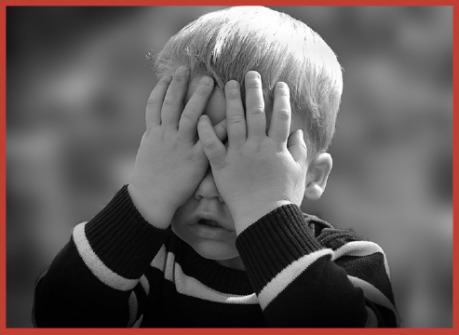

Tento článek do značné míry předpokládá, že už s PbtA systémem nějakou zkušenost máte buďto přímo z hraní Apocalypse Worldu nebo alespoň máte představu, jak se hry založené na tomto systému hrají, protože jste zkoušeli či alespoň četli některou z mnoha her, od PbtA odvozenych. pravidla četli. Problematiku budu vysvětlovat konkrétně nad původní hrou – Apocalypse World ve 2. edici. Přesto může být užitečnou inspirací i pro hráče, kteří by rádi zkusili bez Vypravěče hrát jinou hru a hledají cestu, jak si zajistit generování zápletek v takové hře.

V úvodu si připomeneme, jak se původní nemodifikovaný Apocalypse World vlastně hraje. MC do hry nepřináší žádné předem připravené zápletky, jako tomu bývá zvykem. Namísto toho na prvním sezení spolu s hráči vymyslí a s pomocí pravidel vygenerují sadu __hrozeb ­(threats)__, které reprezentují blízké i širší okolí postav. Během další hry pak vytváří hrozby nové či naopak staré hrozby ruší či upravují. A podoba těchto hrozeb (v pravidlech i v příběhu) je tím, co ve hře následně určuje reakci prostředí. MC tedy nevymýšlí reakce prostředí sám, ale místo toho si vybírá a popisuje hráčům nejvhodnější interpretaci toho, co mu hra předurčila.

Než si ukážeme, jak tohoto herního prvku využít, aby MC ve hře vůbec nemusel být přítomen a všichni hráči si zahráli, zopakujme si ještě, jakým způsobem hra směřuje vývoj událostí, když MC hraje.

V Apocalypse Worldu se MC ke slovu dostává jen za určitých, pravidly definovaných okolností:

- Pokud se ho hráči zeptají, co se děje či jak reaguje okolí
- Pokud hráči dají okolí příležitost reagovat (např. tím, že se vědomě vystaví známému nebezpečí)
- Pokud tak určí herní mechanika (např. hráči hodí 6 a méně na kostkách)

Když tento okamžik nastane, MC musí rozhodnout, jakým způsobem prostředí zareaguje. Jak už víme, MC nemá dopředu připravenou žádnou zápletku. Pravidla mu ale poskytují seznam možností, který nejen, že může, ale dokonce musí využít, aby příběh či scénu nějak posunul. Tyto možnosti se označují jako __tahy (moves)__, a říkáme tedy, že pokud je splněna jedna z výše uvedených podmínek, MC je na tahu. Tahy jsou krátké instrukce, které vyjadřují, co má MC udělat, např. _Rozděl je_ (_Separate them_), Z_ajmi někoho_ (_Capture someone_) nebo _Využij slabin jejich vybavení_ (_Activate their stuff’s downside_).

Tahy, které má MC k dispozici, jsou pevně dané. Vždy má k dispozici větší skupinu __obecných tahů (MC moves)__, které je možné napasovat na téměř jakoukoliv situaci. Navíc k tomu jsou ale ve scéně vždy přítomné nějaké hrozby. Hrozba mohla být přítomna ve hře už od počátku, anebo se jedná o herní prvek (například prostředí, protivníka, nebezpečí) natolik významný, že se MC rozhodl z něj hrozbu udělat.

Hrozby se dělí na několik typů a každý typ hrozby má vlastní množinu tahů, které tematicky rozšiřují výběr tahů dostupných pro MC. Například všechny dopravní prostředky ve hře patří k hrozbám typu _vozidlo_ (_vehicle_) a mezi jejich tahy patří např.: _Naraž do překážky_ (_Smash into an obstacle_) nebo _Řiť se bezhlavě vstříc nebezpečí_ (_Veer stupidly into danger_), zatímco všechny mocné cizí postavy, které jednají zpravidla v zastoupení svých pohůnků a služebníků, jsou hrozbou typu _vojevůdce_ (_warlord_) a k jejich tahům patří např. _Ukaž disciplínu_ (_Make a show of discipline_) nebo _Obchvať, zažeň do rohu, obklič někoho_ (_Outflank someone, corner someone, encircle someone_).

Hrozby mají i svoji motivaci či agendu vyjádřenou jedním nebo více slovy, díky čemuž dávají MC inspiraci k popisu jeho tahů. Například hrozba typu _surovci_ (_brutes_) dává možnost zahrát tah _Proveď koordinovaný úder s jasným cílem_ (_Make a coordinated attack with a coherent objective_). Stejný tah ale bude znamenat různé události, pokud je hrozba popsaná jako _dav_ (_mob_): _bouřit se, pálit, popravit obětního beránka_ (_to riot, burn, kill scapegoat_); či zda zda je její motivace _požitkáři_ (_sybarites_): spotřebovat někomu zdroje (_to consume someone’s resources_).

Nakonec hrozby, u kterých se předpokládá vývoj a gradace, mají ve hře takzvané __odpočítávadlo (countdown clock)__, které slouží k tomu, aby příběh střídavě gradoval a ustupoval. Počítadlo má podobu šesti polí, které se proškrtávají tak, jak se hrozba projevuje v příběhu. Ne každé vystoupení hrozby či odehrání jejího tahu musí počítadlo posunout – k proškrtnutí zpravidla dochází při významnějších odhaleních či zvratech, které se hrozby týkají.

První tři pole slouží k představení a zformování hrozby – hráči se dozvídají, jaké nebezpečí hrozba představuje, zda je možné mu zabránit, jak bude hrozba růst a zároveň mají možnost zasáhnout a hrozbu proměnit. Další dvě pole reprezentují gradaci – je nevyhnutelné, že hrozba vyvrcholí, hráči se připravují či hrozbu konfrontují. Poslední pole představuje vyvrcholení dané hrozby a jeho průběh do značné míry závisí na předchozích okolnostech v příběhu. MC tedy používá počítadlo jako podklad pro svá rozhodnutí. Pokud se hrozba na scénu dostává poprvé, měl by ji nějakým tahem představit. Pokud proškrtává poslední pole, znamená to vyvrcholení dramatického oblouku této hrozby – může jít o její porážku a odstranění nebo naopak o její vítězství či zásadní příběhový zvrat, který hrozbu promění. A s proměnou se vytvoří nová hrozba s novým odpočitávadlem.

Krom seznamů tahů a počítadel zkázy se MC dále řídí doporučením, kdy tahy hrát tzn. tvrdě a kdy měkce. Měkké tahy jsou takové, které zahrnují spíš příležitosti či varování před budoucím nebezpečím. Posouvají příběh, ale nechávají hráči kontrolu. Typickými měkkými tahy jsou například _Ohlas budoucí nebezpečí_ (_Announce future badness_) nebo _Nabídni příležitost, zdarma nebo za cenu_ (_Offer an opportunity, with or without a cost_). Mezi tvrdé tahy patří ty, které postavě přímo ublíží či přivedou ji do nepříjemné situace nebo provází vyvrcholení některé z hrozeb. MC při nich zpravidla na čas přímo převezme kontrolu nad postavou a může jí něco provést, aniž by tomu mohl hráč zabránit – například _Seber jim vybavení_ (_Take away their stuff_) nebo _Uděl poškození_ (_Inflict harm_).

Měkké tahy MC většinou hraje ve chvílích, kdy se hráči dobrovolně vzdávají slova a ptají se, co bude dál. Tvrdé tahy oproti tomu mají přicházet tehdy, pokud hráči dali příležitost nebo neuspěli ve svém hodu na kostkách. Doporučení, kdy hrát tvrdě a kdy měkce, je však nezávazné a pokud má MC dobrý důvod, může se od něj odchýlit.

Abychom nemluvili jen v popisné rovině, ukážeme si krátký kus hry v praxi.

> __Příklad:__ Enrieta je chopper a jako námezdná žoldačka je se svými motorkářkami známá v kraji tím, že občas bere peníze za řešení problémů a jindy zase za jejich vytváření. Teď přijíždí do malé osady jako výběrčí něčeho, co je napůl cesty mezi daněmi a výpalným. Jde o malou sběračskou osadu na okraji zamořené části města. Eva, hráčka Enriety, popíše, jak se její hrdinka i s ostatními jezdkyněmi blíží k vesnici a ptá se Martina, který je MC, co se ve vsi při jejich příjezdu děje.
>
> Martin je tedy na tahu. Nemá připravenou žádnou zápletku, místo toho si prohlédne zápis hrozeb týkající se osady a okolí. Lidé v osadě trpí radiací unikající ze zamořené čtvrti – hrozba typu Obtíže (affliction) s motivací „vystav lidi nebezpečí“ (Condition: to expose people to danger).
>
> Ta už byla v předchozích scénách celkem 3x představena a má proškrtnutá 3 pole ve svém odpočítávadle. Eva se Martina zeptala, proto by jeho odehrávaný tah měl být měkký. Zároveň ale bude Martin proškrtávat již čtvrté pole této hrozby, proto by měl příběh ohrožené vesnice gradovat. MC se podívá na tahy, které má k dispozici, a přijde mu adekvátní, aby zahrál, že někdo považuje hrozbu za požehnání (Someone proclaims the affliction to be, infact, a blessing).
>
> MC popíše Evě, že když Enrieta s děvčaty dorazí na náves osady, jakýsi poblouzněnec tam zrovna nabádá lidi, aby přestali daně platit. Vykládá jim, že radiace je pro vesnici vlastně požehnáním, protože díky ní je konečně vidět, že o vesnici se nikdo nestará a tedy nejde o žádné daně, ale sprosté výpalné. A že osadníci musí vzít vlastní osud do svých rukou.
>
> Eva se rozhodne, že si jako vůdkyně motorkářského gangu musí zjednat respekt a rozhodne se dotyčnému buřiči pohrozit zastřelením, jestli okamžitě nepřestane a sám nezaplatí dvojnásobek. Kostky jí bohužel nepřejí a hodí jen 5. To je tedy příležitost, aby MC zahrál tvrdý tah.
>
> Jak už víme, počítadlo přítomné hrozby affliction/Condition má proškrt­nuté již čtyři pole a osud vesnice se blíží k důležitému zvratu. MC se tedy může rozhodnout, že dále eskaluje hrozbu z vesnice. Proškrtne pátý čtvereček a vybere tah „Someone takes self-destructive, fruitless, or hopeless action.“ V příběhu popíše, jak se rozzlobení vesničané s vidlemi, basebalkami a pistolemi vrhli na po zuby ozbrojené motorkářky. Naprosto stejný tah by ale také mohl popsat tak, že vesničané opravdu mávli nad motorkářkami rukama, sbalili své nástroje a vydali se zamořenou část města čistit od radiace – a naznačit tak Evě, že pokud Enrieta chce nějaké daně vybrat, měla by ukázat, že vesnice si ochranu neplatí nadarmo a pomoct jim. Mohl by také vybrat jiný tah, např. z obecného seznamu vybrat „Take away their stuff“ a popsat, jak vesničané překvapivě obklopí motorkářky a začnou je obírat o zbraně a munici, anebo tah „Activate their stuff’s downside“ a popsat, že Enrieta v rozčilení stiskla spoušť své nespolehlivé zbraně ještě předtím, než vyslovila svou hrozbu a vypadalo to jako chladnokrevná vražda.
>
> Protože odpočítávadlo je již těsně před vyvrcholením, MC nejspíš zahraje jednu z uvedených možností. Kdyby se však hrozba radiace teprve představovala, mohl by si MC také uvědomit, že má na scéně dvě hrozby typu surovci (brutes) – Enrietin gang a shromážděné obyvatele vesnice. Potom by mohl zahrát některý z jejich tahů.

Pozorný čtenář si již jistě všiml, že úloha Mistra obřadu v ApocalypseWorldu se tedy primárně sestává z interpretace hrozeb a tahů do herní reality a položil si otázku:

„Potřebujeme při hře na tento úkol samostatného člověka? Hra nám stejně do značné míry diktuje, z čeho a jakým způsobem se vlastně má MC tah vybírat. Nestačilo by tedy, abychom výběr tahu nechali téměř zcela na hře samotné? Potom by totiž popis a interpretace vybraného výsledku mohl zastat kterýkoliv spoluhráč, v době, kdy zrovna nehraje za svou postavu.“ Jak napovídá název tohoto článku, odpověď zní: „Samostatný MC opravdu není potřeba a můžete to tak udělat.“

## Co k tomu budete potřebovat?

Váš MC bude putovní a budete se o jeho roli střídat, stejně jako se budete střídat ve vyprávění toho, co dělá vaše postava. Velmi vhodné je uspořádání, kdy se hráči postupně střídají, po směru hodinových ručiček, ve vyprávění příběhu jejich postavy. Obdobně jako jsme říkali, že když hraje MC, je na tahu, budeme i o hráči, který je zrovna na řadě a má slovo hovořit, jako o „hráči na tahu“. Hráč na tahu zůstává, dokud se mu daří. Za určitých, předem domluvených okolností ale musí tah předat buďto jinému hráči, nebo putovnímu MC. Je vhodné, aby důvodem pro takové předání tahu byla jedna z následujících okolností:

º Hráč se sám vzdá tahu a předá ho hráči po své levici.

> Pokud hrajete na rozsáhlejším území, můžete se domluvit, že tato možnost nastane vždy, když vaše postava absolvuje delší přesun, pokud při hře přeskakujete mezi scénami delší časové úseky nebo postava čeká na události ve fikci, může oním momentem například právě takový střih.

º Hráč se zeptá putovního MC na dění či reakce okolí a na tahu je MC. Ten zahraje měkký tah a předá slovo spoluhráči po hráčově levici.

> Pokud máte ve hře více významných lokací, můžete se domluvit, že tato možnost nastane vždy, když vaše postava navštíví nové významné místo, aby se při příjezdu vždy něco zajímavého dělo.

º Hráč má výsledek hodu 6 nebo horší (miss) a na tahu je MC. Ten zahraje tvrdý tah a předá slovo spoluhráči po hráčově levici.

> Pozn.: Pokud hrajete druhou edici Apocalyspe Worldu, v bojových tazích ani při výsledku 6− nenastává miss. Součástí kaž­dého bojového tahu ale je výměna udělené zranění a to dále ovlivňuje události pomocí tahu „Suffer harm“. Aby i během boje mohlo dojít k předání slova, považujte výsledek 10+ v tomto tahu za předání tahu MC.

Všimněte si, že pokaždé, když je putovní MC na tahu, odehraje, ale tah nepředá zpátky. Místo toho předáním tahu dalšímu spoluhráči vytvoří jakýsi miniaturní cliffhanger, který pomáhá s udržováním napětí ve hře. Záleží jen na něm, zda tento cliffhanger pevně vymezí, či zda nechá popis neurčit, jako pouhou nahrávku pro příštího putovního MC. Výjimku z tohoto pravidla udělejte při prvním hodu nebo úvodním dotazu „Co se děje?“ na začátku scény. Hráče by určitě nepotěšilo, kdyby jeho tah okamžitě končil s první větou, po které mu nepřejí kostky, nebo si po větším zvratu ve svém tahu stihl pouze ujasnit, v jaké situaci se jeho postava nachází.

Ve chvíli, kdy po hráčově levici sedí putovní MC, prostě si role vymění – spoluhráč po levici získá tah a z hráče, který dosud byl na tahu, se stane putovní MC. Můžete si to představit tak, že hráči se střídají jeden po druhém po směru hodinových ručiček. V okamžik, kdy by se hráčem na tahu měl stát aktuální putovní MC, prostě si s hráčem, od kterého přebírá tah, vymění role. Tím pádem se role putovního MC posune o jednoho hráče proti směru hodinových ručiček a hra pokračuje.

Občas se stane, že některý hráč v době, kdy má slovo, potřebuje nějak interagovat s jinými hráči. To je v pořádku, a dokud má slovo, může je k tomu vyzvat. Případný rozhovor či souboj si pak odehrají podle standardních pravidel pro konfrontaci hráčů. Tato krátká předání ale nejsou považována za předání tahu, spíše za dočasné předání slova. Pokud je takto oslovený protihráč ten, kdo zároveň v daný moment zastává roli putovního MC, je vhodné kvůli zachování objektivity po dobu vzájemné interakce svěřit roli putovního MC někomu třetímu.

V každém okamžiku hry tedy jeden hráč je putovní MC a jeden je na tahu se svou postavou. Ostatní, pokud nejsou vtaženi do scény jako hosté, jsou v tuto chvíli spíše diváci. To ale neznamená, že mají být nutně jen pasivní. Mohou připomínat putovnímu MC, jaké hrozby jsou přítomny na scéně, nabízet vlastní nápady či přemýšlet o motivacích a událostech probíhajících na pozadí.

Pro hru je určitě lepší, když putovní MC nevybírá z celého seznamu všech možných tahů. V jedné scéně může být přítomno i více hrozeb různého druhu a zcela jistě by zdržovalo, kdyby se musel pokaždé probírat dvacítkou až třicítkou tahů. Zároveň platí, že hře prospěje, když bude volba tahů do jisté míry náhodná – přinese to příběhové zvraty, které by jinak hráče nenapadly, kdyby je vylosovaný tah neomezoval. Na druhou stranu není možné výběr konkrétního tahu nechat čistě a jen na náhodě. Příliš náhodné tahy by neumožňovaly vytvářet uvěřitelný příběh. Rozumným kompromisem je tedy na náhodě nechat jakýsi předvýběr a konkrétní tah a jeho interpretaci už poté provede putovní MC.

Jak víme, existují obecné tahy, každý typ hrozby má svou množinu tahů a dále také na tahy pohlížíme jako měkké a tvrdé. Zkuste si tedy před hrou připravit karty, pomocí kterých bude putovní MC svou předvybranou množinu losovat. Na jejich rub vyznačte, pod jakou hrozbu spadají (případně že jde o obecný tah), a na jejich líce napište na každou kartu dva nebo tři obdobné tahy – do spodní části (a např. zelenou barvou) tah měkký, do horní části (a např. červenou barvou) tah tvrdý a uprostřed (pokud se rozhodnete pro variantu se třemi tahy např. oranžovou barvou) tah, který lze snadno zahrát oběma způsoby.

> Příklad: Jedna z karet hrozby typu grotesque může mít v horní části (zeleně) spíše měkký tah „Insult, affront, offend or provoke someone.“, ve střední části (oranžově) obojetný tah „Ruin something. Befoul, rot, desecrate, corrupt, adulter it.“ a ve spodní části (červeně) spíše tvrdý tah „Attack someone face-on, but without threat or warning.“

Až budete mít karty připravené, rozdělte je do skupin podle hrozeb, pod kterou spadají, a každý z těchto balíčků zamíchejte.

Když se při hře dostane putovní MC na tah, lízne si jednu kartu z obecného balíčku a jednu kartu za každý typ hrozby, která je na scéně přítomna. Tak bude mít před sebou na výběr obvykle z šesti až dvanácti tahů, odstupňovaných podle tvrdosti. Jeden z nich si vybere a zahraje ho proti hráči. Občas se může stát, že náhoda si s kartami příliš zahraje a žádný z líznutých tahů se do příběhu opravdu nehodí. V takovém případně se ještě jednou zamyslete, zda vás nenapadne nějaká zajímavá interpretace a pokud tomu tak není, vždy můžete zahrát univerzální tah _Turn their move back on them_, na který nepotřebujete žádnou kartu.

Přestože odehrávání reakcí okolního prostředí tvoří výraznou část náplně práce MC, není to zdaleka všechno, co při hře MC dělá. Proto si na závěr článku projdeme v krátkosti i to, jak jeho proměna v putovního MC promění jeho agendu a principy, kterými se hra řídí.

Prvním požadavkem agendy, je aby MC udržoval herní svět živý a uvěřitelný. V případě hry bez pevně daného MC přechází tato odpovědnost na všechny hráče společně. MC by se také měl starat o to, aby život a příběh postav byl zajímavý. V tom mu do značné míry pomůžou karty – náhodný předvýběr tahů vám často nedovolí odehrát nějaký zjevný, předvídatelný – a tedy i nudný – neúspěch. S tím souvisí připomenutí toho, že miss není neúspěch, který by hru zastavil. Vždy je následován nějakým tahem ze strany MC a vždy posouvá příběh, byť to pokračování nemusí nutně být pro postavu příjemné. Třetí bod agendy, kterou MC má dodržovat, je vlastně spíše jakýmsi anti-bodem, který vymezuje, co MC dělat nesmí. Instrukce zní: _Co se bude dít, objevujte hraním_ (_Play to find out what happens_). V praxi to znamená, že při hraní originálního Apocalypse Woldu si MC nepřipravuje dopředu zápletky nebo scény, připravuje pouze prostředí a události nechává vyplynout ze hry samotné. Pro hru s putovním MC tento bod agendy platí dvojnásob. Do hry se dostává jen to, co zazní v době, kdy jste na tahu, ať už jako hráči nebo jako MC. Nikdy si nepřipravujte dopředu konkrétní podobu budoucích událostí, protože je velmi pravděpodobné, že až se bude ona budoucí scéna odehrávat, putovní MC bude někdo jiný.

S tímto třetím bodem agendy také souvisí podoba oněch cliffhangerů na konci tahů. Jste-li na tahu jako MC a ukončujete hráčův tah, na vás do značné míry závisí, jak moc vymezíte scénu, až se hráč opět dostane ke slovu. Pokud chcete, aby na scénu vstoupil konkrétní antagonista, zmiňte ho výslovně. Nespoléhejte se na to, že pokud slovo předáte dál s tím, že „ze stínu vystoupila temná postava“, všichni ostatní u stolu vám čtou myšlenky a tuší, kterého antagonistu máte na mysli. Jindy naopak bude žádoucí, aby neznámý zůstal neznámým, a právě v duchu posledního bodu agendy je lepší ponechat temnou postavu zatím anonymní a až později, hraním, společně objevit, o koho se jedná.

Obdobně je to s principy. Nebudeme je v článku procházet bod po bodu, většina z nich, např. _Odehrávej tahy v příběhu, nikoliv zmiňováním jejich jména_ (_Make your move, but never speaks its name_), se přenáší beze změny. Uvedeme si tedy jen ty nejdůležitější:

Občas se při hře stane, že hráčova postava je osobně zainteresovaná v některé z hrozeb a hráč sám je putovní MC, když se hrozba dostane do cesty jinému hráči. V takovém případě je nutné si uvědomit, že princip _Buď fanda hráčských postav_ (_Be a fan of the players’ characters_) se týká zejména postavy, která je zrovna teď na tahu, i když to pro postavu putovního MC znamená jít proti zájmům postavy své. Pokud se dostanete do takového konfliktu zájmů, můžete dočasně delegovat pravomoci putovního MC na neutrálního hráče, podobně jako by vaše postava byla přímo přítomná na scéně.

Jednou z dalších odpovědností MC je přemýšlet i o událostech, které nejsou výslovně zmíněny v odehrávaných scénách. Jde o princip _Mysli i mimo scénu_ (_Think offscreen too_). Platí pro něj obdobné omezení, jako pro třetí bod agendy – nespoléhejte se na to, co nebylo výslovně zmíněno ve hře. Pokud chcete ostatním hráčům dát najevo, že probíhají i nějaké události mimo aktuální scénu, naznačte je, nebo zmiňte v době, kdy jste na tahu, anebo využijte tahů _Ohlas budoucí nebezpečí_ (_Announce future badness_) a _Ohlas nebezpečí mimo scénu_ (_Announce off-screen badness_). Při hře s putovním MC je také větší riziko, že se společná představa hráčů o událostech na pozadí rozejde. V běžné hře by to byl právě MC, kdo by případně přemýšlel o tom, jak se události probíhající mimo scénu posunou a staral by se o jejich soulad s odehraným příběhem. V naší hře je tahle odpovědnost společná, zmiňujte proto události mimo scénu otevřeně, abyste předešli rozporům ve vaší představě.

Důležitou zodpovědností MC je také distribuce hráčského spotlightu a dočasné předávání vypravěčských pravomocí. O spotlight se vám do značné míry postará vynucené střídání hráče na tahu v případě missu, delších přesunů či čekání jeho postavy. Pokud jde o předávání vypravěčských pravomocí na ostatní hráče, odpovědnost za něj zůstává na bedrech putovního MC, nebojte se při tom využívat hráčů, co zrovna nejsou na tahu a zapojit je.

Poslední věc, co pro úspěšnou hru potřebujete, jsou hrozby samotné. Pro jejich záznam při hře vám naprosto postačí karty hrozeb a mapa, které jsou přibaleny v Apocalypse ­World Player Refbooku. Hru výrazně usnadní, když se je všichni naučíte číst a vyplňovat obdobným způsobem. Už víme, že množství hrozeb vznikne v průběhu hraní – jde o hráčské pomocníky, gangy, vozidla. Jen s nimi si ale nevystačíte. Aby hra nebyla jen bezcílným putováním a sérií náhodných setkání, je dobré dát jí nějaký všeobecný rámec či hrozby trvalejších charakteru. Možností, jak je do hry dostat je několik.

Velmi vám v tom pomůže první sezení. Při jeho tvorbě si vzájemně klaďte otázky na prostředí, ve kterém postavy žijí, jeho minulost, problémy, kterého tíží a významné cizí postavy, které jejich život ovlivňují. Ty pak převeďte v souladu s pravidel do hrozeb.

Další možností je dohodnout se na tom, že krom běžných hrozeb, každý z hráčů do hry vnese jednu či dvě hrozby navíc, podle toho, jaký příběh by chtěl odehrávat. Např. pokud má rád prostředí postapokalyptických závodů, může přidat jako hrozbu mecenáše, který závody pořádá. Tuto hrozbu pak bude pro ostatní „administrovat“. Vymyslí její motivaci, popíše jeho charaktery, vzezření, prostředí, ve kterém žije. Vnesení jedné takové významné hrozby následně spustí celou kaskádu dalších hrozeb – takový mecenáš zcela jisté bude obklopen lidmi, kteří mu slouží, závodní dráha sama o sobě je nebezpečným terénem, je pravděpodobné, že v okolí tábořiště vyroste malá osada nebo tržiště, to bude mít vlastního vůdce a ochranku a tak dále …

Pokud při hře MC odehrává hrozbu administrovanou některým z hráčů, může ji odehrát zcela po svém, nebo se o její reakci a interpretaci vybraného tahu poradit právě s hráčem, který hrozbu vnesl. Čas od času se také stane, že hráči se uvolní ruce a přestane být za svou hrozbu odpovědný. Například jeho hrozbou mohl být nebezpečný gang mutantů a jiný hráč je eliminoval. Nebo jeho hrozbou byl také nebezpečný gang mutantů, ale jiný hráč si při přestupu na vyšší úroveň zvolil ve svém deníku volbu _„get a gang“_ a události v příběhu ho přivedli k tomu, že získal kontrolu právě nad tímto specifickým gangem. V takovém případě zkrátka hráč při vhodné příležitosti (např. na příští sezení) připraví hrozbu novou.

Mnoho kampaní se také točí kolem nějakého centrálního motivu. Jak už víte, důležitým bodem herní agendy je nepřipravovat události dopředu, ale objevovat je až hraním. Na prvním sezení nejspíše ještě nebudete vědět, jak centrální motiv vaší hry bude vypadat. Po několika sezeních už ale motiv může být patrnější a to je ten okamžik, kdy je vhodné tento motiv hry také nějak pojmenovat, případně z něj udělat hrozbu – buďto stálou a všudypřítomnou, anebo postupně eskalující, s vlastním odpočitávadlem.

Spojením všech výše uvedených zdrojů hrozeb by mělo vašim postavám zajistit náměty na dobrodružství a příběhy na nemálo sezení. Hodně štěstí ve vašich postapokalyptických dobrodružstvích.
