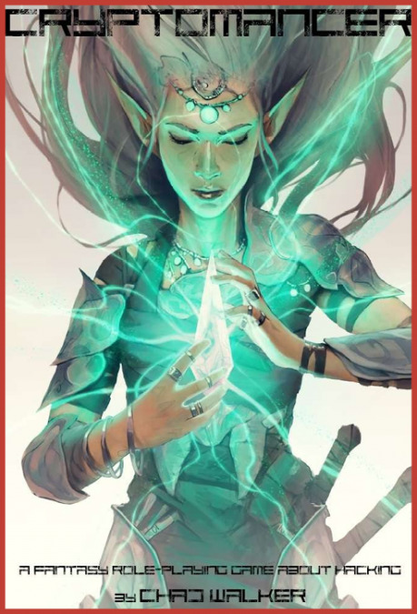

Pravidlá majú 430 strán malého formátu (v priemere okolo 250 slov na stranu), s obrázkom pri každej kapitole. Sú písané v duchu hackingu a tomu je prispôsobený i samotný formát textu, ktorý pripomína príkazový riadok (v linuxe).

Cryptomancer popisuje svet high-fantasy s výraznými prvkami hackingu a špionáže tak, ako ho poznáme zo súčastnosti. Autori sa snažili vytvoriť prostredie a mechanizmy tvorenia postavy vhodné pre hranie klasického fantasy sveta, ale i herné mechanizmy, ktoré sú vhodné pre atmosféru hakingu, tajného získavania informácií, života na úteku.

Svetu vládnu mu tri majoritné rasy: Podzemiu trpazlíci (Subterra), lesom elfovia (Sylvetica) a niekde medzi tým ľudia (Sphere).

Trpazlíci, objavitelia Shardstone – kameňa, ktorý je základným uzlom pre „fantasy internet“ (Shardnet), majú prakticky monopol na ťaženie, výrobu, tvorenie a predaj komunikačnej siete – toku informácií, na ktorej je obchod i politika závislá. Zároveň sú to zruční výrobcovia automatonov, golemov a prístrojov poháňaných parou.

Žiadna rasa nie je „čierna“ alebo „biela“. Tak i elfovia, lesní jazdci na gigantickom hmyze, menia svoju tvár behom histórie. Bývalí nomádi, zmenili spôsob života na mestský. Elfovia si stavajú domy okolo gigantických stromov lacuma, v ktorých pestujú drogu Soma, po ktorej každý túži. Tá však čerpá živiny z okolitých stromov, a tak po dopestovaní ostáva po elfoch púšť miesto zeleného lesa.

Ľudia, v dávnych dobách len niečo viac ako hovoriace opice, sa v tejto dobe vo svojich mestských štátoch stávajú nepostrádateľní ako centrum obchodu, konšpirácií, politických machinácií.

Dobrodruhovia tak vstupujú do komplikovaného sveta obchodu, drog, politiky, špionáže, komunikácie a dôvery v pozícii vyvrheľov, ktorí sú na čiernej listine organizácie strážiacej Shardnet. Môžu v ňom riešiť klasické fantasy questy v krajine plnej lesov a hôr, ale tiež sa môžu vrhnúť do víru hackingu a penetračného testovania, získavania infríg i boja obchodných a politických frakcií mesta.

Pravidlá veľmi peknou formou spojili fantasy Shardnet – fantasy forma moderného internetu – a modernej kryptológie. Vysvetľujú základy používania symetrickej a asymetrickej šifry, použitia a crackovania hesiel (true name, soul key), sociálneho inžinierstva a podobne.

Samozrejme nechýba ani mágia, ktorá je nastavená tak, aby zapadla do postaveného sveta. Na kúzlenie je možné minúť 1–3 talenty a tým nastaviť silu kúzelníka. S jedným talentom je možné kúzliť jednoduché kúzla, ako je prekladatel, zmena alchymistických elixírov, zdieľanie videnia, posvätenie. S dvoma talentami je možné kúzliť väčšiu škálu kúziel. Pribudli útočné kúzla, očarovania, liečenie, čítanie mysle a podobne. Najsilnejší kúzelníci už dokážu i napríklad určitú formu teleportu cez Shardnet.

Zaujímavým mechanizmom je budovanie si základne, ktorá dáva hrdinom bonusy ku niektorým hodom.

Na prvý pohľad sa Cryptomancer podobá Shadowrunu. Pocit, respektíve atmosféra vykresleného fantasy sveta, je však iná. Pravidlá sú písané prehľadne a dávajú GMovi pekne popísané mechanizmy, ako sa o hráčov vo svete špionáže a hackingu postarať, ako ich zabaviť. Zároveň hrať v tomto svete znamená, že šanca na neúspech prudko stúpa v závislosti od utajenia, respektíve prezradenia hrdinov. Rovnako ako v súčasnom svete, čím tichší si, tým lepšie vieš predchádzať protiopatreniam súpera a tým viac „počuješ“.

Tvorcovia použili pravidlá, ktoré som ja osobne ešte nevidel. Používajú 4 hlavné vlastnosti wits, resolve, speed a power (používajú sa ako cieľové číslo pri „opposite“ hodoch). Z každej z nich odvodia dve ďalšie, ktoré sa využívajú na samotné hody a majú hodnotu od 1 do 5. Hádže sa stále piatimi kockami. Úrovňou vlastnosti k10 a zvyšok k6. Napríklad power (6) si hráč podelí na Strenght (2) a Endurance (4). Ak je Strenght 2, potom si na pascu na silu hádže 2k10 a 3k6. Ak by bola Strenght 4, potom si hádže 4k10 a 1k6. Hody kockou sa porovnajú s cieľovým číslom a určí sa počet úspechov. Väčšinou stačí jeden úspech, ale na niektoré náročné činnosti je potrebných viacej úspechov. Zákerným je hod 1, ktorý neguje jeden úspech.

Na záver, pravidlá a popísaný svet Cryptomancera si určite zaslúžia hlbší pohľad a rád by som povzbudil potencionálnych hráčov, aby si o tomto RPG prečítali i z iných zdrojov.

Mňa osobne doslova očarovali krásou Shardnetu.
