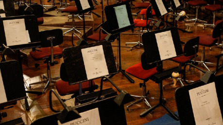

Koho by nepohltily osudy Angela Neumanna, žoviálního ředitele, který procestoval Evropu s vlakem plným opery, v Lipsku na jeviště přivedl slona a v Praze se zasloužil o úspěšné založení Nového německého divadla – dnešní Státní opery – a jehož koncept „divadla zvláštních událostí“ dokázal nadchnout diváky? Nebo cesta jeho nástupce Heinricha Tewelese od divadla do editorského křesla _Prager Tagblattu_ a zpět? Příběh záboru Stavovského divadla, po němž se prezident Masaryk zapřisáhl do něj už nikdy nevstoupit, a nesnadné roky ředitele Leopolda Kramera po Velké válce? Léta hospodářské krize během působení Roberta Volknera? Nebo epilog této éry, kdy se Paul Eger hrdinně snažil dál nezávisle vést divadlo, navrátit mu lesk Neumannových let a pomáhat uprchlíkům z Německa, zatímco nad Evropou se stahovala mračna?

Nemluvě o zajímavých detailech z divadelní historie jako tom, že divadla si dlouho jen pronajímala šatny, místo aby je spravovala; že ředitelé při vedení divadla zpočátku riskovali vlastní prostředky a balancovali mezi požadavky Zemského výboru a tím, co považovali za nejlepší pro publikum; jak čeští a němečtí ředitelé jednali o rozumném rozdělení repertoáru a „zapůjčování“ personálu; kterak se celou historií jako nit táhly spory o platové podmínky; jak se objevila konkurence v podobě biografu; jak u nás hostovaly soubory z Japonska, Ruska … A nemluvě také o úžasné plejádě oper a divadelních her, které pro nás už zavál písek dějin, ale jejich popisy stále dokážou jitřit představivost.

Knihu jsem otevřela kvůli informaci, na jakou operu se dalo zajít v prosinci 1912 – ale našla jsem tam mnohem více, celý úžasný nový svět. Není divu, že s sebou přinesl i inspiraci. Více než sedmisetstránková bichle se čte napínavěji než obdobně rozsáhlé kusy _Písně ledu a ohně_ (nebo si dosaďte libovolnou rozsáhlou fantasy). Dějiny divadla mi neodbytně vířily v hlavě. A tak vznikla delší povídka _Nesnáze s Wagnerem_, publikovaná česky v antologii Bájná stvoření a anglicky jako _The Wagner Trouble_ v magazínu _GigaNotoSaurus_. Duch skladatele proslulého svou výbušnou povahou, náladovostí a mnoha dalšími ne právě příjemnými vlastnostmi se zjeví v Novém německém divadle na sklonku roku 1887, krátce před jeho plánovaným slavnostním otevřením, divadlo přišlo o svého stálého vymítače a musí rychle najít náhradu, aby nedošlo k pohromě … Novým vymítačem se nestává nikdo jiný než Gustav Meyer, sotva dvacetiletý mladík s hlubokým zájmem o okultno. Pokud vám jméno nic neříká, dost možná ho znáte pod jeho podobně znějícím literárním pseudonymem.

U toho by bývalo mohlo zůstat, ale … kdepak. Snad nevěříte, že tak fascinující historie by neinspirovala více příběhů. Pro dvě pokračování z přelomu 19. a 20. století jsme spojily síly s Lucií Lukačovičovou, využily svou zálibu v _Tosce_ a _Mefistofelovi_, a v jedné z povídek se vyskytne i Národní divadlo a tamní vymítač: Jiří Karásek ze Lvovic. A když jsem nedávno byla požádána o povídku do antologie s tématem nacistů, přišlo to jen týden poté, co jsem spontánně rozepsala další operní povídku, odehrávající se tentokrát v roce 1938 – na samém sklonku existence Nového německého divadla. Jsem sama zvědavá, co na ni editoři řeknou a v jaké společnosti se případně objeví; nacisté jsou ve fantastice „vděčné pulpové téma“, ať už si představíme jejich role v _Hellboyovi_, _Indiana Jonesovi_, _Kapitánu Amerikovi_ a jinde. Z toho pohledu mi hrozí, že má povídka bude jedinou vážně pojatou v celé antologii (a dost možná jedinou s převážně německými postavami v hlavní – a jiné než záporné – roli). Možná se ale zcela mýlím; to zřejmě poznáme brzy. Do budoucna by mě lákalo se vrátit přinejmenším ještě do doby záboru Stavovského divadla (1920), možná do let hospodářské krize, a třeba v daném fantasy světě navštívit více i Národní divadlo nebo jiné scény v Česku i ve světě.

_Až k hořkému konci_ tak změnila můj život. Nejenže pestrá historie Nového německého divadla inspirovala celou sérii fantasy povídek (které si snad budete moci v dohledné době přečíst všechny), ale navázala na můj zájem o soužití Čechů, Němců a dalších národností v Praze od poloviny 19. do poloviny 20. století obecně. Ten byl jedním z hnacích motorů stojících na počátku psaní detektivního románu zasazeného do sklonku roku 1912 (kdy jsem mj. potřebovala postavy poslat do opery) a během psaní ještě vzrostl. Rozhodnutí dát hlavnímu hrdinovi-vyšetřovateli původ v česko-německé rodině se ukázalo nosné a začalo čím dál více ovlivňovat příběh. Kromě půjčování statí o česko-německých vztazích na přelomu století, statistik o počtu smíšených sňatků v různých okrscích Prahy (chvála rakousko-uherské byrokracii) a knih o pražských hospodách, salonech či kavárnách (a divadle) jsem se pokoušela luštit převážně švabachem tištěná periodika z přelomu 19. a 20. století (alespoň dokud Rakouská národní knihovna nezavedla převod skenu do formátu txt; teď už se při neporozumění mohu vymlouvat pouze na leckdy ne moc kvalitní převod a svou mizernou znalost němčiny). Varování: pokud se alespoň trochu rádi hrabete v historických pramenech, _nechoďte_ do databáze Rakouské národní knihovny. Pokrývá období od 1568 do 1946, obsahuje nepřeberné množství titulů a umožňuje fulltextové vyhledávání. Jakmile do téhle králičí nory jednou spadnete, strávíte tam dalekosáhlé hodiny. Byli jste varováni!

Divadelní svět si ale žádal jiné zpracování; v příběhu detektiva Eliáše Sattlera (jehož se snad dočkáte na přelomu tohoto a příštího roku) se jen mihl jako součást prostředí. Díky divadelním duchařským povídkám jsem se tak pustila i do králičí nory textů Meyrinka, Leppina, Broda a dalších německy píšících pražských autorů a začala pracovat na tom, abych si je jednou mohla přečíst i v originále. Někteří jsou spjati s divadlem pouze v daných fantasy příbězích, mnozí s ním ale pěstovali čilé styky a sami psali či překládali dramata nebo recenzovali divadlo v kulturních rubrikách tisku. Jejich životy byly obdobně dramatické jako události na prknech, která znamenají svět, a neoddělitelně doplňují osudy tehdejší české literární a divadelní scény. Někteří byli rodilí Pražané; jiní tu prožili jen kratší úsek života; někteří neuměli česky promluvit ani slovo; jiní se běžně setkávali se svými českými kolegy a popovídali si v češtině. Ostatně, pojetí identity v daných dobách může někdy působit lehce schizofrenně, jak pěkně dokládá věta z _Až k hořkému konci_ (str. 207): „Teweles byl Pražan svým narozením, Rakušan státní příslušností, hlásil se k Židům svým původem a k Němcům jazykem a kulturou.“ V divadle navíc odjakživa působili lidé z nejrůznějších koutů Evropy. Už proto, jak fascinující je Praha (a nejen ta, samozřejmě, ale o jiných regionech toho ke své škodě moc nevím) od závěrečných desetiletí monarchie po konec první republiky, se do ní určitě budu dál ráda vracet, ať už v detektivkách, fantasy nebo science fiction. Svou zásluhu na tom mají čeští i němečtí literáti dané doby i _Až k hořkému konci_.

Na závěr knihy se Jitka Ludvová zamýšlí nad tím, k čemu nám bylo německé divadlo – otázka, kterou si pokládali lidé už během jeho existence a především tehdy, kdy se chýlilo ke konci. I když pomineme působení osobností jako Gustav Mahler a uvádění zajímavých a mnohdy riskantních kusů, bylo divadlo kulturní branou Čechů do německého kulturního světa: máme tu překlady Janáčka, Šrámka a dalších autorů opery i činohry. Knihu pak uzavírají úžasné dobové texty, které autorka převážně přeložila z němčiny. Provádějí nás od roku 1886 až po 1938. Začínají optimistickou výzvou Franze Schmeykala k podpoření výstavby Nového německého divadla, končí redakčním úvodníkem _Bohemie_ a o měsíc novějším textem ze sudetoněmeckého hudebního magazínu.

Úvodník odjakživa demokratické a liberální _Bohemie_ z 2. 11. 1938 se nese v hořkosladkém tónu (str. 744): „Hra skončila, pražské německé divadlo přestalo existovat. Zmizel cenný poklad, na němž mnoho lidí lpělo celým srdcem jinak než na zlatě a pomíjejících hodnotách. (…) Konec pražského německého divadla není jen tvrdou skutečností, ale také otřesně naléhavým symbolem. Skončilo cosi velkého a nevýslovně krásného a je třeba se s tím vyrovnat.“ Zato z článku Huga Kienzela z _Musikblätter der Sudetendeutschen_ až mrazí (str. 747): „(…) bránit se mnoha vlivům, jež otevřeně nebo skrytě hrozily překrýt jakékoli zdravé cítění a zničit veškerou práci pro národ. (…) Rozkladný proud se rozléval do říše. (…) Historicky jedinečným Vůdcovým činem bylo nám, sudetským Němcům, nyní umožněno vrátit se do vlasti, jejíž bouřlivý dech jsme směli až dosud vnímat jen zdálky. Co bylo po staletí nevyplněnou tužbou, stalo se teď šťastnou skutečností.“

Po svém hořkém konci strávilo divadlo protektorátní léta pod novým vedením z Říše, které nemělo nic společného s jeho dřívější tradicí. Většina souboru se obměnila. Z původních zaměstnanců divadla někteří uprchli; jiní byli zavražděni či uvězněni nacistickým režimem; další zůstali v Praze a posléze byli vysídleni po skončení války. Fundus byl rozebrán novými divadly; některé dokumenty s sebou odvezli pražští Němci při vysídlení; jiné přetrvaly, část doslova šťastnou náhodou. A na historii divadla se příliš nevzpomínalo. Dnes je Státní opera ve stavu rekonstrukce a zřejmě bude opět otevřena až v roce 2019. Je to škoda; 5. leden 2018 by se jako stotřicetileté výročí založení divadla (a na temnější notu téměř osmdesátileté výročí konce jeho první éry) ke znovuotevření doslova nabízel. Těším se, až znovu vstoupím do budovy, které pro mě kniha Jitky Ludvové vdechla život. Něco jiného je jen obdivovat krásu operního domu a užívat si představení – a pak budovou procházet a představovat si, jak se tu před odvíjely grandiózní začátky za Angela Neumanna či zoufalé snahy Paula Egera udržet soubor pohromadě za stále horší politické situace. _Až k hořkému konci_ mi sedí doma na poličce (půjčit nestačilo) a neuplyne měsíc, abych knihu alespoň na chvíli neotevřela a pokaždé v ní neobjevila něco nového. Díky ní nahlížím do světa, jehož nit nenávratně přetrhl nacistický režim a který se dnes těší spíše malé pozornosti. Jeho konec byl hořký; v naší paměti ale žije dál.
