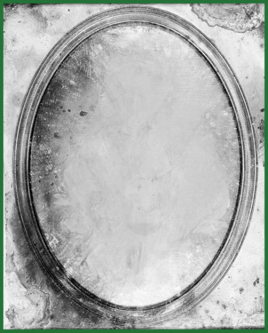

Jedná se o oneshot (jednorázové herní sezení) složený ze dvou na sebe navazujících kapitol. Dobrodružství lze zakomponovat i do rozehraných kampaní, potom je ale potřeba odehrát jen jednu z kapitol, popř. provést zásadnější úpravy. V první kapitole vede PH hráče za ručičku a postupně je seznamuje s jednotlivými mechanikami a pravidly. Hra by měla být svižná, cesta k cíli je jasná a bez výraznějších překážek. Pro tuto hru je vhodné využít předpřipravených postav („Hrdinové“), které najdete na konci článku. V druhé kapitole hráči hrají za jiné postavy („Dobrodruzi“) a je na dohodě, zda si vytvoří zcela nové, nebo pouze upraví a přejmenují již vyzkoušené vzory. Je potřeba hráče upozornit, že v druhé kapitole budou hrát za jiné postavy, aby si k Hrdinům nevytvořili příliš silné citové pouto. Druhá kapitola je otevřená – hráči již znají prostředí a v podstatě i znají cestu k cíli, jejich postavy toho ale ví málo. Zároveň příprava obsahuje jen popis prostředí a charakteristiku nejdůležitějších postav a skupin, jejich zájmy a cíle. Všechny scény vychází pouze z iniciativy hráčů. Odehrání první přímočaré kapitoly zabralo většinou kolem dvou hodin, otevřená druhá kapitola potom zabírá zhruba čtyři hodiny.

Cizí postavy v obou kapitolách vycházejí z bytostí uvedených v základní příručce a bestiáři DrD II. Najdete tam zejména Zvláštní schopnosti, které jsou zde uvedeny pouze obecně a dále obsáhlejší popis jejich chování.

## Pozadí příběhu

Před dávnými dobami, které si dnes již nikdo nepamatuje, připravoval divotvůrce Cronos Amanitis pro trpasličí horníky ojedinělý Žlutý sirup. Jednalo se o nezvykle silnou výbušninu, díky které byli trpaslíci schopni lámat i ty nejtvrdší skály a dolovat nejvzácnější nerosty. Tento výhodný obchod však nedokázal uspokojit Amanitovu nenasytnou povahu, divotvůrce chtěl stále víc … Postupně se pokusil se využívat svůj vliv a ovládnout trpasličího krále. Jeho pikle však byly odhaleny a trpaslíci zrádného Amanita odsoudili k smrti. Dobře utajenou laboratoř podezřívavého vynálezce se trpaslíkům nepodařilo objevit a jedinou vzpomínkou na divotvůrce se stalo kouzelné Zrcadlo, které si trpasličí král nechal vyrobit z Amanitových kostí, a do kterého zaklel jeho duši. Amanitis se však nevzdal ani po smrti, král pod vlivem Zrcadla zešílel a v následujících mocenských bojích mezi trpaslíky se Zrcadlo ztratilo. A jak Žlutý sirup pomalu docházel, stala se z celé záležitosti pouze legenda.

Uvězněná Amanitova duše touží po svobodě a návratu do materiálního světa. Působením skrze snový svět se Amanitovi podařilo během let dostat Zrcadlo do jeho bývalé laboratoře. Věří, že existuje rituál, který by vrátil jeho duši do živého těla. K tomu ale potřebuje vzácné suroviny, vhodné tělo a schopného kouzelníka. Prostřednictvím snového světa hledá mocné hrdiny, láká je do svých služeb a verbuje je k hledání nutných surovin a obnově laboratoře. Jeho plán zatím troskotá na mocném Strážci, kterého Amanitis v laboratoři stvořil v obavě z případných vetřelců. Strážce je mohutná kovová socha s nadlidskou silou a výdrží, nad kterou Amanitis po smrti zcela ztratil kontrolu. Socha, které se zub času téměř nedotkl, nadále pokračuje v plnění zadaného úkolu. Bezmyšlenkovitě napadá a ničí každého nezvaného hosta a tím vytrvale brání v šíření kouzelného vlivu Zrcadla. Postupem času se v blízkosti laboratoře rozrostla osada Bystrá.

## Kapitola první

Úvodní kapitola slouží jako výukové prostředí, pro které jsou určeny předpřipravené postavy odkazované výše. Žádná ze vzorových postav není nutná pro dokončení kapitoly a hráči si nemusí rozebrat všechny. V této části hrají hráči zkušené postavy, čemuž odpovídá i jejich úroveň. S ohledem na přístupnost nováčkům došlo ale k některým zjednodušením. Ačkoliv jsou postavy Hrdinové, ovládají jen jedno pokročilé povolání a každá postava má uvedeny pouze tři Zvláštní schopnosti, které vychází z jejich profilujících povolání. Hrdinové dále nemají žádné Pomocníky (postavy ovládané hráčem s Poutem a dalšími charakteristikami) a pro jednoduchost se nedoporučuje, aby nějaké v průběhu obou kapitol získali.

Postavy slouží pouze pro tuto kapitolu a na začátku druhé, obsahově delší, již hráči budou znát možnosti povolání DrD II a vytvoří dle svých preferencí postavy nové. Je potřeba, aby s tím všichni hráči byli srozuměni a nebáli se v první kapitole své postavy trochu potrápit a vyzkoušet si jejich možnosti – zejména čerpaní zdrojů a princip dlouhodobých následků (jizev).

Hrdinové jsou ostřílené postavy, které už společně ledasco zažily a jen tak něco je nepřekvapí. Krom společných zážitků je spojuje také Amanitův vliv, který na ně působí prostřednictvím snů a zjevení. V současné době pátrají po Zrcadle a všechny stopy je vedou do Bystré. V případě, že hráči nejsou schopni vymyslet během kapitoly další postup, je možné postavám ve spánku dodat podrobnější vize – čím blíže jsou Zrcadlu, tím je jeho moc větší.

## Vesnice Bystrá

Bystrá je prosperující osada obývaná převážně zemědělci, lovci a horníky. Blahobyt pochází zejména z využívání opuštěných trpasličích dolů, které se nachází v kopcích nedaleko od vesnice. Práce v dolech je sice nebezpečná, ale trpaslíci kdysi dávno zdaleka nevytěžili všechno bohatství země a zanechali po sobě důmyslný systém štol a dokonce také některé kusy důlního vybavení. Díky tomu mohou současní lidští horníci těžit vzácné nerosty rychleji a bezpečněji, než je v tomto kraji běžné.

Ze severu na jih protéká vesnicí řeka Bystrá sbírající vodu z okolních hor. Řeka na jihu od vesnice protéká obtížně schůdnými skalami, kde přechází v divokou těžce splavnou vodu v několika navazujících průsmycích a kaňonech. Na východě se od řeky táhne skalnatý les, podhůří vysokých hor. Na západě se údolí otevírá a postupně přechází v lesy a kopce, které ukrývají opuštěné trpasličí sloje. V tomto údolí leží vesnice Bystrá. Hlavní cesta do vesnice vede z jihu podél řeky, skály obchází širokým obloukem po západním břehu.

## Situace ve vesnici

Osada se již od založení potýká s Prokletím skal, které soustavně ohrožuje místní obyvatele i přespolní. Kdokoliv zamíří do skal k řece, mizí beze stopy. Prokletí si vybírá ty nejschopnější, jejich ztrátu vesnice velmi bolestně pociťuje. Stejně tak návštěvníci, kteří přicházejí do Bystré a pátrají ve skalách, patří většinou mezi ostřílené dobrodruhy. Nebýt značného bohatství v nedalekých dolech, byla by Bystrá nejspíše již roky opuštěným místem.

S hrdiny budou vesničané o skalách mluvit velmi neochotně. Většinou mají výčitky kvůli cizincům, kterým ukázali cestu a poslali je tím do záhuby, nebo kvůli ztraceným přátelům. Přesto je možné přesvědčit ty nejchudší z místních, nebo některé dobrodružnější povahy, k doprovodu na výpravu.

## Důležité postavy

Rychtář Pawlas, hostinský Hubert a předák horníků Vitališ jsou nejdůležitější postavy, se kterými se Hrdinové v první kapitole mohou setkat. Pawlas má v Bystré hlavní slovo, Hubert zná nejlépe cesty do skal a Vitališ se bude snažit příchod Hrdinů využít k vlastním účelům. Níže jsou uvedeny jejich hlavní charakteristiky, cíle a motivy jejich chování. Pokud chcete hrát každou kapitolu jako samostatné sezení, nebo máte prostě hodně času, lze využít motivace postav pro rozvoj dílčích zápletek – jedná se o osud dětí Pawlase a Huberta a Vitališovy přepady. Zde jsou dále uvedeny jen klíčové scény kapitoly, které vedou k uzavření první části příběhu.

__Rychtář Stanislav Pawlas__

- CH3 (jednání s lidmi, sebedůvěra, vůle, vliv ve vesnici); S7; T3, D4, V6; ZS na vyjednávání, neoblomnost.
- Vysoký štíhlý muž důstojného vzezření, čistě oblečen a upraven, krystalicky čistý rázný hlas.
- Nejdůrazněji vystupuje proti výpravám místních do skal.
- V najímání dobrodruhů, kteří by vyřešili prokletí, utopil již nemalé peníze, ale po osobní tragédii vzdal veškerou snahu situaci konstruktivně vyřešit.
- Ztratil ve skalách svého nejstaršího syna, při pátrací výpravě potom nešťastně zahynul jeho druhorozený. Zbyl mu pouze malý synek Prokeš, kterého hlídá a opatruje jako oko v hlavě.

__Hostinský Hubert__

- CH2 (smlouvání, boj zblízka proti lidem, vyjednávání s lidmi, legendy a pověsti); S6; T5, D3, V4; ZS na vyjednávání, fyzickou odolnost, boj zblízka.
- Svalnatý muž plný jizev, který ve volném čase láskyplně opečovává dvě válečné sekery pověšené za barem.
- Bývalý dobrodruh, který se rád rozhovoří o starých časech a pověstech spojených s okolím vesnice. Zná velmi dobře cesty do skal, ale není příliš ochotný o nich otevřeně hovořit.
- Snaží se domluvit budoucí sňatek mezi Pawlasovým synem Prokešem a jeho dcerou Blankou.

__Předák horníků Vitališ__

- CH2 (jednání s lidmi, boj beze zbraně proti lidem, lži a úskoky, vedení lidí mimo boj, znalost kopců a trpasličích dolů); S6; T4, D3, V5; ZS na vedení horníků a boj zblízka.
- Věčně zpocený chlap s hadími očky a roztěkanými pohyby, jednoduchý, úlisný a mnohomluvný, neštítí se jakéhokoliv násilí.
- Příchozí hrdiny nabádá k cestě do skal, ochotně pomůže se směrem i dalšími informacemi, hraje na city kvůli ztraceným horníkům.
- S pár horníky přepadává na první pohled slabší skupiny cizinců, bere všechno cenné, nenechává svědky.

## Scény

Krom uvedených scén je v Bystré spousta příležitostí pro vysvětlení mechanik – přijíždějící obchodník potřebuje vytáhnout z příkopu vůz a uklidnit splašeného koně, vesnické děti chtějí po kouzelníkovi předvedení triku se špičatým kloboukem, stařenka sama nezvládne sundat kočku ze stromu. Tyto jednoduché scénky dávají hráčům možnost předvést své postavy v nejlepším světle a vyzkoušet si ta nejjednodušší pravidla.

Tři stěžejní scény první kapitoly je vhodné odehrát v daném pořadí. Hráči by si v nich měli vyzkoušet všechny základní principy RPG: Vyprávění z pohledu hráče a postavy, převod fikce do mechaniky a zpět. Z hlediska pravidel DrD II je nejdůležitější vysvětlit význam Ohrožení a práci s ním, jednotlivé hody a Vyčerpání. Pro začátečníky je nejjednodušší začít s lehkými zkouškami a výzvami a až postupně přejít ke krátkým střetům s jednou protistranou a komplexním konfliktům. Dostanou-li se Hrdinové k jednání s jednou z hlavních postav v Bystré, měli by již hráči znát dílčí pravidla tak, aby zvládli i složitější sociální konflikt odehrát rychle a elegantně. Hrdinové shánějí informace, jednají s vesničany:

- Pawlas veřejně odsoudí cestu Hrdinů k záhubě. Pokud se postavy pokusí přesvědčit některé vesničany k doprovodu a Pawlas na to přijde, pokusí se hrdiny vyhnat z vesnice a vesničany potrestat.
- Hubert se podělí o velmi zkreslené pověsti o místních dolech a trpaslících. Důvěryhodným postavám prozradí, jaká tragédie postihla Pawlase a pokusí se ospravedlnit jeho postoje. V případě ozbrojeného konfliktu je jedním z nejnebezpečnějších vesničanů.
- Vitališ o skalách ve skutečnosti skoro nic neví, ale bude mlžit, lhát a podporovat skupinu k výpravě – tuší v nich snadnou kořist. Pokusí se zdiskreditovat Pawlase, rád by se viděl na jeho místě.

### Výprava do skal

Cestou Hrdiny nejspíše přepadne Vitališ s horníky. Horníci mají výhodu terénu a připravenou past - postavám odříznou cestu zpět do vesnice. Pokud hrdinové získají v boji převahu, pokusí se horníci utéct. Pokud vyhrávají a postavy utečou hlouběji do skal, nebudou je ze strachu pronásledovat.

- __Horníci:__ CH1 (hrubá síla, zastrašování, boj zblízka proti lidem); S3; T4, D2, V3; ZS na skupinový boj.

Hrdinové bloudí ve skalách, hledají vstup do laboratoře. Snaží se vybavit si své sny, najít odpovídající místa v okolí. Mohou si všimnout starých stezek, opracovaných kamenů. Místy je potřeba dostat se přes řeku a prohlédnout si terén na druhé straně břehu.

### Prohlídka laboratoře

Touto scénou první kapitola končí první. Účastní se jí všichni Hrdinové a hráči by měli vědět, že po této scéně opustí své Hrdiny a budou si pro pokračování hry vytvářet nové postavy.

 Je zde proto prostor pro pořádné drama, hrdinská obětování a podobně. Nemělo by se stát, že budou hráči zaskočeni poměrně tvrdým vyústěním scény. A je také dobré upozornit je, že při běžném hraní RPG zpravidla nemá PH takovou moc ani důvody, aby jediným svým rozhodnutím vyřadil celou hráčskou skupinu ze hry.

Laboratoř je ve skále vytesaná, opracovaná a slušně vybavená kruhová třípatrová jeskyně. Na jejím stavu se již značně projevil zub času. Je možné do ní vstoupit chodbou a výtahem vedoucím do lesíka na vršku skály a uzavíratelnými kamennými dveřmi kus nad hladinou řeky. Vrchní dvě patra se většinu roku nacházejí nad hladinou vody, spodní je téměř trvale pod úrovní řeky. Všechna patra mají vysoké stropy podepřené sloupovím a působí velmi prostorným dojmem. Ve vyšších patrech jsou okénka vedoucí do kaňonu. Po obvodu laboratoře vede široké točité schodiště, které propojuje všechna patra. Ve spodním patře byl vyráběn žlutý sirup, střední sloužilo zejména jako sklad a technické prostory, horní potom jako obydlí Amanita.

Při procházení laboratoří jsou hrdinové napadeni Strážcem – kovovou sochou. Konflikt velmi rychle eskaluje, strážce se snaží připravit postavy o světlo a využívá perfektní znalosti prostředí a velké odolnosti. Bojem kapitola končí, protože …

… jednou to přijít muselo. Během potyčky dojde ke vznícení žlutého sirupu, který během chvíle exploduje. Kusy drolící se skály se sypou do kaňonu, postavy pravděpodobně umírají. V Bystré vesničané prchají z polí a dolů, schovávají se do svých domovů, modlí se ke svým bůžkům.

- __Strážce:__ CH5 (zastrašování lidí a zvířat, boj zblízka proti lidem a zvířatům, pohyblivost); S15; T8, D3, V4; ZS na znalost prostředí, zastrašování a boj proti všemu, fyzickou odolnost, mistrovství na boj.
- __Černokněžník – Cronos Amanitis:__ CH5 (ovlivňování pocitů, jednání s bytostmi, hadačství, magie mysli, zobrazování výjevů snového světa); S18, T0, D5, V6; ZS na práci v duševním světě a ovlivňování lidí skrze duševní svět, znalosti a historie, mistrovství v ovlivňování a vyjednávání.

## Kapitola druhá

Pro druhou kapitolu si hráči vytváří nové postavy (Dobrodruhy) na základě svých preferencí. Je vhodné odrazit se od zkušebních Hrdinů a v případě zájmu je možné ponechat hlavní koncepty a upravit pouze dílčí detaily. Vzhledem k otevřenému „sandboxovému“ pojetí kapitoly je v zásadě jedno, jaká bude úroveň postav. Stále je ale dobré nezatěžovat nováčky s ostatními pokročilými povoláními a velkým množstvím Zvláštních schopností. Hráči zde mají mít možnost zahrát si to, co je nejvíce láká, účelem kapitoly není učit hráče nová pravidla. Pokud v první kapitole PH vedl hráče poměrně pevně jednotlivými scénami a důraz byl kladen na vysvětlení pravidel, zde je tvorba příběhu a náplň dobrodružství zejména v rukou hráčů. Je dobré v tuto chvíli hráčům připomenout, že první kapitola byla pouze manuál či návod k použití hry, teď dostávají k dispozici hromadu kostiček stavebnice a je jen na nich, co si v příštích pár hodinách pod dohledem PH postaví.

Příběh pokračuje o mnoho let později a zub času se na prostředí hry zásadně projevil. Dobrodruzi sledují starodávnou mapu, která je má zavést k zapomenutému trpasličímu pokladu – ve skutečnosti vede do Amanitovy laboratoře. V Bystré ocení možnost si odpočinout a doplnit zásoby. Scény ve vesnici by měly postavy seznámit se situací na řece – cíl jejich cesty je již dekády zaplavený.

Přehrada na řece je hlavní překážkou, která dělí Dobrodruhy od nalezení laboratoře a většina hry se nejspíše bude točit okolo otázky, zda a jak hráz zničit. Díky přítomnosti různých zájmových skupin ve vesnici není jednoduché tento problém vyřešit a pravděpodobně se nepodaří vypořádat se s hrází tak, aby byli s výsledkem spokojení všichni. Vzhledem k otevřenému pojetí hry je pravděpodobné, že hráči vymyslí nějakou vlastní cestu: Mohou uzavřít dohodu s vodními běsy nebo Prokešem, mohou se pokusit získat výbušniny a zničit hráz na vlastní pěst, mohou zkusit najít zatím neznámou cestu do laboratoře. Osud hráze a laboratoře je ale v tomto dobrodružství druhořadý, mnohem podstatnější je, jak návštěva Dobrodruhů ovlivní vesnici Bystrou, jednotlivé frakce a důležité postavy.

Současná podoba laboratoře je zcela na společné představě hráčů a potřebě hráče na konci nějak „hmotně“ odměnit. Po výbuchu a desetiletích pod vodou z laboratoře nejspíše nic moc nezbylo. Stavba nebo i jednotlivé poklady ale mohly být magicky chráněny a katastrofu přestát. V troskách prosycených magií se také pravděpodobně usídlil nějaký vodní netvor – bukavač, prašivec nebo bobr.

## Vesnice Bystrá

Příčinu výbuchu vesničané v Bystré nezjistili nikdy, přesné následky až po mnoha letech. Kvůli obavám z Prokletí skal si až pozdě všimli, že se řeka zpomalila a začala se pomalu rozlévat do údolí. Od chvíle, kdy stoupající Bystrá zaplavila kaňony, Prokletí zmizelo. Vesničané se mohli poprvé bezpečně vydat do skal. Ještě než se odhodlala první výprava, vytvořil se v kaňonu u zničené laboratoře neprostupný zátaras kamení a naplavenin. Dnes má několik metrů na výšku i délku a rozebrat jej by byla práce pro mnoho mužů na několik týdnů. Vesničané z Bystré by si s tím poradili, museli by ale táhnout za jeden provaz.

Od pádu hráze voda postupně zaplavila velkou část údolí i část vesnice a vytvořila větší jezero s mokřady v okolí. Z bažin se zejména v parném létě šíří zápach, komáři a nemoci, hynou v nich zvířata i lidé. V bažinách a okolí jezera žijí rusalky a bludičky, které se s chutí přetahují o náhodné kolemjdoucí.

Důsledkem zaplavení údolí je bída, vzájemná nevraživost a celkově velmi mizerná nálada ve vesnici. V Bystré je málo jídla, málo dobytka. Ke všemu je v dolech čím dál tím obtížnější něco objevit a někteří ze starousedlíků již opustili své domovy a vydali se za lepším. Zbylí vesničané tvoří čtyři hlavní frakce:

__Starší__

- Chtějí zachovat současnou situaci a brání se tendencím zbořit hráz a obnovit tok řeky. Chtějí za každou cenu zabránit, aby se vrátilo Prokletí skal. Málokdo myslí na budoucnost, pohání je strach z minulosti.
- Starosta Inocenc Hašek.

__Mladší__

- Patří sem zejména mladí lidé, kteří Prokletí skal nezažili a považují jej jen za bláznivou pohádku. Dále zde jsou i potomci kdysi bohatších lidí, kteří by rádi obnovili zašlou slávu a prosperitu vsi.
- Svatava.

__Skupina trpaslíků__

- Přistěhovalci, kteří do Bystré přišli před několika lety. Věří, že se někde pod hladinou jezera nachází dávno ztracená trpasličí pevnost, kterou chtějí objevit. Postupně se snaží nenápadně hráz ničit, ale je jich málo na to, aby to udělali najednou a ve velkém. Po nocích z dolů po troškách kradou a shromažďují výbušniny, pomocí kterých by zničili hráz.
- Konrád.

__Bludičky a rusalky__

- Vodní běsi se usídlili v nově vzniklém jezeře a bažinách už před mnoha lety. Obě skupiny se navzájem tolerují, ale jejich vztahy jsou napjaté – bludičky touží po větší rozloze bažin, rusalky naopak po čistém jezeře. Křehké spojenectví běsů je dáno společným nepřítelem, kterým je každý, kdo by chtěl zbořit hráz a nechat jejich domov vyschnout. Jediný člověk, se kterým udržují přátelský kontakt, je poustevník Prokeš.
- Pozn. Pokud je zájem o hru s více nadpřirozenými prvky, mohou být vodní běsi klíčovou silou a hrozbou dobrodružství. Obě skupiny mohou sledovat více cílů, které mohou vést až v otevřenou válku o jezero nebo útok na vesnici. Pokud je naopak zájem o civilnější a méně magickou hru, mohou sloužit pouze jako kulisa a dokreslení atmosféry. Podobně lze naložit s dále zmíněnou mavkou Marií.
- Bludička CH1 (smysly, ovlivňování pocitů, nenápadnost a tichý pohyb v divočině, plavání, mrštnost a pohyblivost, jednání se zvířaty, magie iluzí); S5, T2, D4, V4; ZS na magii ovlivňování lidí, (ne)zranitelnost.
- Rusalka CH1 (smysly, ovlivňování pocitů, nenápadnost a tichý pohyb v divočině, plavání, mrštnost a pohyblivost, magie vody); S7, T3, D5, V6; ZS na magii vody, ovlivňování lidí, (ne)zranitelnost.

## Důležité Postavy

__Inocenc Hašek__

- CH4 (jednání s lidmi, sebedůvěra, vůle, vliv ve vesnici); S7; T4, D4, V6; ZS na vyjednávání, předstírání, neoblomnost, triumfální příchod.
- Obhroublý muž s hlasitým projevem a žádnou úctou, namyšlený lenoch.
- Vládne Bystré tvrdou rukou, nepřipouští žádnou opozici.
- Považuje se z vůle boží za ochránce Bystré před Prokletím skal.
- Rád trestá ty, kdo veřejně prosazuje zničení hráze.

__Konrád__

- CH3 (jednání s lidmi, boj zblízka proti lidem a zvířatům, vedení lidí mimo boj); S6; T5, D4, V5; ZS na vyjednávání a boj zblízka.
- Statný kovář s překvapivě tichým projevem a značnou nedůvěrou vůči všemu cizímu.
- Vede vleklý spor s Haškem – soustavně vyvíjí mírný tlak na vesničany, prosazuje rozboření hráze. Poslední větší revoltu za něj odskákal potulný bard Záviš.
- Ačkoliv žije v Bystré již mnoho let, většina ho stále považuje za cizáka.
- Zná značně zkreslené legendy o místě, které hledá (trpasličí pevnost plná zbraní a pokladů).

__Hostinská Helena__

- CH3 (smlouvání, jednání s lidmi); S6; T3, D5, V5; ZS na vyjednávání.
- Vnučka bývalého hostince Huberta, mohla by být Prokešovou dcerou.
- Nenasytná a lakomá žena, která by si pro zlaťák nechala vrtat koleno.
- Protože hostinec navštěvuje málo lidí, snaží se každého nepozorného hosta stáhnout z kůže (metafora).

__Svatava__

- CH 3 (znalost a léčení lidského těla, lektvary a jedy, znalost a léčení lidské duše, jednání s lidmi); S6; T3, D5, V5; ZS na vyjednávání, znalosti a léčení lidského těla.
- Mladá krásná léčitelka s oslnivým úsměvem a velkým srdcem.
- Měla sestru Marii, která spáchala sebevraždu poté, co Hašek odsoudil jejího milého, potulného barda Záviše, za zločinné spiknutí k smrti.

> Záviš se spolu s Konrádem snažil inspirovat vesničany ke vzpouře a zničení hráze. Hašek jejich akci pomocí místní domobrany (většinou horníci) potlačil a Záviše, který vzal veškerou vinu na sebe, exemplárně potrestal.

- Marie se stala mavkou, která v posledních měsících terorizuje vesničany, cizince a v podstatě všechny, kteří se přiblíží k bažinám.

> __Mavka__ CH2 (zastrašování lidí a zvířat, plavání, létání, mrštnost a pohyblivost, nenápadnost a tichý pohyb v divočině, boj zblízka proti lidem, ovlivňování pocitů); S9, T4, D5, V6; ZS na zastrašování, ovlivňování pocitů, proměna v ptáka, triumfální příchod.

- Snaží se získat si vesnici a buduje podhoubí pro druhou rebelii proti Haškovi.
- Pokud v postavách spatří naději, požádá je o pomoc s odstraněním Haška.

__Poustevník Prokeš__

- CH3 (dovednosti mastičkáře, zaříkávače a lovce, hadačství); S9; T4, D6, V6; ZS na zaříkání, jednání s nadpřirozenými bytostmi.
- Pomalu hovořící starý muž s plnovousem až po kolena a mnoha otázkami.
- Syn bývalého starosty Stanislava, velmi nejasně si pamatuje Hrdiny.
- Vyzná se v okolí jezera, má dobré vztahy s rusalkami a bludičkami, dokáže s nimi mnohé dojednat.
- Vadí mu mavka, která v posledních týdnech terorizuje okolí.

__Damael__

- CH2 (jednání s lidmi, Boj zblízka proti lidem, Pohyb v divočině, Hadačství); S5, T4, D3, V4; ZS na boj zblízka, pohyb a znalosti divočiny, triumfální příchod.
- Luxusně oblečený elf s horlivým projevem a tichým sluhou.
- Bytostně touží naleznout pradávné kouzelné zrcadlo, jehož hledání obětoval celý život.
- Disponuje značným bohatstvím, které se mu Hašek pokusí zkonfiskovat. Za velké peníze najímá vesničany i cizince k výpravě přes bažiny a jezero do skal.

## Variace

Hráči mohou hrát v obou kapitolách za stejné postavy. V první kapitole se jedná o mladé dobrodruhy, kteří během své první návštěvy život v Bystré zásadně ovlivní. Nadělají si spojence či nepřátele, způsobí zničení laboratoře a zaplavení údolí. Nejspíše také z laboratoře uprchnou i se Zrcadlem. Ve druhé kapitole se do Bystré vracejí po zhruba čtyřiceti letech jako ostřílení hrdinové. Vede je zde odkaz Zrcadla: Mohou být pod Amanitovým vlivem, mohou hledat něco konkrétního v laboratoři, mohou přijít se záměrem Zrcadlo v laboratoři zničit. Tak či onak, musí se postavit čelem k následkům svých činů. V této variantě je potřeba upravit původ některých postav a zároveň myslet na to, že v Bystré bude mnohem více lidí, kteří si na postavy ještě pamatují.

Dobrodružství lze hrát i retrospektivně – nejprve druhou a potom první kapitolu. Tato varianta je vhodná spíše pro pokročilé hráče, které baví sepsat si ve druhé kapitole svůj vlastní příběh a osud Bystré a v první kapitole se s jinými postavami dostat do výchozího bodu.

Obě předchozí variace lze spojit dohromady, což ale zatím nikdo nezkoušel.

### Filip „Straka“ Pagát

__Rasa:__ Potulný hobit

__Povolání:__

Bojovník ☐☐☐☐☐

Lovec ☑☐☐☐☐

Kejklíř ☑☑☑☑☐

Mastičkář ☑☐☐☐☐

Zaříkávač ☑☑☐☐☐

Mág ☑☑☑☐☐

__Hranice a jizvy:__

Tělo ☐☐☐☐☐

Duše ☐☐☐☐☐

Vliv ☐☐☐☐☐☐

Charakterové rysy

_Černý humor_ – uplatní se vždy, když si dělá legraci z věcí, které ho mohou dostat do potíží.

Rasové schopnosti

_Šestý smysl_ – dokáže rozpoznat nebezpečí i bez smysly zachytitelných podnětů. (0D)

Zvláštní schopnosti

__Kejklíř__

_Změna tváře_ – Postava s touto vyhrazenou dovedností se dokáže vydávat za někoho jiného (například za stařenu nebo žebráka), ačkoliv neměla dost času nebo prostředky k tomu, aby se nalíčila nebo použila převlek. Nemůže se však tímto způsobem vydávat za nějakou určitou existující osobu. (0T)

__Zaříkávač__

_Modlitby a uřknutí_ – Postava s touto vyhrazenou dovedností dokáže seslat silné zaříkání (požehnání nebo prokletí), které ovlivní určitou činnost cíle až do nejbližšího východu nebo západu slunce. (1V)

__Mág__

_Davová psychóza_ – Při myšlenkových kouzlech může postava při každé své akci směřované na přirozeně vzniklý dav lidí použít zdarma manévr rozsáhle. (0V)

Vybavení

- Slušně vypadající oblečení, Kožený prak a kameny, Spacák a deka, Spousta věcí na vaření.
- Šperháky a líčidla, Lucerna, Lanko s kotvičkou, Falešné peníze, Dýmovnice.
- Prak – vrhací – lstivá: může změnit ohrožení o 2.

Poznámky

Mág – Magie mysli (komunikace, smysly, pocity, myšlenky, vzpomínky, city)

- Dosah – dohled, rituál – slova

### Bernard z Rumbergu

__Rasa:__ Hlubinný trpaslík

__Povolání:__

Bojovník ☑☑☑☑☐

Lovec ☑☐☐☐☐

Kejklíř ☐☐☐☐☐

Mastičkář ☑☐☐☐☐

Zaříkávač ☑☑☐☐☐

Čaroděj ☑☑☑☐☐

__Hranice a jizvy:__

Tělo ☐☐☐☐☐☐

Duše ☐☐☐☐☐☐

Vliv ☐☐☐☐

Charakterové rysy

_Já to vydržím_ – uplatní se vždy, když dobrovolně odolává nepříznivým podmínkám, ačkoliv tím vážně riskuje své zdraví nebo život.

Rasové schopnosti

_Noční oči_ – dokáže vidět ve tmě. (0D)

Zvláštní schopnosti

__Bojovník__

_Osobní strážce_ – Tělesnými akcemi může reagovat pomocí manévru obrana nejen na akce vedené na sebe, jak je obvyklé, ale i na jakékoliv akce vedené na jinou postavu, která se nachází poblíž. (0T)

__Zaříkávač__

_Spojení myslí_ – Postava může zaplatit svými zdroji za svého pomocníka nebo jinou postavu, která se nachází dostatečně blízko a čelí jakékoliv formě magie. (0D)

__Čaroděj__

_Dračí dech_ – Postava s touto vyhrazenou dovedností dokáže zabíjet pomocí samotné ohnivé magie a oheň jí stvořený má sílu, jaká je ve středu kovářské výhně, takže taví kov a rozpaluje kámen do ruda. (1D)

Vybavení

- Kroužková zbroj, Menší štít, Obouruční palcát, Spacák a deka, Jednoduché kovářské náčiní
- Vak se vzpomínkami na domov s obrovskou citovou hodnotou
- Palcát – drtivá – mocná: vyčerpání o 1 dražší, Štít: 1 obrana zdarma
- Kroužková zbroj: sleva na vyčerpání 1

Poznámky

Čaroděj – Magie ohně (oheň, dým, teplota)

- Dosah – dohled, rituál – gesta rukama

### Torogiam

__Rasa:__ Lesní elf

__Povolání:__

Bojovník ☑☐☐☐☐

Lovec ☑☑☐☐☐

Kejklíř ☑☐☐☐☐

Mastičkář ☐☐☐☐☐

Zaříkávač ☑☑☑☑☐

Druid ☑☑☑☐☐

__Hranice a jizvy:__

Tělo ☐☐☐☐☐

Duše ☐☐☐☐☐☐☐

Vliv ☐☐☐☐

Charakterové rysy

_Miláček rostlin_ – uplatní se vždy, když upřednostní ochranu rostlin před lidmi, ačkoliv mu to

způsobí potíže.

Rasové schopnosti

Rodová zbraň (luk) – 1 obrana za kolo zdarma, pokud zbraň využije. (0T)

Zvláštní schopnosti

__Lovec__

_Jedno oko otevřené_ – Postava s touto vyhrazenou dovedností dokáže i během spánku reagovat na jakoukoliv akci přímo ohrožující ji nebo jiného člena družiny, jako by nespala, pokud někdo nepoužije k jejímu uspání omamné látky či magii. (1D)

__Zaříkávač__

_Bystrost_ – Duševními akcemi může reagovat pomocí manévru obrana nejen na akce

vedené na sebe, jak je obvyklé, ale i na jakékoliv akce vedené na jinou postavu, která

se nachází v dohledu. (0D)

__Druid__

_Paměť dřeva_ – Postava s touto vyhrazenou dovedností dokáže působit i na rostliny, které přetvořila lidská ruka, například dřevo dveří nebo sušenou květinu. Postava také dokáže vytvořit kouzlo dřeva, které bude trvat až do soumraku či do úsvitu, nebude-li rostlina uklidněna. (1D)

Vybavení

- Luk a tesák, Lovecké oblečení a Kožená zbroj, Křesadlo, lano a pochodně, KPZ
- Výbava na ošetřování stromů, Svitky s lékařskou tématikou, prázdné svitky a věci na psaní
- Luk – střelná – přesná: lepší 2 z hodu 3k6, Tesák – sečná – přesná: lepší 2 z hodu 3k6
- Kožená zbroj: sleva na vyčerpání 1

Poznámky

Druid – Magie dřeva (rostliny – ovládání, růst, přeměny)

- Dosah – dotyk, rituál – hudba

### Andi Vindur z klanu Vinadloo

__Rasa:__ Divoký kroll

__Povolání:__

Bojovník ☑☑☐☐☐

Lovec ☑☑☑☑☐

Kejklíř ☑☐☐☐☐

Mastičkář ☐☐☐☐☐

Zaříkávač ☑☐☐☐☐

Hraničář ☑☑☑☐☐

__Hranice a jizvy:__

Tělo ☐☐☐☐☐☐☐

Duše ☐☐☐☐☐

Vliv ☐☐☐☐

Charakterové rysy

_Neznalost poměrů_ – uplatní se vždy, když ho neznalost zvyklostí a kultury dostane do potíží.

Rasové schopnosti

_Zubří kůže_ – pokožka dává slevu za běžnou zbroj bez jejího omezení. (0T)

Zvláštní schopnosti

__Bojovník__

_Přečtení soupeře_ – Hráč může stanovit, že budoucí soupeř jeho postavy má při boji zblízka určitou slabinu nebo nějakou oblíbenou taktiku, kterou ve střetu s jeho postavou využije. (0T)

__Lovec__

_Něco z ničeho_ – Postava s touto vyhrazenou dovedností dokáže i bez vynaložení koupených surovin vytvářet lovecké pasti. (1D)

__Hraničář__

_Berserk_ – Postava dokáže za zdroje z tělesné jizvy úrovně 1 dosáhnout úspěchu ve zkoušce nebo zabránit neúspěchu ve střetu bez ohledu na velikost Ohrožení. (0T)

Vybavení

- Velmi prosté oblečení, Kostěné kopí, Kostěný luk a šípy, Vybavení na základní pasti
- Rituální ozdoby, Velká spousta jídla, Řetězy a lana, Mnoho pytlů
- Luk – střelná – přesná: lepší 2 z hodu 3k6
- Kopí – bodná – lstivá: může změnit ohrožení o 2

Poznámky

Hraničář – Netvoři (boj, znalosti, ovládání, trofeje), Práce se dřevem

### Orion

__Rasa:__ Noční elf

__Povolání:__

Bojovník ☐☐☐☐☐

Lovec ☑☑☐☐☐

Kejklíř ☑☐☐☐☐

Mastičkář ☑☑☑☑☐

Zaříkávač ☑☐☐☐☐

Šaman ☑☑☑☐☐

__Hranice a jizvy:__

Tělo ☐☐☐☐☐☐

Duše ☐☐☐☐

Vliv ☐☐☐☐☐☐

Charakterové rysy

_Narkoman_ – uplatní se vždy, když si dobrovolně šlehne bez ohledu na okolnosti.

Rasové schopnosti

_Tesknota_ – z každé duševní jizvy získává o 1 zdroj více. (0D)

Zvláštní schopnosti

__Lovec__

_Vetřelci_ – Hráč dokáže v divočině určit, kterým směrem se do vzdálenosti asi jedné hodiny chůze nacházejí tvorové, kteří zde nejsou doma. (1D)

__Mastičkář__

_Pečovatelský zásah_ – Když se někomu přiměřeně dlouho věnuje, může mu předat libovolné množství svých tělesných zdrojů. (0T)

__Šaman__

_Stopy zvěře_ – Hráč může určit, že se v dohledu postavy nacházejí známky nedávné přítomnosti určitého zvířete, které by se v daném prostředí mohlo vyskytovat, například myší díra, stopy jelena, kaliště divočáků, mršina medvěda a podobně. (1D)

Vybavení

- Praktické oblečení a pracovní plášť, Skládací minikuše, Více pracovních nožů
- Masti a obvazy, léky, nádobky na důležité suroviny, KPZ, Výbava na vaření a lučbu
- Kuše – mechanická střelná – mocná: vyčerpání o 1 dražší

Poznámky

Šaman – Magie zvířat (komunikace, smysly; pocity, myšlenky, vzpomínky, city)

- Dosah – dohled, rituál – slova

### Siegfried Dornfelder

__Rasa:__ Člověk království

__Povolání:__

Bojovník ☑☐☐☐☐

Lovec ☑☐☐☐☐

Kejklíř ☑☑☑☑☐

Mastičkář ☑☑☐☐☐

Zaříkávač ☐☐☐☐☐

Lupič ☑☑☑☐☐

__Hranice a jizvy:__

Tělo ☐☐☐☐☐☐

Duše ☐☐☐☐☐☐

Vliv ☐☐☐☐

Charakterové rysy

_Nemilosrdný_ – uplatní se vždy, když ho nedostatek soucitu či pochopení dostane do potíží.

Rasové schopnosti

_Zarputilost_ – z každé jizvy na Vlivu získá o 1 zdroj navíc. (0V)

Zvláštní schopnosti

__Kejklíř__

_Dvě mouchy jednou ranou_ – Při vrhání, během nějž má postava dostatek dobře přístupné munice, může postava při každém svém útoku směřovaném pouze na dva cíle použít zdarma manévr rozsáhle. (0T)

__Mastičkář__

_Neobvyklé jedy_ – Postava s touto vyhrazenou dovedností dokáže vyrobit rychlý jed, který účinkuje okamžitě. Postava dokáže vyrobit dvou­složkový jed, který zůstane v těle oběti a začne působit teprve v okamžiku, kdy oběť pozře něco, co jed aktivuje. Postava rovněž dokáže vyrobit těžko odhalitelný jed, který nemá výraznou chuť, vůni ani barvu. (1D)

__Lupič__

_Jako blesk_ – Když postava vstupuje do konfliktu se soupeřem tak, že na něj zaútočí krátkou zbraní určenou k vrhání nebo k boji zblízka, přičemž soupeř o této zbrani nevěděl, získává Výhodu o velikosti 2. (0T)

Vybavení

- Tmavé oblečení a plášť, Několik vrhacích dýk, Nůž, Spacák a teplá přikrývka
- Suroviny na přípravu jedů a mechanických pastí, Lucerna, olej a sirky, Kyselina
- Vrhací dýka – vrhací – lstivá: může změnit ohrožení o 2
- Nůž – bodná – lstivá: může změnit ohrožení o 2

Poznámky

Lupič – Vzdušná akrobacie, Mechanismy, Padělatelství, Kontaktní jedy
