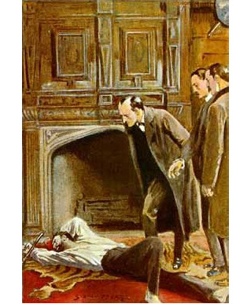

## I.

Holmesovi jsem už věnoval povinný základní odstavec v [Detektivkách I](http://drakkar.sk/41/). Pro ty, kdo jsou líní studovat dlouhé odkazy na [základní fakta](https://cs.wikipedia.org/wiki/Sherlock_Holmes), následuje malé opakování.

Sir Arthur Conan Doyle byl profesí lékař a dobrodružný chlapík, dokonalý exemplář všeho britského, co si lze vybavit. Žil v letech 1859 až 1930. Působil uprostřed nejvěhlasnějších vypravěčů své doby. Dnes ho známe jako tvůrce Holmese, ale je také autorem hromady historických románů, divadelních her a několika dalších hrdinů, z nichž čelní místo zaujímá profesor Challenger. O Holmesovi napsal Conan Doyle přesně 60 příběhů, typicky povídek o délce něco přes 20 stran, soustředěné do pěti sbírek. Není to nijak závratně mnoho.

O to víc fascinuje opravdu kolosální závěj badatelských textů všeho druhu, jejichž slušný přehled uvádí [toto dílo](https://www.mlp.cz/cz/projekty/e-knihovna/883-nove-e-knihy-petr-vyhlidka-holmesiana/?knihovna=), nebo závěje pastišů a fanfiction, kde nechybí ani Češi. Za 120 let je toho opravdu hodně a nenapadá mne nic srovnatelně kolosálního. I takový Harry Pot­ter nebo Mythos Cthulhu jsou proti Holmesovi bezvýznamné krátkodeché epizody. Stačí si uvědomit, že velké procento všech detektivů světa jsou odvozeniny Sherlocka Holmese. Už sama myšlenka soukromého detektiva, vlastně suplujícího policii, je dost podivná a Holmes původně tvrdil, že je jediný na světě. Také novější zpracování Holmese jsou obvykle svoje vlastní fanfiction; prožívají nové příběhy, které nemají s těmi původními mnoho společného, nebo jsou alespoň zásadním způsobem změněné. Navzdory mému krajně skeptickému postoji k fanfiction jakožto principu jsem nucen uznat, že některé tyto výtvory jsou výborné. Proč tomu tak je zrovna u Holmese, to budiž další zajímavá otázka.

## II.

Přidat k této záplavě textu něco objevného se jeví být ukázkové nošení sov do Athén. Půjdu na to trochu atypicky; zkoumáním, jak funguje jeden konkrétní Holmes.

Vybral jsem si _Znamení čtyř_ (_The Sign of Four_, v klasickém čtyřpísmenném badatelském kódu SIGN). Je to dílo z roku 1890, velmi časné, vlastně druhý Holmes vůbec (po _Studii v šarlatové_ čili STUD, 1887). Z nějakého nejasného důvodu jsem kdysi tento román jako jediný úplně minul. A roztomilou péčí Městské knihovny je [volně k mání](https://search.mlp.cz/cz/titul/pribehy-sherlocka-holmese/3347685/).

První zjištění je, že je to příběh _strašně starý_. Pokud jsem zmiňoval skvělé soudobé vypravěče, třeba Machena, Wellse, nebo Josepha Conrada, ani jeden z nich neměl šanci tohle dílko předběhnout, protože ještě nepsali vůbec. Jen ten Monte Christo a Edgar Allan Poe zářili ve tmách. A [Stevenson](https://cs.wikipedia.org/wiki/Robert_Louis_Stevenson), jehož vliv je zvláště jasný. A [Emile Gaboriau](https://cs.wikipedia.org/wiki/Émile_Gaboriau). Holmes také stojí u základu jednoho z raných pulpových časopisů, The Strand Magazine. Znamení čtyř vycházelo ovšem ještě jinde, neb Strand vznikl až za rok.

Druhé základní zjištění je, že to vlastně není román. Má to 38 000 slov, a ani při benevolentní anglosaské definici románu, vyžadující pouhých 50 000 slov, to uznat nelze. Je to dlouhá novela, rozměr, před kterým kdekoho varuji, protože je z hlediska vydavatelského naprosto beznadějný – na knihu málo a na časopis strašně moc. _Znamení čtyř_ se ovšem prosadilo i tak, navzdory mé teorii. A předchozí _Studie v šarlatové_ je navlas podobný případ.

Vysvětlení tohoto paradoxu je, že to všechno vycházelo na pokračování. Celý příběh je složen z dvanácti delších scén, které jsou zároveň kapitoly. Jejich rozměr je zřejmě dán tím, kolik bylo místa v časopise. Jsou určeny k samostatnému čtení a fungují skoro jako samostatné povídky, s vlastní atmosférou a situací. Je to tedy téměř seriál, spíš než novela. Výhodou je, že si každou povídkovou scénu můžete samostatně užít. Naopak kritickým místem je návaznost těchto scén, místy dost problematická.

Pokud jsem v _Detektivkách_ tvrdil, že Holmes překonal Dupina v tom, že rozměr detektivky roztáhl z povídky na román, tak to tedy není zdaleka úplně přesné. Tento časný exemplář ukazuje, že toho bylo dosaženo za cenu značných kompromisů a nám známý tvar detektivky to připomíná místy dost vzdáleně. Řeší se tu totiž kromě pátrání po padouchovi všechno možné.

Aby bylo jasné, o čem mluvím:

> Sherlock Holmes si vzal z rohu krbové římsy svou lahvičku a z pěkného marokénového pouzdra vyňal injekční stříkačku. Dlouhými, nervózními bílými prsty nasadil tenkou jehlu a na levé ruce si vyhrnul rukáv košile. Chvilku zamyšleně hleděl na šlachovité předloktí a zápěstí, poseté a zjizvené nesčetnými vpichy injekční jehly. Posléze vbodl ostrý hrot pod kůži, stlačil malý píst a s hlubokým, spokojeným povzdechem se zvrátil do křesla se sametovým potahem.

Tohle je úplný začátek příběhu, první odstavec, který nám autor vbodne do žíly hned mezi dveřmi. Vlastně jediná drogová scéna ve všech Holmesiádách; více jich není. V povídce _Zmizelý hráč ragby_ (1904, MISS) se dokonce dozvíme, že se Holmes tohoto zlozvyku zbavil. Už v době vzniku románu to bylo dost excentrické. Asi po padesáti letech Holmesovy slávy již přímo nepřijatelné a většina zpracování z toho utekla. Pokud zůstal Velký detektiv výstřední, tak rozhodně ne takto, ale spíše býval roztomile potrhlý.

Nové verze Holmesů se ovšem tohoto tématu chytily přímo s nadšením a Holmesovo narkomanství zdůrazňují úplně všechny – BBC _Sherlock_, Ritchieho filmy i _Elementary_. Nerd na okraji společnosti je téma doby; dnešní génius je naopak velmi často mladý jedinec, který se limitně blíží nebezpečné hraně sociopata. Nebo je dost zjevně za hranou. Vypočítávat zcela reálné velikány dneška, kteří se zapletli s drogami, je potom asi úplně zbytečné.

Jdeme dál. V téže kapitole následuje přímo legendární scéna s hodinkami, kde Watson vyzve Holmese, aby řekl, zda z nich lze něco vyčíst o jejich bývalém majiteli. Holmes napřed trochu mlží, načež pak ale dodá:

> „Nebyl to zrovna příliš pořádný člověk – spíš pořádný lajdák a nedbalec. Zpočátku měl dobré vyhlídky, ale zahodil všechny šance, nějaký čas žil v nouzi, střídané občas krátkými obdobími blahobytu, ale nakonec se dal na pití a umřel. Víc se mi nepodařilo zjistit.“

Není snad jediný příběh, kde by Holmes nepředvedl něco podobného. Dokonce, není ani žádná fanfiction verze, kde by nějaká podobná scéna nebyla. I když se Holmes skrývá pod kutnou středověkého minority Viléma z Baskervillu, přesto se uvede podobnou úvahou, která se týká neviděného a pouze vydedukovaného osla. Je to nejzákladnější a nejdůležitější charakterizace postavy. Můžeme Holmese redefinovat nejrůznějšími způsoby, ale geniální schopnost dedukce mu vzít nelze, tím by se stal někým jiným.

Ve stínu této scény možná leckomu unikne, že celá první kapitola nemá vůbec žádný vztah k ději. Odhalený majitel hodinek v příběhu nevystupuje. Vlastně vůbec nikdy a nikde nevystupuje, a je to hodně s podivem, neb je to bratr doktora Watsona. Ani sám Conan Doyle nenašel pro tuto zapomenutou postavu žádné využití.

Přísným okem vzato, odhalovat postavu, která je k ničemu, je kompoziční chyba, kterou vyspělejší modely napravují. Třeba v _Psu baskervillském_ je replika této scény s vycházkovou holí, a ta už se týká postavy, která je velmi důležitá. Hodně věcí ve _Znamení čtyř_ je prostě daň za to, že to je časný a experimentální model, kde se autor teprve učil.

## III.

Scéna druhá se prostě nazývá _Obeznámení s případem_. A jako byla scéna první učebnicovou charakterizací hlavních postav, pak je toto učebnicová expozice příběhu. Zkrátka přijde detektivův klient, sedne si na židli a vypráví, o co jde.

Člověk by měl tendenci to odstřelit jako poměrně neobratné, primitivní až polopatické. Poznamenám ovšem, že takto v reálném životě příběhy často opravdu začínají; třeba u advokátů nebo u lékařů. Kromě toho, když hrábneme do té fanfiction laviny, zjistíme, že autoři nedospěli v mnoha případech ani o milimetr dál. _Sherlock_, _Elementary_, Ritchie – jakkoli jsou strašně cool a plní efektů, této metody se nijak nezříkají.

No, a _Znamení čtyř_ má při tom ještě pár dalších karet v rukávu.

> Seděla u otevřeného okna, měla na sobě šaty z nějaké průsvitné bílé látky, zdobené kolem pasu a u krku čímsi červeným. Dopadalo na ni měkké světlo zastíněné lampy, jak seděla opřená v proutěném křesle, pohrávalo na její líbezné, vážné tváři a zalévalo bohaté kadeře jejích nádherných vlasů kovovým leskem. Bílá ruka jí visela přes opěradlo a celé držení těla svědčilo o melancholickém zadumání. Jakmile však uslyšela mé kroky, hned vyskočila a bledé tváře jí zbarvil jasný ruměnec překvapení a radosti.

Tohle, věřte, nebo ne, není citát z Jane Austenové, ale ze Sherlocka Holmese, _Znamení čtyř_. Pouze jsme skočili o mnoho stran dál, málem na konec příběhu. A při tom pozornému oku neujde, že tento vývoj událostí je pevně zakotven už v té expozici druhé scény:

> Její tvář nepřekvapovala pravidelnými rysy ani krásnou pletí, ale bylo v ní cosi líbezného a roztomilého a z velkých modrých očí vyzařovala vzácná oduševnělost a porozumění.

Ta dáma totiž není jen klient, ale damsell in distress, hrdinka rytířského románu, kterou je třeba zachraňovat. Pokud je Chestertonovi připisován postřeh, že detektiv je moderním rytířem, který porazí zlo a obnoví rovnováhu, pak si toho byl Conan Doyle vědom již v roce 1890 a jeho postavy nám to přímo říkají:

> „To zní jak z pohádky!“ zvolala paní For­resterová. „Dáma, které bylo ublíženo, poklad v ceně půl miliónu, černý kanibal a padouch s dřevěnou nohou. Bohatě to nahrazuje obligátního draka či zlovolného hraběte.“
>
> „A zachránci princezny jsou dva potulní rytíři,“ dodala slečna Morstanová a vrhla na mě zářivý pohled.

O mnoho let poději S. S. Van Dine tvrdil, že _„V příběhu nesmí být milostná zápletka. Problém, před kterým stojíme, je před­vést zločince spravedlnosti, nikoli přivést láskyplný pár k svatebnímu oltáři.“_ A pro zajímavost, o mnoho let později tomu věří i Kamil Fila: _Za mnohem větší narušení můžeme pokládat, že hlavní hrdina je tu rozptylován něčím takovým, jako je milostný vztah, a trochu mu to komplikuje vyšetřování._

Jak vidíme, oba jsou vedle jako jedle. Stejně jako nešťastníci, co vynalezli strašlivé slovo [bromance](https://en.wikipedia.org/wiki/Bromance). Praotec zakladatel Conan Doyle má romantický motiv ve spoustě povídek, a ve Znamení čtyř končí nekompromisně svatbou. Dokonce bych měl jako čtenář skoro pocit, že je to podstatnější výsledek, než chycení padoucha.

Sherlockovo údajné misogynství havaruje hned v příběhu následujícím, jímž je _Skandál v Čechách_ (1891, SCAN). Co se tam stane, je asi notoricky známo. Málokterý posun pozdějších dob je tak proti původní ideji, jako to, že Holmes a Watson byli vždy postarší a zcela asexuální gentlemani.

## IV.

> Byl zářijový večer a nebylo ještě ani sedm hodin, den však byl pošmourný a hustá lezavá mlha ležela nízko nad velkoměstem. Špinavě zbarvená mračna smutně klesala do rozblácených ulic. Kandelábry na Strandu byly jen mlhavými skvrnami rozptýleného světla, vrhajícího kruhy matné záře na kluzkou dlažbu. Žluté světlo z výkladních skříní se linulo do zamženého, vlhkostí prosyceného vzduchu a vrhalo bezútěšné, pohyblivé paprsky do přeplněných ulic. Bylo pro mne cosi děsivého a přízračného v tom nekonečném zástupu tváří, které se míhaly napříč těmi úzkými proužky světla – tváří smutných i veselých, vychrtlých i šťastných. Jako veškeré lidstvo putovaly i ony z přítmí do světla a znova zapadaly zpátky do šera.

Tady máme třetí scénu a je tu k vidění třetí základní povinnost vypravěče – budování atmosféry. Zatím je to opět časný model, protože nálada následujících scén prudce kolísá nejrůznějšími směry. Nicméně tento šerosvitný odstavec, plný londýnské mlhy, se zdá být určující nejen pro celý příběh, ale pro velikou část toho, co si vybavíme pod značkou Sherlock Holmes™. Později, v _Psu baskervillském_ (1902, HOUN), dosáhne autor v této disciplíně mistrovství, které nepochopila polovina jeho napodobitelů. A pokud někdo vyhlíží steampunk, k páře a kolům dojdeme také, nebojte.

A není to jen mlha, šerosvity a parní stroje. _„Poklad v ceně půl miliónu, černý kanibal a padouch s dřevěnou nohou,“_ shrnula to paní For­resterová. Spousty rekvizit v Holmesovi jsou neobvyklé, výjimečné, fantastické. Něco, co normální smrtelník v Londýně té doby málokdy potkal. V Holmesových příbězích to ovšem je na denním pořádku. Kdejaká postava je podivná a bizarní, snad žádný předložený případ není banální nebo obyčejný. Ostatně, Holmes nám to přímo mnohokrát říká – obyčejné případy ho nezajímají.

Prosvítá tu dědictví učitelů Poea a Stevensona, a vrstva ještě starší, zejména gotický román. Třeba ve čtvrté kapitole praví umírající otec synům:

> „Ve chvíli, kdy se rozžehnávám se světem, tíží mé svědomí jediná vina. Nepěkně jsem se zachoval k ubohému sirotkovi, dcerce kapitána Morstana. Prokletá touha po majetku, které jsem celý život otročil, připravila tu dívku o poklad, z něhož měla dostat nejméně polovinu. Lakota však je tak zaslepená a bláznivá vlastnost, že ani já jsem z bohatství neměl žádný užitek.“

Dnes taková promluva vzbuzuje úsměv. Je na ní vidět autorova neobratnost, udržování sto let starých zaprášených vzorů, které v málem moderní době roku 1890 už ztrácejí smysl. Však se také během následující spousty let s Holmesem naučil autor budovat dialogy daleko přirozeněji. Nicméně, to zvláštní kouzlo, se kterým je třeba ochraňovat _ubohé sirotky_, ho tak úplně neopustilo nikdy. Úplně poslední povídka o Holmesovi, _Na starém zámku v Shoscombe_ (SHOS, 1927), je opět plná vlivů gotického románu.

## V.

Všimnu si toho _černého kanibala_ a dnes tolik oblíbené rasistické roviny. Arthur Conan Doyle je synem své doby, britským gentlemanem, který hledí na divochy poněkud svrchu. Nicméně, nemělo by ujít pozornosti, že velmi důsledně zachovává pravidla fair play, bez ohledu na to, jaké je dotyčná postava barvy pleti nebo vyznání. Titulní skupina _Znamení čtyř_ sestává ze tří muslimů a jednoho bělocha; mají naprosto rovná práva, drží při sobě a nikdo nikoho nezradí, a to na rozdíl od dalších bělochů, co se do spolku přidají později.

Sice se několikrát vyhrožuje, že krvežíznivý Tonga by měl být _zastřelen jako pes_, ale když dojde na věc, vypadá to přesně takto:

> „Střelte, jakmile zvedne ruku,“ řekl Holmes klidně.
>
> V té chvíli nás od nich dělila už jen jedna lodní délka, takže jsme měli kořist na dosah. Dodnes vidím ty dvě postavy, jak tam stály: široce rozkročený běloch, hulákající na nás kletby, a ten demaskovaný trpaslík s úděsnou tváří a silnými žlutými zuby, které na nás cenil ve světle našeho reflektoru.
>
> Štěstí, že jsme ho viděli tak jasně. Před našima očima vytáhl odněkud z hábitu krátký, kulatý kousek dřeva, podobný školnímu ukazovátku, a přiložil jej ke rtům. Obě naše pistole třeskly zároveň. Otočil se kolem své osy, rozhodil rukama, přidušeně zachroptěl a skácel se do řeky.

Jinými slovy, jde o střelecký souboj, dvě pistole proti foukačce, a Holmes s Watsonem jsou prostě rychlejší a přesnější. Dnešní doba by v mnoha případech zbaběle couvla, protože v Hollywoodu padouch v detektivce prostě nesmí být černý. Tady je na tom černý padouch naprosto stejně, jako jeho kolegové bílí padouši; buď zemře, nebo ho dostihne policie, je to za jedny peníze. Musím říci, že je to docela osvobozující pohled na věc.

## VI.

Přestřelka na lodi nás vede ještě k jedné důležité rovině.

> Než jsem se dostal z domu do zahrady, byl už Sherlock Holmes na střeše a viděl jsem ho, jak pomalu leze po hřebeni střechy jako nějaká obrovská svatojánská muška. Na okamžik se mi ztratil z dohledu za několika komíny, ale vzápětí se objevil znova a pak zmizel ještě jednou na protější straně. Než jsem dům obešel, seděl už v rohu na okapové rouře.

Chtěl bych vidět ty důstojné pány s čepicí a dýmkou při podobném výkonu.

Nebo tento skvost s tou slíbenou párou:

> Drželi jsme se poměrně blízko za Najádou. V topeništích jen hučelo a mocné stroje hřmotily a bušily jako veliké kovové srdce. Ostrá a strmá příď se zařezávala do klidné říční hladiny a rozrážela napravo i nalevo dvě valící se vlny. Při každém úderu stroje jsme nadskočili a otřásli se jak živá bytost. Velká žlutá lucerna na boku našeho člunu vrhala před nás chvějivý sloup světla. Přímo před námi temná skvrna na vodě prozrazovala, kde Najáda je, a vějíř bílé pěny za ní naznačoval, jakou rychlostí ujíždí. Hnali jsme se kolem bárek, parníčků a obchodních lodí a mezi nimi; za některými jsme projeli, jiné jsme objížděli. Z temnoty na nás volaly lidské hlasy, ale Najáda se s rachotem řítila pořád dál a my jsme se jí drželi těsně v patách.

Ritchieho první film tuhle scénu vlastně úplně použil. Vůbec má Ritchie i BBC Sherlock naprostou pravdu v tom, že to nejsou žádní důchodci s hůlkami, ale pánové okolo třiceti let, co se akce rozhodně neštítí, ba naopak, zjevně je to baví. Zachraňování princezen a hledání pokladů se bez nějaké té rány pěstí obvykle neobejde, a pistole si berou na většinu výprav.

Posun ke starším pánům, kteří konverzují v místnosti, provedla opět až následná doba, a dokonce mám pocit, že se tu projevil nenápadný vliv pozdějších méně akčních detektivů. Takže to, co se děje s Holmesem v době nejnovější, není žádná dětinská touha po akci, ani porušení kánonu, ale pravý opak, renesance původního stylu.

## VII.

Za povšimnutí stojí i ničemové. Ve _Znamení čtyř_ tvoří poměrně pestrou skupinu lidí. I když je většina z nich jen chvatně načrtnuta, neb se děj s nikým moc nemaže, přesto je ďábelský, ale dost přehledný Tonga jiný typ padoucha, než gang Znamení čtyř. Bezpečně nejzlotřilejší je zrádný major Sholto. Hodně špatně to delší dobu vypadá i s kapitánem Morstanem, ale tady se autor včas zarazil, když si uvědomil, že by Mary neměla být dcerou ničemy.

Stejně pestré jsou i osudy padouchů. Ve většině případů se tak nějak pozabíjejí navzájem. Jednoho z nich zastřelí Holmes s Watsonem, jak jsme viděli. A jediný zbude na konci a dostane se do rukou policie. Rozhodně to není přesvědčivý zloduch, není nijak moc hlavní nebo zlotřilý, občas by ho člověk chápal a dokonce i politoval. Autor ho nechal přežít z jediného důvodu – aby nám měl kdo vyprávět tu původní historii.

V předchozím díle, _Studii v šarlatové_, byl padouch ještě méně zlotřilý; vlastně byl daleko sympatičtější, než jeho oběti, když se to celé dovyprávělo. Také ho autor nenechal zemřít v rukou policie, ale vymyslel kompromisní řešení. Přímo se nabízelo, že takové lidi nechá Holmes nakonec uprchnout, což se později skutečně stane třeba v _Opatském sídle_ (ABBE, 1904).

Tato pestrost padouchů, jejich motivů a způsobů, jak s nimi naložit, trvá po celou Holmesovu kariéru. V první sérii povídek z roku 1891 bylo také k vidění hned několik příběhů, kde se vlastně vůbec žádný zločin nestal. Byla tu jen záhada, která je pro detektivku daleko důležitějším definičním znakem. Občas také všechno vyřeší prachobyčejná náhoda, jako u _Pěti pomerančových jadérek_ (FIVE, 1891). Také není ani později výjimkou, že se ničemové zabíjejí navzájem, jako třeba v _Ďáblově kopytě_ (DEVI, 1910).

Opravdu strašlivý padouch, který někoho zavraždil, si zasluhuje stylovou hororovou smrt, což je k vidění třeba u _Strakatého pásu_ (SPEC, 1892), a zřejmě každého napadne v této kategorii hlavně _Pes baskervilský_ (HOUN, 1902). Díky tomu – a díky Moriartymu – se představa tohoto druhu padoucha a jeho bídného konce všeobecně stabilizovala jako univerzální a jedině možná, ale původně tomu tak rozhodně nebylo.

## VIII.

Jak vidno z předchozího průzkumu, _Znamení čtyř_ je dílko náramně pestré až roztříštěné, řítí se od šerosvitného gotického románu k břitce intelektuální konverzaci, od lovestory ke rvačce a z Londýna přímo do Indie, do doby povstání sipáhiů. Neboť konec, po té, co je padouch dostižen lodní honičkou a milenci trochu překvapivě jásají nad tím, že se poklad ztratil, tvoří jedna hodně dlouhá nalepená scéna, vyprávění jediného přeživšího padoucha o tom, jak to vlastně celé začalo.

Řešení je to docela zvláštní; proti očekávání nevysvětluje Holmes, ale padouch sám. Souvislost příběhu s předchozím je také značně volná; jsou tu jiné kulisy a z podstatné části vlastně i úplně jiné postavy. Jakoby vyprávění ovládl Rudyard Kipling. Vypráví se poutavě a dokonale realisticky, ale ani tady bychom zřejmě nepoznali, že je to Holmes:

> Odnesli jsme ho dovnitř, Abdullah, Akbar a já. Byl zatraceně těžký, přestože to byl takový mrňous. Mahomet Singh zůstal u vrat na stráži. Odvlekli jsme mrtvolu na místo, které už Sikhové připravili. Bylo to dost daleko od brány, křivolaká ulička tam vedla do veliké prázdné síně, jejíž cihlové zdi se už rozpadaly. Podlaha z udusané hlíny se na jednom místě propadla a vytvořila tak přirozený hrob. Kupce Achmeta jsme do něho uložili a mrtvolu zakryli uvolněnými cihlami. Když jsme s tím byli hotovi, vrátili jsme se všichni k pokladu.

Ve skutečnosti byl přesně stejný manévr použitý i v prvním případě, ve _Studii v šarlatové_. Tam je dokonce takto vložený druhý příběh mnohem delší, ještě neobratněji navazující, a hlavně, daleko průhlednější. Ve _Znamení čtyř_ je vylepšení modelu. Nápad s druhým příběhem v minulosti a za mořem se bude opakovat u mnoha dalších povídek. V Holmesovi si lze proto užít i western, Indii, námořní piráty a další nečekanou exotiku.

## IX.

Je zajímavé si uvědomit, že tu ještě nefunguje schéma Velké Záhady, která je v první scéně exponována a v poslední vyřešena. Je to spíše něco jako jízda šikmo svahem. Případ, který nám představila na počátku Mary Morstanová v kapitole II., zmizení jejího otce, je z velké části vyřešen už v kapitole IV. Tam následuje obratem expozice záhady další. Odtud zákonitě dojdeme ke kapitole V., kde je první naživo předvedená vražda, až někde ve třetině textu. Tady máme konečně opravdovou záhadu, jakou bychom očekávali:

> „Předně: jak se sem ti lidé dostali a jak se dostali odtud? Dveře od včerejšího večera nikdo neotevřel. Jak to vypadá s oknem?“ Přistoupil k oknu s lucernou v ruce a chvílemi něco zabručel o tom, co zjistil, ale adresoval ty poznámky spíš sobě než mně. „Okno je zavřeno zevnitř. Okenní rám je pevný. Žádné panty po straně nejsou. Tak si je tedy otevřeme. Poblíž nikde žádná okapová roura. Střecha jo mimo dosah.“

Jenže tato záhada zamčené místnosti je vyřešena již v kapitole VII. Následuje ještě půl příběhu – honičky, akce, láska a ta odbočka do Indie.

Takto pojatý řetězec záhad a odhalení naznačuje, že možná ani sám autor tak úplně netušil, jak to přesně dopadne, a při psaní těžce improvizoval. Kompozice i vložený příběh jsou zjevným výsledkem psaní na pokračování.

Celá řada odboček také míří někam mimo děj. To, co bylo řečeno o první deduktivní kapitole, platí o hromadě dalších scén. Kdybychom neznali polovinu podrobností finálního Smallova dobrodružství v Indii, asi bychom je nijak nepostrádali. Kdyby se pes Toby trefil hned napoprvé a nevznikla pointa _Epizody se sudem_, taky by nikde nechyběla. Celé to bláznivé leporelo funguje daleko lépe jako seriál, než jako ucelený příběh. Nad čímž milovník klasických dějových oblouků a důmyslných kompozičních celků zapláče, ale dnešní divák, myslící v seriálových krátkých epizodách, to naopak možná ocení.

A podotýkám, že i tento pro mne jednoznačný nedostatek napravil čas. O dvanáct let pozdější _Pes baskervilský_ je již konstrukcí oslnivě dokonalou, s jednotnou atmosférou a ústřední záhadou, kterou odhalíme až na úplném konci.

## X.

Výtěžnost návštěvy v časném, ne úplně perfektně provedeném a méně slavném románu o Holmesovi je překvapivě bohatá. Myslím, že většina záhad je objasněna.

_Ano, Holmes je opravdu tak dobrý._ Dokonce je možná paradoxně lepší, než plno jeho následníků. Nebýval nijak skvěle napsaný, k určitému stylu se dostal autor až někde v době Baskervillského psa. Také se naučil skládat dlouhé příběhy.

Jenže, možná je to tou jednoduchostí a názorností pro spisovatele a gamemastery vděčný materiál. Budování atmosféry je budování atmosféry, ničím víc, žádné vymyšlenosti.

A hlavně, byl to vždy ohňostroj nápadů. Perfektní využití toho lepšího, co zbylo z gotického románu; strašlivé drama, zlotřilý major a ubohá sirota, mrtvoly za ranního úsvitu, poklady a zlověstní trpaslíci. A k tomu nové, moderní prvky, stejně zábavné; honička parníků na Temži a detektiv šplhající po okapové rouře. A samozřejmě oslnivé dedukce z hodinek, z prachu na okně, z doutníku, prostě z kdečeho. Holmes může být kritizován za všechno možné, ale rozhodně s ním nebývala nuda.

_Ano, Holmes je velice aktuální._ Předběhl do­bu, třeba v otázce excentrického nerda v hlavní úloze; nebo v touze po výjimečném, nevšedním a fantastickém. Dokonce bych šel ještě dál; některé roviny příběhu nejsou úplně doceněny ani dnes.

Pokud z toho udělal BBC _Sherlock_ šachovou partii na způsob filmu _Saw_, zkříženou s _Mlčením jehňátek_, utekla mu tím poměrně subtilní poezie, kterou originál obsahoval. Totiž, že je to jako v pohádce, kde rytířové zachraňují krásné princezny. Udělat z okouzlující Holmesovy protivnice sadomasochistickou dominu není bezeztrátová operace.

Pokud se _Elementary_ nadšeně vrhlo na tu všední a moderní rovinu vyléčeného narkomana a jemné mezilidské vztahy, pak mu utekla ta zábavná rovina exotické výjimečnosti, lehké nadsázky, _poklad v ceně půl miliónu, černý kanibal a padouch s dřevěnou nohou_.

Pokud Ritchie tolik lpí pro změnu na té nadsázce a tanečním rytmu, pak se mu může stát, že mu pro změnu utečou docela nečekaně vážné situace:

> Holmes zahořekoval a jeho tvář, bledá jak stěna, zasvítila temnotou.
>
> „Ó, ten netvor, ten netvor!“ zvolal jsem se zaťatými pěstmi. „Neodpustím si nikdy, že jsem ho ponechal osudu.“
>
> „Zasluhuji přísnější pokárání, než vy, Watsone. Chtěl jsem, abych měl k případu všechny důkazy, pěkně zaokrouhlené, a při tom jsem ztratil život klienta. Je to největší rána v mojí kariéře. Ale jak jsem mohl vědět – jak jsem mohl vědět, že ohrozí svůj život cestou na močál, přes moje varování?“

Možnosti následovat Holmese tu jsou, ale důležité je právě pochytat ty podstatné složky, které tu byly odhaleny. Spíše pokračovat v tom stylu, který původní Holmes načrtl, ale už mnohdy z různých důvodů nedotáhl. Předkládat Holmesovi tajemné záhady a nechat ho pomáhat lidem, kteří si to zasluhují.

Pokud chcete stvořit veselý pulpový děj, můžete vzít Holmese rovnou a vytvořit fanfiction. A bude to fungovat.

Pokud máte vlastní plány, pak, kupodivu, není žádný problém pulpový děj nechat a vyhodit z toho Holmese. Stačí mu sebrat schopnost dedukce, přejmenovat ho, přesunout z Londýna třeba do Prahy, a nepozná ho nikdo.

Pokud máte ještě větší a ambicióznější plány na rozvoj hlavní postavy a kdovíco ještě, i pak vám může být Holmes užitečný. Lze třeba žasnout nad novým Simmonsovým románem _Pět srdcí_. Vtip je v tom, že Holmesovské prvky jsou velmi univerzální a ne moc agresivní, aby bránily něčemu dalšímu.

Výsledek může být ve všech případech až překvapivě dobrý.
