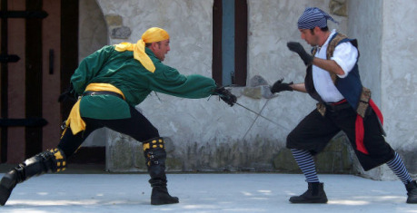

> Inspirováno playsetem Scurvy Bastards and Grim Disasters od Daniela Maloneho.

S tímto playsetem si vrazíte na hlavu trojhranné klobouky, na rameno papouška a vplujete do Karibiku na přelomu sedmnáctého a osmnáctého století, se všemi klišé, která známe z populární kultury. V kůži postav budete přepadat lodě, kout pikle, plenit, unášet sličné dámy (a neopatrné gentlemany), zaplétat se do vlastních lží a pod palbou děl tančit s vlastní zkázou.

### Piráti v knížkách:

R. L. Stevenson – _Ostrov pokladů_, R. Sabatini – _Odysea kapitána Blooda_, Tim Powers – _Plout na vlnách podivna_

### Piráti ve filmech:

Long John Silver (1954), Ostrov hrdlořezů (1995), Piráti z Karibiku (2003)

## Vztahy

### 1. Na jedné lodi

1. Kapitán a první důstojník
1. Kapitán a zhýčkaný pasažér
1. Vzpurný kormidelník a guvernérův agent
1. Sluha a kuchař
1. Plavčík a černý pasažér
1. Odsouzenci

### 2. Rodina

1. Hašteřící se sourozenci
1. Pokrevní bratři
1. Úzkostlivý rodič a problémové dítě
1. Zapomenutá rodina
1. Dvojčata
1. Zámožný stařec a mladý dědic

### 3. Kočka a myš

1. Kořist a lovec
1. Podvodník a důvěřivec
1. Vázáni přísahou
1. Zajatec a jeho stráž
1. Loutkář a jeho zmírající se loutka
1. Jednostranná náklonost

### 4. Suchozemské krysy

1. Dcera guvernéra Porto Rica a její tajný milenec
1. Uprchlý otrok a zarytý abolicionista
1. Výběrčí daní a poplatník v průšvihu
1. Idealistický dobrodruh a bezzubý skeptik
1. Dominikánský mnich a neznaboh
1. Vůdce domorodého povstání a bledá tvář

### 5. Minulost

1. Postrach sedmi moří a jeho nedobrovolný komplic
1. Mistr a bývalý učedník
1. Společné temné tajemství
1. Staří spiklenci
1. Ty a ten, kdo způsobil tvůj pád
1. Společně zakopali poklad

### 6. Kšefty

1. Pirát a guvernér
1. Dva kohouti na jednom smetišti
1. Nenapravitelní smolaři
1. Sňatek z rozumu
1. Tajný vedlejšák
1. Smlouva s ďáblem

## Tužby

### 1. Kořist

1. Vyrabovat Port Royal
1. Unést toho zazobance
1. Kořist: tentokrát ji rozdělit správně
1. Stát se guvernérem
1. Dobýt jeho/její srdce
1. Najít jednoho z nejhledanějších zločinců z Porto Rica

### 2. Pomsta

1. Najít vraha svého otce
1. Zabít kapitána Blacka
1. Získat zpátky svojí ukradenou loď
1. Vystopovat toho zbabělýho bastarda, co ti vypíchl oko
1. Podvést toho podvodníka, co tě připravil o kořist
1. Najít toho zbabělce, co tě nechal hnít ve španělském vězení

### 3. Objevit

1. Ztracené vzpomínky
1. Nejlepší rumovou plantáž
1. Potopenou loď s pokladem
1. Španělskou misii se schovaným aztéckým zlatem
1. Slabinu královského námořnictva
1. Kde a proč mizí všechny lodě

### 4. Očištění

1. Získat amnestii od guvernéra
1. Dokázat, že jsem to nebyl já
1. Urovnat to s královským námořnictvem
1. Dokázat, že jsem pirát
1. Získat uznání kapitána Blacka
1. Zlomit tu kletbu

### 5. Uniknout

1. Svému osudu
1. Tomu, co se plíží ve stínech
1. Armadě
1. Své falešné identitě
1. Z jeho/jejích spárů
1. Nebýt ve špatný čas na špatném místě

### 6. Dokončit

1. Své pátrání po mořském hadu
1. Prastarý rituál
1. Svůj tajný úkol
1. Ten prastarý spor
1. Tuhle poslední akci
1. Sečíst jeho/její dny

## Místa

### 1. Širé moře

1. Na útěku
1. Tišiny
1. Obklíčeni dvěma flotilami
1. Uprostřed Bermudského trojúhelníku
1. Ztraceni
1. V bouři

### 2. Ztroskotání…

1. Pod útesy královské pevnosti
1. Na pustém ostrově
1. V břiše velryby
1. … a „zachráněni“
1. Ostrov kapitána Blacka
1. Na člunech, uprostřed širého moře

### 3. Tortuga

1. Pochybná putyka plná bídáků bez špetky cti v těle
1. Černý trh
1. Noční dostaveníčko na pláži
1. Zakotvená loď tvého největšího rivala
1. Lichvářovo doupě
1. Starý maják

### 4. Port Royal

1. Guvernérova pokladnice
1. Vězení
1. Přístavní pevnost
1. Popraviště
1. Vlajková loď královského námořnictva
1. Tajná chodba v guvernérově sídle

### 5. Tajné

1. Tajný pirátský ostrov
1. Jeskyně s pokladem
1. Léčka kapitána Blacka
1. Sklad rumu
1. Domov
1. Okraj světa

### 6. Na lodi

1. Košík na vrcholu nejvyššího stěžně
1. Lodní spíž
1. Podpalubí
1. Sklad střelného prachu
1. Kapitánova kajuta
1. Zapovězená komůrka

## Objekty

### 1. Zbraně

1. Tucet kanónů
1. Dřevěná paže s hákem
1. Sto soudků střelného prachu
1. Ukradená šavle kapitána Blacka
1. Corpus delicti
1. Posádka po zuby ozbrojených žoldnéřů

### 2. Poklady

1. Truhla prokletého Aztéckého zlata
1. Oblíbený psík guvernérovy ženy
1. Tajné zásoby Kapitána Blacka
1. Guvernérova ulitá „rezerva“
1. Loď s výplatami pro francouzské námořnictvo
1. Pacička pro štěstí

### 3. Informace

1. Francouzský dopis obsahující příkaz ke zničení všech anglických lodí
1. Zatykač
1. Anglický dopis obsahující příkaz ke zničení všech francouzských lodí
1. Guvernérovo tajné účetnictví
1. Mapa k pokladu
1. „Vím, jak to bylo doopravdy“

### 4. Hrůzostrašné

1. Scvrknuté hlavy voodoo panenek
1. Tělo hrůzostrašného pirátského kapitána Williamsona
1. Otrokářská loď
1. Pohřešovaný guvernér Port Royal
1. Vězni nakažení morem
1. Náklad plný mrtvých těl

### 5. Arrr!

1. Mluvící papoušek
1. Klíč ke kapitánovu srdci
1. Páska přes oko
1. Věkem omšelá bible
1. Dosud neotevřený balíček
1. Maska

### 6. Legendární (opatrně s tím!)

1. Velká mořská příšera
1. Fontána mládí
1. Boží vnuknutí
1. Loď duchů
1. Sirény
1. Obří černá perla

## Insta setup

Chcete přípravnou fázi urychlit? Přeskočte generování vztahů mezi postavami a jejich charakterizaci a použijte připravené věci z tohoto seznamu!

### Vztahy

__Pro 3 hráče__

- Minulost – Postrach sedmi moří a jeho nedobrovolný komplic
- Kočka a myš – Podvodník a důvěřivec
- Vzpurný kormidelník a guvernérův agent

__Pro 4 hráče přidej__

- Rodina – Úzkostlivý rodič a problémové dítě

__Pro 5 hráčů ještě navíc__

- Kšeft – Tajný vedlejšák

### Tužby

__Pro 3 hráče__

- Kořist – Kořist: Tentokrát ji rozdělit správně

__Pro 4 a 5 hráčů přidej__

- Pomsta – Vystopovat toho zbabělýho bastarda,

### Místa

__Pro 3, 4 nebo 5 hráčů__

- Na lodi – Sklad střelného prachu

### Objekty

__Pro 3 nebo 4 hráče__

- Zatykač

__Pro 5 hráčů ještě přidej__

- Truhla prokletého Aztéckého zlata
