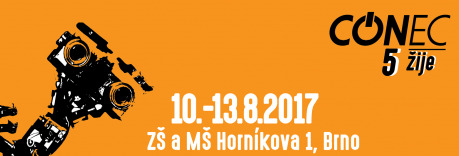

Tentokrát s podtitulem _Con-ec 5 žije_.

- V termínu: __10.–13. 8. 2017__
- V místě: __Brno, ZŠ Horníkova 1__

Kdo jste byli na minulých ročnících, již víte, co máte čekat, a pro vás ostatní – můžete se těšit na několik souběžných linií programů (sci-fi, fantasy, military, literatura, horor, Asie, komiks, steampunk a tradiční manifest fantastiky) a také množství komorních larpů a rpg her.

Najdete u nás všechno, co k dobrému conu patří, spoustu deskových her, simulátor kosmické lodi Artemis, Retrohernu, která vám přinese to nejlepší z dob dávno minulých, a mnoho dalšího zajímavého a originálního programu, kde nebude chybět například oblíbený turnaj ve famfrpálu a další zábava vytvořená speciálně pro návštěvníky Con-ce.

A hlavně pak nepřetržitou uvolněnou párty 24 hodin denně s bohatým přísunem občerstvení kdykoli po ruce.

Takže buďte vítáni a neváhejte navštívit naše stránky a sami se mrknout, jaký program vás čeká.

Předprodej vstupenek s výhodnou slevou a registraci účastníků zahajujeme v půlce června.

### Odkazy

- [Událost na Facebooku](https://www.facebook.com/events/1811985109122665)
- [Stránky conu (con-ec.cz)](http://con-ec.cz/)

Těší se na vás opět u baru...

vaši orgové.

Con-ci zdar!!
